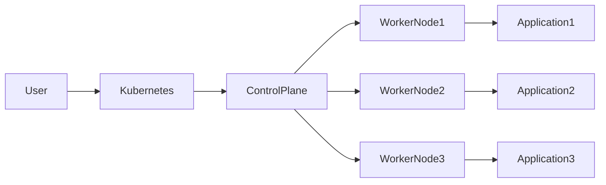

# What is Kubernetes?

> **Chapter 1 of the Kubernetes Handbook**
>
> **Prerequisites:** Basic understanding of applications and containers (Docker).
>
> **After completing this chapter you should be able to answer:**
>
> - What is Kubernetes?
> - Why was Kubernetes created?
> - What problems does it solve?
> - Why is Kubernetes so widely adopted?
> - When should you use Kubernetes?
> - When should you avoid Kubernetes?

---

# Learning Objectives

By the end of this chapter you will understand:

- The evolution of software deployment
- The limitations of traditional servers
- Why containers changed the industry
- Why containers alone are insufficient
- The purpose of Kubernetes
- How Kubernetes works at a high level
- The responsibilities of Kubernetes
- Common misconceptions
- Real-world production use cases

---

# 1. Introduction

Imagine you have developed a shopping application.

Initially, everything is simple.

```
Shopping App
     │
     ▼
 Single Server
```

Your application has:

- Backend
- Frontend
- Database

Everything runs on one machine.

Life is good.

---

Then your application becomes popular.

Thousands of users start visiting every minute.

The server becomes overloaded.

```
Users

 ↓↓↓↓↓↓↓↓

One Server

❌ CPU 100%
❌ Memory Full
❌ Slow Responses
```

Now you buy another server.

```
Users

↓

Server 1

Server 2
```

But now a new problem appears.

How do users know which server to access?

How do both servers stay synchronized?

What happens if one server crashes?

How do you deploy updates to both servers?

How do you scale to 10 servers?

How do you monitor all of them?

Managing servers becomes more difficult than developing the application itself.

This is exactly the problem Kubernetes was designed to solve.

---

# 2. What is Kubernetes?

**Definition**

Kubernetes is an open-source container orchestration platform that automates the deployment, scaling, networking, management, and recovery of containerized applications.

That definition sounds complicated.

Let's simplify it.

Suppose you own a large restaurant.

Instead of cooking yourself, you hire chefs.

Now you need someone to:

- assign work
- replace sick chefs
- order ingredients
- manage shifts
- ensure enough chefs during rush hours
- remove extra chefs when customers leave

The manager does not cook food.

The manager manages the people who cook.

Kubernetes works similarly.

Your application runs inside containers.

Kubernetes manages those containers.

It decides:

- where containers should run
- when they should restart
- how many should exist
- how they communicate
- how updates happen
- how failures are handled

---

# 3. Breaking Down the Name

"Kubernetes" comes from the Greek word meaning:

> Helmsman
>
> or
>
> Ship Pilot

Imagine a cargo ship.

```
Containers
Containers
Containers
Containers

      🚢
```

Someone has to steer the ship.

Kubernetes is the captain.

It doesn't create the cargo.

It manages where the cargo goes.

---

# 4. The Evolution of Application Deployment

Understanding Kubernetes is impossible without understanding why it was created.

Let's go through the history.

---

## Era 1 — Physical Servers

Initially every application had its own physical machine.

```
Machine 1

Email Server

-------------------

Machine 2

Database

-------------------

Machine 3

Web Server
```

Advantages

- Isolation
- Simple

Problems

- Expensive
- Poor utilization
- Hard to scale
- Hardware failures

A server costing thousands of dollars might use only 10% CPU.

The remaining 90% sat idle.

---

## Era 2 — Virtual Machines

Virtualization solved this problem.

Instead of buying many physical servers, companies started running multiple virtual machines on one physical machine.

```
Physical Machine

--------------------

VM 1

Ubuntu

Application A

--------------------

VM 2

Windows

Application B

--------------------

VM 3

CentOS

Application C
```

Advantages

- Better hardware utilization
- Isolation
- Easier backups

Problems

Every VM includes:

- Operating System
- Kernel
- Drivers
- Libraries

This makes VMs heavy.

Starting a VM can take minutes.

---

## Era 3 — Containers

Containers solved many VM problems.

Instead of running multiple operating systems, containers share the host operating system.

```
Host Operating System

│

├── Container A

├── Container B

├── Container C
```

Advantages

- Lightweight
- Fast startup
- Portable
- Efficient
- Smaller images

Now developers could package:

- code
- dependencies
- runtime
- libraries

inside one container.

The famous phrase became:

> "It works on my machine."

Now it truly worked everywhere.

---

# 5. Why Containers Were Not Enough

Containers solved packaging.

They did NOT solve operations.

Suppose your company has:

```
500 Containers
```

Questions immediately arise.

Which machine should run them?

What if one crashes?

What if CPU becomes full?

How do users access the correct container?

How do updates happen?

How do we roll back?

How do we scale?

How do we monitor them?

Who replaces failed containers?

Who checks their health?

Docker can run containers.

Docker does **not** manage thousands of containers across many machines.

This is where Kubernetes enters.

---

# 6. The Problem Kubernetes Solves

Imagine you have 200 servers.

Each server runs dozens of containers.

Without Kubernetes:

```
Server 1

Container A
Container B
Container C

--------------------

Server 2

Container D
Container E

--------------------

Server 3

Container F
Container G
```

Every deployment becomes manual.

You have to:

- SSH into servers
- Copy files
- Restart applications
- Check logs
- Replace failed containers
- Monitor resources
- Configure networking

This quickly becomes impossible.

Kubernetes automates all of it.

Instead of managing servers, you describe the **desired state**.

Example:

```
"I want 5 copies of my application."

"I want them always running."

"I want zero downtime."

"I want automatic recovery."

"I want updates without service interruption."
```

Kubernetes continuously works to make reality match your desired state.

This idea—**declarative infrastructure**—is one of the most important concepts in Kubernetes.

---

# 7. What Does Kubernetes Actually Do?

Kubernetes continuously watches your applications.

Whenever reality differs from what you requested, Kubernetes automatically tries to correct it.

Suppose you request:

```
3 application instances
```

Current state:

```
App 1 ✅

App 2 ✅

App 3 ✅
```

Everything is healthy.

Now one application crashes.

```
App 1 ✅

App 2 ❌

App 3 ✅
```

Kubernetes notices the difference.

Desired:

```
3 Running
```

Actual:

```
2 Running
```

Kubernetes automatically creates a replacement.

```
App 1 ✅

App 2 ✅

App 3 ✅
```

No engineer had to manually restart anything.

This self-healing capability is one of Kubernetes' defining features.

---

# 8. The Desired State Concept

Unlike traditional systems where administrators execute individual commands, Kubernetes operates using a declarative model.

You tell Kubernetes **what** you want, not **how** to achieve it.

For example:

> "Run five copies of my application."

You do not specify:

- which server to use
- where to place them
- how to monitor them
- how to recover them if one fails

Kubernetes determines the best way to satisfy the request and continuously reconciles the actual state with the desired state.

This reconciliation loop is fundamental to how Kubernetes works and is one of the reasons it is so resilient.

---

---

# 9. Core Responsibilities of Kubernetes

Kubernetes is often described as a **container orchestration platform**, but what does "orchestration" actually mean?

Imagine an orchestra with dozens of musicians.

Each musician knows how to play their instrument.

However, without a conductor:

- some musicians may play too early
- some too late
- some too loudly
- some may stop playing entirely

The conductor coordinates everyone so that the final performance is correct.

Similarly:

- Docker knows how to run a container.
- Kubernetes coordinates thousands of containers so they behave like one reliable application.

Kubernetes provides several core responsibilities.

---

## 9.1 Deployment

Kubernetes automates application deployment.

Without Kubernetes:

```
SSH Server
↓

Copy Files
↓

Restart Application
↓

Verify Logs
```

With Kubernetes:

```
Update YAML

↓

kubectl apply

↓

Kubernetes performs deployment
```

Instead of manually logging into servers, you declare the desired configuration.

---

## 9.2 Scheduling

A cluster contains many machines.

Which machine should run your application?

Example:

```
Node A
CPU: 20%

Node B
CPU: 90%

Node C
CPU: 40%
```

Kubernetes chooses the most suitable node based on available resources and scheduling rules.

You don't manually assign containers to servers in normal situations.

---

## 9.3 Scaling

Traffic changes constantly.

Morning:

```
500 users
```

Evening sale:

```
50,000 users
```

Without Kubernetes:

Someone must manually start more servers.

With Kubernetes:

```
More traffic

↓

Create more application instances

↓

Traffic decreases

↓

Remove extra instances
```

Scaling can happen manually or automatically.

---

## 9.4 Self-Healing

Applications fail.

Servers fail.

Containers crash.

Network connections break.

Instead of waiting for an engineer:

Kubernetes continuously checks application health.

Example:

```
Desired

3 Pods

↓

Actual

2 Pods

↓

Kubernetes creates new Pod
```

Recovery begins automatically.

---

## 9.5 Service Discovery

Imagine five copies of your application.

```
App A

App B

App C

App D

App E
```

Which one should a user access?

Users should not need to know.

Kubernetes provides networking abstractions so applications can communicate without hardcoding IP addresses.

---

## 9.6 Load Balancing

Suppose 10,000 users arrive.

Without load balancing:

```
Server 1

██████████

Server 2

█

Server 3

██
```

One server crashes.

Others remain mostly idle.

With Kubernetes:

```
Users

↓

Traffic Distributed

↓

Server 1

Server 2

Server 3
```

Requests are distributed across healthy application instances.

---

## 9.7 Rolling Updates

Imagine deploying version 2.

Without Kubernetes:

```
Stop old version

↓

Deploy new version

↓

Website unavailable
```

Downtime occurs.

With Kubernetes:

```
Old

Old

Old

↓

Old

Old

New

↓

Old

New

New

↓

New

New

New
```

Users continue accessing the application while updates occur.

---

## 9.8 Rollbacks

Suppose version 2 contains a serious bug.

Traditional deployment:

```
Website Broken

↓

Find Backup

↓

Deploy Old Version

↓

Hope Everything Works
```

Kubernetes maintains deployment history.

If the latest version fails:

```
Rollback

↓

Previous Stable Version
```

This can happen within seconds.

---

## 9.9 Resource Management

Servers have limited resources.

Every application consumes:

- CPU
- Memory
- Storage
- Network

Without limits:

One application could consume everything.

Other applications become slow or crash.

Kubernetes allows developers to specify resource requirements and limits so applications coexist fairly.

---

# 10. What Kubernetes Does NOT Do

Many beginners assume Kubernetes solves every infrastructure problem.

It does not.

Understanding its limitations is just as important.

---

## Kubernetes is NOT Docker

Docker:

Runs containers.

Kubernetes:

Manages containers.

They solve different problems.

---

## Kubernetes is NOT a Programming Language

You do not write applications in Kubernetes.

You write applications in:

- Java
- Python
- Go
- Node.js
- C#
- Rust

Kubernetes simply runs them.

---

## Kubernetes is NOT a Database

It does not store business data.

It stores cluster configuration.

Your application still needs databases such as:

- PostgreSQL
- MySQL
- MongoDB
- Redis

---

## Kubernetes is NOT a CI/CD Tool

CI/CD tools:

- GitHub Actions
- Jenkins
- GitLab CI
- ArgoCD

build and deploy software.

Kubernetes receives the deployment.

---

## Kubernetes is NOT Monitoring Software

Monitoring tools include:

- Prometheus
- Grafana

Kubernetes exposes information but is not a complete monitoring solution.

---

## Kubernetes is NOT a Security Product

Kubernetes includes security features.

However, it cannot replace:

- vulnerability scanning
- image scanning
- network security
- identity management

---

# 11. High-Level View of a Kubernetes Cluster

At the highest level, a Kubernetes cluster consists of two categories of machines.

```
                 Kubernetes Cluster

        +---------------------------+
        |      Control Plane        |
        +---------------------------+

                 |

---------------------------------------------

Node 1       Node 2        Node 3

Application  Application   Application
```

The Control Plane makes decisions.

The worker nodes run applications.

We will study every component in detail in later chapters.

For now, remember only this:

**Control Plane = Brain**

**Worker Nodes = Muscles**

---

## Mermaid Diagram



---

# 12. A Simple Deployment Flow

Let's see what happens conceptually when you deploy an application.

Step 1

Developer writes code.

↓

Step 2

Code is packaged into a container image.

↓

Step 3

Developer tells Kubernetes:

"I want three copies."

↓

Step 4

Kubernetes decides where to run them.

↓

Step 5

Applications start.

↓

Step 6

Health checks begin.

↓

Step 7

Users send requests.

↓

Step 8

If one application crashes, Kubernetes replaces it automatically.

Notice something important:

The developer never logs into servers.

Instead, the developer communicates only with Kubernetes.

---

# 13. Why Companies Love Kubernetes

Modern applications rarely consist of a single service.

A typical e-commerce platform may contain:

- Frontend
- Backend API
- Authentication Service
- Inventory Service
- Payment Service
- Recommendation Engine
- Notification Service
- Database
- Cache
- Search Engine

This architecture is called **microservices**.

Each service may need:

- independent deployment
- independent scaling
- independent recovery
- independent updates

Managing this manually is nearly impossible.

Kubernetes provides a unified platform to manage all of these services consistently.

---

# 14. Key Characteristics of Kubernetes

Kubernetes is:

### Declarative

You describe the desired state instead of issuing imperative commands.

---

### Self-Healing

Failed applications are restarted or replaced automatically.

---

### Portable

Applications can run on:

- laptops
- on-premise servers
- public cloud
- hybrid cloud
- multi-cloud

with minimal changes.

---

### Extensible

Kubernetes has a rich API that allows custom resources, operators, and integrations with many tools.

---

### Highly Available

Clusters can be designed to minimize downtime by distributing workloads and recovering from failures.

---
---

# 15. Real-World Analogy

Many people understand Kubernetes much faster through analogies.

Imagine you own a large hotel.

The hotel has:

- 500 rooms
- 200 employees
- Thousands of guests
- Cleaning staff
- Security
- Reception
- Maintenance

Guests don't care:

- who cleans the room
- who repairs electricity
- who changes bedsheets

They only expect:

- a room should always be available
- problems should be fixed quickly
- service should not stop

Now imagine the hotel manager.

The manager doesn't:

- clean rooms
- cook food
- carry luggage

Instead, the manager coordinates everything.

If an employee becomes sick:

→ another employee replaces them.

If one floor becomes crowded:

→ guests are redirected elsewhere.

If maintenance is required:

→ rooms are temporarily taken out of service.

If VIP guests arrive:

→ better rooms are allocated.

Kubernetes behaves similarly.

Applications are like hotel rooms.

Containers are like hotel staff.

Worker nodes are like hotel floors.

The Control Plane acts as the hotel manager.

---

# 16. Advantages of Kubernetes

## 16.1 High Availability

Applications continue running even if:

- containers fail
- nodes fail
- applications crash

Failures are detected and corrected automatically.

---

## 16.2 Automatic Scaling

Traffic changes constantly.

Example:

```
Morning

100 Users

↓

Lunch

5,000 Users

↓

Night

200 Users
```

Instead of manually adding servers, Kubernetes can automatically increase or decrease application instances.

---

## 16.3 Faster Deployments

Traditional deployment:

```
Copy files

↓

Restart service

↓

Hope nothing breaks
```

Kubernetes deployment:

```
Apply configuration

↓

Automatic rollout

↓

Health verification

↓

Available to users
```

---

## 16.4 Self-Healing

Applications inevitably fail.

Kubernetes continuously attempts to restore the desired state.

Examples:

- restart failed containers
- replace unhealthy instances
- move workloads from failed nodes

---

## 16.5 Better Resource Utilization

Instead of dedicating one server to one application,

multiple applications can safely share cluster resources.

This reduces infrastructure cost.

---

## 16.6 Cloud Agnostic

Kubernetes can run almost anywhere.

Examples:

- Local laptop
- Bare metal
- VMware
- AWS
- Azure
- Google Cloud
- Hybrid cloud

Applications become less dependent on a specific cloud provider.

---

## 16.7 Declarative Configuration

Infrastructure becomes version controlled.

Instead of documenting manual steps, configuration files describe the desired system.

Benefits include:

- repeatability
- easier reviews
- rollback capability
- automation

---

# 17. Limitations of Kubernetes

Although Kubernetes is powerful, it is not always the right solution.

---

## Complexity

Kubernetes introduces many concepts:

- Pods
- Services
- Deployments
- Networking
- Storage
- Scheduling
- Security

Teams need time to learn them.

---

## Operational Overhead

Clusters require maintenance.

Examples:

- upgrades
- monitoring
- backups
- security patches
- certificates

Managed Kubernetes services reduce this burden but do not eliminate it.

---

## Resource Consumption

Even an empty cluster consumes resources.

For very small applications, Kubernetes may be unnecessary.

---

## Steeper Learning Curve

Compared to running a single Docker container,

Kubernetes requires significantly more knowledge.

---

# 18. When Should You Use Kubernetes?

Kubernetes is a good choice when:

- You have multiple services.
- High availability is important.
- Automatic scaling is required.
- Multiple developers work on the system.
- Deployments happen frequently.
- Downtime is unacceptable.
- Applications must run across many servers.
- Infrastructure automation is a priority.

---

# 19. When Should You NOT Use Kubernetes?

Kubernetes is probably unnecessary if:

- you are learning basic programming
- you have one small application
- one server is sufficient
- downtime is acceptable
- Docker Compose already satisfies your needs
- operational simplicity is more important than scalability

Many successful startups begin with Docker Compose before adopting Kubernetes.

Choosing Kubernetes too early can introduce unnecessary complexity.

---

# 20. Common Misconceptions

## "Kubernetes makes applications faster."

False.

Kubernetes manages applications.

It does not optimize application code.

---

## "Kubernetes prevents all downtime."

False.

Poor application design can still cause outages.

Kubernetes improves resilience but cannot eliminate every failure.

---

## "Containers never fail."

False.

Containers crash regularly.

Kubernetes exists largely because failures are expected.

---

## "Learning kubectl means learning Kubernetes."

False.

`kubectl` is only the command-line client.

Understanding scheduling, networking, storage, security, and controllers is far more important.

---

## "Kubernetes replaces DevOps."

False.

Kubernetes is a platform.

DevOps is a culture and engineering practice.

---

# 21. Kubernetes in Production

Many organizations use Kubernetes to operate large-scale systems.

Typical workloads include:

- e-commerce platforms
- streaming services
- banking systems
- logistics platforms
- healthcare applications
- AI/ML services
- internal enterprise tools
- SaaS products

Kubernetes is especially valuable for applications composed of many independent services that must be deployed and scaled continuously.

---

# 22. AI-SRE Perspective

As an AI-SRE engineer, you should view Kubernetes differently from an application developer.

Developers ask:

> "How do I deploy my application?"

SREs ask:

> "How do I keep the application healthy?"

AI-SRE systems ask:

> "How do I automatically detect, investigate, and recommend fixes for failures?"

For AI-driven incident response, Kubernetes provides rich operational data such as:

- resource usage
- events
- logs
- deployment history
- health status
- scheduling information

An AI-SRE agent can analyze this information to identify probable root causes and suggest recovery steps.

---

# 23. Interview Questions

## Beginner

**Q1. What is Kubernetes?**

Expected Answer:

Kubernetes is an open-source container orchestration platform that automates deployment, scaling, networking, and management of containerized applications.

---

**Q2. Why was Kubernetes created?**

Expected Answer:

Containers simplified packaging, but managing thousands of containers manually became difficult. Kubernetes automates container operations across multiple machines.

---

**Q3. What problem does Kubernetes solve?**

Expected Answer:

It solves deployment, scaling, service discovery, load balancing, self-healing, and operational management of containerized applications.

---

**Q4. Is Kubernetes a container runtime?**

No.

Container runtimes execute containers.

Kubernetes orchestrates them.

---

**Q5. What is meant by orchestration?**

Coordinating multiple containers so they behave as a reliable distributed application.

---

## Intermediate

**Q6. Explain the desired state model.**

**Q7. What is self-healing?**

**Q8. Why are rolling updates useful?**

**Q9. How is Kubernetes different from Docker?**

**Q10. When would you avoid Kubernetes?**

---

## Scenario-Based

**Q11. Your application crashes every hour. How can Kubernetes help?**

Expected Answer:

Kubernetes detects the unhealthy instance through health checks and attempts to restart or replace it automatically, while maintaining the desired number of running instances.

---

**Q12. Traffic suddenly increases tenfold. What happens?**

Expected Answer:

Kubernetes can scale the application by increasing the number of running instances, provided appropriate autoscaling is configured.

---

**Q13. Why is declarative configuration better than manual deployment?**

Expected Answer:

Declarative configuration is repeatable, version-controlled, auditable, and enables automation.

---

# 24. Key Takeaways

- Kubernetes manages containers—it does not replace them.
- It focuses on automation, resilience, and scalability.
- The desired state model is a foundational concept.
- Self-healing and orchestration distinguish Kubernetes from simple container runtimes.
- Kubernetes is powerful but introduces operational complexity.
- It is best suited for distributed, production-grade applications.

---

# 25. Revision Box

## Remember These Five Ideas

✅ Kubernetes manages containers rather than creating them.

✅ Kubernetes continuously works to match the desired state.

✅ Self-healing is one of its defining capabilities.

✅ Kubernetes is most valuable for distributed production systems.

✅ Kubernetes automates deployment, scaling, networking, and recovery.

---

# Glossary

| Term | Meaning |
|------|---------|
| Container | A lightweight package containing an application and its dependencies. |
| Orchestration | Coordinating many containers across multiple machines. |
| Cluster | A group of machines managed by Kubernetes. |
| Desired State | The state you declare Kubernetes should maintain. |
| Self-Healing | Automatic recovery from failures. |
| Scaling | Increasing or decreasing application instances based on demand. |
| Rolling Update | Gradually replacing an old version with a new one without downtime. |
| Control Plane | The decision-making components of Kubernetes. |
| Worker Node | A machine that runs application workloads. |

---

# What's Next?

In the next chapter, **"Why Kubernetes Exists"**, we'll take a deeper look at the operational challenges that led to Kubernetes, including traditional deployments, virtual machines, containers, microservices, and why orchestration became essential. This historical context will make the design decisions behind Kubernetes much easier to understand.

---
