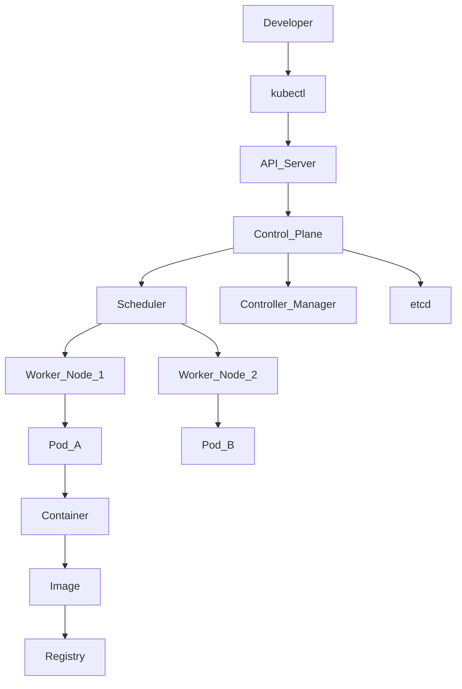
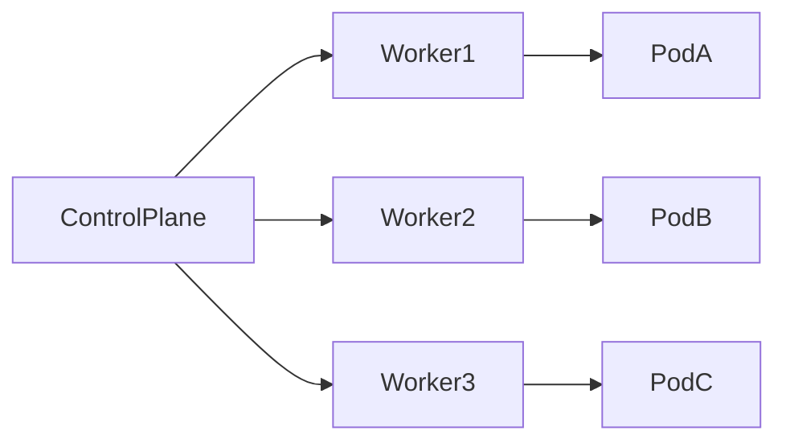
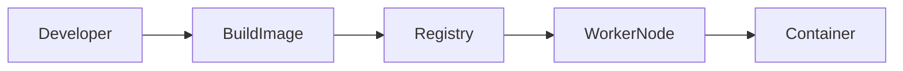
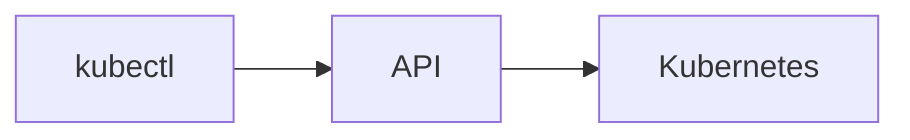
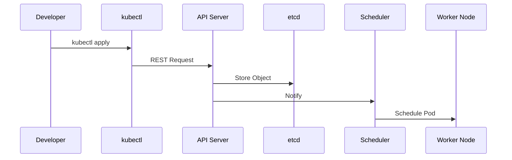
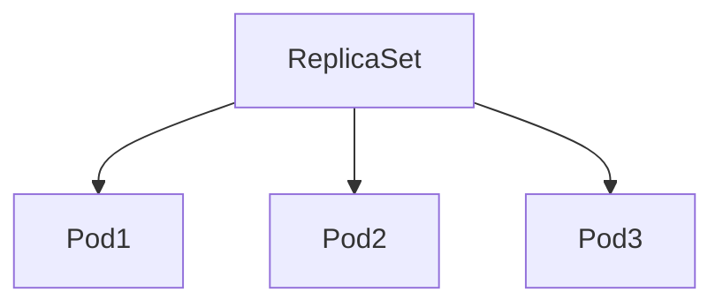

# Common Kubernetes Terms

> **Chapter 2 of the Kubernetes Handbook**
>
> **Difficulty:** ⭐ Beginner
>
> **Reading Time:** ~2 hours
>
> **Prerequisites:**
>
> - What is Kubernetes
> - Basic Docker knowledge
>
> **Next Chapter:**
>
> Kubernetes Architecture

---

# Learning Objectives

By the end of this chapter you will:

- Understand the language used in Kubernetes documentation.
- Differentiate between commonly confused terms.
- Learn how different Kubernetes components relate to one another.
- Build a strong foundation before learning Pods and Deployments.

---

# Why This Chapter Matters

One of the biggest reasons beginners find Kubernetes difficult is **terminology**.

Consider this sentence:

> "The Deployment creates a ReplicaSet, which creates Pods that run containers on Worker Nodes inside a Cluster while the Control Plane maintains the desired state."

For someone new to Kubernetes, almost every word in that sentence is unfamiliar.

By the end of this chapter, you'll understand every one of those terms.

---

# Kubernetes Ecosystem Overview

Before defining individual terms, let's look at how they fit together.



Don't worry if every component isn't clear yet. This diagram serves as a roadmap. By the end of the chapter, every block will make sense.

---

# Kubernetes Object

## Definition

A **Kubernetes Object** is a persistent record that describes the desired state of something inside a Kubernetes cluster.

Whenever you create, update, or delete resources in Kubernetes, you're interacting with Kubernetes Objects.

Examples include:

- Pod
- Deployment
- Service
- ConfigMap
- Secret
- Namespace
- Job

Almost everything in Kubernetes is represented as an object.

---

## Why Do Objects Exist?

Imagine manually telling Kubernetes:

- Create a Pod.
- Restart it if it crashes.
- Keep exactly three running.
- Expose it to users.
- Mount storage.
- Attach configuration.
- Set memory limits.

Doing this repeatedly would be tedious and error-prone.

Instead, Kubernetes lets you describe the desired outcome using objects.

The system continuously works to make reality match that description.

This approach is known as the **Declarative Model**.

---

## Real-World Analogy

Think of ordering a custom laptop online.

You don't tell the factory:

- Pick this screw.
- Install this RAM chip.
- Tighten the motherboard.

Instead, you simply choose:

- 16 GB RAM
- 1 TB SSD
- Intel Core i7

That order becomes the specification.

Similarly, Kubernetes Objects describe **what should exist**, not **how to build it**.

---

## Example

A Deployment object might declare:

```yaml
replicas: 3
image: nginx:1.27
```

This simply tells Kubernetes:

> "Always keep three running containers using this image."

How Kubernetes accomplishes this is its responsibility.

---

## Important Characteristics

Every Kubernetes Object has:

- metadata
- specification (spec)
- current status

You'll encounter these fields in almost every YAML file.

---

## Common Mistakes

❌ Thinking Objects are actual running applications.

Objects are **descriptions**.

The running application is created based on those descriptions.

---

## Interview Question

**What is a Kubernetes Object?**

Expected answer:

A Kubernetes Object is a persistent resource stored by the Kubernetes API that describes the desired state of an application or infrastructure component.

---

# Cluster

## Definition

A **Cluster** is a collection of machines managed together by Kubernetes.

Instead of treating each machine independently, Kubernetes treats them as one logical computing platform.

---

## Why Clusters Exist

Suppose your application receives 5 million requests per day.

One machine may not provide enough:

- CPU
- Memory
- Storage
- Network bandwidth

Adding more machines increases available resources.

Managing those machines individually would be difficult.

A cluster allows Kubernetes to manage them collectively.

---

## Architecture

```
Kubernetes Cluster

├── Control Plane
│
├── Worker Node
│
├── Worker Node
│
└── Worker Node
```

Each node contributes resources to the cluster.

---

## Real-World Analogy

Imagine a hospital.

The hospital consists of many departments.

Patients don't choose individual departments.

They visit the hospital.

The hospital internally decides where patients should go.

Similarly, users interact with applications running in the cluster rather than individual machines.

---

## Cluster Characteristics

A cluster may contain:

- One node (learning)
- Two or three nodes (development)
- Tens of nodes (small companies)
- Hundreds of nodes (large enterprises)
- Thousands of nodes (very large cloud environments)

---

## Common Misconceptions

### A Cluster is NOT a Server

Many beginners use these terms interchangeably.

Server = one machine

Cluster = many machines working together.

---

## Interview Question

**What is the difference between a server and a Kubernetes cluster?**

A server is a single machine.

A Kubernetes cluster is a group of machines managed as one system.

---

# Node

## Definition

A **Node** is an individual machine within a Kubernetes Cluster.

Nodes provide the computing resources needed to run applications.

A node may be:

- Physical server
- Virtual Machine
- Cloud Instance

---

## Why Nodes Exist

Applications require:

- CPU
- Memory
- Storage
- Networking

These resources come from Nodes.

Without Nodes, Kubernetes would have nowhere to execute workloads.

---

## Node Types

There are two primary types of nodes:

### Control Plane Node

Responsible for managing the cluster.

### Worker Node

Responsible for running application workloads.

---

## Diagram

```
Cluster

├── Node A

├── Node B

├── Node C
```

Each node contributes resources to the cluster.

---

## Real-World Analogy

Think of a warehouse.

Warehouse = Cluster

Shelf = Node

Products = Applications

The warehouse contains many shelves.

Applications are placed onto available shelves.

---

## Responsibilities

Nodes provide:

- CPU
- RAM
- Storage
- Networking

Worker nodes additionally run Pods and Containers.

---

## Common Mistakes

### Node ≠ Pod

A Node is a machine.

A Pod is an application unit running on that machine.

One Node can host many Pods.

---

## Comparison

| Node | Pod |
|------|-----|
| Physical or virtual machine | Kubernetes workload |
| Provides hardware resources | Consumes hardware resources |
| Can host many Pods | Runs on exactly one Node at a time |

---

## Interview Question

**Can multiple Pods run on one Node?**

Yes.

A Node typically hosts many Pods depending on available CPU and memory.

---

# Control Plane

## Definition

The **Control Plane** is the management layer of Kubernetes.

It continuously observes the cluster and makes decisions to keep the system in the desired state.

It is often referred to as **the brain of Kubernetes**.

---

## Why Does It Exist?

Imagine manually deciding:

- Which machine should run each application?
- Which Pods need restarting?
- Which nodes are unhealthy?
- Which deployments need updating?

That quickly becomes impossible in large environments.

The Control Plane automates these decisions.

---

## Responsibilities

The Control Plane is responsible for:

- Scheduling workloads
- Monitoring cluster health
- Maintaining desired state
- Managing deployments
- Processing API requests
- Coordinating cluster-wide operations

---

## Internal Components

The Control Plane consists of several major components:

- API Server
- Scheduler
- Controller Manager
- etcd

Each of these will receive a dedicated chapter later in this handbook.

---

## Real-World Analogy

Imagine an airport.

The control tower doesn't fly airplanes.

Instead, it coordinates:

- Takeoffs
- Landings
- Taxi routes
- Runway allocation

Similarly, the Control Plane coordinates the cluster while Worker Nodes perform the actual work.

---

## Common Mistakes

The Control Plane does **not** usually run user applications.

Its primary responsibility is managing the cluster itself.

---

## Quick Revision

Remember:

- Cluster = Entire Kubernetes environment
- Node = Individual machine
- Control Plane = Decision maker
- Worker Node = Runs applications
- Kubernetes Object = Desired state description

---

# Worker Node

## Definition

A **Worker Node** is a machine responsible for running your applications inside a Kubernetes cluster.

Whenever you deploy an application, Kubernetes eventually schedules it onto one of the Worker Nodes.

Unlike the Control Plane, which makes decisions, Worker Nodes execute those decisions.

---

## Why Worker Nodes Exist

Applications need somewhere to run.

They require:

- CPU
- Memory
- Disk
- Network

Worker Nodes provide these resources.

Without Worker Nodes, Kubernetes would have nowhere to run your Pods.

---

## Responsibilities

A Worker Node is responsible for:

- Running Pods
- Running Containers
- Pulling container images
- Reporting health to the Control Plane
- Executing instructions received from the Control Plane

It does **not** decide where workloads should run.

---

## High-Level Architecture



---

## Components Inside Every Worker Node

Every Worker Node contains several important components.

```
Worker Node

├── kubelet
├── kube-proxy
├── Container Runtime
└── Pods
```

We'll dedicate separate chapters to each of these components later.

---

## Real-World Analogy

Imagine a restaurant.

The restaurant manager assigns work.

The chefs actually cook.

Manager = Control Plane

Chef = Worker Node

The chef does not decide which orders to prepare.

The manager assigns them.

---

## Common Mistakes

### Worker Node ≠ Cluster

A Cluster consists of multiple Nodes.

A Worker Node is only one machine inside the cluster.

---

## Interview Question

**What runs on Worker Nodes?**

Expected Answer:

Worker Nodes run Pods, Containers, kubelet, kube-proxy, and the container runtime.

---

# Container

## Definition

A **Container** is a lightweight, isolated execution environment that packages an application together with everything it needs to run.

It includes:

- Application code
- Runtime
- Libraries
- Dependencies
- Configuration

Containers solve the classic problem:

> "It works on my machine."

---

## Why Containers Exist

Before containers, developers often faced environment inconsistencies.

Example:

```
Developer Laptop

Python 3.12

Ubuntu 24

---------------------

Production

Python 3.10

Ubuntu 20
```

The application works locally but fails in production.

Containers package the complete runtime environment, ensuring consistent behavior across systems.

---

## Container vs Virtual Machine

| Container | Virtual Machine |
|-----------|-----------------|
| Shares host OS kernel | Runs its own OS |
| Lightweight | Heavyweight |
| Starts in seconds | Starts in minutes |
| Lower resource usage | Higher resource usage |
| Ideal for microservices | Ideal for strong isolation |

---

## Lifecycle

```
Image

↓

Container Created

↓

Container Running

↓

Container Stops

↓

Container Removed
```

---

## Important Characteristics

Containers are:

- Portable
- Fast
- Isolated
- Reproducible
- Lightweight

---

## Common Mistakes

### Containers are NOT Virtual Machines.

Containers share the host operating system kernel.

Virtual Machines include an entire operating system.

---

## Interview Question

**Why are containers preferred over virtual machines in Kubernetes?**

Expected Answer:

Containers start faster, consume fewer resources, and package applications consistently while sharing the host operating system.

---

# Container Image

## Definition

A **Container Image** is a read-only template used to create containers.

Think of it as a blueprint.

Containers are running instances created from images.

---

## Relationship

```
Image

↓

Container

↓

Running Application
```

One image can create thousands of containers.

---

## What's Inside an Image?

An image typically contains:

- Application code
- Runtime
- Libraries
- Dependencies
- Environment configuration

---

## Image Layers

Images are built in layers.

Example:

```
Ubuntu Base

↓

Python

↓

Application Code

↓

Configuration
```

Layering improves storage efficiency because unchanged layers can be reused.

---

## Image Tags

Examples:

```
nginx:1.27

python:3.12

redis:8
```

The part after the colon is the tag.

---

> **Best Practice**
>
> Avoid using the `latest` tag in production. Use explicit version tags (for example, `nginx:1.27`) to ensure predictable deployments.

---

## Common Mistakes

### Image ≠ Container

Image = Blueprint

Container = Running instance

---

## Interview Question

**Can multiple containers be created from the same image?**

Yes.

One image may be used to create thousands of identical containers.

---

# Container Registry

## Definition

A **Container Registry** stores container images.

Instead of copying application files to every server manually, images are stored centrally.

Worker Nodes download images when needed.

---

## Popular Registries

- Docker Hub
- GitHub Container Registry (GHCR)
- Amazon Elastic Container Registry (ECR)
- Google Artifact Registry
- Azure Container Registry

---

## Workflow



---

## Public vs Private Registries

| Public | Private |
|---------|----------|
| Anyone can pull images | Authentication required |
| Suitable for open-source images | Suitable for company applications |

---

## Common Mistakes

Deleting a local image does **not** delete it from the registry.

The registry is the source of truth.

---

# Manifest

## Definition

A **Manifest** is a YAML file describing one or more Kubernetes Objects.

Instead of typing commands repeatedly, you declare the desired configuration in a manifest.

---

## Example

```yaml
apiVersion: v1

kind: Pod

metadata:
  name: nginx

spec:
  containers:
  - name: nginx
    image: nginx:1.27
```

---

## Why Manifests Exist

Benefits include:

- Version control
- Repeatability
- Automation
- Easy rollback
- Infrastructure as Code

---

## Common Mistake

A Manifest is **not** executed like a shell script.

It is submitted to the Kubernetes API, which interprets it.

---

# YAML

## Definition

YAML (YAML Ain't Markup Language) is the configuration language used by Kubernetes.

Almost every Kubernetes object is written in YAML.

---

## Example

```yaml
apiVersion: apps/v1

kind: Deployment

metadata:
  name: shopping-app
```

---

## Why YAML?

YAML is:

- Human-readable
- Easy to edit
- Widely adopted
- Well-suited for nested configuration

---

## YAML Rules

Indentation matters.

Use spaces—not tabs.

Incorrect indentation causes parsing errors.

---

## Common Mistakes

❌ Using tabs.

❌ Incorrect indentation.

❌ Misspelling field names.

---

> **Tip**
>
> Validate your manifests before applying them. Small indentation mistakes can prevent resources from being created.

---

# API

## Definition

An **API (Application Programming Interface)** is a mechanism that allows software systems to communicate with one another.

In Kubernetes, almost every interaction happens through the Kubernetes API.

---

## Example

When you execute:

```bash
kubectl get pods
```

`kubectl` does **not** read Pods directly.

Instead, it sends a request to the Kubernetes API.

---

## Simple Flow



---

## Common Mistake

Many beginners think `kubectl` talks directly to Worker Nodes.

It doesn't.

Everything goes through the Kubernetes API.

---

# API Server

## Definition

The **API Server** is the front door of Kubernetes.

Every request enters the cluster through the API Server.

Whether you:

- Create a Pod
- Delete a Deployment
- Scale an application
- Read logs

the request first reaches the API Server.

---

## Responsibilities

The API Server:

- Validates requests
- Authenticates users
- Authorizes operations
- Stores objects in etcd
- Returns responses

---

## Request Flow



---

## Why Is the API Server Important?

Without the API Server:

- No Pods can be created.
- No Deployments can be updated.
- No objects can be queried.
- The Control Plane cannot function correctly.

It is one of the most critical components of the cluster.

---

# Quick Revision

| Term | Remember This |
|------|---------------|
| Worker Node | Runs applications |
| Container | Running application package |
| Image | Blueprint for containers |
| Registry | Stores images |
| Manifest | YAML configuration file |
| YAML | Configuration language |
| API | Communication interface |
| API Server | Entry point to Kubernetes |

---

## Coming Next (Part 3)

We'll cover the core Kubernetes objects you'll work with every day:

- Pod
- ReplicaSet
- Deployment
- Namespace
- Labels
- Selectors
- Annotations

---

# Pod

> **Most Important Concept in Kubernetes**

If you remember only one Kubernetes object, remember the **Pod**.

Everything else—Deployments, ReplicaSets, Jobs, DaemonSets—ultimately creates Pods.

---

## Definition

A **Pod** is the **smallest deployable unit** in Kubernetes.

A Pod is **not** a container.

Instead, it is a wrapper around one or more containers that:

- share the same network
- share the same storage (if configured)
- are scheduled together
- have the same lifecycle

---

## Why Didn't Kubernetes Schedule Containers Directly?

This is one of the most common interview questions.

Containers sometimes need to work so closely together that separating them makes no sense.

Example:

```
Main Application

↓

Logging Agent
```

The logging agent should always start with the application.

If the application moves to another machine,
the logging agent must move too.

Instead of scheduling them independently,

Kubernetes groups them into a Pod.

---

## Pod Architecture

```mermaid
flowchart TB

Pod

--> Container A

Pod

--> Container B

Pod

--> Shared Network

Pod

--> Shared Storage
```

---

## Usually One Container per Pod

Although multiple containers are allowed,

the recommended practice is:

```
1 Pod

↓

1 Container
```

Why?

Because Kubernetes already provides scaling and management at the Pod level.

Running unrelated applications inside the same Pod makes scaling and maintenance more difficult.

---

## Multi-Container Pods

Multiple containers are appropriate when they work together as a single unit.

Examples:

- Application + Logging Agent
- Application + Metrics Exporter
- Application + Proxy Sidecar

This pattern is called the **Sidecar Pattern**.

---

## Real-World Analogy

Think of a motorcycle.

```
Motorcycle

↓

Engine

↓

Fuel Tank

↓

Handlebars
```

You don't transport the engine separately from the motorcycle.

Similarly, Kubernetes schedules related containers together inside one Pod.

---

## Common Mistakes

❌ Pod = Container

Correct:

A Pod **contains** one or more containers.

---

## Interview Question

**Can a Pod contain multiple containers?**

Yes.

However, the recommended practice is usually one container per Pod unless the containers must share the same lifecycle.

---

# ReplicaSet

## Definition

A ReplicaSet ensures that a specified number of identical Pods are always running.

Example:

```
Desired

3 Pods
```

Current:

```
Pod 1

Pod 2
```

One Pod crashes.

ReplicaSet notices:

```
Desired = 3

Actual = 2
```

It immediately creates another Pod.

---

## Why Does ReplicaSet Exist?

Applications fail.

Servers fail.

Pods crash.

Without ReplicaSets, engineers would need to recreate Pods manually.

ReplicaSets automate this process.

---

## Architecture



---

## Important Note

In real projects,

you rarely create ReplicaSets directly.

Instead,

Deployments create and manage ReplicaSets.

---

## Common Mistake

Many beginners think:

Deployment creates Pods.

Actually:

```
Deployment

↓

ReplicaSet

↓

Pods
```

---

# Deployment

## Definition

A Deployment manages ReplicaSets and provides declarative updates for Pods.

This is the object developers use most frequently.

---

## Why Was Deployment Introduced?

ReplicaSets ensure the correct number of Pods.

But they don't handle:

- Rolling updates
- Rollbacks
- Deployment history

Deployments provide these higher-level features.

---

## Architecture

```mermaid
flowchart TB

Deployment

↓

ReplicaSet

↓

Pods
```

---

## Capabilities

Deployments support:

- Scaling
- Rolling Updates
- Rollbacks
- Version History
- Self-Healing

---

## Real-World Example

Suppose your shopping application currently runs:

Version 1

You deploy:

Version 2

Deployment gradually replaces old Pods with new Pods.

Users continue using the application during the update.

If Version 2 fails,

Deployment automatically supports rolling back to Version 1.

---

## Common Mistake

Developers often delete Pods manually.

Deployment immediately recreates them.

The Deployment—not the Pod—is the resource being managed.

---

## Interview Question

**Why should you create a Deployment instead of a Pod?**

Expected Answer:

Deployments provide scaling, rolling updates, rollbacks, self-healing, and management of ReplicaSets.

---

# Namespace

## Definition

A Namespace is a logical partition inside a Kubernetes Cluster.

Think of it as a folder.

Instead of placing everything together,

Namespaces organize resources.

---

## Example

```
Cluster

├── Development

├── Testing

├── Production
```

Each Namespace contains its own:

- Pods
- Services
- Deployments
- ConfigMaps
- Secrets

---

## Why Use Namespaces?

Imagine a company with:

- Team A
- Team B
- Team C

Without Namespaces:

everyone creates resources together.

Soon you have:

```
400 Pods

300 Services

200 Deployments
```

Nobody knows which belongs to whom.

Namespaces solve this problem.

---

## Common Namespaces

```
default

kube-system

kube-public

kube-node-lease
```

---

## Common Mistakes

Namespaces do **not** provide security by themselves.

They organize resources.

Access control is handled separately using RBAC.

---

## Interview Question

**Can Pods in different Namespaces communicate?**

Yes.

Namespaces are organizational boundaries, not complete network isolation.

Communication can still occur unless restricted by policies.

---

# Labels

## Definition

Labels are key-value pairs attached to Kubernetes objects.

Example:

```yaml
labels:

  app: nginx

  environment: production

  team: backend
```

---

## Why Are Labels Needed?

Imagine 5,000 Pods.

How do you identify:

- Backend Pods?
- Production Pods?
- Payment Pods?

Labels make searching and grouping possible.

---

## Real-World Analogy

Imagine books in a library.

Labels might include:

- Science
- Mathematics
- Fiction

Books are grouped using labels.

Pods are grouped similarly.

---

## Best Practices

Good labels include:

```
app

version

team

environment

component
```

---

# Selectors

## Definition

Selectors locate Kubernetes objects using Labels.

Example:

```
Label

app=frontend
```

Selector:

```
Find all Pods

where

app=frontend
```

---

## Relationship

```
Labels

↓

Selectors

↓

Matching Pods
```

---

## Why Are Selectors Important?

Services use selectors.

ReplicaSets use selectors.

Deployments use selectors.

Without selectors,

Kubernetes wouldn't know which Pods belong together.

---

## Analogy

Imagine Gmail.

Emails have labels.

You search:

```
label:important
```

That search is equivalent to a Selector.

---

## Common Mistake

Labels identify objects.

Selectors search for objects.

They are not the same thing.

---

# Annotations

## Definition

Annotations are metadata attached to Kubernetes objects.

Unlike labels,

annotations are **not** intended for selecting resources.

---

## Example

```yaml
annotations:

  owner: platform-team

  documentation: internal wiki

  build: Jenkins #402
```

---

## Labels vs Annotations

| Labels | Annotations |
|---------|-------------|
| Used for selection | Not used for selection |
| Small metadata | Large metadata |
| Queried frequently | Informational |
| Used by controllers | Used by humans and tools |

---

## Common Use Cases

Annotations often store:

- Build numbers
- Git commit hashes
- Documentation links
- Deployment timestamps
- Monitoring configuration

---

# Comparison Summary

| Object | Primary Responsibility |
|---------|------------------------|
| Pod | Runs containers |
| ReplicaSet | Maintains Pod count |
| Deployment | Manages ReplicaSets |
| Namespace | Organizes resources |
| Label | Identifies resources |
| Selector | Finds resources |
| Annotation | Stores additional metadata |

---

# Quick Revision

Remember this chain:

```
Deployment

↓

ReplicaSet

↓

Pod

↓

Container
```

And remember:

```
Label

↓

Selector

↓

Matching Resources
```

---

## Coming Next (Part 4)

We'll complete the terminology chapter with:

- Service
- Endpoint
- Ingress
- ConfigMap
- Secret
- Volume
- Persistent Volume
- Persistent Volume Claim
- StorageClass
- kubelet
- kube-proxy
- Scheduler
- Controller
- etcd
- Container Runtime
- Final glossary
- One-page revision sheet
- Interview recap

---

# Service

> **One of the most important Kubernetes Objects**

Pods are **temporary**.

Whenever a Pod is recreated, its IP address changes.

Applications cannot reliably communicate using Pod IP addresses.

Kubernetes solves this problem using **Services**.

---

## Definition

A **Service** is a stable network endpoint that provides access to one or more Pods.

Instead of connecting directly to Pods,

applications connect to a Service.

The Service automatically forwards traffic to healthy Pods.

---

## Why Do Services Exist?

Imagine you have three Pods.

```
Shopping App

↓

Pod A

10.0.1.12

Pod B

10.0.1.18

Pod C

10.0.1.25
```

Tomorrow Pod B crashes.

Kubernetes creates another Pod.

```
New Pod

10.0.1.77
```

The IP address changed.

If another application stored:

```
10.0.1.18
```

communication immediately fails.

Instead,

applications connect to

```
shopping-service
```

The Service automatically routes traffic to whichever Pods are healthy.

---

## Architecture

```mermaid
flowchart TB

Users

↓

Service

↓

Pod A

Service

↓

Pod B

Service

↓

Pod C
```

---

## Responsibilities

A Service provides:

- Stable IP address
- Stable DNS name
- Load balancing
- Service discovery

---

## Common Types

- ClusterIP
- NodePort
- LoadBalancer
- ExternalName

These receive dedicated chapters later.

---

## Common Mistake

A Service does **not** create Pods.

It only provides access to existing Pods.

---

## Interview Question

**Why do Pods need Services?**

Expected Answer:

Because Pod IP addresses change when Pods are recreated.

Services provide a stable endpoint.

---

# Endpoint

## Definition

An Endpoint is the actual list of Pods behind a Service.

Example:

```
shopping-service

↓

10.0.1.12

10.0.1.20

10.0.1.32
```

Whenever Pods change,

Endpoints change automatically.

The Service itself remains unchanged.

---

## Relationship

```
Service

↓

Endpoints

↓

Pods
```

---

## Common Mistake

Service ≠ Endpoint

The Service is the stable interface.

Endpoints are the current Pod addresses.

---

# Ingress

## Definition

Ingress provides HTTP and HTTPS routing into a Kubernetes cluster.

Instead of exposing every Service individually,

Ingress acts as a single entry point.

---

## Example

```
shop.example.com

↓

Shopping Service

----------------

admin.example.com

↓

Admin Service

----------------

api.example.com

↓

API Service
```

One external IP.

Multiple applications.

---

## Architecture

```mermaid
flowchart TB

Internet

↓

Ingress

↓

Shopping Service

↓

Shopping Pods

Ingress

↓

API Service

↓

API Pods
```

---

## Benefits

Ingress supports:

- URL routing
- Host-based routing
- SSL termination
- Reverse proxy
- Load balancing

---

## Common Mistake

Ingress is **not** a Service.

Ingress routes traffic **to Services**.

---

# ConfigMap

## Definition

A ConfigMap stores **non-sensitive configuration data** separately from application code.

Examples include:

- Database hostname
- Feature flags
- Port numbers
- Application settings

---

## Why Use ConfigMaps?

Without ConfigMaps:

Configuration is hardcoded.

Changing configuration requires rebuilding container images.

With ConfigMaps:

Configuration changes independently of application code.

---

## Example

Instead of:

```
Database Host

hardcoded
```

Store it inside a ConfigMap.

Applications read the value at runtime.

---

## Common Mistake

Never store passwords inside ConfigMaps.

---

# Secret

## Definition

Secrets store **sensitive information**.

Examples:

- Passwords
- API Keys
- Tokens
- Certificates

---

## Why Separate Secrets?

Configuration is often visible to many engineers.

Passwords should not be.

Secrets help separate confidential information from general configuration.

---

## Important Note

Secrets are **Base64 encoded**.

Encoding is **not encryption**.

Clusters should also enable encryption at rest for stronger protection.

---

## Common Mistake

Base64 encoding does **not** make data secure.

---

## Comparison

| ConfigMap | Secret |
|------------|---------|
| Configuration | Sensitive data |
| Non-confidential | Confidential |
| Plain values | Encoded values |

---

# Volume

## Definition

A Volume provides storage for Pods.

Normally,

container files disappear when the container stops.

Volumes allow data to persist during the Pod's lifetime.

---

## Why Are Volumes Needed?

Suppose an application stores uploaded files.

Container crashes.

Container restarts.

Without a Volume:

```
Files Lost
```

Volumes solve this problem.

---

## Common Use Cases

- Logs
- Uploads
- Temporary files
- Shared data between containers

---

# Persistent Volume (PV)

## Definition

A Persistent Volume represents storage available inside the cluster.

Unlike normal Volumes,

Persistent Volumes exist independently of Pods.

---

## Analogy

Imagine renting an apartment.

Tenant leaves.

Apartment remains.

Another tenant moves in.

Similarly,

Pods come and go,

Persistent Volumes remain.

---

# Persistent Volume Claim (PVC)

## Definition

A Persistent Volume Claim is a request for storage.

Instead of selecting storage directly,

Pods request storage through a PVC.

---

## Relationship

```
Pod

↓

PVC

↓

Persistent Volume
```

---

## Why Use PVC?

Pods should not know where storage physically exists.

PVCs decouple applications from storage implementation.

---

# StorageClass

## Definition

A StorageClass defines **how storage should be created**.

Different StorageClasses may represent:

- SSD
- HDD
- Cloud Block Storage
- Network Storage

Pods request storage.

StorageClass determines how that storage is provisioned.

---

## Workflow

```
Pod

↓

PVC

↓

StorageClass

↓

Persistent Volume
```

---

# kubelet

## Definition

The kubelet is an agent running on every Worker Node.

It communicates with the Control Plane.

---

## Responsibilities

kubelet:

- Starts Pods
- Stops Pods
- Reports Node health
- Executes instructions
- Monitors containers

---

## Common Mistake

kubelet does **not** schedule Pods.

The Scheduler does.

---

# kube-proxy

## Definition

kube-proxy manages networking rules on Worker Nodes.

It enables Services to communicate with Pods.

---

## Responsibilities

- Service networking
- Load balancing
- Network routing

---

# Scheduler

## Definition

The Scheduler decides **where Pods should run**.

When a new Pod is created,

the Scheduler chooses the most suitable Worker Node.

---

## Factors Considered

- CPU availability
- Memory
- Taints
- Affinity rules
- Resource requests
- Scheduling policies

---

## Common Mistake

Scheduler chooses the Node.

kubelet starts the Pod.

These are different responsibilities.

---

# Controller

## Definition

Controllers continuously compare:

Desired State

vs

Current State

Whenever differences exist,

Controllers attempt to fix them.

---

## Example

Desired:

```
5 Pods
```

Current:

```
4 Pods
```

Controller creates:

```
1 New Pod
```

---

## Why Controllers Matter

Controllers implement Kubernetes' famous reconciliation loop.

Without Controllers,

desired state could never be maintained automatically.

---

# etcd

## Definition

etcd is Kubernetes' distributed key-value database.

It stores:

- Cluster configuration
- Objects
- Metadata
- Cluster state

Everything Kubernetes knows about the cluster is ultimately stored in etcd.

---

## Why Is etcd Important?

If etcd becomes unavailable,

the Control Plane cannot reliably read or update cluster state.

Regular backups are therefore critical in production environments.

---

# Container Runtime

## Definition

A Container Runtime is the software responsible for actually running containers.

Examples include:

- containerd
- CRI-O

Earlier Kubernetes versions commonly used Docker as the runtime, but modern Kubernetes interacts with runtimes through the **Container Runtime Interface (CRI)**.

---

## Responsibilities

The runtime:

- Pulls images
- Creates containers
- Starts containers
- Stops containers
- Removes containers

---

# Complete Relationship Diagram

```mermaid
flowchart TD

Developer

↓

kubectl

↓

API Server

↓

Scheduler

↓

Worker Node

↓

kubelet

↓

Container Runtime

↓

Pod

↓

Container

↓

Application
```

---

---

# Commonly Confused Terms

One of the biggest challenges in Kubernetes is that many concepts sound similar but serve very different purposes.

This section summarizes the most common interview and real-world confusions.

---

## Pod vs Container

| Pod | Container |
|------|-----------|
| Smallest deployable Kubernetes unit | Smallest runnable software unit |
| Managed by Kubernetes | Managed by a container runtime |
| Can contain one or more containers | Contains a single application process (typically) |
| Has its own IP | Shares the Pod's IP |
| Scheduled by Kubernetes | Runs inside a Pod |

### Remember

```
Pod

└── Container
```

A Pod is **not** a container.

A Pod **contains** containers.

---

## Deployment vs ReplicaSet

| Deployment | ReplicaSet |
|------------|------------|
| Higher-level object | Lower-level object |
| Supports rolling updates | Does not |
| Supports rollbacks | Does not |
| Maintains deployment history | No |
| Creates ReplicaSets | Creates Pods |

Relationship:

```
Deployment

↓

ReplicaSet

↓

Pods
```

In production, you almost always create Deployments instead of ReplicaSets directly.

---

## Service vs Ingress

| Service | Ingress |
|----------|---------|
| Connects to Pods | Connects to Services |
| Internal networking | External HTTP/HTTPS routing |
| Stable IP | URL/Host-based routing |
| Load balances Pods | Routes traffic between Services |

Flow:

```
Internet

↓

Ingress

↓

Service

↓

Pods
```

---

## ConfigMap vs Secret

| ConfigMap | Secret |
|------------|--------|
| Non-sensitive configuration | Sensitive configuration |
| Database hostname | Database password |
| Feature flags | API tokens |
| Environment settings | Certificates |

---

## Persistent Volume vs Persistent Volume Claim

| Persistent Volume | Persistent Volume Claim |
|-------------------|------------------------|
| Actual storage | Request for storage |
| Provided by cluster | Requested by application |
| Infrastructure resource | Application resource |

Relationship:

```
Application

↓

PVC

↓

PV
```

---

## Label vs Selector

| Label | Selector |
|--------|----------|
| Identifies resources | Finds resources |
| Attached to objects | Queries labels |
| Key-value metadata | Search expression |

Example:

```
Label

app=frontend

↓

Selector

Find Pods

app=frontend
```

---

## Cluster vs Node

| Cluster | Node |
|----------|------|
| Entire Kubernetes environment | One machine inside it |
| Contains many nodes | Runs workloads |
| Managed collectively | Individual resource provider |

---

## Control Plane vs Worker Node

| Control Plane | Worker Node |
|---------------|-------------|
| Makes decisions | Executes decisions |
| Runs management components | Runs application workloads |
| Schedules Pods | Hosts Pods |
| Stores cluster state | Provides compute resources |

---

# End-to-End Kubernetes Flow

Understanding how everything connects is more important than memorizing definitions.

```mermaid
flowchart TD

Developer

↓

kubectl

↓

API Server

↓

Scheduler

↓

Worker Node

↓

kubelet

↓

Container Runtime

↓

Pod

↓

Container

↓

Application

Application

↓

Service

↓

Ingress

↓

Internet User
```

---

# How to Read Kubernetes Documentation

Whenever you read Kubernetes documentation, mentally divide concepts into four categories:

## 1. Infrastructure

Examples:

- Cluster
- Node
- Control Plane
- Worker Node

These provide the platform.

---

## 2. Workloads

Examples:

- Pod
- Deployment
- ReplicaSet
- Job
- DaemonSet
- StatefulSet

These run applications.

---

## 3. Networking

Examples:

- Service
- Ingress
- Endpoint
- DNS

These connect applications.

---

## 4. Configuration

Examples:

- ConfigMap
- Secret
- Volume
- PVC

These provide configuration and storage.

Thinking this way makes Kubernetes documentation much easier to understand.

---

# Memory Tricks

## Deployment

Think:

> "I want this application running."

---

## ReplicaSet

Think:

> "Always maintain this number of Pods."

---

## Pod

Think:

> "This is where my application actually runs."

---

## Service

Think:

> "Stable address for Pods."

---

## Namespace

Think:

> "Folder."

---

## Label

Think:

> "Tag."

---

## Selector

Think:

> "Search."

---

## ConfigMap

Think:

> "Configuration."

---

## Secret

Think:

> "Passwords."

---

## Persistent Volume

Think:

> "Storage."

---

## PVC

Think:

> "Storage request."

---

# Interview Questions

## Beginner

### What is a Cluster?

### What is a Node?

### What is a Pod?

### What is a Deployment?

### What is a Service?

### What is a Namespace?

### What is a ConfigMap?

### What is a Secret?

### What is a Persistent Volume?

### What is a Persistent Volume Claim?

---

## Intermediate

### Why are Pods used instead of containers?

### Why are Deployments preferred over Pods?

### Why do Services exist?

### Why are Labels important?

### How do Selectors work?

### What is the purpose of the Scheduler?

### What does kubelet do?

### What is stored in etcd?

### Why shouldn't you use the `latest` image tag in production?

### Why are ConfigMaps and Secrets separate resources?

---

## Scenario-Based

### One Pod crashes. Which Kubernetes object recreates it?

**Answer:**
The ReplicaSet (usually managed by a Deployment).

---

### A Pod's IP changes after recreation. How should other applications connect to it?

**Answer:**
Through a Service.

---

### You accidentally delete a Pod created by a Deployment. What happens?

**Answer:**
The Deployment notices the desired number of Pods is no longer met and recreates it via its ReplicaSet.

---

### You need to store an API token. Which object should you use?

**Answer:**
A Secret.

---

### You need to store the application port number.

**Answer:**
A ConfigMap.

---

# Quick Revision Sheet

Remember these relationships:

```
Deployment

↓

ReplicaSet

↓

Pod

↓

Container
```

```
Service

↓

Endpoints

↓

Pods
```

```
Application

↓

PVC

↓

Persistent Volume
```

```
Labels

↓

Selectors

↓

Matching Resources
```

```
Developer

↓

kubectl

↓

API Server

↓

Scheduler

↓

Worker Node

↓

Pod

↓

Container
```

---

# Glossary

| Term | One-Line Meaning |
|------|------------------|
| Cluster | Collection of nodes managed by Kubernetes |
| Node | Machine in the cluster |
| Control Plane | Cluster management components |
| Worker Node | Runs application workloads |
| Pod | Smallest deployable Kubernetes unit |
| Container | Running application package |
| Image | Blueprint for containers |
| Registry | Stores images |
| Deployment | Manages ReplicaSets and updates |
| ReplicaSet | Maintains the desired number of Pods |
| Service | Stable network endpoint for Pods |
| Endpoint | Current list of Pod IPs behind a Service |
| Ingress | HTTP/HTTPS entry point into the cluster |
| Namespace | Logical partition of cluster resources |
| Label | Key-value metadata for identification |
| Selector | Matches resources using labels |
| ConfigMap | Non-sensitive configuration |
| Secret | Sensitive configuration |
| Volume | Storage for a Pod |
| Persistent Volume | Cluster storage resource |
| Persistent Volume Claim | Request for storage |
| StorageClass | Defines how storage is provisioned |
| kubelet | Node agent that manages Pods |
| kube-proxy | Manages Service networking |
| Scheduler | Chooses where Pods run |
| Controller | Reconciles desired and actual state |
| API Server | Entry point for all Kubernetes API requests |
| etcd | Distributed key-value store for cluster state |
| Container Runtime | Software that runs containers |

---

# Summary

In this chapter, you learned the foundational vocabulary of Kubernetes. These terms are used throughout the rest of the handbook and form the basis for understanding Kubernetes architecture, workloads, networking, storage, and troubleshooting.

You should now be able to:

- Distinguish between infrastructure components and workloads.
- Understand how Pods, Deployments, and ReplicaSets relate.
- Explain why Services provide stable networking.
- Differentiate ConfigMaps from Secrets.
- Describe the role of the Control Plane and Worker Nodes.
- Follow the lifecycle of a request from `kubectl` to a running application.

---

# Related Chapters

Next:

- **03_Kubernetes_Architecture.md**

Future deep dives:

- **02_Core_Objects/01_Pods.md**
- **02_Core_Objects/02_ReplicaSets.md**
- **02_Core_Objects/03_Deployments.md**
- **03_Networking/04_Service.md**
- **04_Storage/01_Volumes.md**

> **Tip:** Don't worry if some terms still feel abstract. The upcoming chapters explore each major component in detail, with real YAML, production examples, troubleshooting workflows, and hands-on labs.

---

---

