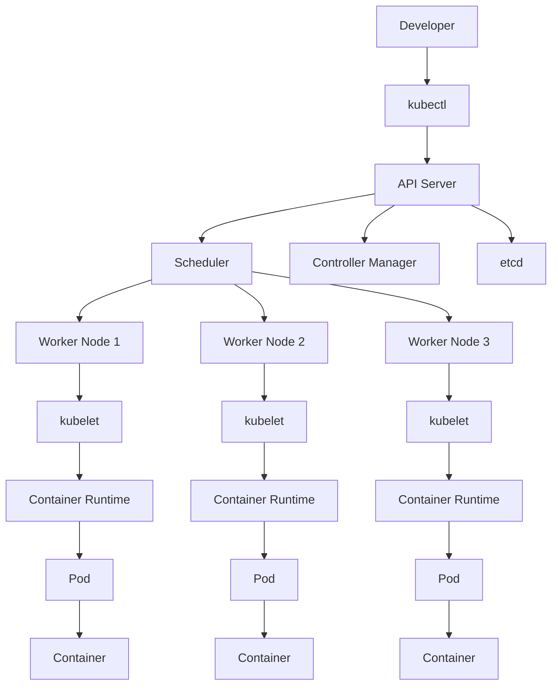
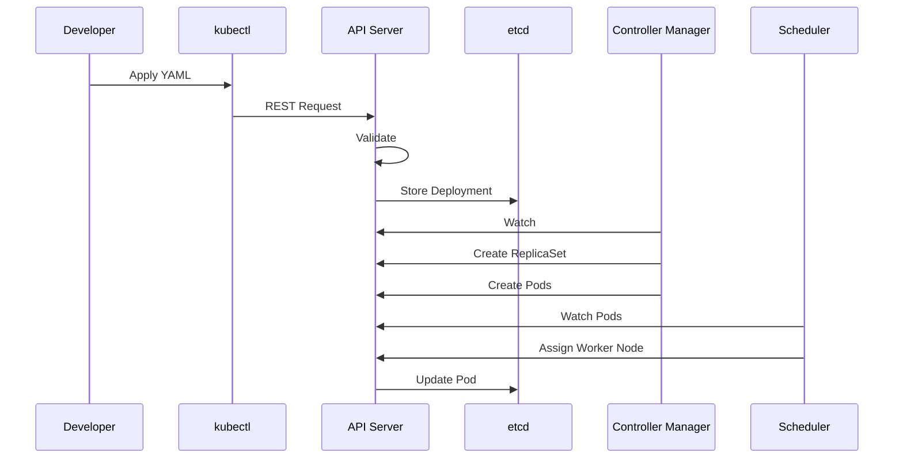
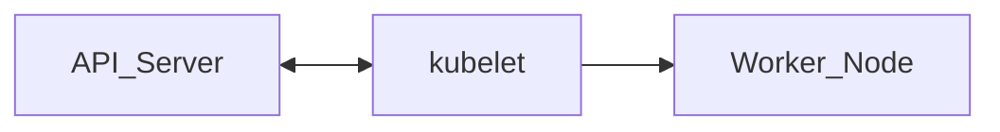
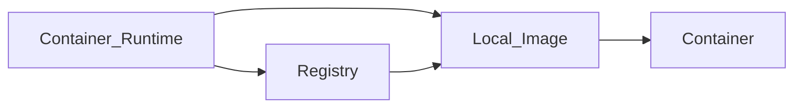
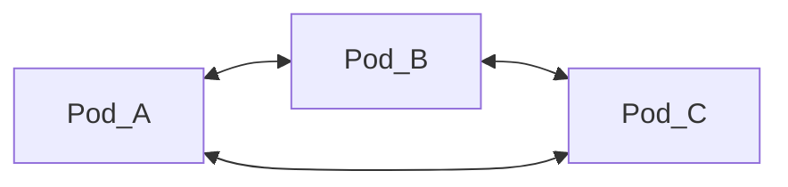
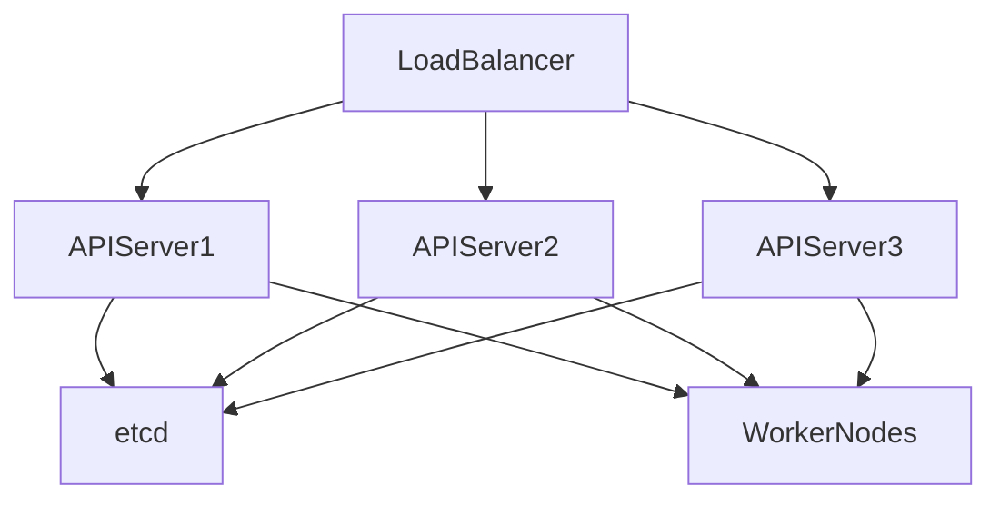

# Kubernetes Architecture

> **Chapter 3 of the Kubernetes Handbook**
>
> **Difficulty:** ⭐⭐ Beginner → Intermediate
>
> **Reading Time:** ~2.5 Hours
>
> **Prerequisites**
>
> - 01_What_is_Kubernetes.md
> - 02_Common_Terms.md
>
> **Next Chapters**
>
> - Control Plane
> - Worker Node

---

# Learning Objectives

After completing this chapter you will understand:

- Why Kubernetes has the architecture it does
- Every major component in the cluster
- How components communicate
- High-level request flow
- Why the Control Plane is separated
- Worker Node responsibilities
- The complete picture before diving into each component

---

# Why Architecture Matters

Many beginners learn Kubernetes like this:

```
Pod

↓

Deployment

↓

Service

↓

Ingress
```

They memorize objects.

But they never understand **how Kubernetes actually works**.

Imagine learning how to drive without knowing:

- where the engine is
- what the steering wheel does
- why brakes exist

Eventually you'll get confused.

The same happens with Kubernetes.

Once you understand the architecture,

everything else becomes much easier.

---

# What Is Kubernetes Architecture?

Kubernetes Architecture describes how all Kubernetes components work together to manage applications.

Think of Kubernetes as an operating system for an entire data center.

Instead of managing one computer,

it manages hundreds or thousands.

To achieve this,

Kubernetes divides responsibilities among specialized components.

Each component has one job.

Together,

they form the Kubernetes Control Plane and Worker Nodes.

---

# High-Level Architecture

Let's begin with the complete picture.



At first glance,

this may look complicated.

Don't worry.

By the end of this chapter,

every box in this diagram will make sense.

---

# Kubernetes Architecture Philosophy

Kubernetes follows one important design principle:

> **Every component should have one clearly defined responsibility.**

Instead of creating one giant program that performs every task,

Kubernetes is built from many smaller components.

For example,

the Scheduler only decides **where Pods should run**.

It does **not** start Pods.

The kubelet starts Pods.

The API Server processes requests.

The Controller Manager maintains the desired state.

The Container Runtime runs containers.

Each component focuses on one responsibility.

This design makes Kubernetes:

- Easier to maintain
- Easier to scale
- Easier to debug
- More reliable

---

# The Two Major Parts of Kubernetes

Every Kubernetes cluster consists of two logical sections.

```
Kubernetes Cluster

│

├── Control Plane

│

└── Worker Nodes
```

Everything belongs to one of these two categories.

---

# The Control Plane

The Control Plane is the management layer.

It makes decisions.

It does **not** normally execute application workloads.

Think of it as the brain.

The Control Plane answers questions like:

- Which node should run this Pod?
- Is a Pod unhealthy?
- Has someone created a Deployment?
- Should another Pod be started?
- Which objects exist?

The Control Plane constantly watches the cluster and works to ensure that reality matches the desired state.

---

## Components of the Control Plane

The Control Plane contains several important components.

```
Control Plane

├── API Server

├── Scheduler

├── Controller Manager

└── etcd
```

Each has a unique responsibility.

We'll dedicate entire chapters to each one later.

For now,

focus on understanding the overall picture.

---

# Worker Nodes

Worker Nodes are responsible for running your applications.

Whenever you create a Pod,

that Pod eventually runs on a Worker Node.

Unlike the Control Plane,

Worker Nodes do not make scheduling decisions.

Instead,

they execute instructions received from the Control Plane.

---

## Components of a Worker Node

Every Worker Node contains:

```
Worker Node

├── kubelet

├── kube-proxy

├── Container Runtime

└── Pods
```

These components cooperate to execute application workloads.

---

# Architecture Analogy

Imagine a large airport.

```
Airport

├── Air Traffic Control

├── Airplanes
```

The Air Traffic Control Tower:

- Assigns runways
- Coordinates flights
- Prevents collisions
- Handles emergencies

Airplanes:

- Carry passengers
- Fly to destinations
- Consume fuel

Mapping this to Kubernetes:

| Airport | Kubernetes |
|----------|------------|
| Air Traffic Control | Control Plane |
| Airplane | Worker Node |
| Passenger | Application |
| Flight Plan | Deployment |

The tower never flies airplanes.

Likewise,

the Control Plane never runs your applications.

It coordinates the cluster.

---

# Communication Flow

One of the most important concepts in Kubernetes is that components **do not communicate randomly**.

Almost every operation flows through the API Server.

```
Developer

↓

kubectl

↓

API Server

↓

Other Components
```

This design provides:

- Security
- Consistency
- Authentication
- Authorization
- Validation
- Centralized communication

The API Server acts as the single entry point into the cluster.

---

# Why Not Let Components Talk Directly?

Suppose the Scheduler directly modified Pods.

Suppose the kubelet also modified Pods.

Suppose Controllers modified Pods independently.

Soon,

multiple components would conflict with each other.

Instead,

every component communicates through the Kubernetes API.

This creates a single source of truth.

---

> **Key Principle**
>
> The API Server is the "front door" of Kubernetes. Almost every read or write operation goes through it.

---

# Desired State Revisited

One of Kubernetes' most important ideas is the **Desired State Model**.

Instead of issuing procedural commands like:

```
Start Pod

Monitor Pod

Restart Pod
```

you declare:

```
I want three Pods running.
```

Kubernetes continuously compares:

```
Desired State

↓

Actual State
```

Whenever they differ,

the Control Plane initiates corrective action.

This continuous comparison is called the **Reconciliation Loop**, and it is the foundation of Kubernetes' self-healing behavior.

---

# Summary (Part 1)

In this first part, we've established the high-level architecture of a Kubernetes cluster:

- A cluster is divided into the **Control Plane** and **Worker Nodes**.
- The Control Plane makes decisions; Worker Nodes execute workloads.
- Components have clearly defined responsibilities.
- The API Server is the central communication hub.
- Kubernetes continuously reconciles the desired state with the actual state.

In the next part, we'll zoom in on the Control Plane and follow a real deployment request from `kubectl` all the way to a running Pod.


---

# The Journey of a Deployment

Imagine you execute the following command.

```bash
kubectl apply -f deployment.yaml
```

It looks like a single command.

In reality, dozens of operations happen behind the scenes.

Understanding this workflow is one of the most important concepts in Kubernetes.

Let's follow the request from your laptop to a running application.

---

# Step 1 – The Developer

Everything begins with the developer.

```
Developer

↓

kubectl apply
```

The developer writes a YAML manifest describing the desired state.

Example:

```yaml
replicas: 3

image: nginx:1.27
```

The YAML does **not** tell Kubernetes:

- where to run Pods
- which machine to use
- how to recover failures

It only describes **what should exist**.

---

# Step 2 – kubectl

`kubectl` is the Kubernetes command-line client.

Think of it as a remote control.

It does **not** manage Kubernetes itself.

Its responsibilities are:

- Read YAML
- Validate basic syntax
- Authenticate
- Send requests to the API Server
- Display responses

---

## Architecture

```
Developer

↓

kubectl

↓

API Server
```

---

> **Architecture Insight**
>
> `kubectl` is just one client.
>
> The Kubernetes Dashboard, Terraform, ArgoCD, GitOps tools, and custom applications also communicate with Kubernetes through the same API.

---

# Step 3 – API Server Receives the Request

The API Server is the first Kubernetes component that processes the request.

```
Developer

↓

kubectl

↓

API Server
```

Nothing enters Kubernetes without passing through the API Server.

This design provides a single, secure entry point.

---

## What Does the API Server Do?

The API Server performs several tasks before accepting a request.

### Authentication

Who is making this request?

---

### Authorization

Is the user allowed to perform this action?

---

### Admission Control

Should the object be modified or rejected?

Examples:

- Add default values
- Enforce security policies
- Validate configuration

---

### Schema Validation

Is the YAML valid?

Example:

Correct:

```yaml
replicas: 3
```

Incorrect:

```yaml
replicaCount: three
```

The API Server rejects invalid objects.

---

### Store Object

If validation succeeds,

the object is written into **etcd**.

---

# Why Store Objects First?

Many beginners expect Kubernetes to immediately create Pods.

It doesn't.

First,

Kubernetes stores the desired state.

Only after the desired state has been recorded do other components begin working.

---

## Why Is This Important?

Suppose the Scheduler crashes.

Suppose every Worker Node goes offline.

Your Deployment still exists.

Why?

Because it has already been stored in etcd.

Later,

when components recover,

they continue processing from the stored desired state.

---

# Step 4 – etcd

After validation,

the API Server stores the object in **etcd**.

```
API Server

↓

etcd
```

---

## What Is etcd?

etcd is a distributed key-value database.

Think of it as Kubernetes' memory.

Everything Kubernetes knows is stored here.

Examples include:

- Deployments
- Pods
- Nodes
- Services
- Secrets
- ConfigMaps
- Namespaces

Even the desired replica count lives inside etcd.

---

## Why etcd Matters

Imagine Kubernetes forgot everything after every restart.

That would be disastrous.

Instead,

all cluster state is preserved inside etcd.

---

## Architecture Insight

The API Server is the **only** component that communicates directly with etcd.

Other components never modify etcd themselves.

Instead,

they communicate through the API Server.

```
Controller

↓

API Server

↓

etcd
```

This prevents inconsistent state.

---

# Step 5 – Controller Manager Notices Something New

The Deployment now exists.

But there are still:

```
0 Pods
```

The Controller Manager continuously watches the cluster.

It notices:

```
Desired

Deployment Exists

Actual

Pods Missing
```

A difference exists.

This triggers the reconciliation loop.

---

## What Happens?

The Deployment Controller creates:

```
ReplicaSet
```

The ReplicaSet Controller notices:

```
Need 3 Pods
```

It creates three Pod objects.

Notice carefully.

Pods are still **not running**.

Only Pod **objects** have been created.

---

## Architecture Diagram

```mermaid
flowchart TB

Deployment

↓

ReplicaSet

↓

Pod Objects

↓

API Server

↓

etcd
```

At this stage,

everything still exists only as Kubernetes objects.

No containers have started.

---

# Step 6 – Scheduler Notices Unscheduled Pods

The Scheduler constantly watches the API Server.

It discovers:

```
Pod

Node = None
```

No Worker Node has been assigned.

---

## Scheduler Decision

The Scheduler evaluates every available Worker Node.

It considers factors such as:

- Available CPU
- Available Memory
- Resource Requests
- Node Affinity
- Taints
- Tolerations
- Scheduling Policies

Suppose:

```
Worker 1

CPU 20%

Worker 2

CPU 90%

Worker 3

CPU 40%
```

The Scheduler selects the most appropriate node.

Example:

```
Pod A

↓

Worker 1
```

---

## Important Observation

The Scheduler **does not start Pods.**

It only makes placement decisions.

Its job ends after assigning a Node.

---

> **Architecture Insight**
>
> Kubernetes separates **decision-making** from **execution**.
>
> The Scheduler decides **where**.
>
> The kubelet decides **how**.

---

# Step 7 – API Server Updates the Pod

The Scheduler informs the API Server:

```
Pod

↓

Worker Node 1
```

The API Server stores the updated Pod object in etcd.

Now the Pod has:

```
Node Name

Worker-1
```

The Pod is officially assigned.

---

# Communication Summary

So far, the request has followed this path:



Notice something interesting.

Every component communicates through the API Server.

This keeps the architecture clean, secure, and consistent.

---

# Common Misconceptions

### "The Scheduler starts Pods."

❌ False.

The Scheduler only selects a Worker Node.

The kubelet will start the Pod in the next phase.

---

### "The API Server runs containers."

❌ False.

The API Server processes requests.

It never runs application containers.

---

### "etcd starts applications."

❌ False.

etcd stores state.

It does not execute workloads.

---

# Summary (Part 2)

At this point in the deployment lifecycle:

- The developer has submitted a manifest.
- The API Server has validated and stored the desired state.
- etcd contains the Deployment, ReplicaSet, and Pod objects.
- The Controller Manager has created the necessary resources.
- The Scheduler has selected an appropriate Worker Node.

**The containers are still not running.**

In the next part, we'll move inside the Worker Node to see how the kubelet, container runtime, and networking components collaborate to transform a Pod object into a running application.

---

# Step 8 – The Worker Node Notices the Assignment

The Scheduler has selected a Worker Node.

The Pod object now looks conceptually like this:

```
Pod

Name: shopping-app

Node: worker-node-2

Status: Pending
```

Notice something important.

The Scheduler **does not contact the Worker Node directly.**

Instead, the Worker Node continuously watches the API Server for work assigned to it.

This is known as the **watch mechanism**.

---

# The Watch Mechanism

Every Worker Node runs an agent called **kubelet**.

The kubelet continuously asks the API Server:

```
Do you have any Pods assigned to me?
```

This happens continuously.

The Worker Node does **not** wait for someone to SSH into it.

Instead, it watches for changes.

---

## Architecture



Notice the direction.

The kubelet pulls information from the API Server.

The API Server does not push Pods to kubelets.

---

> **Architecture Insight**
>
> Kubernetes favors a pull-based model for node operations.
>
> Worker Nodes continuously watch the API Server for changes rather than accepting unsolicited commands. This simplifies networking and allows nodes behind firewalls or NAT to participate in the cluster without requiring inbound connections.

---

# Step 9 – kubelet Reads the Pod Specification

The kubelet receives the Pod specification.

Example (simplified):

```yaml
Pod

↓

Container

↓

Image

nginx:1.27

CPU

500m

Memory

512Mi
```

The kubelet now knows:

- Which image is required
- Resource requests
- Resource limits
- Environment variables
- Volumes
- Secrets
- ConfigMaps
- Networking requirements

Its responsibility is to ensure that the actual running Pod matches this specification.

---

# kubelet Does NOT Run Containers

This surprises many beginners.

The kubelet **does not execute containers itself**.

Instead, it communicates with the **Container Runtime**.

```
kubelet

↓

Container Runtime

↓

Container
```

The kubelet acts as an orchestrator on the node.

---

# Step 10 – The Container Runtime

Every Worker Node has a **Container Runtime** installed.

Examples include:

- containerd
- CRI-O

Historically, Docker was commonly used as the runtime, but Kubernetes now communicates with runtimes through the **Container Runtime Interface (CRI)**.

---

## Responsibilities of the Runtime

The runtime is responsible for:

- Pulling images
- Creating containers
- Starting containers
- Stopping containers
- Removing containers

Think of it as the engine that actually executes containers.

---

# Step 11 – Pulling the Image

The runtime first checks whether the required image already exists on the node.

Example:

```
nginx:1.27
```

### Case 1: Image Exists

```
Local Cache

↓

Start Container
```

No download is necessary.

---

### Case 2: Image Missing

```
Container Registry

↓

Download Image

↓

Store Locally

↓

Start Container
```

The image is downloaded once and cached for future use.

---

## Architecture



---

> **Best Practice**
>
> Use versioned image tags (for example, `nginx:1.27`) instead of `latest`. Explicit versions make deployments predictable and easier to roll back.

---

# Step 12 – Creating the Container

Once the image is available, the runtime creates the container.

This includes:

- Allocating CPU
- Allocating memory
- Creating namespaces
- Setting up cgroups
- Mounting volumes
- Configuring networking
- Injecting environment variables

Finally, the application's entrypoint is executed.

At this point, your application process begins running.

---

# Step 13 – Pod Networking

Kubernetes now configures networking for the Pod.

Every Pod receives:

- Its own IP address
- A network namespace
- Access to the cluster network

One of Kubernetes' networking principles is:

> **Every Pod can communicate with every other Pod without NAT.**

The implementation of this networking is provided by the **Container Network Interface (CNI)** plugin, which we'll study in the Networking section of the handbook.

---

## Networking Flow



Pods communicate directly across nodes through the cluster network.

---

# Step 14 – Health Checks Begin

Once the container starts, Kubernetes doesn't simply assume everything is healthy.

The kubelet begins monitoring the Pod.

Health checks may include:

- Startup Probe
- Liveness Probe
- Readiness Probe

These probes determine:

- Did the application start successfully?
- Is it still running correctly?
- Is it ready to receive traffic?

We'll explore probes in detail later, but it's important to know they begin soon after the container starts.

---

# Step 15 – Status Updates

As the Pod progresses through its lifecycle, the kubelet reports updates back to the API Server.

Typical sequence:

```
Pending

↓

ContainerCreating

↓

Running
```

If a problem occurs, the status may become:

- CrashLoopBackOff
- ImagePullBackOff
- ErrImagePull
- OOMKilled

The API Server stores these status updates, making them visible through commands like:

```bash
kubectl get pods
kubectl describe pod <pod-name>
```

---

# Step 16 – The Service Finds the Pod

If the Pod matches a Service's selector, the Service begins routing traffic to it.

Example:

```
Service

↓

Pod A

Pod B

Pod C
```

Only Pods that are **Ready** receive traffic.

If a Pod fails its readiness check, it is temporarily removed from the Service's endpoints until it becomes healthy again.

---

# Complete Deployment Lifecycle

The entire flow can now be summarized.

```mermaid
flowchart TD

Developer

↓

kubectl

↓

API_Server

↓

etcd

↓

Controller_Manager

↓

ReplicaSet

↓

Pod_Object

↓

Scheduler

↓

Worker_Node

↓

kubelet

↓

Container_Runtime

↓

Container

↓

Running_Pod

↓

Service

↓

Users
```

This is one of the most important diagrams in Kubernetes.

Understanding it gives you a mental model for almost every cluster operation.

---

# Common Misconceptions

### "The kubelet schedules Pods."

❌ False.

Scheduling is the Scheduler's responsibility.

The kubelet only executes Pods assigned to its node.

---

### "The Container Runtime decides where Pods run."

❌ False.

Placement decisions happen before the runtime is involved.

The runtime simply executes containers.

---

### "Pods start immediately after `kubectl apply`."

❌ False.

Many components participate before the application begins running:

- API Server
- etcd
- Controller Manager
- Scheduler
- kubelet
- Container Runtime
- CNI

---

# Summary (Part 3)

Inside a Worker Node:

1. The kubelet watches the API Server.
2. It detects Pods assigned to the node.
3. It asks the Container Runtime to create the containers.
4. Images are pulled if necessary.
5. Networking is configured.
6. Health checks begin.
7. Pod status is reported back to the API Server.
8. Services route traffic only after the Pod is ready.

You now understand how a Kubernetes object stored in etcd becomes a running application serving real users.

---

# High Availability (HA) Architecture

Everything we've discussed so far assumes a single Control Plane.

That is acceptable for:

- Learning
- Local development
- Small test environments

However, production clusters require high availability.

---

## Single Control Plane

```
                 Cluster

        +----------------------+
        |   Control Plane      |
        +----------------------+

        /        |         \

 Worker1     Worker2     Worker3
```

If the Control Plane fails:

- No new Pods can be scheduled.
- Deployments cannot be updated.
- Cluster state cannot be modified.

Existing applications may continue running, but cluster management stops.

---

## Highly Available Control Plane

Production clusters usually run multiple Control Plane nodes.



Benefits:

- No single point of failure.
- Rolling upgrades.
- Better reliability.
- Increased availability.

---

# Component Communication Matrix

Understanding which component talks to which is useful for interviews and troubleshooting.

| Component | Talks To | Purpose |
|-----------|----------|---------|
| kubectl | API Server | Send user requests |
| API Server | etcd | Store and retrieve cluster state |
| API Server | Scheduler | Notify about unscheduled Pods |
| API Server | Controller Manager | Notify about object changes |
| kubelet | API Server | Watch assigned Pods and report status |
| Scheduler | API Server | Read Pod specs and write node assignments |
| Controller Manager | API Server | Create/update Kubernetes objects |
| Container Runtime | Registry | Pull container images |
| kube-proxy | API Server | Watch Service and Endpoint changes |

> **Key Principle:** With very few exceptions, components communicate **through the API Server**, not directly with one another.

---

# Why Kubernetes Is Resilient

Kubernetes is designed around the expectation that failures will happen.

Instead of preventing failures, it focuses on detecting and recovering from them.

This philosophy is visible throughout the architecture:

- Controllers reconcile desired and actual state.
- ReplicaSets recreate missing Pods.
- kubelet restarts failed containers.
- Scheduler places Pods on healthy nodes.
- Services stop sending traffic to unhealthy Pods.

Resilience comes from many small components working together.

---

# Common Failure Scenarios

## API Server Failure

### Symptoms

- `kubectl` commands fail.
- New Deployments cannot be created.
- Controllers cannot update objects.
- Scheduler cannot receive new work.

### What Still Works?

Existing Pods continue running because kubelets already know about them.

### What Stops?

Cluster management.

---

## Scheduler Failure

### Symptoms

New Pods remain in:

```
Pending
```

Existing Pods continue running normally.

Why?

Because scheduling only happens when a Pod needs placement.

---

## Controller Manager Failure

### Symptoms

- Missing Pods are not recreated.
- Deployments stop progressing.
- Desired state is no longer reconciled.

Applications may continue running until something changes.

---

## etcd Failure

### Symptoms

- Cluster state cannot be reliably stored.
- New updates fail.
- API Server becomes unable to persist changes.

Because etcd stores the cluster's source of truth, regular backups are essential.

---

## Worker Node Failure

Suppose:

```
Worker 2

↓

Power Failure
```

Pods running on that node become unavailable.

The Control Plane detects the node failure.

If those Pods are managed by a Deployment, new Pods are scheduled onto healthy nodes.

---

## Container Runtime Failure

The kubelet cannot start new containers.

Symptoms may include:

- Pods stuck in `ContainerCreating`
- Runtime-related events in `kubectl describe`

---

# Architecture Summary

The complete architecture can now be viewed as one continuous workflow.

```mermaid
flowchart TD

Developer

↓

kubectl

↓

API Server

↓

etcd

API Server --> Scheduler

API Server --> ControllerManager

Scheduler --> API Server

ControllerManager --> API Server

API Server --> kubelet

kubelet --> ContainerRuntime

ContainerRuntime --> Pod

Pod --> Service

Service --> Ingress

Ingress --> Users
```

---

# How to Reason About Problems

A useful troubleshooting habit is to think about where the failure occurs in the request path.

Example:

```
kubectl apply fails

↓

Developer?

kubectl?

API Server?

Authentication?

```

Or:

```
Pod Pending

↓

Scheduler?

Resources?

Taints?

Node availability?

```

Or:

```
ContainerCreating

↓

Image?

Registry?

Container Runtime?

Volumes?

```

Following the architecture helps narrow the investigation quickly.

---

# Architecture Cheat Sheet

```
Developer

↓

kubectl

↓

API Server

↓

etcd

↓

Controller Manager

↓

ReplicaSet

↓

Pod Object

↓

Scheduler

↓

Worker Node

↓

kubelet

↓

Container Runtime

↓

Running Pod

↓

Service

↓

Ingress

↓

Users
```

Keep this flow in mind—it appears repeatedly throughout the handbook.

---

# Key Takeaways

- Kubernetes separates **decision-making** (Control Plane) from **execution** (Worker Nodes).
- The API Server is the central communication hub.
- etcd stores the cluster's desired and current state.
- Controllers maintain the desired state.
- The Scheduler assigns Pods to nodes.
- kubelet runs Pods on Worker Nodes.
- The Container Runtime executes containers.
- Services provide stable networking for Pods.
- High Availability removes single points of failure in the Control Plane.

---

# Interview Questions

## Beginner

1. What are the two main parts of a Kubernetes cluster?
2. What is the role of the Control Plane?
3. What does a Worker Node do?
4. Why is the API Server considered the front door of Kubernetes?
5. What is stored in etcd?

---

## Intermediate

1. Describe what happens after `kubectl apply`.
2. Why doesn't the Scheduler start containers?
3. Why does kubelet watch the API Server instead of the API Server pushing work to it?
4. Why does Kubernetes separate scheduling from execution?
5. How does Kubernetes recover from a node failure?

---

## Scenario-Based

### Scenario 1

You create a Deployment.

Pods remain in `Pending`.

Which component would you investigate first?

> **Answer:** The Scheduler, followed by resource availability, taints, affinity rules, and node health.

---

### Scenario 2

Pods are assigned to a node but remain in `ContainerCreating`.

What are likely causes?

> **Answer:** Image pull issues, container runtime problems, storage mounts, or networking setup failures.

---

### Scenario 3

`kubectl get pods` returns:

```
Unable to connect to the server
```

Which component is most likely unavailable?

> **Answer:** The API Server (or connectivity/authentication to it).

---

# Summary

In this chapter, you learned how the major Kubernetes components collaborate to transform a declarative YAML manifest into a running application.

You now understand:

- The separation between the Control Plane and Worker Nodes.
- The responsibilities of the API Server, Scheduler, Controller Manager, kubelet, and Container Runtime.
- The end-to-end lifecycle of a deployment request.
- How Kubernetes maintains the desired state.
- How the architecture supports scalability, resilience, and self-healing.

This architectural understanding provides the foundation for every chapter that follows.

---

# Related Chapters

Next:

- **04_Control_Plane.md**

