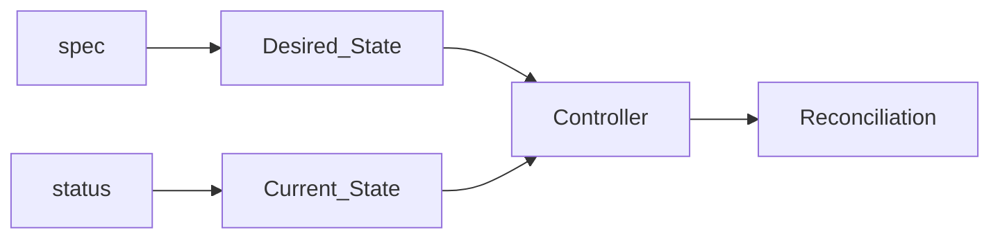
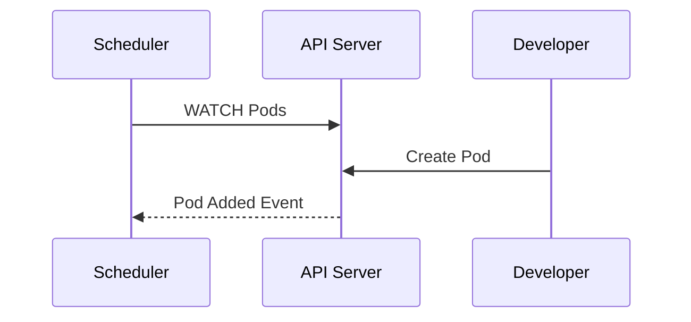
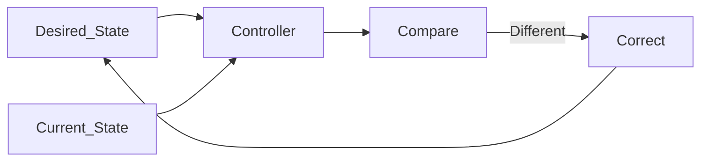

# Kubernetes API

> **Chapter 4 of the Kubernetes Handbook**
>
> **Difficulty:** ⭐⭐ Beginner → Intermediate
>
> **Reading Time:** ~2 Hours
>
> **Prerequisites**
>
> - 01_What_is_Kubernetes.md
> - 02_Common_Terms.md
> - 03_Kubernetes_Architecture.md
>
> **Next Chapter**
>
> - Control Plane

---

# Learning Objectives

By the end of this chapter you will understand:

- What the Kubernetes API actually is
- Why Kubernetes is called an API-driven platform
- The difference between the Kubernetes API and the API Server
- API Resources
- API Objects
- API Groups
- API Versions
- Declarative API model
- Why every Kubernetes component depends on the API

---

# Why Learn the Kubernetes API?

Most engineers think Kubernetes is about:

- Pods
- Deployments
- Services

Actually, Kubernetes is about **APIs**.

Pods are API objects.

Deployments are API objects.

Services are API objects.

Secrets are API objects.

Everything inside Kubernetes exists because of the Kubernetes API.

If you understand the API,

you understand Kubernetes.

---

# What Is an API?

API stands for

> **Application Programming Interface**

An API allows two software systems to communicate using a common language.

Imagine ordering food.

```
Customer

↓

Waiter

↓

Chef
```

The customer never enters the kitchen.

Instead,

the waiter carries requests.

Similarly,

applications don't directly manipulate Kubernetes internals.

They communicate through the Kubernetes API.

---

# Real-World Analogy

Imagine an ATM.

You interact with:

- buttons
- screen
- keypad

You never interact directly with the bank database.

The ATM exposes a controlled interface.

Kubernetes works the same way.

Applications interact with Kubernetes through its API.

They never manipulate cluster components directly.

---

# Kubernetes Is API-First

One of Kubernetes' core design principles is:

> Everything is exposed through an API.

This means:

- Creating Pods uses the API.
- Reading logs uses the API.
- Scaling Deployments uses the API.
- Watching events uses the API.
- Updating Services uses the API.

There are no "special" operations outside the API.

---

# High-Level View

```mermaid
flowchart LR

Developer

↓

kubectl

↓

Kubernetes API

↓

Cluster
```

Notice something important.

The developer is communicating with the API,

not directly with Nodes.

---

# API vs API Server

This is probably the most commonly misunderstood Kubernetes concept.

Many engineers incorrectly use these terms interchangeably.

They are related,

but not identical.

---

## Kubernetes API

The API is the **specification**.

It defines:

- available resources
- operations
- request formats
- response formats
- rules

Think of it as a contract.

---

## API Server

The API Server is the software component that implements the Kubernetes API.

It receives requests.

It validates them.

It authenticates users.

It stores objects.

It returns responses.

---

## Analogy

Imagine a restaurant.

Menu

↓

Waiter

The menu defines:

- what can be ordered

The waiter accepts:

- customer requests

Menu = API

Waiter = API Server

---

## Comparison

| Kubernetes API | API Server |
|---------------|------------|
| Specification | Implementation |
| Defines resources | Processes requests |
| Defines operations | Executes operations |
| Contract | Software component |

---

> **Important**
>
> The Kubernetes API is a concept.
>
> The API Server is a running process.

---

# Why Does Kubernetes Use an API?

Imagine if every component communicated directly with every other component.

```
Scheduler

↓

Worker

↓

Controller

↓

etcd

↓

kubelet
```

Soon,

every component would need to understand every other component.

The architecture would become tightly coupled.

Instead,

every component communicates through a common interface.

```
Scheduler

↓

API

↓

Worker

Controller

↓

API

↓

etcd
```

This creates loose coupling.

---

# Benefits of an API-Driven Architecture

## Standardization

Every client uses the same interface.

Examples:

- kubectl
- Dashboard
- Terraform
- ArgoCD
- GitOps tools
- CI/CD pipelines
- Custom applications

All communicate using the same Kubernetes API.

---

## Security

Every request passes through:

- Authentication
- Authorization
- Admission Control

There are no shortcuts.

---

## Extensibility

New tools don't need to understand Kubernetes internals.

They only need to understand the API.

This is one reason Kubernetes has such a rich ecosystem.

---

## Consistency

Every object behaves similarly.

Pods

Services

Deployments

Secrets

Namespaces

All follow the same API patterns.

---

# REST API

The Kubernetes API follows REST principles.

That means resources are accessed using HTTP methods.

Common operations include:

| HTTP Method | Purpose |
|-------------|---------|
| GET | Read a resource |
| POST | Create a resource |
| PUT | Replace a resource |
| PATCH | Update part of a resource |
| DELETE | Delete a resource |

Example:

```
GET

/api/v1/pods
```

returns Pods.

```
POST

/apis/apps/v1/deployments
```

creates a Deployment.

You rarely use these URLs directly because `kubectl` builds these requests for you.

---

# kubectl Is an API Client

This is another important concept.

Many beginners think:

```
kubectl

↓

creates Pods
```

Wrong.

Actually:

```
kubectl

↓

REST Request

↓

API Server

↓

Cluster
```

`kubectl` never creates anything by itself.

It only sends API requests.

---

# Example

When you execute:

```bash
kubectl get pods
```

the flow is:

```
kubectl

↓

GET Request

↓

API Server

↓

etcd

↓

API Server

↓

kubectl

↓

Terminal Output
```

The information ultimately comes from the cluster state managed by the API.

---

# Architecture Insight

One of Kubernetes' greatest strengths is that **everything is programmable**.

Because every operation is exposed through the API, automation tools can interact with Kubernetes in exactly the same way a human using `kubectl` does.

This is why Infrastructure as Code, GitOps, and AI-driven automation fit so naturally into the Kubernetes ecosystem.

---

# Summary (Part 1)

In this first part, you've learned:

- Kubernetes is fundamentally an API-driven platform.
- The Kubernetes API defines the contract.
- The API Server implements that contract.
- `kubectl` is simply an API client.
- All Kubernetes components communicate through the API.
- REST principles underpin Kubernetes resource operations.

---

# API Resources

Everything inside Kubernetes is represented as an **API Resource**.

Examples include:

- Pod
- Deployment
- Service
- Secret
- ConfigMap
- Namespace
- Job

When someone says:

> "Create a Deployment."

they are actually saying:

> "Create a Deployment API Resource."

---

## Think of Resources as Nouns

Kubernetes is built around resources.

Examples:

```
Pod

Deployment

Service

Secret

Node

Namespace
```

Each resource has:

- a name
- a type
- a lifecycle
- properties
- status

---

## Resource Examples

```
pods

services

deployments

configmaps

secrets

nodes
```

Notice that Kubernetes internally treats everything as resources.

---

# API Object

Earlier we learned about Kubernetes Objects.

Now let's connect that concept to the API.

An **API Resource** defines the type.

An **API Object** is one actual instance.

Example:

```
Resource

Deployment

↓

Object

shopping-app
```

Another example:

```
Resource

Pod

↓

Object

frontend-7c94d85d8-xfjhm
```

Think of it like programming.

```
Class

↓

Object
```

Resource = Class

Object = Instance

---

## Example

Suppose you create:

```yaml
kind: Deployment

metadata:

  name: shopping-app
```

Deployment is the resource.

shopping-app is the object.

---

# Everything Is an Object

Inside Kubernetes,

all of these are objects.

```
Pod

Deployment

Service

Node

Namespace

Secret

ConfigMap
```

The API stores all of them using a common structure.

This consistency is one of Kubernetes' greatest strengths.

---

# Anatomy of an API Object

Almost every Kubernetes object follows the same structure.

```yaml
apiVersion:

kind:

metadata:

spec:

status:
```

If you understand these five fields,

you can understand almost every Kubernetes manifest.

---

# apiVersion

The first field tells Kubernetes:

> Which API version understands this object?

Example:

```yaml
apiVersion: v1
```

or

```yaml
apiVersion: apps/v1
```

Different resources belong to different API groups and versions.

We'll explore those shortly.

---

# kind

The `kind` field specifies the resource type.

Example:

```yaml
kind: Pod
```

or

```yaml
kind: Deployment
```

Examples include:

- Pod
- Deployment
- Service
- ConfigMap
- Secret
- Job
- Namespace

Think of `kind` as answering:

> "What are we creating?"

---

# metadata

Every object contains metadata.

Metadata describes the object rather than the application.

Example:

```yaml
metadata:

  name: shopping-app

  labels:

    app: frontend
```

Common metadata fields include:

- name
- namespace
- labels
- annotations
- UID
- creation timestamp

---

## Why Metadata Exists

Imagine managing 20,000 Pods.

How would Kubernetes distinguish them?

Metadata provides identity.

---

# spec

The `spec` field describes the desired state.

Example:

```yaml
spec:

  replicas: 3
```

You are telling Kubernetes:

```
I want

↓

3 replicas
```

Not:

```
Start one.

Then another.

Then another.
```

Remember,

Kubernetes is declarative.

---

# status

Status describes the current state.

Unlike `spec`,

users generally do not modify status.

Kubernetes updates it automatically.

Example:

```
Desired

3 Pods

----------------

Current

2 Running
```

Status changes continuously as the cluster changes.

---

# Desired State vs Current State

This distinction is fundamental.

```
spec

↓

Desired State
```

```
status

↓

Actual State
```

Controllers continuously compare the two.

Whenever they differ,

the reconciliation loop begins.

---

# Visual Representation



---

# API Groups

As Kubernetes grew,

putting every resource into one API became impractical.

Instead,

resources were organized into **API Groups**.

Think of API Groups like folders.

---

## Example

```
Core API

↓

Pods

Services

Secrets

ConfigMaps
```

Another group:

```
apps

↓

Deployments

ReplicaSets

DaemonSets

StatefulSets
```

Another:

```
batch

↓

Jobs

CronJobs
```

---

# Why API Groups Exist

Suppose Kubernetes had:

```
600 Resources
```

inside one giant API.

Finding resources would become difficult.

API Groups organize related resources together.

---

# Common API Groups

| API Group | Common Resources |
|-----------|------------------|
| Core (`v1`) | Pods, Services, Secrets, ConfigMaps |
| apps | Deployments, ReplicaSets, StatefulSets |
| batch | Jobs, CronJobs |
| networking.k8s.io | Ingress, NetworkPolicy |
| rbac.authorization.k8s.io | Roles, RoleBindings |

You'll encounter these groups frequently when writing manifests.

---

# API Versions

Kubernetes evolves over time.

Resources improve.

Features are added.

Old versions are eventually removed.

API Versions help Kubernetes support this evolution.

Examples:

```
apps/v1

batch/v1

networking.k8s.io/v1

v1
```

---

## Why Versions Matter

Imagine Kubernetes introduced a new field.

Older clients should continue working.

Versions allow Kubernetes to evolve without breaking every application immediately.

---

# Stable vs Beta vs Alpha

Historically, Kubernetes exposed resources using stages such as:

```
v1alpha1

↓

v1beta1

↓

v1
```

Meaning:

Alpha

↓

Experimental

Beta

↓

Mostly Stable

v1

↓

Production Ready

Today, most commonly used resources are available in stable (`v1`) APIs.

---

# Example Manifest

Let's examine a simple Pod.

```yaml
apiVersion: v1

kind: Pod

metadata:

  name: nginx

spec:

  containers:

  - name: nginx

    image: nginx:1.27
```

Reading this becomes straightforward.

```
Use API Version

↓

v1

Create

↓

Pod

Called

↓

nginx

Desired

↓

Run nginx image
```

Everything is simply describing the desired state.

---

# Common Misconceptions

### "apiVersion is the Kubernetes version."

❌ False.

`apiVersion` refers to the API used by that resource.

It does **not** indicate the version of the Kubernetes cluster.

---

### "`status` should be edited."

❌ False.

Kubernetes manages the `status` field automatically.

Users define the desired state through `spec`.

---

### "`metadata` controls application behavior."

❌ Usually false.

Metadata primarily identifies and organizes resources.

Application behavior is generally controlled through the `spec`.

---

# Architecture Insight

Notice how every Kubernetes object shares the same structure:

```
apiVersion

kind

metadata

spec

status
```

This consistency means tools can work with almost any Kubernetes resource in a generic way.

For example:

- `kubectl`
- Helm
- Argo CD
- Terraform
- GitOps controllers

can all process different resource types because they share a common object model.

---

# Summary (Part 2)

You now understand:

- API Resources define resource types.
- API Objects are individual instances.
- Every object follows a common structure.
- `apiVersion` selects the API schema.
- `kind` identifies the resource type.
- `metadata` identifies the object.
- `spec` declares the desired state.
- `status` reports the current state.
- API Groups organize related resources.
- API Versions allow Kubernetes to evolve safely.

In the next part, we'll explore how clients interact with the API, including watches, list operations, reconciliation, and why Kubernetes is often described as an event-driven control system.

---

# Talking to the Kubernetes API

Everything that interacts with Kubernetes communicates through the API.

Examples include:

- kubectl
- kubelet
- Scheduler
- Controller Manager
- Dashboard
- Helm
- Argo CD
- Terraform
- Custom applications

All of them use the Kubernetes API.

---

# CRUD Operations

Like most APIs, Kubernetes supports basic CRUD operations.

| Operation | Meaning | HTTP Method |
|------------|---------|-------------|
| Create | Create a new resource | POST |
| Read | Retrieve a resource | GET |
| Update | Replace an existing resource | PUT |
| Patch | Modify part of a resource | PATCH |
| Delete | Remove a resource | DELETE |

Example:

```bash
kubectl create deployment nginx
```

↓

POST Request

---

```bash
kubectl get pods
```

↓

GET Request

---

```bash
kubectl delete pod nginx
```

↓

DELETE Request

---

# GET Operation

A GET request retrieves one resource.

Example:

```bash
kubectl get pod nginx
```

Conceptually:

```
GET

↓

API Server

↓

Pod Information
```

---

# LIST Operation

Sometimes we don't want one object.

We want every object.

Example:

```bash
kubectl get pods
```

Conceptually:

```
LIST

↓

All Pods
```

The API Server returns every Pod matching the request.

---

# WATCH Operation

This is where Kubernetes becomes interesting.

Imagine a Scheduler.

It needs to know whenever a new Pod appears.

A naïve approach would be:

```
Every second

↓

Ask API Server

↓

Anything new?

↓

No

↓

Repeat forever
```

This wastes CPU and network bandwidth.

Instead,

Kubernetes uses **WATCH**.

---

## What is WATCH?

A WATCH keeps the connection open.

The client says:

> "Tell me whenever something changes."

The API Server only sends data when an event occurs.

---

## Example

Scheduler:

```
WATCH Pods
```

Developer creates a Pod.

API Server immediately sends:

```
New Pod Created
```

The Scheduler reacts instantly.

---

## Architecture



No polling required.

---

# Why WATCH Is Important

Imagine:

```
100,000 Pods
```

If every component repeatedly queried the API Server,

the cluster would waste enormous resources.

WATCH allows Kubernetes to scale efficiently.

---

> **Architecture Insight**
>
> Kubernetes is designed around *change notifications*, not constant polling.
>
> Components subscribe to changes and react only when necessary. This event-driven model is one of the reasons Kubernetes scales to very large clusters.

---

# Resource Version

Whenever a Kubernetes object changes,

its **resourceVersion** changes.

Example:

```
Pod

Version 18
```

You update the Pod.

```
Version 19
```

Another update.

```
Version 20
```

Every change increments the version.

---

## Why Is resourceVersion Useful?

Imagine two administrators edit the same Deployment simultaneously.

Administrator A:

```
Replicas = 5
```

Administrator B:

```
Replicas = 10
```

Without versioning,

one update could silently overwrite the other.

Instead,

the API Server checks the object's resourceVersion.

If the version has changed unexpectedly,

the update can be rejected,

preventing accidental overwrites.

---

# Optimistic Concurrency

Kubernetes uses **optimistic concurrency control**.

The assumption is:

> Conflicts are rare.

When a conflict does occur,

the client retries using the latest object.

This allows Kubernetes to remain highly concurrent without locking every object.

---

# Events

Kubernetes records important events.

Examples:

```
Pod Created

Container Started

Image Pulled

Failed Scheduling

Container Restarted
```

These events are extremely useful when troubleshooting.

---

## Viewing Events

```bash
kubectl get events
```

or

```bash
kubectl describe pod <pod-name>
```

The event history often explains **why** something happened.

---

## Example Event Flow

```
Pod Created

↓

Scheduled

↓

Image Pulled

↓

Container Created

↓

Started
```

If something fails:

```
FailedScheduling

↓

ImagePullBackOff

↓

BackOff
```

Events become your first source of information.

---

# Reconciliation Loop

The **reconciliation loop** is the heart of Kubernetes.

Controllers continuously compare:

```
Desired State

↓

Actual State
```

If they differ,

the controller takes action.

---

## Example

Desired:

```
3 Pods
```

Actual:

```
2 Pods
```

Controller:

```
Creates One New Pod
```

Now:

```
Desired = Actual
```

The system returns to its intended state.

---

## Visual Representation



This process never stops while the controller is running.

---

# Why Kubernetes Is Declarative

Traditional systems are often imperative.

Example:

```
Start Server

↓

Copy Files

↓

Restart Application
```

Kubernetes is declarative.

You declare:

```
replicas: 3
```

Controllers determine the necessary actions to reach that state.

---

# API as the Source of Truth

Every Kubernetes component trusts the API.

Not the local machine.

Not cached files.

Not shell scripts.

Everything ultimately comes from the API.

This ensures consistency across the cluster.

---

# Complete API Flow

```mermaid
flowchart TD

Developer

↓

kubectl

↓

API Server

↓

etcd

↓

WATCH Events

↓

Controllers

↓

Scheduler

↓

kubelet

↓

Container Runtime

↓

Running Application
```

Notice that the API Server sits at the center of every operation.

---

# Common Misconceptions

### "Controllers continuously scan the cluster."

❌ Not exactly.

Controllers typically establish watches and react to events rather than constantly polling.

---

### "kubectl changes the cluster directly."

❌ False.

It only sends API requests.

The API Server performs validation and stores the desired state.

---

### "Events are logs."

❌ False.

Events describe *what happened* to Kubernetes resources.

Logs describe *what an application or component wrote*.

Both are useful, but they serve different purposes.

---

# Best Practices

- Use declarative manifests instead of imperative commands whenever possible.
- Treat the API as the source of truth.
- Inspect events early during troubleshooting.
- Avoid manual changes on Worker Nodes; modify resources through the API.

---

# Summary (Part 3)

In this part, you learned:

- CRUD operations map to Kubernetes API requests.
- GET retrieves a single resource.
- LIST retrieves collections of resources.
- WATCH enables event-driven communication.
- `resourceVersion` supports safe concurrent updates.
- Controllers use reconciliation loops to maintain the desired state.
- Events provide valuable insight into resource lifecycle changes.
- The Kubernetes API is the central source of truth for the cluster.

The final part of this chapter will cover authentication, authorization, admission control at a high level, API discovery, and conclude with interview questions, a revision sheet, and a concise API cheat sheet.

---

# The Complete Journey of an API Request

Let's put everything together.

Suppose you run:

```bash
kubectl apply -f deployment.yaml
```

This single command triggers a series of operations inside Kubernetes.

```mermaid
flowchart TD

Developer

↓

kubectl

↓

Authentication

↓

Authorization

↓

Admission Controller

↓

API Server Validation

↓

etcd

↓

Controllers

↓

Scheduler

↓

kubelet

↓

Container Runtime

↓

Running Pods
```

Each stage has a specific responsibility.

---

# Authentication

## What is Authentication?

Authentication answers one question:

> **Who are you?**

Before Kubernetes accepts any request, it verifies the identity of the requester.

Examples include:

- Human users
- Service Accounts
- CI/CD pipelines
- Automation tools

Without authentication, anyone could modify the cluster.

---

## Common Authentication Methods

Kubernetes supports several authentication mechanisms.

Examples:

- Client Certificates
- Bearer Tokens
- Service Account Tokens
- OpenID Connect (OIDC)
- Cloud Provider IAM integrations

You don't need to memorize all of them now.

The important concept is:

Authentication identifies the requester.

---

## Example

```
kubectl

↓

Certificate

↓

API Server

↓

Identity Verified
```

---

# Authorization

Authentication answers:

> Who are you?

Authorization answers:

> What are you allowed to do?

---

## Example

User A:

```
Read Pods
```

Allowed ✅

Delete Deployments

Denied ❌

---

User B:

```
Create Deployments

Allowed ✅
```

Identity alone is not enough.

Permissions are also required.

---

## RBAC

The most common authorization mechanism is **Role-Based Access Control (RBAC)**.

RBAC allows administrators to define:

- Roles
- Permissions
- Users
- Groups
- Service Accounts

We'll study RBAC in detail in the Security section.

---

# Admission Controllers

Suppose authentication and authorization both succeed.

Is the request immediately stored?

Not yet.

Kubernetes provides one more checkpoint.

---

## What Are Admission Controllers?

Admission Controllers inspect requests before they are stored.

They can:

- Reject requests
- Modify requests
- Add default values
- Enforce policies

Think of them as quality-control inspectors.

---

## Example

Suppose a developer creates a Pod without labels.

An Admission Controller may automatically add:

```yaml
labels:

  managed-by: platform-team
```

The user never typed it.

The cluster added it automatically.

---

## Another Example

Suppose company policy requires:

```
Every container

↓

Must define memory limits.
```

A developer forgets.

Admission Controller rejects the request.

---

> **Architecture Insight**
>
> Admission Controllers are one of Kubernetes' most powerful extension points.
>
> Organizations use them to enforce security, governance, and operational standards without requiring developers to remember every rule.

---

# Validation

After admission, the API Server validates the object.

Examples:

Correct:

```yaml
replicas: 3
```

Incorrect:

```yaml
replicas: three
```

The schema determines whether the object is valid.

Invalid resources are rejected before reaching etcd.

---

# Storage in etcd

Once the request passes all previous stages:

- Authentication
- Authorization
- Admission
- Validation

the object is written to etcd.

At this point,

the desired state officially exists inside Kubernetes.

Controllers can now begin acting upon it.

---

# API Discovery

One of Kubernetes' strengths is that clients can discover available APIs dynamically.

For example:

```bash
kubectl api-resources
```

lists all available resource types.

Example output (simplified):

```
pods

services

deployments

jobs

cronjobs

ingresses
```

---

## Discovering API Versions

To view supported API versions:

```bash
kubectl api-versions
```

Example:

```
v1

apps/v1

batch/v1

networking.k8s.io/v1

rbac.authorization.k8s.io/v1
```

This allows clients to adapt automatically to different cluster versions.

---

# Why API Discovery Matters

Suppose Kubernetes adds a new resource in a future release.

Clients don't need hardcoded knowledge.

They can discover it through the API.

This makes Kubernetes highly extensible.

---

# Declarative vs Imperative

Throughout this handbook you've seen two styles.

## Imperative

You tell Kubernetes exactly what to do.

Example:

```bash
kubectl scale deployment nginx --replicas=5
```

---

## Declarative

You describe the desired state.

```yaml
replicas: 5
```

Then apply:

```bash
kubectl apply -f deployment.yaml
```

---

## Which Should You Use?

| Imperative | Declarative |
|------------|-------------|
| Quick experiments | Production |
| Manual changes | Version controlled |
| Difficult to audit | Easy to review |
| Harder to reproduce | Repeatable |

> **Best Practice**
>
> Use imperative commands for learning and debugging.
>
> Use declarative manifests for production systems.

---

# The API is the Foundation of GitOps

GitOps tools such as Argo CD and Flux do not log into servers.

Instead:

```
Git Repository

↓

Controller

↓

Kubernetes API

↓

Cluster
```

Git becomes the source of truth.

The Kubernetes API becomes the mechanism for applying that truth.

---

# AI-SRE Perspective

Your AI-SRE agent will also communicate with Kubernetes through the API.

Typical workflow:

```
User reports incident

↓

LLM decides investigation steps

↓

API Requests

↓

Collect:

Pods

Events

Logs

Deployments

Nodes

Metrics

↓

Root Cause Analysis

↓

Suggested Fix
```

Notice that the AI agent never talks directly to Pods or Worker Nodes.

It queries the Kubernetes API, just like `kubectl`.

---

# Common Mistakes

### "The API Server creates Pods."

❌ False.

The API Server stores objects and coordinates requests.

Controllers and kubelets are responsible for creating and running workloads.

---

### "Authentication and Authorization are the same."

❌ False.

Authentication identifies **who** you are.

Authorization determines **what** you can do.

---

### "Admission Controllers replace RBAC."

❌ False.

RBAC controls permissions.

Admission Controllers enforce policies on requests.

---

# API Request Cheat Sheet

```
Developer

↓

kubectl

↓

Authentication

↓

Authorization

↓

Admission Controllers

↓

Validation

↓

etcd

↓

Controllers

↓

Scheduler

↓

kubelet

↓

Container Runtime

↓

Running Application
```

Memorize this flow.

It appears throughout Kubernetes.

---

# Interview Questions

## Beginner

1. What is the Kubernetes API?
2. How is the API different from the API Server?
3. Why is Kubernetes called API-driven?
4. What does `kubectl` actually do?
5. What is an API Resource?

---

## Intermediate

1. Explain the fields `apiVersion`, `kind`, `metadata`, `spec`, and `status`.
2. What is the difference between GET, LIST, and WATCH?
3. Why does Kubernetes use watches instead of polling?
4. What is `resourceVersion`?
5. Why are API Groups necessary?

---

## Advanced

1. Describe the complete lifecycle of an API request.
2. Explain the order of authentication, authorization, admission control, validation, and storage.
3. Why does Kubernetes separate the API definition from the API Server implementation?
4. How does the API enable GitOps?
5. Why is the Kubernetes API considered the source of truth?

---

# Revision Sheet

Remember these key ideas:

- Everything in Kubernetes is an API Resource.
- Every resource is represented as an API Object.
- Every object has:
  - `apiVersion`
  - `kind`
  - `metadata`
  - `spec`
  - `status`
- `kubectl` is only an API client.
- The API Server is the gateway to the cluster.
- Authentication verifies identity.
- Authorization checks permissions.
- Admission Controllers enforce policies.
- etcd stores the desired state.
- Controllers reconcile desired and actual state.
- WATCH enables efficient, event-driven updates.

---

# Summary

The Kubernetes API is the foundation of the entire platform.

Every action—whether performed by a developer, an automated deployment pipeline, a controller, or an AI-SRE agent—ultimately flows through the API.

Understanding this API-centric architecture explains why Kubernetes is:

- Extensible
- Automatable
- Secure
- Consistent
- Declarative

As you continue through the handbook, you'll see that every major component of Kubernetes either exposes, consumes, or reacts to the API.

---

# Related Chapters

Next:

- **05_Control_Plane.md**


In the next part, we'll dive into API Resources, API Objects, API Groups, API Versions, and how Kubernetes organizes thousands of resources in a consistent and extensible way.

