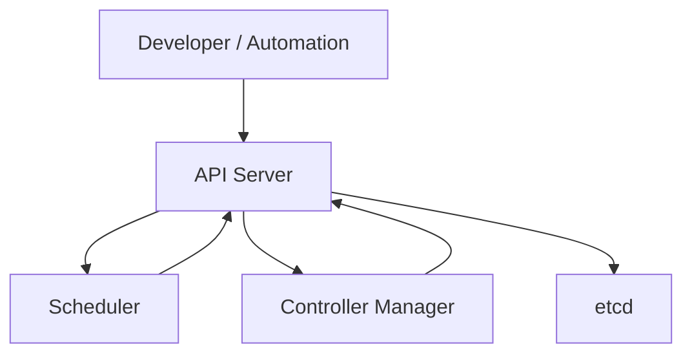
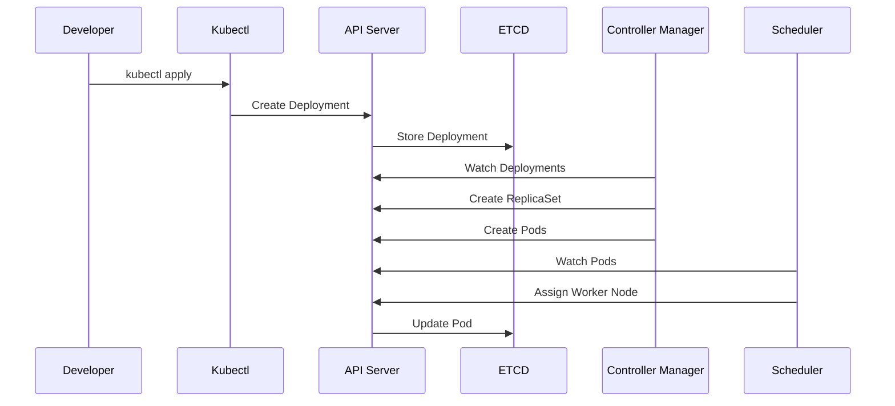
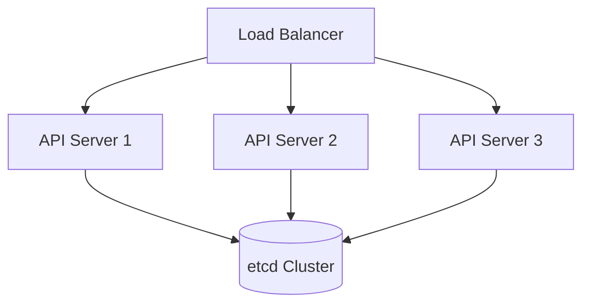

# Kubernetes Control Plane

> **Chapter 5 of the Kubernetes Handbook**
>
> **Difficulty:** ⭐⭐ Intermediate
>
> **Reading Time:** 2–3 Hours
>
> **Prerequisites**
>
> - What is Kubernetes
> - Common Terms
> - Kubernetes Architecture
> - Kubernetes API
>
> **Next Chapter**
>
> Worker Node

---

# Learning Objectives

After completing this chapter you'll understand:

- What the Control Plane actually is
- Why Kubernetes needs a Control Plane
- Every Control Plane component
- How they communicate
- How decisions are made
- High Availability
- Failure scenarios
- Best practices
- Production architecture

---

# What is the Control Plane?

The **Control Plane** is the collection of Kubernetes components responsible for managing the entire cluster.

It does **not** usually run your applications.

Instead, it continuously observes the cluster and makes decisions to keep it in the desired state.

Think of it as the **brain** of Kubernetes.

---

# Why Does Kubernetes Need a Control Plane?

Imagine a cluster with:

- 500 Worker Nodes
- 12,000 Pods
- 800 Deployments
- 300 Services

Now imagine there is **no Control Plane**.

Who decides:

- Which node gets a new Pod?
- Which Pods should restart?
- Whether a Deployment succeeded?
- Which node is unhealthy?
- Which Service should receive traffic?
- Whether someone is allowed to create a Pod?

Without a central decision-making system, every component would need to coordinate directly with every other component.

That quickly becomes impossible.

The Control Plane centralizes these responsibilities.

---

# Responsibilities of the Control Plane

The Control Plane is responsible for:

- Managing cluster state
- Receiving API requests
- Scheduling workloads
- Maintaining desired state
- Monitoring Nodes
- Managing Deployments
- Coordinating controllers
- Security decisions
- Cluster-wide reconciliation

Notice that it **manages** workloads.

It does **not** execute them.

---

# Brain vs Muscles

A useful mental model is:

```
                 Kubernetes Cluster

        +---------------------------+
        |      Control Plane        |
        +---------------------------+
                 Decision Making
                        │
                        ▼
        +---------------------------+
        |       Worker Nodes        |
        +---------------------------+
            Execute Applications
```

The brain makes decisions.

The muscles perform work.

---

# Components of the Control Plane

The Control Plane consists of several independent components.

```
Control Plane

├── API Server
├── Scheduler
├── Controller Manager
└── etcd
```

Each component has **one primary responsibility**.

This follows one of Kubernetes' core design principles:

> **One component, one responsibility.**

---

# High-Level Architecture



Notice something important.

The Scheduler does **not** communicate directly with etcd.

Neither does the Controller Manager.

Everything goes through the API Server.

---

# Why Is Everything Routed Through the API Server?

Suppose every component modified etcd directly.

```
Scheduler

↓

etcd

Controller

↓

etcd

kubelet

↓

etcd
```

Now imagine:

- two components update the same object
- another deletes it
- another modifies it simultaneously

Chaos.

Instead,

the API Server becomes the **single gateway** to the cluster state.

Benefits:

- Validation
- Authentication
- Authorization
- Auditing
- Consistency
- Version control

---

# Control Plane Philosophy

Kubernetes follows an important philosophy.

```
Observe

↓

Compare

↓

Decide

↓

Act
```

The Control Plane continuously repeats this cycle.

Example:

Desired:

```
5 Pods
```

Actual:

```
4 Pods
```

Decision:

```
Need 1 Pod
```

Action:

```
Create Pod
```

The cycle never stops.

---

# The Reconciliation Loop

Every major Control Plane component participates in reconciliation.

The process is:

```
Desired State
      │
      ▼
Current State
      │
      ▼
Difference?
      │
 ┌────┴────┐
 │         │
No        Yes
 │         │
 ▼         ▼
Nothing   Take Action
```

This simple idea powers almost every feature in Kubernetes.

- Self-healing
- Rolling updates
- Scaling
- Node recovery
- Pod replacement

---

# Control Plane Components in Detail

Before diving into individual chapters, let's briefly understand the role of each component.

---

## API Server

The API Server is the **front door** of Kubernetes.

Responsibilities:

- Receives requests
- Validates objects
- Authenticates users
- Authorizes operations
- Stores objects in etcd
- Returns responses

Without the API Server,

nothing enters the cluster.

---

## Scheduler

The Scheduler answers one question:

> **Where should this Pod run?**

It examines:

- CPU
- Memory
- Affinity
- Taints
- Node health
- Scheduling rules

Then chooses the most appropriate Worker Node.

It **never starts containers**.

---

## Controller Manager

Controllers answer another question:

> **Is reality matching the desired state?**

If not,

controllers begin correcting the difference.

Examples:

Desired:

```
3 Pods
```

Actual:

```
2 Pods
```

Controller:

```
Create another Pod
```

---

## etcd

etcd is the cluster's database.

It stores:

- Pods
- Deployments
- Services
- Secrets
- Nodes
- ConfigMaps
- Cluster configuration

Everything Kubernetes knows is stored here.

Without etcd,

the cluster loses its memory.

---

# How Components Work Together

Suppose you create a Deployment.

The workflow becomes:

```
Developer

      │

kubectl

      │

API Server

      │

etcd

      │

Controller Manager

      │

ReplicaSet

      │

Pod

      │

Scheduler

      │

Worker Node
```

Notice the sequence.

Each component performs exactly one task before handing responsibility to the next.

---

# Design Principle

Instead of one giant program,

Kubernetes uses many small components.

Benefits:

- Easier testing
- Independent upgrades
- Better scalability
- Easier debugging
- Fault isolation

This architecture follows the Unix philosophy:

> **Do one thing well.**

---

# Common Misconceptions

### "The Control Plane runs applications."

❌ False.

Applications run on Worker Nodes.

---

### "The Control Plane is one program."

❌ False.

It consists of multiple cooperating components.

---

### "The Scheduler creates Pods."

❌ False.

The Scheduler only assigns Pods to Worker Nodes.

---

### "etcd decides anything."

❌ False.

etcd stores data.

It does not make decisions.

---

# Architecture Insight

A common interview question is:

> "Why did Kubernetes separate the Control Plane into multiple components?"

The answer is **separation of concerns**.

Each component has a narrowly defined responsibility, making the system easier to understand, scale, replace, and recover. For example, if the Scheduler has a bug, it can often be fixed or restarted without changing how the API Server validates requests or how etcd stores data.

---

# Summary (Part 1)

You now understand:

- What the Control Plane is.
- Why Kubernetes needs it.
- Its major responsibilities.
- The four core components.
- Why every component communicates through the API Server.
- How the reconciliation loop drives cluster behavior.

---

# How the Control Plane Processes a Request

Let's trace what happens after a developer runs:

```bash
kubectl apply -f deployment.yaml
```

From the outside, it appears to be a single command.

Inside the Control Plane, however, multiple components cooperate to transform that request into running Pods.

---

# Step 1 – The Request Arrives

The request reaches the API Server.

```text
Developer
     │
     ▼
kubectl
     │
     ▼
API Server
```

The API Server is the **only entry point** into the cluster.

No other Control Plane component accepts user requests directly.

---

# Step 2 – Authentication

The API Server verifies the identity of the requester.

Questions include:

- Who sent this request?
- Is the certificate valid?
- Is the token valid?

If authentication fails:

```
Request Rejected
```

No further processing occurs.

---

# Step 3 – Authorization

Authentication answers:

> Who are you?

Authorization answers:

> What are you allowed to do?

Example:

```
Developer

↓

Create Deployment

✓ Allowed
```

Another example:

```
Developer

↓

Delete Namespace

✗ Denied
```

Only authorized requests continue.

---

# Step 4 – Admission Control

The request now passes through Admission Controllers.

Admission Controllers may:

- Reject the request
- Modify the request
- Add default values
- Enforce organization policies

Example:

A developer forgets to specify:

```yaml
imagePullPolicy
```

An Admission Controller may automatically add a default value.

---

# Step 5 – Validation

The API Server validates the object.

Example:

Correct:

```yaml
replicas: 3
```

Incorrect:

```yaml
replicas: three
```

Invalid resources are rejected before entering the cluster.

---

# Step 6 – Store Desired State

Once validation succeeds,

the API Server writes the object into etcd.

```text
API Server
     │
     ▼
etcd
```

At this point:

- The Deployment exists.
- The desired state has been recorded.
- No Pods are running yet.

This distinction is extremely important.

---

# Why Store Before Acting?

Imagine the Scheduler crashes immediately after you create a Deployment.

Should the Deployment disappear?

No.

Because the desired state is safely stored in etcd.

When the Scheduler recovers,

it simply continues from the stored state.

This separation improves reliability.

---

# Step 7 – Controllers Notice the Change

The Controller Manager continuously watches the API Server.

It notices:

```
New Deployment Created
```

The Deployment Controller begins working.

---

## Deployment Controller

The Deployment Controller asks:

```
Does a ReplicaSet exist?
```

If not,

it creates one.

Now the desired state becomes:

```text
Deployment
      │
      ▼
ReplicaSet
```

---

## ReplicaSet Controller

Next,

the ReplicaSet Controller checks:

```
Desired Pods = 3

Current Pods = 0
```

Difference:

```
Need 3 Pods
```

The controller creates three Pod objects.

Again,

these are only **Pod objects**.

Containers still haven't started.

---

# Why Multiple Controllers?

A common interview question is:

> Why not let one controller manage everything?

Imagine one controller responsible for:

- Deployments
- ReplicaSets
- Jobs
- Services
- StatefulSets
- DaemonSets
- Nodes

The code would become enormous.

Instead,

Kubernetes assigns one responsibility per controller.

Benefits include:

- Simpler logic
- Easier testing
- Independent maintenance
- Better scalability

---

# Step 8 – Scheduler Watches for Work

The Scheduler continuously watches the API Server.

It notices three Pods with:

```text
Node = <none>
```

These Pods have not yet been assigned to a Worker Node.

The Scheduler begins evaluating available nodes.

---

# Scheduler Decision Process

The Scheduler considers factors such as:

- Available CPU
- Available Memory
- Resource Requests
- Resource Limits
- Node Affinity
- Pod Affinity
- Taints
- Tolerations
- Scheduling Policies

Suppose the cluster looks like this:

| Node | CPU Usage | Memory Usage |
|------|----------:|-------------:|
| Worker-1 | 20% | 35% |
| Worker-2 | 85% | 90% |
| Worker-3 | 40% | 50% |

The Scheduler may choose:

```
Worker-1
```

for the first Pod.

---

# Important Responsibility

The Scheduler performs exactly one task:

```
Choose Node
```

It does **not**:

- Pull images
- Start containers
- Create networks
- Mount volumes

Those responsibilities belong to the Worker Node.

---

# Step 9 – Scheduler Updates the API

After choosing a node,

the Scheduler updates the Pod object.

Before:

```text
Node = None
```

After:

```text
Node = Worker-1
```

The updated object is stored through the API Server.

Notice the Scheduler never writes directly to etcd.

---

# Communication Flow



This sequence demonstrates the layered nature of the Control Plane.

---

# Event-Driven Design

Notice that components don't repeatedly ask:

```
Anything new?

Anything new?

Anything new?
```

Instead,

they establish watches.

Whenever the API Server observes a change,

interested components react.

This makes Kubernetes highly scalable.

---

# Design Insight

Think of the Control Plane as an office.

```
Receptionist

↓

Verifies Visitor

↓

Records Request

↓

Routes Request

↓

Departments Work

↓

Results Recorded
```

Mapping to Kubernetes:

| Office | Kubernetes |
|---------|------------|
| Receptionist | API Server |
| Filing Cabinet | etcd |
| Operations Team | Controllers |
| Resource Planner | Scheduler |

Each department specializes in a single responsibility.

---

# Common Misconceptions

### "The API Server creates Pods."

❌ False.

It stores Pod objects.

Controllers create the objects.

The kubelet later creates the running containers.

---

### "The Scheduler talks directly to Worker Nodes."

❌ False.

It updates the Pod object through the API Server.

The kubelet notices the assignment and acts on it.

---

### "Controllers continuously scan the cluster."

❌ Not exactly.

Controllers typically establish watches and react to changes instead of repeatedly polling.

---

# Summary (Part 2)

The Control Plane processes requests in a predictable sequence:

1. API Server receives the request.
2. Authentication verifies identity.
3. Authorization checks permissions.
4. Admission Controllers enforce policies.
5. Validation checks correctness.
6. Desired state is stored in etcd.
7. Controllers create the required Kubernetes objects.
8. The Scheduler selects appropriate Worker Nodes.
9. Updated Pod assignments are stored through the API Server.

At this point, the Control Plane has finished its primary work.

The next step is handled by the Worker Node, where the kubelet and Container Runtime transform the assigned Pod into a running application.

---

# Why High Availability Matters

Imagine a production Kubernetes cluster running:

- 800 microservices
- 15,000 Pods
- Millions of user requests per hour

Now imagine the Control Plane suddenly crashes.

Questions immediately arise:

- Can users still access applications?
- Can new Pods be created?
- Can Deployments be updated?
- Can failed Pods recover?

The answers depend on how the Control Plane is designed.

---

# Single Control Plane

A learning cluster often looks like this.

```text
                Kubernetes Cluster

        +---------------------------+
        |      Control Plane        |
        +---------------------------+
                  │
        ┌─────────┼─────────┐
        ▼         ▼         ▼
    Worker1    Worker2    Worker3
```

Advantages:

- Simple
- Easy to install
- Low resource usage

Disadvantages:

- Single point of failure
- No redundancy
- Not suitable for production

---

# Highly Available Control Plane

Production clusters normally run multiple Control Plane nodes.



Benefits:

- Higher availability
- Fault tolerance
- Rolling upgrades
- No single API Server failure

---

# Why Multiple API Servers?

Suppose API Server 2 crashes.

The Load Balancer simply routes new requests to:

- API Server 1
- API Server 3

Applications continue operating normally.

Users often never notice the failure.

---

# But What About the Scheduler?

If there are three API Servers,

should there also be three Schedulers?

Yes.

Production clusters often run multiple Scheduler instances.

But...

only **one Scheduler is active** at a time.

---

# Leader Election

This introduces one of Kubernetes' most important concepts:

> **Leader Election**

Leader Election ensures that only one instance of certain Control Plane components performs active work.

Other instances remain on standby.

---

## Example

```text
Scheduler A  ← Leader

Scheduler B  ← Standby

Scheduler C  ← Standby
```

If Scheduler A fails:

```text
Scheduler B

↓

Becomes Leader
```

The transition happens automatically.

---

# Why Is Leader Election Necessary?

Imagine two active Schedulers.

Both observe:

```
Pod X

Node = None
```

Scheduler A decides:

```
Worker-1
```

Scheduler B decides:

```
Worker-3
```

Now two conflicting decisions exist.

Leader Election prevents this situation.

---

# Which Components Use Leader Election?

Leader Election is commonly used by:

- Scheduler
- Controller Manager

API Servers are different.

All API Servers actively serve requests.

---

# Architecture

```text
                Load Balancer
                      │
      ┌───────────────┼───────────────┐
      ▼               ▼               ▼
 API Server 1   API Server 2   API Server 3
      │               │               │
      └───────────────┼───────────────┘
                      ▼
                 etcd Cluster


Scheduler 1  ← Leader
Scheduler 2  ← Standby
Scheduler 3  ← Standby


Controller Manager 1 ← Leader
Controller Manager 2 ← Standby
Controller Manager 3 ← Standby
```

---

# How Leader Election Works

At a high level:

1. Multiple instances start.
2. They attempt to acquire leadership.
3. One instance succeeds.
4. Others observe the leader.
5. If the leader becomes unavailable,
   another instance takes over.

The implementation details involve Kubernetes coordination resources, which we'll study later.

For now, remember the concept.

---

# etcd High Availability

Earlier we learned that etcd stores the cluster state.

Production systems never rely on a single etcd instance.

Instead:

```text
etcd-1

etcd-2

etcd-3
```

Together they form an **etcd cluster**.

This provides:

- Redundancy
- Fault tolerance
- Consistent data

---

# Why Three etcd Nodes?

A common question:

Why not two?

Distributed systems rely on **majority agreement (quorum)**.

Examples:

3 nodes

```
Need 2
```

5 nodes

```
Need 3
```

With only two nodes,

losing one leaves no majority.

Using an odd number avoids many split-decision scenarios.

> **Note:** We'll study quorum and consensus in detail in the dedicated **etcd** chapter.

---

# Failure Scenario 1 – API Server Failure

Suppose:

```
API Server 2

↓

Crash
```

What happens?

Existing API Servers continue serving requests.

The Load Balancer routes traffic to healthy instances.

Users generally notice no interruption.

---

# Failure Scenario 2 – Scheduler Failure

Suppose the active Scheduler crashes.

Immediately afterward:

```
Leader Election

↓

New Leader Selected
```

Scheduling resumes.

Existing Pods continue running during the transition.

---

# Failure Scenario 3 – Controller Manager Failure

If the active Controller Manager fails:

- A standby instance becomes the leader.
- Reconciliation resumes.

During the transition:

- Existing Pods continue running.
- Temporary delays in reconciliation may occur.

---

# Failure Scenario 4 – Worker Node Failure

Suppose:

```
Worker-2

↓

Power Failure
```

The Control Plane detects:

```
Node Not Ready
```

Controllers notice that Pods have disappeared.

New Pods are scheduled onto healthy Worker Nodes (assuming the workload is managed by resources such as Deployments).

---

# Failure Scenario 5 – etcd Failure

This is one of the most serious failures.

If the etcd cluster loses quorum:

- New writes cannot be committed.
- Cluster state cannot be safely updated.

Depending on the remaining healthy members, read behavior may also be affected.

This is why etcd backups and monitoring are critical.

---

# Component Responsibilities During Failures

| Component | Responsibility |
|-----------|----------------|
| API Server | Accept requests and expose the API |
| Scheduler | Assign Pods to Nodes |
| Controller Manager | Reconcile desired state |
| etcd | Persist cluster state |
| kubelet | Keep assigned Pods running on its node |

Notice that each component has a clearly defined recovery responsibility.

---

# Design Philosophy

Kubernetes does not assume components are perfect.

Instead, it assumes:

- Hardware fails.
- Software crashes.
- Networks partition.
- Machines reboot.

The architecture is designed to recover automatically whenever possible.

This philosophy is fundamental to cloud-native systems.

---

# Common Misconceptions

### "If one API Server crashes, the cluster stops."

❌ False.

Other API Servers continue serving requests.

---

### "Every Scheduler schedules Pods."

❌ False.

Only the elected leader schedules Pods.

---

### "Standby components do nothing."

❌ Not exactly.

They remain synchronized and ready to take over if leadership changes.

---

### "High Availability eliminates downtime."

❌ False.

HA greatly reduces downtime and removes many single points of failure, but it cannot eliminate every possible failure scenario.

---

# Architecture Insight

One reason Kubernetes scales so well is that different Control Plane components can scale independently.

For example:

- API Servers can be scaled horizontally to handle more requests.
- Worker Nodes can be added to increase compute capacity.
- Controllers remain focused on reconciliation.
- Schedulers remain focused on placement.

Each component specializes in one area instead of becoming a monolithic system.

---

# Summary (Part 3)

In this section you learned:

- Why production clusters require High Availability.
- Why API Servers are replicated behind a Load Balancer.
- How Leader Election prevents conflicting decisions.
- Why Schedulers and Controller Managers have active and standby instances.
- Why etcd is deployed as a cluster.
- How Kubernetes recovers from common Control Plane failures.
- The fault-tolerant design principles that make Kubernetes suitable for production environments.

In the final part, we'll bring everything together with production best practices, troubleshooting strategies, interview questions, and a Control Plane revision cheat sheet.


- The design philosophy behind the Control Plane.

In the next part, we'll follow a **real Deployment request inside the Control Plane**, tracing exactly how each component collaborates before work is handed off to a Worker Node.
