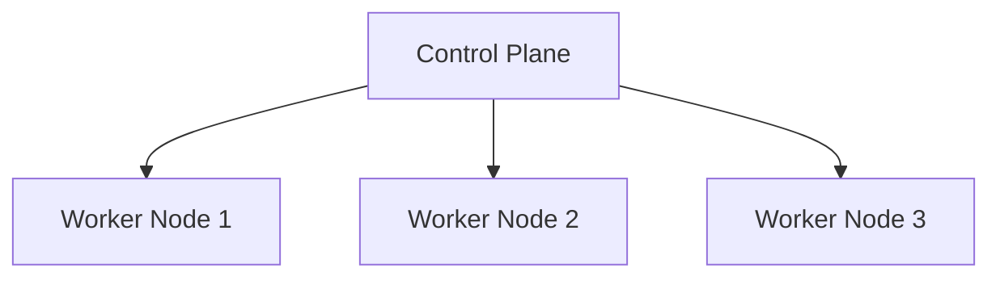
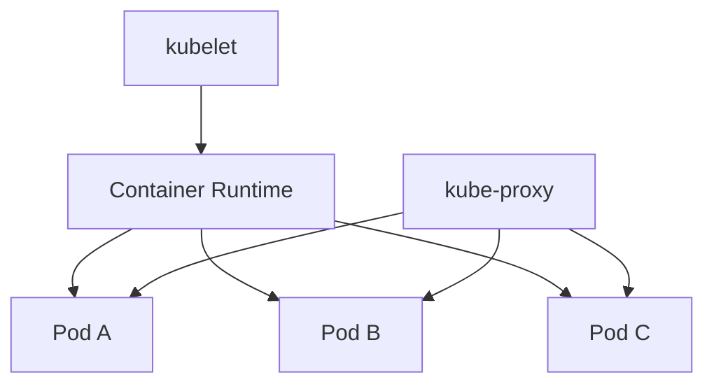
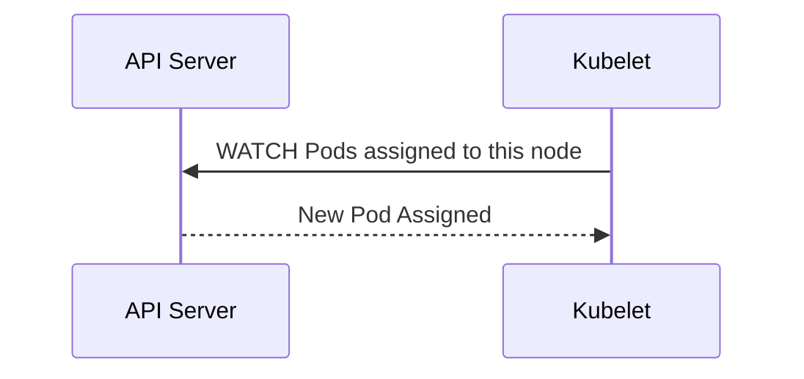

# Kubernetes Worker Node

> **Chapter 6 of the Kubernetes Handbook**
>
> **Difficulty:** ⭐⭐ Intermediate
>
> **Reading Time:** 2–3 Hours
>
> **Prerequisites**
>
> - What is Kubernetes
> - Common Terms
> - Kubernetes Architecture
> - Kubernetes API
> - Control Plane
>
> **Next Chapter**
>
> API Server

---

# Learning Objectives

After completing this chapter you will understand:

- What a Worker Node is
- Why Worker Nodes exist
- Every component inside a Worker Node
- How Pods are executed
- Communication with the Control Plane
- Worker Node lifecycle
- Production best practices
- Common failures

---

# What is a Worker Node?

A **Worker Node** is a machine that runs application workloads inside a Kubernetes cluster.

Unlike the Control Plane, which makes decisions,

the Worker Node executes those decisions.

Whenever you create a Pod,

that Pod eventually runs on a Worker Node.

---

# Worker Node Responsibilities

Worker Nodes are responsible for:

- Running Pods
- Running Containers
- Pulling Images
- Mounting Volumes
- Configuring Pod Networking
- Reporting status to the Control Plane
- Executing health checks
- Restarting failed containers

Notice something important.

Worker Nodes do **not** decide where Pods should run.

That responsibility belongs to the Scheduler.

---

# Brain vs Worker

Think of Kubernetes like the human body.

```text
Control Plane
      │
      ▼
Makes Decisions

Worker Node
      │
      ▼
Executes Decisions
```

The brain decides.

The muscles perform the work.

---

# Where Does a Worker Node Fit?



Every application ultimately runs on one of the Worker Nodes.

---

# What's Inside a Worker Node?

Every Worker Node contains several important components.

```text
Worker Node

├── kubelet
├── kube-proxy
├── Container Runtime
└── Pods
```

Each component has a clearly defined responsibility.

We'll study each of them in detail later.

---

# kubelet

The **kubelet** is the primary agent running on every Worker Node.

Think of it as the node's representative inside the cluster.

Its responsibilities include:

- Watching for assigned Pods
- Starting Pods
- Monitoring Pods
- Reporting Node health
- Reporting Pod status
- Running health probes

Without the kubelet,

the Worker Node cannot participate in Kubernetes.

---

# kube-proxy

The **kube-proxy** manages Service networking.

Responsibilities include:

- Network rules
- Service routing
- Load balancing
- Endpoint updates

Applications usually never communicate directly with kube-proxy,

but almost every Service depends on it.

---

# Container Runtime

The Container Runtime actually executes containers.

Examples include:

- containerd
- CRI-O

Responsibilities:

- Pull images
- Create containers
- Start containers
- Stop containers
- Delete containers

Remember:

The kubelet tells the runtime **what** to run.

The runtime performs the execution.

---

# Pods

Pods are the workloads executed on the Worker Node.

A Worker Node may run:

- 5 Pods
- 50 Pods
- 200 Pods

depending on available resources.

Each Pod consumes:

- CPU
- Memory
- Storage
- Network

These resources come from the Worker Node.

---

# Worker Node Architecture



Notice that:

- kubelet manages Pods.
- Container Runtime executes Pods.
- kube-proxy provides networking.

---

# How Does a Worker Node Receive Work?

Many beginners imagine this process:

```text
Control Plane

↓

Push Pod

↓

Worker Node
```

That is **not** how Kubernetes works.

Instead,

the Worker Node continuously watches the API Server.

```text
Worker Node

↓

kubelet

↓

Watch API Server

↓

New Assignment?

↓

Execute
```

The Worker Node is proactive.

It pulls assignments from the API Server.

---

# Worker Node Lifecycle

A Worker Node generally follows this lifecycle:

```text
Machine Starts
      │
      ▼
kubelet Starts
      │
      ▼
Registers with API Server
      │
      ▼
Node Becomes Ready
      │
      ▼
Scheduler Can Place Pods
      │
      ▼
Applications Begin Running
```

Registration is automatic once the kubelet successfully communicates with the Control Plane.

---

# Node Registration

When the kubelet starts,

it sends information about the machine.

Examples:

- CPU capacity
- Memory
- Operating System
- Kubernetes version
- Architecture
- Available resources

The API Server stores this information as a **Node object**.

You can view registered nodes using:

```bash
kubectl get nodes
```

Example:

```text
NAME         STATUS   ROLES    AGE   VERSION
worker-1     Ready    <none>   15d   v1.34.0
worker-2     Ready    <none>   15d   v1.34.0
worker-3     Ready    <none>   15d   v1.34.0
```

---

# Node Status

Worker Nodes report their health continuously.

Common states include:

| Status | Meaning |
|---------|---------|
| Ready | Node is healthy and can accept Pods |
| NotReady | Node is unhealthy or unreachable |
| SchedulingDisabled | Node is healthy but not accepting new Pods |

The kubelet periodically updates the Node status through the API Server.

---

# Node Capacity

Every Worker Node has limited resources.

Example:

| Resource | Capacity |
|----------|---------:|
| CPU | 8 Cores |
| Memory | 32 GiB |
| Storage | 500 GiB |

The Scheduler considers this information before assigning Pods.

A Pod cannot be scheduled if the node lacks sufficient resources.

---

# Common Misconceptions

### "Worker Nodes decide where Pods run."

❌ False.

The Scheduler selects the node.

The Worker Node executes the assignment.

---

### "The kubelet runs containers."

❌ Not directly.

The kubelet instructs the Container Runtime,

which starts the containers.

---

### "Pods communicate with the API Server."

❌ Usually false.

Pods communicate with other services or applications.

The kubelet is responsible for communicating with the API Server about node and Pod state.

---

# Best Practices

- Use identical Kubernetes versions across Worker Nodes whenever possible.
- Monitor CPU, memory, and disk usage.
- Keep container runtimes updated.
- Avoid running unrelated software directly on Worker Nodes.
- Treat Worker Nodes as infrastructure, not application servers.

---

# Summary (Part 1)

In this chapter you've learned:

- A Worker Node executes application workloads.
- Every Worker Node contains kubelet, kube-proxy, a Container Runtime, and Pods.
- The kubelet is the node's primary Kubernetes agent.
- The Container Runtime executes containers.
- Worker Nodes register themselves with the Control Plane.
- Node health is continuously reported.
- The Scheduler chooses the node; the Worker Node performs the work.

---

# The Life of a Pod Inside a Worker Node

Earlier we learned that the Scheduler selects a Worker Node.

Now let's answer the next question:

> **What happens after the Scheduler assigns a Pod to a Worker Node?**

We'll follow every important step.

---

# Step 1 – Scheduler Updates the Pod

Suppose the Scheduler chooses:

```
Worker-2
```

The Pod object is updated.

Before:

```text
Node = <none>
Status = Pending
```

After:

```text
Node = worker-2
Status = Pending
```

Notice that nothing is running yet.

Only the Pod specification has changed.

---

# Step 2 – kubelet Detects the Assignment

The kubelet continuously watches the API Server.

Eventually it notices:

```text
A new Pod has been assigned to me.
```

This happens automatically.

No administrator logs into the Worker Node.

No SSH commands are executed.

---

## Architecture



The kubelet now begins creating the Pod.

---

# Step 3 – Read the Pod Specification

The kubelet downloads the complete Pod specification.

Example (simplified):

```yaml
containers:
  - image: nginx:1.27

resources:
  requests:
    cpu: "500m"
    memory: "512Mi"
```

The specification contains information such as:

- Container images
- Environment variables
- Secrets
- ConfigMaps
- Resource requests
- Resource limits
- Volumes
- Networking requirements
- Health probes

The kubelet now knows exactly what should be running.

---

# Step 4 – Prepare the Environment

Before starting containers,

the kubelet prepares the node.

Typical tasks include:

- Creating Pod directories
- Preparing log locations
- Mounting volumes
- Loading Secrets
- Loading ConfigMaps
- Preparing networking

At this stage,

the application has **not** started yet.

---

# Step 5 – Ask the Container Runtime

The kubelet now contacts the Container Runtime.

```text
kubelet
     │
     ▼
Container Runtime
```

The kubelet does **not** start containers itself.

Instead, it sends instructions.

Think of it as saying:

> "Please create this Pod according to the specification."

---

# Step 6 – Image Check

The Container Runtime checks whether the required image already exists.

Example:

```text
nginx:1.27
```

Two possibilities exist.

---

## Image Already Present

```text
Local Cache

↓

Start Container
```

This is fast.

No network download is required.

---

## Image Missing

```text
Container Registry

↓

Download Image

↓

Store Locally

↓

Start Container
```

The image is cached for future use.

---

> **Best Practice**
>
> Always use explicit image versions (for example, `nginx:1.27`) instead of `latest`. Versioned images make deployments predictable and simplify rollbacks.

---

# Step 7 – Create the Container

Now the runtime creates the container.

This involves:

- Creating Linux namespaces
- Configuring cgroups
- Applying resource limits
- Mounting volumes
- Injecting environment variables
- Setting up the container filesystem

Finally,

the application's entrypoint is executed.

The process begins running.

---

# Step 8 – Configure Networking

Every Pod receives its own network namespace.

The Container Network Interface (CNI) plugin is responsible for configuring networking.

The Pod receives:

- An IP address
- Routing configuration
- Access to the cluster network

Conceptually:

```text
Worker Node
     │
     ▼
Pod
     │
     ▼
10.244.2.15
```

Each Pod has its own unique IP.

We'll study CNI in detail in the Networking section.

---

# Step 9 – Start Health Monitoring

The kubelet now begins monitoring the Pod.

Possible probes include:

- Startup Probe
- Liveness Probe
- Readiness Probe

These answer different questions.

| Probe | Question |
|--------|----------|
| Startup | Did the application start successfully? |
| Liveness | Is the application still alive? |
| Readiness | Can the application receive traffic? |

If a readiness probe fails,

the Pod continues running,

but it is temporarily removed from Service endpoints.

---

# Step 10 – Report Status

As the Pod progresses,

the kubelet reports updates to the API Server.

Typical lifecycle:

```text
Pending
     │
     ▼
ContainerCreating
     │
     ▼
Running
```

If problems occur, you may instead see:

- `ErrImagePull`
- `ImagePullBackOff`
- `CrashLoopBackOff`
- `OOMKilled`
- `CreateContainerConfigError`

These statuses are visible through:

```bash
kubectl get pods
```

and

```bash
kubectl describe pod <pod-name>
```

---

# Step 11 – Service Discovers the Pod

Suppose a Service selects:

```yaml
app: frontend
```

If the Pod has:

```yaml
labels:
  app: frontend
```

and the readiness probe succeeds,

the Service automatically adds the Pod to its endpoints.

Traffic can now reach the application.

---

# Complete Workflow

```text
Scheduler
     │
     ▼
API Server
     │
     ▼
kubelet
     │
     ▼
Container Runtime
     │
     ▼
Pull Image
     │
     ▼
Create Container
     │
     ▼
Configure Network
     │
     ▼
Run Health Checks
     │
     ▼
Running Pod
     │
     ▼
Service
     │
     ▼
Users
```

This is the complete journey from scheduling to a live application.

---

# Why Separate kubelet and Container Runtime?

A common interview question is:

> Why doesn't kubelet run containers directly?

Because Kubernetes follows the principle of **separation of concerns**.

- kubelet manages Pods.
- Container Runtime executes containers.

This allows Kubernetes to support multiple runtimes through the Container Runtime Interface (CRI).

The kubelet doesn't need to know how a specific runtime launches containers.

---

# Common Misconceptions

### "The Scheduler starts the Pod."

❌ False.

The Scheduler only assigns a Worker Node.

---

### "The kubelet downloads images."

❌ Not directly.

The Container Runtime pulls images when instructed by the kubelet.

---

### "A Running Pod is automatically receiving traffic."

❌ Not always.

If a readiness probe is failing,

the Pod may be running but will not receive traffic from a Service.

---

# Production Insight

When a Pod doesn't start,

think in stages.

```text
Pending

↓

ContainerCreating

↓

Running

↓

Ready
```

Each stage narrows the possible causes.

For example:

- Stuck in **Pending** → investigate scheduling.
- Stuck in **ContainerCreating** → investigate image pulls, volumes, or the runtime.
- **Running** but not serving traffic → investigate readiness probes and Services.

This staged approach helps you troubleshoot systematically.

---

# Summary (Part 2)

Inside a Worker Node:

1. The kubelet detects newly assigned Pods.
2. It retrieves the Pod specification.
3. The node environment is prepared.
4. The kubelet instructs the Container Runtime.
5. Images are pulled if necessary.
6. Containers are created.
7. Pod networking is configured.
8. Health probes begin.
9. Status is reported back to the API Server.
10. Services start routing traffic only after the Pod is ready.

You now understand how a Pod object becomes a running application inside a Worker Node.


---

# Worker Nodes in Production

In a production cluster, Worker Nodes are expected to fail.

Reasons include:

- Hardware failures
- Operating system crashes
- Kernel panics
- Disk failures
- Network partitions
- Resource exhaustion
- Cloud instance termination
- Planned maintenance

Kubernetes is designed with the assumption that these failures will happen.

The goal is not to prevent every failure, but to recover from them automatically whenever possible.

---

# Node Conditions

The kubelet continuously reports the health of its Worker Node.

These health indicators are called **Node Conditions**.

You can view them with:

```bash
kubectl describe node <node-name>
```

Typical output includes conditions such as:

- Ready
- MemoryPressure
- DiskPressure
- PIDPressure
- NetworkUnavailable

---

# Ready

The most important condition is:

```
Ready = True
```

Meaning:

- kubelet is communicating with the API Server
- The node is healthy
- The Scheduler may place new Pods here

If:

```
Ready = False
```

the Scheduler avoids placing new Pods on that node.

---

# MemoryPressure

MemoryPressure indicates that the node is running low on available memory.

Possible causes:

- Memory leaks
- Too many Pods
- Incorrect resource limits
- Large applications

Symptoms:

- Pods may be evicted.
- New Pods may not be scheduled.

---

# DiskPressure

DiskPressure means the node is running low on available disk space.

Common causes:

- Large container images
- Excessive logs
- Temporary files
- Full container storage

If disk pressure becomes severe,

Kubernetes may evict Pods to protect node stability.

---

# PIDPressure

Every Linux system has a limit on the number of running processes (PIDs).

If too many processes exist,

the node reports:

```
PIDPressure = True
```

Possible causes include:

- Runaway applications
- Fork bombs
- Misconfigured workloads

---

# NetworkUnavailable

This condition indicates that the node's networking is not functioning correctly.

Potential causes:

- CNI plugin failure
- Network configuration issues
- Cloud networking problems

Pods may start but be unable to communicate with other services.

---

# Node Status Lifecycle

A healthy node typically follows this lifecycle.

```text
Machine Boots
      │
      ▼
kubelet Starts
      │
      ▼
Registers with API Server
      │
      ▼
Ready
```

If communication is lost:

```text
Ready
      │
      ▼
NotReady
```

If the node recovers:

```text
NotReady
      │
      ▼
Ready
```

---

# What Happens When a Node Fails?

Suppose:

```
Worker-2

↓

Power Failure
```

Immediately:

- kubelet stops reporting status.
- The API Server stops receiving heartbeats.
- The node eventually becomes `NotReady`.

The Control Plane detects that something is wrong.

---

# Heartbeats

Worker Nodes periodically send heartbeats to the Control Plane.

Conceptually:

```text
Worker Node

↓

Heartbeat

↓

API Server
```

As long as heartbeats continue,

the node is considered healthy.

If heartbeats stop,

the node is marked unhealthy after a timeout.

---

# What Happens to Running Pods?

Suppose the failed node hosted:

- Payment Service
- User Service
- Inventory Service

Those Pods immediately become unavailable.

If they are managed by a Deployment,

the Controller Manager notices that the desired number of replicas is no longer available.

New Pods are scheduled onto healthy Worker Nodes.

This is the self-healing behavior of Kubernetes.

---

# Node Maintenance

Sometimes failures are intentional.

Examples:

- Operating system upgrades
- Security patches
- Hardware replacement

Kubernetes provides commands for safe maintenance.

---

# Cordon

A cordoned node remains operational,

but receives **no new Pods**.

Command:

```bash
kubectl cordon worker-1
```

Result:

- Existing Pods continue running.
- New Pods are scheduled elsewhere.

---

# Drain

Draining prepares a node for maintenance.

Command:

```bash
kubectl drain worker-1 --ignore-daemonsets
```

Drain performs several actions:

- Marks the node unschedulable.
- Evicts workload Pods.
- Allows Deployments to recreate Pods on other nodes.

After draining,

the node is typically ready for maintenance.

---

# Uncordon

Once maintenance is complete:

```bash
kubectl uncordon worker-1
```

The node becomes schedulable again.

The Scheduler may once again place new Pods there.

---

# Maintenance Workflow

```text
Healthy Node
      │
      ▼
kubectl cordon
      │
      ▼
No New Pods
      │
      ▼
kubectl drain
      │
      ▼
Existing Pods Moved
      │
      ▼
Maintenance
      │
      ▼
kubectl uncordon
      │
      ▼
Scheduler Uses Node Again
```

---

# Pod Eviction

Eviction is a controlled way of removing Pods from a node.

Reasons include:

- Memory pressure
- Disk pressure
- Node maintenance
- Node shutdown

Unlike deleting a Pod manually,

eviction allows Kubernetes to handle the transition gracefully.

---

# Troubleshooting a Worker Node

When investigating a problem,

follow a structured approach.

---

## Step 1 – Check Node Status

```bash
kubectl get nodes
```

Example:

```text
NAME        STATUS
worker-1    Ready
worker-2    NotReady
worker-3    Ready
```

---

## Step 2 – Inspect the Node

```bash
kubectl describe node worker-2
```

Look for:

- Conditions
- Events
- Resource usage
- Taints

---

## Step 3 – Check the Pods

```bash
kubectl get pods -A -o wide
```

Verify:

- Which Pods were running on the node
- Their current status
- Whether replacements have been scheduled

---

## Step 4 – Inspect Events

```bash
kubectl get events --sort-by=.lastTimestamp
```

Events often reveal:

- Failed scheduling
- Evictions
- Node readiness changes

---

## Step 5 – Examine kubelet Logs

On the Worker Node:

```bash
journalctl -u kubelet
```

The kubelet logs frequently explain why Pods failed to start or why the node became unhealthy.

---

# Common Failure Patterns

| Symptom | Likely Area to Investigate |
|---------|----------------------------|
| Pod Pending | Scheduler, resources, taints |
| ContainerCreating | Image pull, volumes, runtime |
| CrashLoopBackOff | Application startup or liveness probe |
| Node NotReady | kubelet, networking, machine health |
| MemoryPressure | Resource usage, limits, leaks |
| DiskPressure | Disk space, image cache, logs |

Remember to identify **which stage** of the lifecycle failed before investigating deeper.

---

# Best Practices

- Monitor node CPU, memory, and disk usage.
- Configure appropriate Pod resource requests and limits.
- Keep kubelet and the container runtime updated.
- Drain nodes before planned maintenance.
- Avoid logging directly into Worker Nodes unless necessary.
- Use Kubernetes APIs and tooling whenever possible.

---

# Common Misconceptions

### "Deleting a NotReady node fixes the problem."

❌ Not necessarily.

First determine why the node became NotReady.

Deleting the Node object without understanding the root cause may hide the real issue.

---

### "Draining deletes applications."

❌ False.

For managed workloads, Pods are recreated on healthy nodes.

---

### "A cordoned node is unhealthy."

❌ False.

A cordoned node is healthy but intentionally prevented from receiving new Pods.

---

# Summary (Part 3)

In this section you learned:

- How Worker Nodes report health through Node Conditions.
- What Ready, MemoryPressure, DiskPressure, PIDPressure, and NetworkUnavailable mean.
- How Kubernetes detects node failures using heartbeats.
- How Deployments recover from Worker Node failures.
- The difference between `cordon`, `drain`, and `uncordon`.
- A structured troubleshooting workflow for Worker Node issues.
- Common operational best practices for maintaining healthy nodes.

In the final part, we'll cover advanced Worker Node concepts, production architecture, interview questions, and a concise revision cheat sheet.

---

# Worker Node Communication Matrix

Understanding which component communicates with which helps during troubleshooting.

| Component | Communicates With | Purpose |
|-----------|-------------------|---------|
| kubelet | API Server | Watches assigned Pods, reports Node and Pod status |
| kubelet | Container Runtime | Creates, starts, stops, and removes containers |
| kube-proxy | API Server | Watches Services and Endpoints |
| Container Runtime | Container Registry | Pulls container images |
| Pods | Services | Application communication |
| Pods | DNS | Service discovery |

> **Remember:** The kubelet does **not** talk directly to the Scheduler or Controller Manager. Communication is coordinated through the API Server.

---

# Worker Node Resource Management

A Worker Node has finite resources.

```text
Worker Node

CPU: 16 Cores
Memory: 64 GiB
Storage: 1 TB
```

These resources are shared among:

- System processes
- Kubernetes components
- Application Pods

Proper resource management is critical for cluster stability.

---

# Resource Requests vs Limits

Every production workload should define resource requests and limits.

Example:

```yaml
resources:
  requests:
    cpu: "250m"
    memory: "256Mi"

  limits:
    cpu: "1000m"
    memory: "1Gi"
```

### Requests

Requests represent the minimum resources required.

The Scheduler uses requests when deciding where a Pod can run.

### Limits

Limits define the maximum resources a container may consume.

If a container exceeds a memory limit, it may be terminated by the kernel (often resulting in `OOMKilled`).

---

# Avoid Overloading Nodes

Suppose a node has:

```text
8 CPU Cores
```

If Pods collectively request:

```text
20 CPU Cores
```

the Scheduler cannot place them all on that node.

Capacity planning is an ongoing operational responsibility.

---

# Security Considerations

Worker Nodes execute application code.

Treat them as sensitive infrastructure.

Recommendations:

- Keep the operating system updated.
- Restrict SSH access.
- Use least-privilege access.
- Protect kubelet credentials.
- Monitor system logs.
- Use trusted container images.

Do not use Worker Nodes as general-purpose servers for unrelated software.

---

# Monitoring Worker Nodes

Monitor both Kubernetes and operating system metrics.

Important metrics include:

- CPU usage
- Memory usage
- Disk usage
- Disk I/O
- Network throughput
- Node Conditions
- Pod count
- Container restarts

These metrics help detect problems before applications are affected.

---

# Logging

Useful log sources include:

| Source | Purpose |
|--------|---------|
| kubelet | Pod lifecycle, health checks, node communication |
| Container Runtime | Image pulls, container creation |
| System logs | Operating system issues |
| Application logs | Business logic and application errors |

Remember:

Events tell you **what happened**.

Logs often explain **why it happened**.

---

# Production Recommendations

### Keep Nodes Consistent

Worker Nodes should use:

- Similar Kubernetes versions
- Similar operating system versions
- Similar runtime configurations

Consistency simplifies operations and troubleshooting.

---

### Use Dedicated Node Pools

Large clusters often separate workloads.

Example:

```text
General Applications

↓

Node Pool A

---------------------

Machine Learning

↓

Node Pool B

---------------------

Databases

↓

Node Pool C
```

Different workloads often have different hardware requirements.

---

### Plan for Failure

Never assume a Worker Node will always be available.

Applications should tolerate:

- Node failures
- Pod rescheduling
- Temporary network interruptions

This is one of the foundations of cloud-native design.

---

# Worker Node Troubleshooting Strategy

When a problem occurs, avoid guessing.

Use a structured approach.

```text
Problem

↓

Identify the Stage

↓

Gather Evidence

↓

Locate Responsible Component

↓

Verify Root Cause

↓

Apply Fix

↓

Confirm Recovery
```

---

## Example 1

Problem:

```text
Pod Pending
```

Possible areas:

- Scheduler
- Resource requests
- Taints
- Affinity rules
- Node availability

---

## Example 2

Problem:

```text
ContainerCreating
```

Possible areas:

- Image registry
- Container Runtime
- Storage
- CNI
- Secrets
- ConfigMaps

---

## Example 3

Problem:

```text
CrashLoopBackOff
```

Possible areas:

- Application startup failure
- Incorrect configuration
- Liveness probe
- Missing dependencies

---

## Example 4

Problem:

```text
Node NotReady
```

Possible areas:

- kubelet
- Network connectivity
- Operating system
- Hardware failure

---

# Worker Node Checklist

When investigating a Worker Node:

- Is the node `Ready`?
- Are Node Conditions healthy?
- Are heartbeats arriving?
- Is the kubelet running?
- Is the Container Runtime healthy?
- Is disk space available?
- Is memory exhausted?
- Are Pods restarting?
- Are recent events informative?
- Are application logs reporting errors?

A checklist helps ensure important steps aren't overlooked.

---

# Worker Node Cheat Sheet

```text
Scheduler
     │
     ▼
Assign Pod
     │
     ▼
API Server
     │
     ▼
kubelet
     │
     ▼
Container Runtime
     │
     ▼
Pull Image
     │
     ▼
Create Container
     │
     ▼
Configure Network
     │
     ▼
Health Checks
     │
     ▼
Running Pod
     │
     ▼
Service
```

---

# Interview Questions

## Beginner

1. What is a Worker Node?
2. What components run on a Worker Node?
3. What is the role of the kubelet?
4. What is the role of the Container Runtime?
5. What does kube-proxy do?

---

## Intermediate

1. Describe what happens after the Scheduler assigns a Pod.
2. Why doesn't the kubelet run containers directly?
3. How does the kubelet know about newly assigned Pods?
4. What happens when a Worker Node becomes `NotReady`?
5. Explain the difference between `cordon` and `drain`.

---

## Advanced

1. Describe the complete lifecycle of a Pod inside a Worker Node.
2. How does Kubernetes recover from a Worker Node failure?
3. Why are resource requests important for scheduling?
4. Why might a Pod be `Running` but not receive traffic?
5. What logs and commands would you examine for a failing Worker Node?

---

# Real-World Scenarios

### Scenario 1

A Pod remains in `Pending`.

Where do you start?

> **Answer:** Verify Scheduler decisions, resource requests, taints, node availability, and scheduling events.

---

### Scenario 2

A Pod is `Running`, but users cannot access it.

Where do you investigate?

> **Answer:** Check readiness probes, Service selectors, Endpoints, and application logs.

---

### Scenario 3

A node reports `DiskPressure`.

What are possible causes?

> **Answer:** Full image cache, excessive logs, temporary files, or insufficient disk capacity.

---

### Scenario 4

The kubelet stops running.

What is the impact?

> **Answer:** The node stops reporting status, new Pods cannot be managed on that node, and it will eventually be marked `NotReady` by the Control Plane.

---

# Key Takeaways

- Worker Nodes execute application workloads.
- The kubelet is the primary Kubernetes agent on the node.
- The Container Runtime runs containers.
- kube-proxy manages Service networking.
- The Scheduler assigns Pods, but the kubelet executes them.
- Node Conditions provide insight into node health.
- Planned maintenance should use `cordon`, `drain`, and `uncordon`.
- Structured troubleshooting is more effective than guessing.

---

# Summary

Worker Nodes are the execution engine of Kubernetes.

The Control Plane decides **what should happen**.

Worker Nodes make it happen.

Understanding the responsibilities of the kubelet, Container Runtime, and kube-proxy—and knowing how to troubleshoot common node issues—provides the operational foundation required for managing production Kubernetes clusters.

---

# Related Chapters

Next:

- **07_API_Server.md**

In the next part, we'll follow a Pod from the moment it is assigned to a Worker Node until it becomes a fully running application, examining every internal step along the way.

