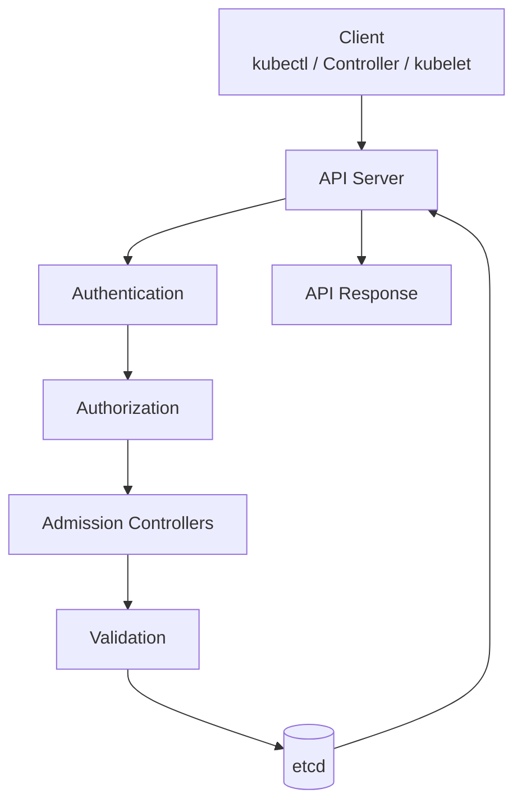
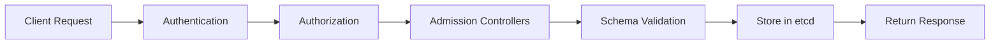
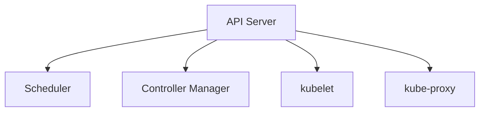
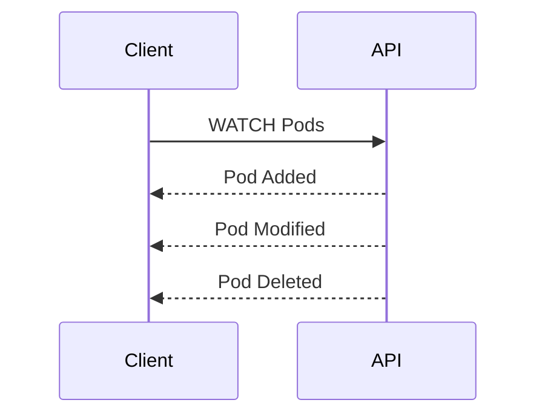
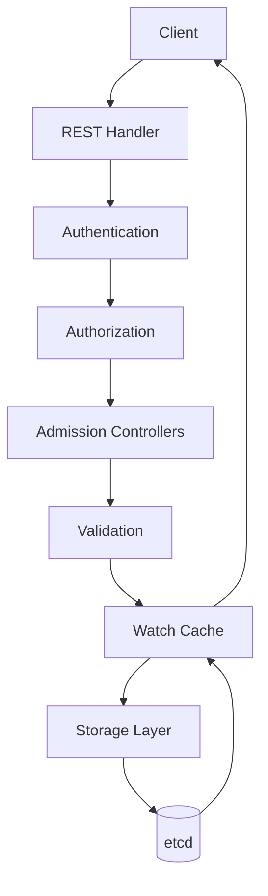
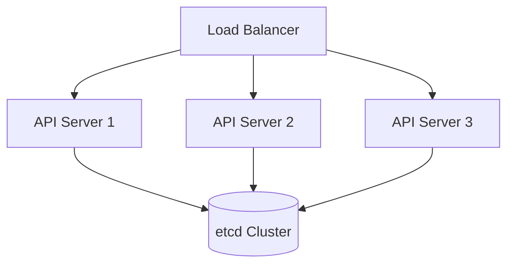

# Kubernetes API Server

> **Chapter 7 of the Kubernetes Handbook**
>
> **Difficulty:** ⭐⭐⭐ Intermediate
>
> **Reading Time:** 3–4 Hours
>
> **Prerequisites**
>
> - Kubernetes Architecture
> - Kubernetes API
> - Control Plane
> - Worker Node
>
> **Next Chapter**
>
> etcd

---

# Learning Objectives

After completing this chapter, you will understand:

- What the API Server is
- Why it is the heart of the Control Plane
- Internal architecture
- Request processing pipeline
- Communication with every Kubernetes component
- Authentication and authorization flow
- Admission control
- High Availability
- Failure scenarios
- Performance considerations
- Production best practices

---

# What is the API Server?

The **Kubernetes API Server** is the central component of the Control Plane.

It exposes the Kubernetes API and acts as the **single gateway** through which almost every operation enters or leaves the cluster.

Every major Kubernetes component communicates with the API Server.

Without it, the cluster cannot be managed.

---

# Why Does Kubernetes Need an API Server?

Imagine Kubernetes without an API Server.

```
Scheduler

↓

etcd

Controller Manager

↓

etcd

kubectl

↓

etcd

kubelet

↓

etcd
```

Every component would need to:

- understand the database
- validate requests
- authenticate users
- enforce permissions
- resolve conflicts

The system would quickly become impossible to maintain.

Instead, Kubernetes centralizes these responsibilities.

```
Scheduler
       │
kubectl│
       │
kubelet│
       ▼
 +------------------+
 |    API Server    |
 +------------------+
          │
          ▼
        etcd
```

---

# Responsibilities

The API Server performs many critical tasks.

It:

- Exposes the Kubernetes REST API
- Validates requests
- Authenticates users
- Authorizes operations
- Runs Admission Controllers
- Stores objects in etcd
- Watches cluster changes
- Serves API responses
- Coordinates Control Plane communication

Notice something important.

The API Server **does not schedule Pods**.

It **does not run containers**.

It coordinates and validates.

---

# Why the API Server is Called the Front Door

Everything enters through the API Server.

Examples:

```
kubectl apply

↓

API Server
```

```
Scheduler

↓

API Server
```

```
kubelet

↓

API Server
```

```
Controller Manager

↓

API Server
```

Even internal Kubernetes components use the same API.

There are no secret shortcuts.

---

# Architecture Overview



Every request passes through this pipeline.

---

# API Server Design Principles

The API Server is built around several core principles.

## 1. Single Entry Point

Every request enters through one well-defined interface.

Benefits:

- Security
- Consistency
- Auditing
- Centralized validation

---

## 2. Stateless Design

The API Server itself stores **very little state**.

Persistent cluster state lives in **etcd**.

This allows multiple API Server instances to run simultaneously behind a load balancer.

---

## 3. RESTful API

Resources are accessed using standard HTTP methods.

Examples:

| Method | Purpose |
|---------|---------|
| GET | Read |
| POST | Create |
| PUT | Replace |
| PATCH | Modify |
| DELETE | Remove |

This makes Kubernetes easy to automate.

---

## 4. Declarative Operations

Users describe the desired state.

Example:

```yaml
replicas: 5
```

The API Server stores this declaration.

Controllers perform the necessary actions later.

---

# Who Talks to the API Server?

Almost every important component.

| Component | Purpose |
|-----------|---------|
| kubectl | User requests |
| Scheduler | Read Pods, update assignments |
| Controller Manager | Watch resources, create objects |
| kubelet | Report node and Pod status |
| kube-proxy | Watch Services and Endpoints |
| Operators | Manage custom resources |
| GitOps Controllers | Synchronize manifests |
| CI/CD Systems | Deploy applications |

This central communication model is one of Kubernetes' defining characteristics.

---

# Request Categories

The API Server processes many different kinds of requests.

Examples include:

### Read

```bash
kubectl get pods
```

---

### Create

```bash
kubectl apply -f deployment.yaml
```

---

### Update

```bash
kubectl scale deployment web --replicas=5
```

---

### Delete

```bash
kubectl delete pod nginx
```

---

### Watch

```bash
kubectl get pods --watch
```

The API Server efficiently streams changes instead of requiring repeated polling.

---

# API Server vs etcd

These two components are often confused.

| API Server | etcd |
|------------|------|
| Processes requests | Stores cluster state |
| Validates resources | Persists resources |
| Handles authentication | No authentication logic |
| Runs admission control | No business logic |
| Stateless | Stateful |

A useful way to think about them:

```
API Server

↓

Brain

----------------

etcd

↓

Memory
```

---

# Why Components Don't Access etcd Directly

Suppose the Scheduler directly modified etcd.

Suppose the kubelet also modified etcd.

Suppose a custom application did the same.

Soon:

- conflicting updates
- invalid objects
- inconsistent state

would become common.

Instead,

everything flows through the API Server.

This guarantees:

- Validation
- Authorization
- Auditability
- Version checks
- Consistency

---

# Real-World Analogy

Imagine an airport.

Passengers never walk directly onto the runway.

Instead they pass through:

- Check-in
- Security
- Passport Control
- Boarding

Only then do they board the aircraft.

Similarly, every Kubernetes request passes through:

```
Authentication

↓

Authorization

↓

Admission

↓

Validation

↓

Storage
```

before becoming part of the cluster state.

---

# Common Misconceptions

### "The API Server runs Pods."

❌ False.

Pods are executed by kubelets on Worker Nodes.

---

### "The API Server stores Kubernetes objects."

❌ Not exactly.

Objects are persisted in etcd.

The API Server validates and manages access to them.

---

### "Only kubectl talks to the API Server."

❌ False.

Almost every Kubernetes component communicates with the API Server.

---

# Best Practices

- Never bypass the API Server.
- Use declarative manifests whenever possible.
- Secure API access with strong authentication.
- Monitor API Server latency and availability.
- Run multiple API Server instances in production.

---

# Summary (Part 1)

In this chapter you've learned:

- The API Server is the gateway to Kubernetes.
- It exposes the Kubernetes API.
- Every major component communicates through it.
- It validates, authenticates, authorizes, and stores requests.
- It is stateless, with persistent state stored in etcd.
- It enables Kubernetes' secure and consistent architecture.

In the next part, we'll dissect the **complete request processing pipeline**, following a request from the moment it reaches the API Server until it is safely stored in etcd.

---

# The API Server Request Pipeline

Every request follows a well-defined pipeline.

Nothing skips steps.

Whether the request comes from:

- kubectl
- kubelet
- Scheduler
- Controller Manager
- Argo CD
- Terraform
- GitHub Actions

the API Server processes it in the same way.

---

# Complete Pipeline



Every stage has exactly one responsibility.

---

# Step 1 – Receive Request

Suppose the developer executes:

```bash
kubectl apply -f deployment.yaml
```

`kubectl` converts the YAML into an HTTP request.

Conceptually:

```text
Developer
     │
     ▼
kubectl
     │
     ▼
POST /apis/apps/v1/deployments
```

The request arrives at the API Server.

---

# Step 2 – Authentication

The first question is always:

> **Who is making this request?**

Authentication verifies identity.

Possible identities include:

- Human users
- Service Accounts
- CI/CD systems
- Controllers
- kubelets

If identity cannot be verified,

the request is rejected immediately.

---

## Authentication Example

```
Incoming Request

↓

Token

↓

Valid?

↓

Yes

↓

Continue
```

Otherwise:

```
401 Unauthorized
```

---

# Step 3 – Authorization

Now that Kubernetes knows **who** made the request,

it determines **what** they are allowed to do.

Example:

```
User

↓

Create Deployment

↓

Allowed
```

Another example:

```
User

↓

Delete Namespace

↓

Denied
```

Authorization frequently uses **RBAC (Role-Based Access Control)**.

We'll explore RBAC in detail later.

---

## Authentication vs Authorization

| Authentication | Authorization |
|----------------|---------------|
| Who are you? | What may you do? |
| Identity | Permissions |
| Happens first | Happens second |

This distinction appears frequently in interviews.

---

# Step 4 – Admission Controllers

Passing authorization does **not** mean the request is accepted.

Admission Controllers inspect the request.

They may:

- Reject it
- Modify it
- Add defaults
- Enforce policies

---

## Example 1 – Default Values

Developer submits:

```yaml
spec:
  containers:
  - image: nginx
```

Admission Controller may automatically add:

```yaml
imagePullPolicy: IfNotPresent
```

The stored object is slightly different from what the user submitted.

---

## Example 2 – Security Policy

Company rule:

```
Every container

↓

Must define CPU and Memory limits
```

Developer forgets.

Admission Controller rejects the request.

---

## Why Admission Controllers Exist

Without them,

every developer would need to remember every organizational rule.

Admission Controllers enforce policies centrally.

---

# Step 5 – Schema Validation

Now the API Server validates the object.

Example:

Correct:

```yaml
replicas: 3
```

Incorrect:

```yaml
replicas: three
```

The schema determines whether:

- Required fields exist
- Data types are correct
- Structure is valid

Invalid objects never reach etcd.

---

# Step 6 – Resource Version Check

Many Kubernetes objects are updated by multiple clients.

Example:

Administrator A:

```
Scale to 5
```

Administrator B:

```
Scale to 10
```

The API Server uses the object's `resourceVersion` to detect conflicting updates.

If the object changed unexpectedly,

the update may be rejected.

This prevents accidental overwrites.

---

# Step 7 – Persist the Object

The request has now passed:

- Authentication
- Authorization
- Admission
- Validation
- Version checks

The API Server stores the object in etcd.

```text
API Server
     │
     ▼
etcd
```

At this point,

the desired state officially becomes part of the cluster.

---

# Step 8 – Notify Watchers

Many components are watching the API.

Examples:

- Scheduler
- Controller Manager
- kubelets
- kube-proxy

When the object changes,

the API Server notifies interested watchers.

Example:

```text
Deployment Created

↓

Controller Manager Notified
```

No polling is required.

---

## Architecture



The API Server acts as the event hub.

---

# Step 9 – Return Response

Finally,

the API Server returns a response.

Example:

```bash
deployment.apps/frontend created
```

or

```
Error from server (Forbidden)
```

or

```
Error from server (Unauthorized)
```

The client receives immediate feedback about the request.

---

# Read Requests

Not every request modifies the cluster.

Example:

```bash
kubectl get pods
```

Processing is simpler.

```text
Client
     │
     ▼
Authentication
     │
     ▼
Authorization
     │
     ▼
Read from etcd
     │
     ▼
Return Results
```

No Admission Controllers are involved because nothing is being created or modified.

---

# Watch Requests

A WATCH request is different.

Example:

```bash
kubectl get pods --watch
```

The connection remains open.

Whenever a Pod changes,

the API Server streams the update.



This event-driven model scales far better than repeated polling.

---

# Error Responses

Common HTTP status codes include:

| Code | Meaning |
|------|---------|
| 200 | Success |
| 201 | Resource created |
| 400 | Bad request |
| 401 | Authentication failed |
| 403 | Authorization denied |
| 404 | Resource not found |
| 409 | Resource version conflict |
| 500 | Internal server error |

Understanding these codes helps during debugging.

---

# Common Misconceptions

### "Validation happens before authentication."

❌ False.

Kubernetes first verifies who is making the request.

Only authenticated requests continue.

---

### "Admission Controllers store objects."

❌ False.

They inspect or modify requests.

The API Server persists objects in etcd.

---

### "Every request passes through Admission Controllers."

❌ Not always.

Read-only operations such as `GET` typically do not require admission processing.

---

# Production Insight

When troubleshooting failed API requests,

think in pipeline order.

```text
Authentication

↓

Authorization

↓

Admission

↓

Validation

↓

etcd
```

Identify the stage where the request failed.

This dramatically reduces troubleshooting time.

---

# Summary (Part 2)

The API Server processes requests in a consistent sequence:

1. Receive the request.
2. Authenticate the client.
3. Authorize the requested action.
4. Apply Admission Controllers.
5. Validate the object.
6. Check resource versions.
7. Persist the object in etcd.
8. Notify interested watchers.
9. Return a response.

Every successful write to Kubernetes follows this pipeline, making it one of the most fundamental workflows in the entire platform.

---

# Inside the API Server

So far we've treated the API Server as a single component.

Internally, it consists of several logical layers.

```text
                API Server

┌────────────────────────────────────┐
│ REST API Endpoints                 │
├────────────────────────────────────┤
│ Authentication                     │
├────────────────────────────────────┤
│ Authorization                      │
├────────────────────────────────────┤
│ Admission Controllers              │
├────────────────────────────────────┤
│ Validation                         │
├────────────────────────────────────┤
│ Storage Layer                      │
├────────────────────────────────────┤
│ etcd                              │
└────────────────────────────────────┘
```

Each layer performs a specific task before passing the request to the next.

---

# REST Handlers

When a request arrives,

the API Server first determines:

- Which API group?
- Which resource?
- Which HTTP method?

Example:

```text
GET /api/v1/pods
```

The request is routed to the handler responsible for Pods.

Another example:

```text
POST /apis/apps/v1/deployments
```

This is routed to the Deployment handler.

This routing process is similar to web frameworks such as FastAPI, Express, or Spring Boot.

---

# Serialization

Clients send requests as JSON (or YAML converted to JSON).

Internally,

the API Server converts the request into Kubernetes objects.

Example:

```yaml
apiVersion: apps/v1
kind: Deployment
```

↓

Internal Go structures

↓

Validation

↓

Storage

Likewise,

responses are converted back into JSON before being returned to the client.

---

# Storage Layer

The Storage Layer is responsible for communicating with etcd.

The API Server does **not** expose etcd directly.

Instead,

every read and write passes through this abstraction.

Benefits include:

- Consistent validation
- Version management
- Future extensibility
- Simplified maintenance

---

# Why Doesn't Every Read Go to etcd?

Imagine a cluster with:

- 5,000 Nodes
- 200,000 Pods
- Hundreds of controllers
- Thousands of API requests per second

If every request queried etcd directly,

performance would suffer significantly.

To solve this,

the API Server uses a **Watch Cache**.

---

# Watch Cache

The Watch Cache stores recently accessed Kubernetes objects in memory.

Conceptually:

```text
Client Request
      │
      ▼
API Server
      │
      ├─────────────► Watch Cache
      │                     │
      │                     ▼
      └─────────────► etcd (if needed)
```

The cache reduces:

- Read latency
- Load on etcd
- Network traffic

---

# Cache Example

Suppose five users execute:

```bash
kubectl get pods
```

within a few seconds.

Without caching:

```text
User 1 → etcd
User 2 → etcd
User 3 → etcd
User 4 → etcd
User 5 → etcd
```

With the Watch Cache:

```text
User 1 → etcd

↓

Cache Updated

↓

Users 2–5 → Cache
```

Much less work is required.

---

# Why Is It Called a Watch Cache?

The cache stays up to date by observing changes through Kubernetes' watch mechanism.

Whenever an object changes:

```text
Pod Updated

↓

Watch Event

↓

Cache Updated
```

The API Server doesn't repeatedly reload all data from etcd.

Instead,

it incrementally updates the cache as events occur.

---

# API Groups Revisited

Earlier we learned about API Groups.

Internally,

the API Server organizes resources by these groups.

Examples:

```text
Core

↓

Pods

Services

Secrets
```

```text
apps

↓

Deployments

ReplicaSets

DaemonSets
```

```text
batch

↓

Jobs

CronJobs
```

Each API Group has its own handlers and schema definitions.

---

# API Discovery

Clients don't need to know every supported resource in advance.

The API Server supports discovery.

Example commands:

```bash
kubectl api-resources
```

and

```bash
kubectl api-versions
```

The API Server responds with supported resources and versions.

This allows clients to adapt to different Kubernetes releases.

---

# API Aggregation

One of Kubernetes' most powerful features is that the API can be extended.

The API Server can expose APIs that are not part of core Kubernetes.

Conceptually:

```text
Client
     │
     ▼
API Server
     │
     ├────────► Core APIs
     │
     └────────► Extension APIs
```

To the client,

both appear as part of a single Kubernetes API.

---

# Why API Aggregation Exists

Imagine you build a storage platform.

You want users to create resources such as:

```yaml
kind: Backup
```

Core Kubernetes doesn't include this resource.

Instead of building a separate API,

you can integrate it into Kubernetes.

Users interact with it just like they do with Pods or Deployments.

---

# Custom Resource Definitions (CRDs)

CRDs allow you to define entirely new Kubernetes resource types.

Example:

```yaml
apiVersion: company.example.com/v1

kind: Database
```

After installing the CRD,

users can create Database objects using `kubectl`.

Example:

```bash
kubectl get databases
```

This works because the API Server now understands the new resource.

---

# Why CRDs Matter

CRDs are the foundation of the Kubernetes ecosystem.

Many popular tools rely on them.

Examples include:

- Certificate management
- Monitoring
- Service meshes
- GitOps
- Database operators

Rather than inventing new management interfaces,

they extend the Kubernetes API.

---

# Operators

An Operator combines:

- Custom Resource Definitions
- A Controller

Example:

```text
Database Resource

↓

Database Controller

↓

Create Database

↓

Monitor Database

↓

Recover Database
```

Operators automate complex applications while preserving the Kubernetes declarative model.

We'll study Operators in a later chapter.

---

# Watch Connections

Many Kubernetes components establish long-lived watch connections.

Examples:

- Scheduler
- Controller Manager
- kubelet
- kube-proxy
- GitOps controllers

Instead of repeatedly asking for updates,

they receive events whenever resources change.

This dramatically improves scalability.

---

# Internal Architecture Overview



This diagram illustrates the logical flow through the API Server.

---

# Common Misconceptions

### "The Watch Cache replaces etcd."

❌ False.

The Watch Cache is an in-memory optimization.

etcd remains the authoritative source of cluster state.

---

### "CRDs require changes to Kubernetes source code."

❌ False.

CRDs extend Kubernetes without modifying the core platform.

---

### "The API Server only supports built-in resources."

❌ False.

Through API Aggregation and CRDs, the API can be extended significantly.

---

# Production Insight

Large production clusters often serve thousands of API requests per second.

Key scalability techniques include:

- Running multiple API Server instances.
- Using the Watch Cache to reduce etcd reads.
- Favoring watches over repeated polling.
- Extending Kubernetes through CRDs instead of building separate management systems.

These design choices allow Kubernetes to scale while remaining extensible.

---

# Summary (Part 3)

In this section you learned:

- The API Server is composed of multiple logical layers.
- REST handlers route requests to the correct resources.
- Requests are serialized into internal Kubernetes objects.
- The Storage Layer isolates etcd access.
- The Watch Cache improves read performance.
- API Discovery enables clients to discover supported resources.
- API Aggregation extends the Kubernetes API.
- CRDs allow entirely new resource types.
- Operators build on CRDs to automate complex systems.

The final part of this chapter will focus on production operations: High Availability, performance tuning, troubleshooting, interview questions, and a concise API Server revision sheet.
---

# API Server High Availability

A production Kubernetes cluster should never rely on a single API Server.

Instead, multiple API Server instances run behind a Load Balancer.



Benefits:

- No single point of failure
- Higher request capacity
- Rolling upgrades
- Better availability

---

# Why Multiple API Servers Work

Unlike etcd,

the API Server is **stateless**.

It stores almost no persistent information locally.

All persistent cluster state is stored in etcd.

Therefore:

```
API Server 1

↓

Crash
```

Requests can simply be routed to:

```
API Server 2
```

without losing cluster state.

---

# API Server Performance

The API Server is often the busiest component in a Kubernetes cluster.

It handles requests from:

- Developers
- Controllers
- kubelets
- kube-proxy
- GitOps tools
- Monitoring systems
- CI/CD pipelines

Performance directly affects the entire cluster.

---

# Common Performance Bottlenecks

Possible bottlenecks include:

- High request rate
- Expensive admission webhooks
- Large watch streams
- Slow etcd responses
- Excessive list operations
- Too many concurrent clients

Symptoms may include:

- Slow `kubectl` commands
- Delayed scheduling
- Timeouts
- Increased API latency

---

# API Priority and Fairness (APF)

Imagine hundreds of users and controllers all sending requests simultaneously.

Without controls,

one client could overwhelm the API Server.

Kubernetes provides **API Priority and Fairness (APF)**.

Its goals include:

- Prevent starvation
- Prioritize critical system requests
- Ensure fair sharing of API capacity

For example, requests from core Kubernetes components are generally given higher priority than bulk user requests.

---

# Audit Logging

Every important API request can be recorded.

Typical audit information includes:

- Who made the request
- When it happened
- Which resource was accessed
- Which operation was performed
- Whether it succeeded

Example (conceptual):

```text
Time: 14:32:05
User: alice
Action: DELETE
Resource: Pod/frontend-7d6b8
Result: Success
```

Audit logs are valuable for:

- Security investigations
- Compliance
- Troubleshooting
- Change tracking

---

# Failure Scenario 1 – API Server Crash

Suppose one API Server crashes.

Impact:

- Requests routed to that instance fail.
- The Load Balancer directs new requests to healthy API Servers.
- Existing Pods continue running.

If all API Servers become unavailable:

- Existing workloads generally continue running.
- New API operations fail.
- Controllers and kubelets cannot synchronize new state.

---

# Failure Scenario 2 – etcd Latency

Suppose etcd becomes slow.

The API Server can still receive requests,

but writes and some reads become slower.

Possible symptoms:

- Slow `kubectl apply`
- Delayed object updates
- Increased API latency

Because etcd is the source of truth, its performance directly affects the API Server.

---

# Failure Scenario 3 – Admission Webhook Failure

Many organizations use custom admission webhooks.

If a required webhook becomes unavailable:

```text
Create Deployment

↓

Webhook Timeout

↓

Request Rejected
```

This is why webhook availability and timeout configuration are important operational considerations.

---

# Failure Scenario 4 – Excessive LIST Requests

Suppose thousands of clients repeatedly execute:

```bash
kubectl get pods -A
```

The API Server experiences unnecessary load.

Whenever possible:

- Use watches for continuous monitoring.
- Avoid repeatedly listing large resource collections.

---

# Troubleshooting Workflow

When API-related problems occur,

use a structured approach.

---

## Step 1 – Verify Cluster Connectivity

```bash
kubectl cluster-info
```

This checks whether the cluster is reachable.

---

## Step 2 – Check API Server Health

```bash
kubectl get --raw='/readyz'
```

Expected response:

```text
ok
```

You can also inspect detailed readiness information:

```bash
kubectl get --raw='/readyz?verbose'
```

---

## Step 3 – Check Component Status

```bash
kubectl get componentstatuses
```

> **Note:** `componentstatuses` is deprecated in modern Kubernetes releases.

In production, prefer:

- `/readyz`
- `/livez`
- Control Plane metrics
- Control Plane logs

---

## Step 4 – Review API Server Logs

On a Control Plane node:

```bash
journalctl -u kube-apiserver
```

or, depending on the installation method:

```bash
kubectl logs -n kube-system <kube-apiserver-pod>
```

API Server logs often reveal:

- Authentication failures
- Authorization denials
- Admission webhook issues
- Storage errors

---

## Step 5 – Measure API Latency

Useful indicators include:

- Request duration
- Request rate
- Error rate
- Response codes

These metrics are commonly collected using Prometheus.

---

# Common Operational Commands

View API resources:

```bash
kubectl api-resources
```

---

View supported API versions:

```bash
kubectl api-versions
```

---

Inspect raw API output:

```bash
kubectl get --raw /api
```

---

Inspect API groups:

```bash
kubectl get --raw /apis
```

---

Watch Pods:

```bash
kubectl get pods --watch
```

These commands help you explore and debug the Kubernetes API.

---

# Best Practices

- Run multiple API Server instances in production.
- Protect the API Server with strong authentication.
- Use RBAC to enforce least privilege.
- Monitor request latency and error rates.
- Keep admission webhooks highly available.
- Prefer WATCH over repeated LIST operations.
- Monitor etcd health, as API Server performance depends on it.

---

# Common Misconceptions

### "The API Server stores cluster data."

❌ Not exactly.

The API Server coordinates access.

Persistent state lives in etcd.

---

### "Scaling the API Server increases cluster compute capacity."

❌ False.

Scaling API Servers increases request-handling capacity, not the CPU or memory available for running Pods.

---

### "Audit logs replace application logs."

❌ False.

Audit logs describe API activity.

Application logs describe application behavior.

They complement each other.

---

# API Server Communication Matrix

| Component | Interaction |
|-----------|-------------|
| kubectl | Sends user requests |
| Scheduler | Watches Pods, updates node assignments |
| Controller Manager | Watches resources, creates and updates objects |
| kubelet | Watches assigned Pods, reports status |
| kube-proxy | Watches Services and Endpoints |
| etcd | Stores and retrieves cluster state |
| Operators | Manage custom resources |

The API Server is the communication hub for the cluster.

---

# API Server Cheat Sheet

```text
Client
     │
     ▼
Authentication
     │
     ▼
Authorization
     │
     ▼
Admission Controllers
     │
     ▼
Validation
     │
     ▼
Storage Layer
     │
     ▼
etcd
     │
     ▼
Watch Notifications
     │
     ▼
Controllers / kubelets / Clients
```

---

# Interview Questions

## Beginner

1. What is the Kubernetes API Server?
2. Why is it called the front door of the cluster?
3. What is the difference between the Kubernetes API and the API Server?
4. Why don't components access etcd directly?
5. What are the responsibilities of the API Server?

---

## Intermediate

1. Describe the complete request processing pipeline.
2. Explain the difference between authentication and authorization.
3. What are Admission Controllers?
4. What is the Watch Cache?
5. Why does Kubernetes use watches instead of polling?

---

## Advanced

1. Why is the API Server stateless?
2. Explain API Aggregation and CRDs.
3. How does the API Server scale horizontally?
4. What is API Priority and Fairness?
5. How would you troubleshoot a slow API Server?

---

# Real-World Scenarios

### Scenario 1

`kubectl apply` returns:

```text
Error from server (Forbidden)
```

Where should you investigate?

> **Answer:** Authorization (typically RBAC), since authentication succeeded but permissions were insufficient.

---

### Scenario 2

All API requests become slow.

Possible causes?

> **Answer:** etcd latency, API Server overload, expensive admission webhooks, or high request volume.

---

### Scenario 3

Controllers are not reacting to newly created Deployments.

Possible areas?

> **Answer:** API Server availability, watch connections, Controller Manager health, or etcd issues.

---

### Scenario 4

A request succeeds, but the created object contains additional fields.

Why?

> **Answer:** Admission Controllers or defaulting logic modified the object before it was stored.

---

# Key Takeaways

- The API Server is the gateway to Kubernetes.
- Every request follows a predictable processing pipeline.
- Authentication verifies identity.
- Authorization verifies permissions.
- Admission Controllers enforce policy.
- Validation ensures object correctness.
- etcd stores the authoritative cluster state.
- The Watch Cache improves read performance.
- API Servers are stateless and horizontally scalable.
- Audit logs record API activity for security and troubleshooting.

---

# Summary

The API Server is the central communication hub of Kubernetes.

It connects users, automation tools, controllers, kubelets, and storage into a single, secure, and consistent system.

By understanding its request pipeline, internal architecture, scalability mechanisms, and operational characteristics, you gain a solid foundation for troubleshooting and operating production Kubernetes clusters.

---

# Related Chapters

Next:

- **08_etcd.md**

