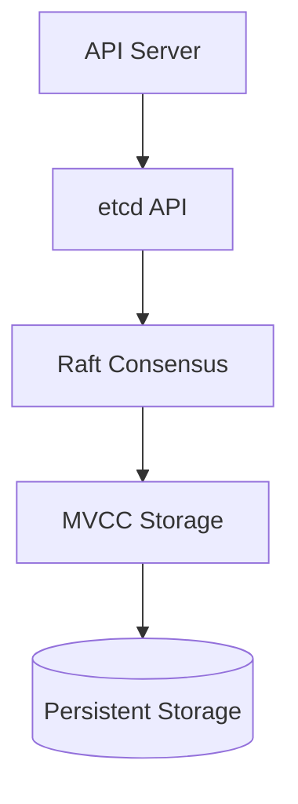

# etcd - The Brain's Memory

> **Chapter 8 of the Kubernetes Handbook**
>
> **Difficulty:** ⭐⭐⭐ Intermediate
>
> **Reading Time:** 3–4 Hours
>
> **Prerequisites**
>
> - Kubernetes Architecture
> - Kubernetes API
> - Control Plane
> - API Server
>
> **Next Chapter**
>
> Scheduler

---

# Learning Objectives

After completing this chapter, you'll understand:

- What etcd is
- Why Kubernetes needs etcd
- Key-Value databases
- Distributed databases
- Cluster state
- High Availability
- Quorum
- Leader Election
- Data consistency
- Failure scenarios
- Backups and restores
- Production best practices

---

# What is etcd?

**etcd** is Kubernetes' distributed key-value database.

It stores the **entire state of the Kubernetes cluster.**

Think of it as Kubernetes' permanent memory.

Without etcd,

Kubernetes would forget everything whenever the Control Plane restarted.

---

# Why Does Kubernetes Need etcd?

Imagine this situation.

You create:

- 400 Deployments
- 6,000 Pods
- 700 Services
- 200 Secrets
- 50 Namespaces

Where should Kubernetes remember all this information?

Answer:

```
etcd
```

Everything Kubernetes knows is stored there.

---

# The Source of Truth

One phrase appears repeatedly in Kubernetes documentation.

> **etcd is the source of truth.**

What does that mean?

Suppose:

```
Deployment

Replicas = 5
```

The Scheduler crashes.

The Controller Manager crashes.

The API Server restarts.

How does Kubernetes know that:

```
5 Pods

should exist?
```

Because that desired state is safely stored inside etcd.

---

# What Does etcd Store?

Almost every Kubernetes object.

Examples include:

- Pods
- Deployments
- ReplicaSets
- Services
- Nodes
- ConfigMaps
- Secrets
- Namespaces
- Jobs
- CronJobs
- PersistentVolumes
- PersistentVolumeClaims

If it exists inside Kubernetes,

it almost certainly exists inside etcd.

---

# What Doesn't etcd Store?

A common misconception is that etcd stores everything.

It does **not**.

Examples of data **not** stored in etcd include:

- Container images
- Application logs
- Container filesystem data
- Metrics collected by Prometheus
- Application binaries

etcd stores **cluster state**, not application data.

---

# What is a Key-Value Database?

Unlike relational databases,

etcd stores information as:

```
Key

↓

Value
```

Example:

```
Key

/registry/pods/default/nginx

↓

Value

Pod Object
```

Another example:

```
Key

/registry/deployments/default/frontend

↓

Deployment Object
```

The key uniquely identifies an object.

The value contains the serialized Kubernetes resource.

---

# Why Use a Key-Value Database?

Kubernetes frequently performs operations such as:

- Read object
- Update object
- Delete object
- Watch object

A key-value database is extremely efficient for these operations.

It is also simpler than a relational database for Kubernetes' object model.

---

# Conceptual Example

Suppose you create:

```yaml
apiVersion: v1

kind: Pod

metadata:

  name: nginx
```

Internally,

etcd stores something conceptually similar to:

```
Key

/registry/pods/default/nginx

↓

Value

{
  metadata...
  spec...
  status...
}
```

The exact internal representation differs,

but the concept remains the same.

---

# Why Doesn't Kubernetes Use MySQL?

This is a common interview question.

Could Kubernetes use MySQL?

Technically,

a system could be designed that way.

However,

Kubernetes requires:

- Very fast reads
- Very fast writes
- Strong consistency
- Distributed replication
- Efficient watch support

etcd is specifically designed for these requirements.

---

# Distributed Database

Unlike a traditional database,

etcd is designed to run across multiple machines.

Example:

```text
etcd Cluster

+---------+
| etcd-1  |
+---------+

+---------+
| etcd-2  |
+---------+

+---------+
| etcd-3  |
+---------+
```

Together,

they behave as a single logical database.

---

# Why Multiple etcd Nodes?

Suppose one machine crashes.

Should Kubernetes lose its memory?

No.

Replication ensures that the remaining members continue serving the cluster.

This is one reason production Kubernetes clusters deploy etcd as a cluster rather than a single instance.

---

# Cluster State

The term **cluster state** appears throughout Kubernetes.

Cluster state includes information such as:

- Desired state
- Current state
- Node information
- Pod assignments
- Labels
- Annotations
- Resource versions

Controllers rely on this state to perform reconciliation.

---

# Example

Desired state:

```
Deployment

Replicas = 3
```

Current state:

```
Pods Running = 2
```

Where are these values stored?

```
etcd
```

The Controller Manager reads this information and creates another Pod to restore the desired state.

---

# etcd and the API Server

Applications never communicate directly with etcd.

Instead:

```text
Client

↓

API Server

↓

etcd
```

This separation provides:

- Validation
- Authentication
- Authorization
- Auditing
- Version management

Only the API Server writes to etcd.

---

# Why Direct Access is Dangerous

Imagine:

```
Scheduler

↓

Modify etcd

kubelet

↓

Modify etcd

User Script

↓

Modify etcd
```

Soon,

conflicting updates and inconsistent objects become likely.

The API Server prevents this by acting as the single gateway.

---

# Real-World Analogy

Imagine a hospital.

The patient's medical record is stored in a secure system.

Doctors,

nurses,

and pharmacists

do not edit the database directly.

Instead,

they use approved applications.

Similarly,

Kubernetes components access cluster state through the API Server,

which safely manages etcd.

---

# Common Misconceptions

### "etcd runs Pods."

❌ False.

It stores information about Pods.

The kubelet runs Pods.

---

### "Applications store their business data in etcd."

❌ False.

Application databases should remain separate.

etcd is reserved for Kubernetes cluster state.

---

### "The API Server and etcd are the same thing."

❌ False.

The API Server manages requests.

etcd stores data.

---

# Best Practices

- Never allow applications to use etcd as their own database.
- Protect etcd with strong security controls.
- Run an odd number of etcd members in production.
- Take regular backups.
- Monitor disk latency and storage health.

---

# Summary (Part 1)

You now understand:

- What etcd is.
- Why Kubernetes depends on it.
- What cluster state means.
- Why etcd uses a key-value model.
- Why Kubernetes uses etcd instead of a relational database.

---

# Why One Database Is Not Enough

Suppose Kubernetes stores all cluster data on a single machine.

```text
            Kubernetes

                │

                ▼

           +-----------+
           |   etcd    |
           +-----------+
```

Everything works well.

Until...

```
Power Failure
```

The machine crashes.

Immediately,

Kubernetes loses access to its entire cluster state.

This is unacceptable for production systems.

---

# Distributed Database

Instead,

production Kubernetes uses multiple etcd servers.

```text
          etcd Cluster

+---------+   +---------+   +---------+
| etcd-1  |   | etcd-2  |   | etcd-3  |
+---------+   +---------+   +---------+
```

These servers cooperate and behave as a single logical database.

Advantages:

- Redundancy
- High Availability
- Fault Tolerance

---

# The Challenge

Running multiple databases creates a new problem.

Suppose:

```
Deployment

Replicas = 5
```

One database stores:

```
5
```

Another stores:

```
3
```

Which one is correct?

Distributed systems need a way to ensure that every member agrees on the current state.

This agreement is called **consensus**.

---

# What is Consensus?

Consensus means:

> All healthy members agree on the current state of the system.

Without consensus,

different machines could make different decisions.

In Kubernetes,

that could result in:

- Incorrect scheduling
- Lost updates
- Conflicting cluster state

---

# Raft Consensus Algorithm

etcd uses the **Raft Consensus Algorithm**.

Raft defines rules for:

- Choosing a leader
- Replicating data
- Handling failures
- Recovering after crashes
- Maintaining consistency

You don't need to memorize every detail of Raft,

but understanding the high-level workflow is essential.

---

# Leader and Followers

In a healthy etcd cluster,

one member acts as the **Leader**.

The others are **Followers**.

Example:

```text
          etcd Cluster

Leader

+---------+
| etcd-1  |
+---------+

Followers

+---------+   +---------+
| etcd-2  |   | etcd-3  |
+---------+   +---------+
```

Only the Leader accepts write operations.

Followers replicate data from the Leader.

---

# Why Only One Leader?

Imagine two Leaders.

Leader A receives:

```
Replicas = 5
```

Leader B receives:

```
Replicas = 10
```

Which value should Kubernetes trust?

Multiple active leaders can produce conflicting updates.

Raft avoids this by ensuring that only one Leader exists at a time.

---

# Write Workflow

Suppose a developer scales a Deployment.

```bash
kubectl scale deployment web --replicas=5
```

Conceptually:

```text
Developer
     │
     ▼
API Server
     │
     ▼
etcd Leader
```

The Leader:

1. Receives the update.
2. Sends it to Followers.
3. Waits for acknowledgements.
4. Commits the update.

Only then is the write considered successful.

---

# Replication

Whenever data changes,

the Leader replicates the change.

```text
Leader

↓

Followers

↓

Acknowledgements

↓

Commit
```

All healthy members eventually store the same information.

This process keeps the cluster consistent.

---

# Quorum

Another fundamental concept is **quorum**.

A quorum is the **minimum number of members required to agree** before an operation is committed.

In etcd,

writes require agreement from a majority of members.

---

# Majority

Examples:

| Cluster Size | Majority Required |
|--------------|------------------:|
| 1 | 1 |
| 3 | 2 |
| 5 | 3 |
| 7 | 4 |

The formula is:

```text
Majority = floor(N / 2) + 1
```

where **N** is the total number of members.

---

# Why Three Nodes?

Suppose we have:

```text
3 Members
```

Majority:

```text
2
```

If one member fails:

```
Healthy Members = 2
```

The cluster still has a majority.

Writes can continue.

---

# Why Not Two Nodes?

Imagine:

```text
2 Members
```

Majority:

```text
2
```

Now one member crashes.

```
Healthy Members = 1
```

Majority is lost.

The cluster can no longer safely accept writes.

This is why production etcd clusters typically use an odd number of members.

---

# Five-Node Cluster

Example:

```text
+---------+
| etcd-1  |
+---------+

+---------+
| etcd-2  |
+---------+

+---------+
| etcd-3  |
+---------+

+---------+
| etcd-4  |
+---------+

+---------+
| etcd-5  |
+---------+
```

Majority:

```
3 Members
```

The cluster can tolerate the loss of two members while still accepting writes.

---

# What Happens if Quorum Is Lost?

Suppose a three-member cluster loses two members.

Remaining:

```
1 Member
```

Majority required:

```
2
```

Result:

```
No Quorum
```

The remaining member refuses new writes.

Why?

Because accepting writes without a majority could create inconsistent cluster state.

Protecting consistency is more important than accepting every write.

---

# Split Brain

One of the biggest dangers in distributed systems is **Split Brain**.

Imagine a network problem divides the cluster.

```text
Group A

etcd-1

etcd-2

-------------------

Group B

etcd-3
```

Without quorum rules,

both groups might believe they are authoritative.

Raft prevents this.

Only the partition with a majority can continue accepting writes.

The minority partition becomes read-limited and waits until communication is restored.

---

# Leader Failure

Suppose the Leader crashes.

```text
Leader

↓

Failure
```

Followers detect the failure.

A new election begins.

One follower becomes the new Leader.

The cluster continues operating.

This process is automatic.

---

# Election Timeout

Followers periodically expect to hear from the Leader.

If they stop receiving messages,

they assume the Leader has failed.

Then:

```text
Election

↓

New Leader

↓

Replication Resumes
```

Leader election usually completes quickly, minimizing disruption.

---

# Read Operations

Reads are generally less expensive than writes.

Depending on configuration,

the Leader or Followers may serve reads.

For strongly consistent reads,

the system ensures the latest committed state is returned.

---

# Strong Consistency

One of etcd's guarantees is **strong consistency**.

This means:

Once a write is committed,

future reads will not return an older committed value.

This property is essential for Kubernetes.

Imagine a Scheduler reading outdated information about available nodes.

Incorrect scheduling decisions could follow.

---

# Common Misconceptions

### "Every etcd member accepts writes."

❌ False.

Only the Leader accepts writes.

Followers replicate data.

---

### "More nodes always improve performance."

❌ Not necessarily.

Larger clusters increase communication overhead.

For most Kubernetes clusters,

three or five members provide a good balance.

---

### "A single healthy member is enough."

❌ False.

Without quorum,

new writes cannot be safely committed.

---

# Production Insight

When etcd experiences problems,

many Kubernetes components appear unhealthy,

even though the root cause is the database.

For example:

- `kubectl apply` may hang.
- Deployments may stop progressing.
- Controllers may stop reconciling.
- Scheduling may appear stalled.

Understanding quorum and leader election helps explain these symptoms.

---

# Summary (Part 2)

In this section you learned:

- Why etcd is distributed.
- What consensus means.
- Why etcd uses the Raft algorithm.
- The roles of Leaders and Followers.
- How replication works.
- What quorum is.
- Why production clusters use an odd number of members.
- How leader election works.
- Why strong consistency is essential for Kubernetes.

In the next part, we'll explore **etcd internals, transactions, MVCC, snapshots, compaction, watches, and performance optimizations**, giving you a deeper understanding of how etcd remains both fast and reliable.

---

# Internal Architecture

At a high level, etcd consists of several logical components.

```text
                etcd

┌────────────────────────────┐
│ API Layer                  │
├────────────────────────────┤
│ Raft Consensus             │
├────────────────────────────┤
│ MVCC Storage               │
├────────────────────────────┤
│ Watch Engine               │
├────────────────────────────┤
│ Snapshot & Compaction      │
├────────────────────────────┤
│ Persistent Storage         │
└────────────────────────────┘
```

Each layer performs a specific role.

---

# API Layer

The API Layer receives requests from the Kubernetes API Server.

Typical operations include:

- Read
- Write
- Delete
- Watch

Remember:

Applications normally never communicate with etcd directly.

The API Server is the primary client.

---

# Persistent Storage

Eventually,

every committed write is stored on disk.

This ensures data survives:

- Power failures
- Restarts
- Process crashes

Without persistent storage,

the cluster would lose its state after every reboot.

---

# MVCC (Multi-Version Concurrency Control)

One of etcd's most important features is **MVCC**.

MVCC stands for:

> **Multi-Version Concurrency Control**

Instead of immediately replacing old data,

etcd creates a new version whenever an object changes.

---

# Example

Suppose a Deployment starts with:

```text
Replicas = 3
```

Version:

```text
Revision 101
```

Now you scale it:

```text
Replicas = 5
```

Instead of overwriting Revision 101,

etcd creates:

```text
Revision 102
```

Another update:

```text
Replicas = 8
```

Creates:

```text
Revision 103
```

Each committed change receives a new revision.

---

# Why MVCC?

MVCC provides several benefits.

It allows:

- Safe concurrent updates
- Efficient watches
- Consistent reads
- Snapshot creation

Without MVCC,

many distributed operations would become much harder.

---

# Revisions

Every successful write increases the global revision number.

Example:

| Revision | Change |
|----------|---------|
| 100 | Deployment Created |
| 101 | Scale to 3 |
| 102 | Scale to 5 |
| 103 | Scale to 8 |

Notice that revisions increase globally,

not per object.

---

# Transactions

Suppose two clients update the same object simultaneously.

Without protection,

one update could overwrite the other.

Instead,

etcd supports **transactions**.

Conceptually:

```text
IF

Current Revision == Expected Revision

THEN

Apply Update

ELSE

Reject Update
```

This ensures updates remain consistent.

---

# Compare-And-Swap

A common transaction pattern is:

**Compare → Then Update**

Example:

```
Expected Revision = 102
```

Current Revision:

```
102
```

Update succeeds.

But if the current revision is:

```
103
```

the transaction fails.

The client must retry using the latest data.

---

# Watches

Earlier we learned that Kubernetes uses watches extensively.

The watch capability actually comes from etcd.

Suppose the API Server wants to know whenever Pods change.

Instead of repeatedly asking:

```
Anything new?
```

it creates a watch.

```
Watch

↓

Wait

↓

Receive Event
```

Whenever data changes,

the watcher is notified.

---

# Watch Example

Suppose the API Server watches:

```
Pods
```

Developer creates:

```yaml
kind: Pod
```

etcd generates an event.

The API Server receives it immediately.

This enables Kubernetes' event-driven architecture.

---

# Event Flow

```text
Write

↓

Revision Created

↓

Watch Triggered

↓

API Server Notified

↓

Controllers React
```

Notice how many Kubernetes components depend on this mechanism.

---

# Leases

etcd also supports **leases**.

A lease represents a time-limited ownership.

Example:

```
Lease

↓

60 Seconds
```

If not renewed,

the lease expires automatically.

---

# Why Leases Matter

Kubernetes uses leases for several purposes.

Examples include:

- Node heartbeats
- Leader election
- Component coordination

Leases reduce unnecessary writes while allowing components to prove they are still alive.

---

# Snapshots

A snapshot is a complete backup of the etcd database at a specific point in time.

Conceptually:

```text
Current Cluster State

↓

Snapshot

↓

Backup File
```

Snapshots are essential for disaster recovery.

---

# Why Snapshots Matter

Imagine:

- Accidental deletion
- Disk corruption
- Hardware failure
- Complete Control Plane loss

Without a snapshot,

recovering cluster state may be impossible.

---

# Compaction

Because MVCC keeps older revisions,

the database would grow forever without cleanup.

To prevent this,

etcd performs **compaction**.

Conceptually:

Before:

```text
Revision

100

101

102

103

104

105
```

After compaction:

```text
Recent Revisions

↓

Kept

Older Revisions

↓

Removed
```

Compaction reduces storage usage while preserving recent history.

---

# Defragmentation

Even after compaction,

disk space may not be fully reclaimed.

This is where **defragmentation** helps.

Compaction:

```
Logical Cleanup
```

Defragmentation:

```
Physical Disk Cleanup
```

Think of it like cleaning and reorganizing a hard drive.

---

# Why Both Are Needed

Compaction removes obsolete revisions.

Defragmentation reorganizes storage to reclaim disk space.

Large production clusters typically perform both as part of regular maintenance.

---

# Internal Data Flow



This illustrates the path a write follows inside etcd.

---

# Common Misconceptions

### "Compaction deletes Kubernetes objects."

❌ False.

Compaction removes old revisions, not the current object.

---

### "Snapshots pause the cluster."

❌ Not necessarily.

Snapshots can typically be taken while the cluster remains operational, though they should be planned carefully in production.

---

### "Revision numbers belong to individual objects."

❌ False.

Revisions are global across the etcd cluster.

---

# Production Insight

Large Kubernetes clusters rely heavily on:

- Watches
- MVCC
- Transactions
- Compaction

Poor etcd maintenance can lead to:

- Increased database size
- Higher disk usage
- Slower response times
- Longer recovery times

Regular monitoring and maintenance are essential.

---

# Summary (Part 3)

In this section you learned:

- The internal architecture of etcd.
- How MVCC stores multiple revisions.
- Why revision numbers matter.
- How transactions prevent conflicting updates.
- How watches power Kubernetes' event-driven design.
- How leases support heartbeats and leader election.
- Why snapshots are essential for disaster recovery.
- The difference between compaction and defragmentation.

In the final part, we'll focus on operating etcd in production, including backups, restores, troubleshooting, monitoring, interview questions, and a concise revision cheat sheet.

---

# etcd in Production

In a production Kubernetes cluster, etcd is one of the most critical components.

If etcd becomes unavailable,

the Control Plane loses access to the cluster's source of truth.

Existing applications may continue running for a while,

but the cluster can no longer reliably process new changes.

---

# Why etcd Must Be Protected

Think of etcd as the master copy of your cluster.

It contains:

- Deployments
- Pods
- Services
- Secrets
- ConfigMaps
- RBAC configuration
- Namespaces
- Cluster configuration

Losing etcd means losing the cluster's configuration and desired state.

---

# Backup Strategy

Every production cluster should have regular etcd backups.

A common approach is:

```text
Daily Full Backup
       │
       ▼
Encrypted Storage
       │
       ▼
Periodic Restore Testing
```

A backup that has never been tested cannot be trusted.

---

# Creating a Snapshot

A snapshot captures the current etcd state.

Typical command:

```bash
etcdctl snapshot save snapshot.db
```

Example output:

```text
Snapshot saved at snapshot.db
```

This file can later be used for recovery.

---

# Restoring from a Snapshot

Suppose:

- Disk failure
- Accidental deletion
- Corrupted database

A previously created snapshot can be restored.

Example:

```bash
etcdctl snapshot restore snapshot.db
```

After restoration,

the recovered data is used to rebuild the etcd cluster.

> **Important:** Restoring etcd is only one step of disaster recovery. Depending on your cluster deployment method (for example, kubeadm or a managed Kubernetes service), additional Control Plane recovery steps are usually required.

---

# Backup Best Practices

- Automate backups.
- Encrypt backup files.
- Store backups outside the cluster.
- Test restores regularly.
- Monitor backup success.

Never rely on manual backups alone.

---

# Monitoring etcd

Healthy etcd performance is essential for Kubernetes.

Important areas to monitor include:

- Request latency
- Disk latency
- Disk space
- Database size
- Leader changes
- Quorum health
- Snapshot frequency

A small performance issue in etcd can affect the entire Control Plane.

---

# Why Disk Performance Matters

etcd performs frequent writes.

Slow disks can increase:

- API latency
- Deployment times
- Controller reconciliation delays

For production clusters,

fast SSD storage is strongly recommended.

---

# Common Failure Scenarios

---

## Scenario 1 – Leader Failure

Suppose:

```text
Leader

↓

Crash
```

Followers detect the failure.

A new election occurs.

A healthy follower becomes the new Leader.

Cluster operation continues.

---

## Scenario 2 – Loss of One Member

Three-member cluster:

```text
etcd-1

etcd-2

etcd-3
```

Suppose:

```
etcd-2

↓

Failure
```

Remaining members:

```
2
```

Majority still exists.

Writes continue.

---

## Scenario 3 – Loss of Quorum

Three-member cluster:

```
etcd-1

etcd-2

etcd-3
```

Failures:

```
etcd-2

↓

Down

etcd-3

↓

Down
```

Remaining:

```
1 Member
```

Majority required:

```
2
```

Result:

```
No Quorum
```

The cluster stops accepting new writes.

This protects consistency.

---

## Scenario 4 – Disk Full

Suppose the etcd disk becomes full.

Possible symptoms:

- Failed writes
- API Server errors
- Slow responses
- Failed Deployments

Disk usage should always be monitored.

---

## Scenario 5 – Database Growth

Without regular compaction,

old revisions accumulate.

Effects may include:

- Larger database
- Higher memory usage
- Slower startup
- Longer recovery

Regular maintenance helps avoid these issues.

---

# Troubleshooting Workflow

When etcd problems are suspected,

follow a structured process.

---

## Step 1 – Verify API Symptoms

Examples:

```bash
kubectl get pods
```

Is it slow?

Do writes fail?

Are timeouts occurring?

---

## Step 2 – Check Control Plane Logs

The API Server often reports storage-related errors.

Example:

```text
Unable to persist object

Storage timeout

Connection refused
```

These messages may point toward etcd.

---

## Step 3 – Check etcd Health

Typical command:

```bash
etcdctl endpoint health
```

Healthy output resembles:

```text
https://127.0.0.1:2379

is healthy
```

---

## Step 4 – Check Cluster Membership

```bash
etcdctl member list
```

This displays:

- Members
- Roles
- Status

Confirm that the expected members are present.

---

## Step 5 – Check Alarms

```bash
etcdctl alarm list
```

Common alarms include:

- Low disk space
- Corruption warnings

Investigate alarms promptly.

---

# Common etcd Commands

Check health:

```bash
etcdctl endpoint health
```

---

View status:

```bash
etcdctl endpoint status
```

---

List members:

```bash
etcdctl member list
```

---

Save snapshot:

```bash
etcdctl snapshot save snapshot.db
```

---

Restore snapshot:

```bash
etcdctl snapshot restore snapshot.db
```

---

Compact old revisions:

```bash
etcdctl compact <revision>
```

---

Defragment database:

```bash
etcdctl defrag
```

---

# Production Best Practices

- Run three or five etcd members.
- Use fast SSD storage.
- Avoid sharing etcd disks with heavy workloads.
- Schedule regular snapshots.
- Test disaster recovery procedures.
- Monitor latency and disk usage.
- Protect etcd with strong access controls.
- Keep etcd versions aligned with your Kubernetes version.

---

# Common Misconceptions

### "Adding more etcd nodes always improves performance."

❌ False.

Larger clusters increase replication overhead.

Three members are sufficient for most production clusters.

---

### "A healthy API Server guarantees a healthy etcd."

❌ False.

The API Server depends on etcd.

An unhealthy etcd cluster can still cause API operations to fail.

---

### "Snapshots replace High Availability."

❌ False.

High Availability keeps the cluster running.

Snapshots recover data after failures.

Both are necessary.

---

# etcd Communication Matrix

| Component | Interaction |
|-----------|-------------|
| API Server | Read and write cluster state |
| Scheduler | Indirect access through the API Server |
| Controller Manager | Indirect access through the API Server |
| kubelet | Indirect access through the API Server |
| kubectl | Indirect access through the API Server |

Only the API Server communicates directly with etcd.

---

# etcd Cheat Sheet

```text
Client
     │
     ▼
API Server
     │
     ▼
Authentication
     │
     ▼
Validation
     │
     ▼
Raft Leader
     │
     ▼
Replication
     │
     ▼
Quorum
     │
     ▼
Commit
     │
     ▼
Persistent Storage
```

---

# Interview Questions

## Beginner

1. What is etcd?
2. Why does Kubernetes use etcd?
3. What is stored in etcd?
4. Why don't applications communicate directly with etcd?
5. What is a key-value database?

---

## Intermediate

1. Explain quorum.
2. Why are three etcd members common?
3. What is Raft?
4. What is MVCC?
5. Why are watches important?

---

## Advanced

1. Describe the lifecycle of a write operation in etcd.
2. What happens when quorum is lost?
3. Explain snapshots, compaction, and defragmentation.
4. How would you recover from complete etcd failure?
5. How does etcd ensure strong consistency?

---

# Real-World Scenarios

### Scenario 1

`kubectl apply` hangs for several seconds.

Possible causes?

> **Answer:** Investigate API Server latency, etcd disk performance, quorum health, or network connectivity.

---

### Scenario 2

The API Server reports storage timeouts.

Where should you investigate?

> **Answer:** etcd health, disk latency, leader status, and network connectivity.

---

### Scenario 3

One etcd member fails.

Can the cluster continue?

> **Answer:** Yes, provided quorum is still maintained.

---

### Scenario 4

A three-member etcd cluster loses two members.

Can new writes succeed?

> **Answer:** No. Quorum is lost, so the cluster rejects new writes to preserve consistency.

---

# Key Takeaways

- etcd is Kubernetes' source of truth.
- It stores cluster state, not application data.
- It uses the Raft consensus algorithm.
- Quorum protects consistency.
- MVCC enables efficient concurrency.
- Watches power Kubernetes' event-driven architecture.
- Snapshots are essential for disaster recovery.
- Compaction and defragmentation keep the database healthy.
- Fast disks and regular monitoring are critical in production.

---

# Summary

etcd is the persistent memory of Kubernetes.

Every major Control Plane component depends on it, and every important cluster decision ultimately relies on the data stored within it.

Understanding consensus, replication, quorum, MVCC, and operational best practices provides the foundation needed to manage production Kubernetes clusters confidently.

---

# Related Chapters

Next:

- **09_Scheduler.md**

Deep dives:

- **07_API_Server.md**
- **10_Controller_Manager.md**
- **11_kubelet.md**

Future topics:

- **05_Troubleshooting/**
- **08_Observability/**
- **10_AI_SRE/**
- Why all access goes through the API Server.

In the next part, we'll explore **how etcd works internally**, including distributed consensus, Raft, quorum, replication, and why Kubernetes can tolerate failures without losing consistency.
