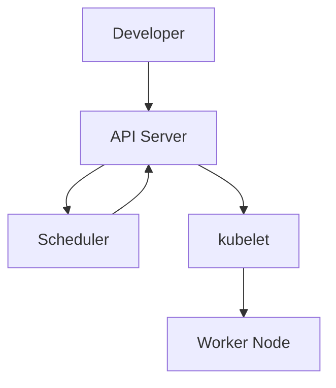
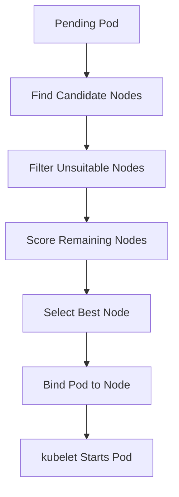

# Kubernetes Scheduler

> **Chapter 9 of the Kubernetes Handbook**
>
> **Difficulty:** ⭐⭐⭐ Intermediate
>
> **Reading Time:** 3–4 Hours
>
> **Prerequisites**
>
> - Kubernetes Architecture
> - Kubernetes API
> - Control Plane
> - Worker Node
> - API Server
> - etcd
>
> **Next Chapter**
>
> Controller Manager

---

# Learning Objectives

After completing this chapter, you'll understand:

- What the Scheduler is
- Why Kubernetes needs a Scheduler
- Scheduling workflow
- Filtering and Scoring
- Resource Requests
- Node Selection
- Scheduling constraints
- Failure scenarios
- Production best practices
- Troubleshooting Pending Pods

---

# What is the Kubernetes Scheduler?

The **Kubernetes Scheduler** is the Control Plane component responsible for assigning Pods to Worker Nodes.

It answers one question:

> **Which Worker Node should run this Pod?**

Notice the wording carefully.

The Scheduler **assigns** Pods.

It does **not** run them.

---

# Why Does Kubernetes Need a Scheduler?

Imagine a cluster with:

- 250 Worker Nodes
- 12,000 Pods

A developer creates a Deployment with:

```yaml
replicas: 20
```

Which Worker Nodes should run these Pods?

Without a Scheduler,

someone would need to manually choose nodes.

That clearly doesn't scale.

The Scheduler automates placement decisions.

---

# Responsibilities

The Scheduler is responsible for:

- Watching for unscheduled Pods
- Finding suitable Worker Nodes
- Selecting the best node
- Updating the Pod object
- Respecting scheduling constraints

The Scheduler is **not** responsible for:

- Running containers
- Pulling images
- Creating networks
- Monitoring Pod health

Those responsibilities belong to the Worker Node.

---

# Where Does the Scheduler Fit?



Notice that the Scheduler never communicates directly with Worker Nodes.

Instead, it updates the Pod object through the API Server.

The kubelet later notices the assignment.

---

# When Does the Scheduler Run?

The Scheduler continuously watches the API Server.

It is interested in Pods that have:

```text
Node = <none>
```

These Pods have not yet been assigned to a Worker Node.

Whenever such a Pod appears,

the Scheduler immediately begins making a placement decision.

---

# Example

Suppose a Deployment creates:

```text
frontend-pod
```

Current state:

```text
Pod

Node = None

Status = Pending
```

The Scheduler notices this new Pod and starts evaluating available nodes.

---

# High-Level Scheduling Workflow

The scheduling process looks like this.

```text
Pod Created
      │
      ▼
Scheduler Detects Pod
      │
      ▼
Find Candidate Nodes
      │
      ▼
Remove Unsuitable Nodes
      │
      ▼
Score Remaining Nodes
      │
      ▼
Choose Best Node
      │
      ▼
Update Pod
```

This process typically completes in milliseconds.

---

# Scheduling is a Decision Process

Think of the Scheduler as an interviewer evaluating job candidates.

Applicants:

```
Worker Nodes
```

Requirements:

```
Pod Requirements
```

The Scheduler first removes applicants that cannot do the job.

Then it ranks the remaining candidates.

Finally,

it chooses the best one.

---

# Scheduling Cycle

Every Pod goes through a scheduling cycle.

Conceptually:

```text
Pending Pod
      │
      ▼
Scheduling Cycle
      │
      ▼
Selected Node
```

The scheduling cycle ends after a node has been selected.

The kubelet then takes over.

---

# What Information Does the Scheduler Use?

The Scheduler considers many factors.

Examples include:

- Available CPU
- Available Memory
- Resource Requests
- Node Labels
- Taints
- Tolerations
- Node Affinity
- Pod Affinity
- Anti-Affinity
- Topology Spread Constraints
- Node Health

The Scheduler combines all of this information before making a decision.

---

# Resource Requests Matter

One of the Scheduler's most important inputs is:

```yaml
resources:
  requests:
    cpu: "500m"
    memory: "512Mi"
```

Notice:

The Scheduler uses **requests**,

not actual runtime usage,

when deciding whether a node has enough capacity.

We'll explore this in detail later.

---

# Scheduler vs kubelet

This distinction is extremely important.

| Scheduler | kubelet |
|-----------|----------|
| Chooses a Worker Node | Runs Pods |
| Operates in the Control Plane | Runs on every Worker Node |
| Makes placement decisions | Executes placement decisions |
| Handles Pending Pods | Handles assigned Pods |

Many interview questions test this difference.

---

# Why Doesn't the Scheduler Start Pods?

Suppose the Scheduler also started containers.

It would need to:

- Pull images
- Configure networking
- Mount storage
- Monitor health

That would tightly couple scheduling and execution.

Instead,

Kubernetes separates:

```
Decision

↓

Scheduler

----------------

Execution

↓

kubelet
```

This separation makes Kubernetes easier to scale and maintain.

---

# Scheduler and etcd

The Scheduler never writes directly to etcd.

Instead:

```text
Scheduler

↓

API Server

↓

etcd
```

This keeps all writes consistent and validated.

---

# Common Misconceptions

### "The Scheduler runs containers."

❌ False.

The kubelet and Container Runtime execute containers.

---

### "The Scheduler talks directly to Worker Nodes."

❌ False.

It updates Pod assignments through the API Server.

---

### "The Scheduler is only used when the cluster starts."

❌ False.

The Scheduler continuously watches for new unscheduled Pods throughout the life of the cluster.

---

# Best Practices

- Define resource requests for every workload.
- Avoid unnecessary scheduling constraints.
- Monitor Pending Pods.
- Use node labels consistently.
- Keep Worker Nodes healthy.

---

# Architecture Insight

The Scheduler follows Kubernetes' philosophy of **single responsibility**.

Its only job is:

> Find the best Worker Node.

Everything else—

container creation,

network setup,

storage mounting,

health checks—

is delegated to other components.

This separation allows each component to evolve independently.

---

# Summary (Part 1)

In this chapter you've learned:

- The Scheduler assigns Pods to Worker Nodes.
- It continuously watches for unscheduled Pods.
- It evaluates many factors before selecting a node.
- It updates the Pod through the API Server.
- The kubelet later executes the assignment.


---

# The Scheduling Cycle

Earlier we learned that the Scheduler watches for Pods whose:

```text
Node = <none>
```

Once such a Pod appears,

the Scheduler begins its scheduling cycle.

Conceptually:

```text
Pending Pod
      │
      ▼
Find Candidate Nodes
      │
      ▼
Filter Nodes
      │
      ▼
Score Nodes
      │
      ▼
Select Best Node
      │
      ▼
Update Pod
```

The scheduling cycle ends once the Pod has been assigned to a Worker Node.

---

# Example Cluster

Suppose our cluster contains:

| Node | CPU | Memory |
|------|----:|-------:|
| Worker-1 | 8 Cores | 16 GiB |
| Worker-2 | 4 Cores | 8 GiB |
| Worker-3 | 16 Cores | 32 GiB |

A new Pod requests:

```yaml
resources:
  requests:
    cpu: "2"
    memory: "4Gi"
```

Which node should Kubernetes choose?

Let's follow the algorithm.

---

# Phase 1 – Find Candidate Nodes

The Scheduler first retrieves all nodes that are eligible for scheduling.

Conceptually:

```text
Cluster

↓

Worker-1

Worker-2

Worker-3
```

At this point,

every healthy schedulable node is considered.

No decisions have been made yet.

---

# Phase 2 – Filtering

Filtering removes nodes that **cannot** run the Pod.

Think of filtering as answering:

> **Can this node run the Pod at all?**

Nodes that fail any mandatory requirement are eliminated.

---

# Example

Suppose:

| Node | Free CPU |
|------|----------:|
| Worker-1 | 6 |
| Worker-2 | 1 |
| Worker-3 | 12 |

The Pod requests:

```yaml
cpu: 2
```

Filtering removes:

```
Worker-2
```

because it doesn't have enough available CPU to satisfy the request.

Remaining candidates:

- Worker-1
- Worker-3

---

# Common Filtering Checks

The Scheduler evaluates many mandatory conditions.

Examples include:

- Sufficient CPU
- Sufficient memory
- Required volumes
- Node readiness
- Taints and tolerations
- Required node affinity
- Pod affinity rules
- Topology constraints

If any required condition fails,

the node is removed from consideration.

---

# Resource Requests

The Scheduler uses **resource requests**, not limits.

Example:

```yaml
resources:
  requests:
    cpu: "500m"
    memory: "512Mi"

  limits:
    cpu: "2"
    memory: "2Gi"
```

For scheduling purposes:

```
CPU = 500m

Memory = 512Mi
```

The limits are not used when deciding placement.

---

# Why Not Use Limits?

Limits describe the maximum resources a container may consume.

Requests describe the minimum resources the Pod expects to need.

The Scheduler reserves capacity based on requests so that workloads have the resources they asked for.

---

# Phase 3 – Scoring

After filtering,

multiple nodes may still be suitable.

Now the Scheduler asks:

> **Which suitable node is the best choice?**

Each remaining node receives a score.

The highest-scoring node wins.

---

# Example

Remaining nodes:

| Node | Score |
|------|------:|
| Worker-1 | 78 |
| Worker-3 | 92 |

Winner:

```
Worker-3
```

The exact score depends on several scoring plugins.

---

# What Influences Scores?

Possible scoring factors include:

- Resource balance
- Node utilization
- Preferred node affinity
- Image locality
- Topology preferences
- Preferred pod affinity
- Preferred pod anti-affinity

Unlike filtering,

these are **preferences**, not hard requirements.

---

# Hard Rules vs Soft Preferences

This distinction is critical.

| Hard Requirement | Soft Preference |
|------------------|-----------------|
| Must be satisfied | Nice to have |
| Used during filtering | Used during scoring |
| Failure eliminates the node | Failure only lowers the score |

Example:

Required node affinity:

```
Must run in region A
```

Preferred node affinity:

```
Prefer region A
```

If no node satisfies a preferred rule,

the Scheduler can still place the Pod elsewhere.

---

# Image Locality

Suppose:

```
Worker-1

Already has nginx:1.27
```

Worker-2 does not.

If both nodes are otherwise suitable,

the Scheduler may prefer Worker-1 because the image is already cached.

Benefits:

- Faster startup
- Less network traffic
- Reduced registry load

---

# Resource Balance

Suppose:

| Node | CPU Used | Memory Used |
|------|---------:|------------:|
| Worker-1 | 95% | 20% |
| Worker-2 | 55% | 50% |

Although Worker-1 has enough free memory,

placing another CPU-intensive Pod there may create an imbalance.

The Scheduler often prefers more balanced resource usage across the cluster.

---

# Final Selection

After scoring:

```text
Worker-1

Score 82

----------------

Worker-3

Score 95
```

The Scheduler selects:

```
Worker-3
```

It then updates the Pod object:

```text
Node = Worker-3
```

through the API Server.

---

# Binding

The final scheduling step is called **binding**.

Binding associates the Pod with its selected Worker Node.

Conceptually:

```text
Pod
     │
     ▼
Worker-3
```

Once binding succeeds,

the scheduling cycle is complete.

The kubelet on Worker-3 notices the assignment and begins creating the Pod.

---

# Scheduling Flow



This is the core scheduling workflow used by Kubernetes.

---

# What If No Node Passes Filtering?

Suppose every node fails at least one mandatory requirement.

Result:

```text
No Suitable Node
```

The Pod remains:

```text
Pending
```

The Scheduler periodically retries as cluster conditions change.

Examples:

- A node becomes available.
- Resources are freed.
- A new node joins the cluster.

---

# Scheduling is Continuous

The Scheduler doesn't give up after one attempt.

Conceptually:

```text
Pending
     │
     ▼
Try Scheduling
     │
     ▼
No Suitable Node
     │
     ▼
Wait
     │
     ▼
Retry
```

This continues until the Pod is successfully scheduled or removed.

---

# Common Misconceptions

### "The first suitable node always wins."

❌ False.

Suitable nodes are scored, and the highest-scoring node is selected.

---

### "Limits determine scheduling."

❌ False.

The Scheduler uses resource **requests**, not limits.

---

### "Filtering chooses the best node."

❌ False.

Filtering removes unsuitable nodes.

Scoring ranks the remaining candidates.

---

# Production Insight

When troubleshooting a Pending Pod,

first ask:

> **Did filtering eliminate every node?**

If yes,

identify which requirement failed:

- CPU
- Memory
- Taints
- Affinity
- Node readiness
- Storage
- Topology constraints

If several nodes remain after filtering,

investigate why one node received a higher score than the others.

---

# Summary (Part 2)

The Scheduler's algorithm consists of:

1. Detect an unscheduled Pod.
2. Find candidate nodes.
3. Filter out nodes that cannot satisfy mandatory requirements.
4. Score the remaining nodes based on preferences.
5. Select the highest-scoring node.
6. Bind the Pod to that node.
7. The kubelet begins executing the Pod.

Understanding the difference between **hard requirements (filtering)** and **soft preferences (scoring)** is one of the most important concepts in Kubernetes scheduling.

---

# Why Scheduling Constraints Exist

Earlier we learned that the Scheduler chooses the "best" node.

Sometimes, however, **the application has specific placement requirements**.

Examples:

- Database Pods should run only on SSD-backed nodes.
- GPU workloads should run only on GPU nodes.
- Frontend Pods should be spread across availability zones.
- Two replicas should never run on the same node.

Scheduling constraints allow you to express these requirements.

---

# Node Labels

The Scheduler uses **labels** to describe Worker Nodes.

Example:

```text
Worker-1

disk=ssd
region=us-east
gpu=false

--------------------

Worker-2

disk=hdd
region=us-west
gpu=true
```

View labels:

```bash
kubectl get nodes --show-labels
```

Add a label:

```bash
kubectl label node worker-1 disk=ssd
```

Labels are the foundation of many scheduling decisions.

---

# Node Selector

The simplest scheduling constraint is **nodeSelector**.

Example:

```yaml
spec:
  nodeSelector:
    disk: ssd
```

Meaning:

> Schedule this Pod only on nodes labeled `disk=ssd`.

---

## Example

Nodes:

| Node | disk |
|------|------|
| Worker-1 | ssd |
| Worker-2 | hdd |
| Worker-3 | ssd |

Pod:

```yaml
nodeSelector:
  disk: ssd
```

Candidate nodes:

- Worker-1
- Worker-3

Worker-2 is filtered out.

---

# Limitations of nodeSelector

`nodeSelector` supports only **exact matches**.

For example:

```yaml
disk: ssd
```

It cannot express conditions like:

- disk is not hdd
- region is east OR west
- cpu > 8
- gpu exists

For more advanced rules, Kubernetes provides **Node Affinity**.

---

# Node Affinity

Node Affinity extends the idea of nodeSelector.

It supports:

- Multiple expressions
- Logical operators
- Required rules
- Preferred rules

There are two main types:

- requiredDuringSchedulingIgnoredDuringExecution
- preferredDuringSchedulingIgnoredDuringExecution

The long names describe *when* the rule is applied and *whether* it is mandatory.

---

# Required Node Affinity

This is a **hard requirement**.

Example:

```yaml
affinity:
  nodeAffinity:
    requiredDuringSchedulingIgnoredDuringExecution:
      nodeSelectorTerms:
      - matchExpressions:
        - key: disk
          operator: In
          values:
          - ssd
```

If no node matches,

the Pod remains:

```text
Pending
```

---

# Preferred Node Affinity

This is a **soft preference**.

Example:

```yaml
preferredDuringSchedulingIgnoredDuringExecution:
```

Meaning:

> Prefer SSD nodes, but use another node if necessary.

The Scheduler uses this during the **scoring phase**.

---

# Node Selector vs Node Affinity

| nodeSelector | Node Affinity |
|--------------|---------------|
| Simple | Flexible |
| Exact match | Multiple operators |
| Hard requirement | Hard or soft |
| Easy to configure | More expressive |

If your requirement is simple, `nodeSelector` is often sufficient.

---

# Pod Affinity

Sometimes a Pod should run **near another Pod**.

Example:

```
Frontend

↓

Should run near

↓

Backend
```

Why?

Because communication between them is frequent, and keeping them close can reduce network latency.

Pod Affinity allows you to express this preference or requirement.

---

# Pod Anti-Affinity

The opposite requirement is also common.

Example:

```
Frontend Replica 1

↓

Should NOT run with

↓

Frontend Replica 2
```

Why?

If one Worker Node fails,

both replicas won't be lost.

Anti-affinity improves availability.

---

# Example

Suppose:

```
Worker-1

Frontend

-----------------

Worker-2

(empty)
```

A second frontend replica with Pod Anti-Affinity is scheduled.

Result:

```
Worker-2
```

The Scheduler avoids placing both replicas on the same node.

---

# Taints

Until now,

Pods decided where they wanted to go.

Taints reverse the idea.

Nodes declare:

> **Certain Pods are not welcome here.**

Example:

```bash
kubectl taint nodes worker-1 gpu=true:NoSchedule
```

Meaning:

Only Pods that tolerate this taint may be scheduled onto the node.

---

# Tolerations

Pods use **tolerations** to indicate that they can run on tainted nodes.

Example:

```yaml
tolerations:
- key: gpu
  operator: Equal
  value: "true"
  effect: NoSchedule
```

Without this toleration,

the Scheduler filters out the node.

---

# Taints vs Tolerations

Think of them as a lock and key.

```text
Node

↓

Taint

↓

Locked

-------------------

Pod

↓

Toleration

↓

Key
```

The key allows the Pod to enter.

Without the key,

the node remains unavailable.

---

# Common Taint Effects

| Effect | Meaning |
|---------|---------|
| NoSchedule | Do not place new Pods on this node. |
| PreferNoSchedule | Avoid this node if possible. |
| NoExecute | Remove existing Pods that don't tolerate the taint and prevent new ones from being scheduled. |

---

# Topology Spread Constraints

Production systems often span multiple:

- Availability Zones
- Regions
- Racks

Suppose:

```
Zone A

10 Pods

-----------------

Zone B

0 Pods
```

If Zone A fails,

every Pod disappears.

Topology Spread Constraints encourage the Scheduler to distribute Pods more evenly.

---

# Example

Desired placement:

```text
Zone A

5 Pods

-----------------

Zone B

5 Pods

-----------------

Zone C

5 Pods
```

This improves resilience.

---

# Preemption

Imagine:

All Worker Nodes are full.

A high-priority Pod arrives.

What should Kubernetes do?

The Scheduler may **preempt** lower-priority Pods.

Conceptually:

```text
Low Priority Pod

↓

Evicted

↓

High Priority Pod Scheduled
```

Preemption helps ensure that critical workloads can run when resources are scarce.

---

# Scheduler Plugins

Modern Kubernetes uses a plugin-based Scheduler.

Conceptually:

```text
Pending Pod
     │
     ▼
Filter Plugins
     │
     ▼
Score Plugins
     │
     ▼
Bind Plugins
```

This architecture allows Kubernetes to evolve and makes custom scheduling behavior possible without rewriting the entire Scheduler.

---

# Putting It All Together

Imagine this Pod:

- Requires SSD storage.
- Prefers `region=us-east`.
- Must avoid other replicas.
- Tolerates GPU nodes if necessary.

The Scheduler evaluates all of these constraints together.

The final decision results from combining:

- Hard requirements
- Soft preferences
- Resource availability
- Plugin scores

---

# Constraint Summary

| Constraint | Type | Mandatory? |
|-----------|------|------------|
| nodeSelector | Node | Yes |
| Required Node Affinity | Node | Yes |
| Preferred Node Affinity | Node | No |
| Pod Affinity | Pod | Depends on configuration |
| Pod Anti-Affinity | Pod | Depends on configuration |
| Taints | Node | Yes (unless tolerated) |
| Tolerations | Pod | Allow placement on tainted nodes |
| Topology Spread | Cluster | Depends on configuration |

---

# Common Misconceptions

### "Tolerations force a Pod onto a tainted node."

❌ False.

A toleration only allows the Pod to be scheduled there.

The Scheduler may still choose another suitable node.

---

### "Pod Anti-Affinity guarantees every replica runs on a different node."

❌ Not always.

If the rule is preferred rather than required, the Scheduler may place replicas together when no better option exists.

---

### "Node Affinity replaces nodeSelector."

❌ Not exactly.

Node Affinity is more expressive, but `nodeSelector` remains useful for simple, exact-match requirements.

---

# Production Insight

When a Pod remains `Pending`, inspect scheduling constraints carefully.

Common causes include:

- Incorrect node labels
- Missing tolerations
- Overly strict affinity rules
- Topology constraints that cannot be satisfied
- Insufficient resources

Use:

```bash
kubectl describe pod <pod-name>
```

The Events section often explains exactly which scheduling rule prevented placement.

---

# Summary (Part 3)

In this section you learned:

- How node labels describe Worker Nodes.
- When to use `nodeSelector`.
- The difference between required and preferred Node Affinity.
- How Pod Affinity and Anti-Affinity influence placement.
- How Taints and Tolerations work together.
- Why Topology Spread Constraints improve resilience.
- How Preemption allows high-priority workloads to run.
- That the Scheduler uses a plugin-based architecture to combine all these rules into a final placement decision.

In the final part, we'll focus on **production troubleshooting**, **Pending Pods**, **performance**, **best practices**, **interview questions**, and a **Scheduler revision cheat sheet**.

---

# Scheduler in Production

The Scheduler continuously watches the API Server for Pods that have not yet been assigned to a Worker Node.

In large production clusters, it may make thousands of scheduling decisions every minute.

Although scheduling is usually very fast, problems can occur when:

- Resources are exhausted.
- Scheduling constraints conflict.
- Nodes become unhealthy.
- Storage or networking requirements cannot be satisfied.

Understanding how to troubleshoot these situations is a key operational skill.

---

# Pending Pods

The most common scheduling issue is:

```text
STATUS: Pending
```

A Pending Pod has **not yet been assigned to a Worker Node** or is waiting for additional resources before it can start.

Do not assume every Pending Pod indicates a Scheduler bug.

Most are caused by configuration or capacity issues.

---

# Common Causes of Pending Pods

| Cause | Description |
|--------|-------------|
| Insufficient CPU | No node satisfies CPU requests |
| Insufficient Memory | No node satisfies memory requests |
| Node NotReady | Healthy nodes unavailable |
| Missing Toleration | Pod rejected by taints |
| Node Affinity | No node matches required labels |
| Pod Affinity | Required matching Pods unavailable |
| Persistent Volume | Storage cannot be provisioned or attached |
| Topology Constraints | Placement rules cannot be satisfied |

---

# Troubleshooting Workflow

Always investigate systematically.

---

## Step 1 – Check Pod Status

```bash
kubectl get pods
```

Example:

```text
NAME          READY   STATUS
frontend      0/1     Pending
```

---

## Step 2 – Describe the Pod

```bash
kubectl describe pod frontend
```

The **Events** section is often the most valuable.

Example:

```text
0/3 nodes are available:

2 Insufficient memory

1 node had untolerated taint
```

This immediately narrows the investigation.

---

## Step 3 – Check Nodes

```bash
kubectl get nodes
```

Verify:

- Ready status
- Number of nodes
- Recent failures

---

## Step 4 – Inspect Node Labels

```bash
kubectl get nodes --show-labels
```

Confirm that labels match the Pod's scheduling requirements.

---

## Step 5 – Check Taints

```bash
kubectl describe node worker-1
```

Look for:

```text
Taints:
```

Verify that Pods include matching tolerations when required.

---

## Step 6 – Verify Resources

```bash
kubectl describe node worker-1
```

Inspect:

- Allocatable CPU
- Allocatable Memory
- Currently allocated resources

Compare these values with the Pod's resource requests.

---

# Example Investigation

Suppose:

```text
Pod

↓

Pending
```

Events show:

```text
0/5 nodes available

5 Insufficient CPU
```

Question:

Should you investigate:

- kubelet?
- Container Runtime?
- Scheduler?

Answer:

The Scheduler cannot find a suitable Worker Node because resource requests cannot be satisfied.

The problem is cluster capacity, not Pod execution.

---

# Scheduler Performance

The Scheduler evaluates many factors.

Performance depends on:

- Number of Worker Nodes
- Number of Pods
- Scheduling constraints
- Cluster size
- Plugin complexity

Most scheduling operations complete quickly, but unnecessary constraints can increase scheduling time.

---

# Avoid Over-Constraining Workloads

Example:

```
Must run on SSD

AND

Must run in Zone A

AND

Must avoid Frontend Pods

AND

Must run only on GPU Nodes
```

Too many hard requirements reduce the number of eligible nodes.

Whenever possible:

- Use preferences instead of hard requirements.
- Keep rules simple.
- Label nodes consistently.

---

# High Availability

Production clusters usually run multiple Scheduler instances.

```text
Scheduler A

↓

Leader

-----------------

Scheduler B

↓

Standby

-----------------

Scheduler C

↓

Standby
```

Leader Election ensures that only one Scheduler actively assigns Pods.

If the leader fails,

another Scheduler automatically takes over.

---

# Scheduler Failure

Suppose the active Scheduler crashes.

Impact:

- Existing Pods continue running.
- New Pods remain Pending temporarily.
- Leader Election selects a new Scheduler.
- Scheduling resumes.

Applications already running on Worker Nodes are not interrupted.

---

# Scheduler Metrics

Common operational metrics include:

- Scheduling latency
- Pending Pod count
- Failed scheduling attempts
- Scheduling throughput
- Queue length

These metrics are commonly monitored using Prometheus.

---

# Production Best Practices

- Always define resource requests.
- Use node labels consistently.
- Prefer soft scheduling rules where appropriate.
- Avoid unnecessary taints.
- Monitor Pending Pods.
- Keep Worker Nodes healthy.
- Monitor Scheduler latency.

---

# Common Commands

View Pods:

```bash
kubectl get pods
```

---

Describe a Pod:

```bash
kubectl describe pod <pod-name>
```

---

View Nodes:

```bash
kubectl get nodes
```

---

View Node Labels:

```bash
kubectl get nodes --show-labels
```

---

Label a Node:

```bash
kubectl label node worker-1 disk=ssd
```

---

Remove a Label:

```bash
kubectl label node worker-1 disk-
```

---

Add a Taint:

```bash
kubectl taint node worker-1 gpu=true:NoSchedule
```

---

Remove a Taint:

```bash
kubectl taint node worker-1 gpu=true:NoSchedule-
```

---

# Scheduler Communication Matrix

| Component | Interaction |
|-----------|-------------|
| API Server | Watches unscheduled Pods, updates bindings |
| etcd | Indirect access through the API Server |
| Worker Nodes | Indirect communication through the API Server |
| kubelet | Observes Scheduler's node assignment |
| Controller Manager | Creates Pods that require scheduling |

---

# Scheduler Cheat Sheet

```text
Pending Pod
      │
      ▼
Find Nodes
      │
      ▼
Filter
(Hard Requirements)
      │
      ▼
Score
(Preferences)
      │
      ▼
Select Best Node
      │
      ▼
Bind Pod
      │
      ▼
kubelet Starts Pod
```

---

# Interview Questions

## Beginner

1. What is the Kubernetes Scheduler?
2. What is the Scheduler's primary responsibility?
3. What happens after the Scheduler selects a node?
4. What is a Pending Pod?
5. What is the difference between the Scheduler and the kubelet?

---

## Intermediate

1. Explain the Scheduler's filtering and scoring phases.
2. Why does the Scheduler use resource requests instead of limits?
3. Explain nodeSelector and Node Affinity.
4. What are Taints and Tolerations?
5. What is Pod Anti-Affinity?

---

## Advanced

1. Describe the complete scheduling workflow.
2. Explain Scheduler High Availability.
3. What is Leader Election?
4. How would you troubleshoot a Pending Pod?
5. How do Topology Spread Constraints improve availability?

---

# Real-World Scenarios

### Scenario 1

A Pod remains `Pending`.

Events show:

```text
Insufficient memory
```

What should you investigate?

> **Answer:** Check node allocatable memory, current resource usage, and the Pod's memory requests.

---

### Scenario 2

A Pod should run on GPU nodes but never schedules.

Possible causes?

> **Answer:** Missing node labels, incorrect nodeSelector or Node Affinity, missing toleration for GPU taints, or no available GPU nodes.

---

### Scenario 3

The Scheduler crashes.

What happens?

> **Answer:** Existing Pods continue running. New Pods remain Pending until a new Scheduler leader is elected.

---

### Scenario 4

Two replicas unexpectedly run on the same node.

Possible explanation?

> **Answer:** Pod Anti-Affinity may have been configured as a preference instead of a requirement, or no alternative node satisfied all constraints.

---

# Common Misconceptions

### "The Scheduler keeps monitoring running Pods."

❌ False.

The Scheduler's responsibility ends after binding the Pod to a Worker Node.

The kubelet manages execution afterward.

---

### "Pending means the application has crashed."

❌ False.

A Pending Pod has usually not been scheduled or is waiting for required resources or dependencies.

---

### "Adding more Scheduler instances improves scheduling throughput."

❌ Not automatically.

Only the elected leader actively schedules Pods.

Additional instances primarily improve availability.

---

# Key Takeaways

- The Scheduler decides where Pods run.
- Filtering evaluates mandatory requirements.
- Scoring ranks suitable nodes.
- Resource requests drive placement decisions.
- Scheduling constraints allow precise workload placement.
- Leader Election enables high availability.
- Pending Pods are usually caused by capacity or configuration issues rather than Scheduler failures.
- Structured troubleshooting is more effective than guessing.

---

# Summary

The Kubernetes Scheduler is responsible for one of the platform's most important decisions: selecting the most appropriate Worker Node for every Pod.

By combining resource awareness, scheduling constraints, and intelligent scoring, it enables efficient, resilient, and predictable workload placement.

Understanding how the Scheduler evaluates nodes—and how to troubleshoot scheduling failures—is essential for operating production Kubernetes clusters.

---

# Related Chapters

Next:

- **10_Controller_Manager.md**

Deep dives:

- **11_kubelet.md**
- **12_kube_proxy.md**
- **13_Container_Runtime.md**

Future topics:

- **03_Networking/**
- **04_Storage/**
- **05_Troubleshooting/**
- Scheduling is separate from execution.

In the next part, we'll dive into the Scheduler's internal algorithm, including **Filtering**, **Scoring**, and **Node Selection**—the core logic that determines where every Pod runs.
