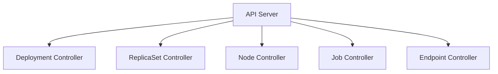
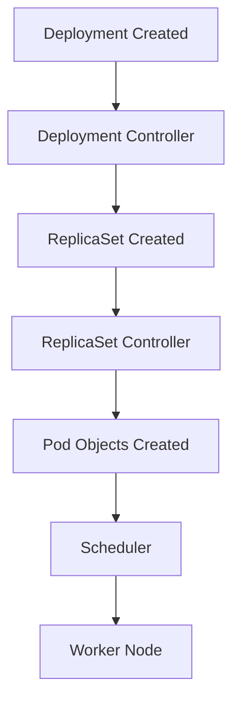
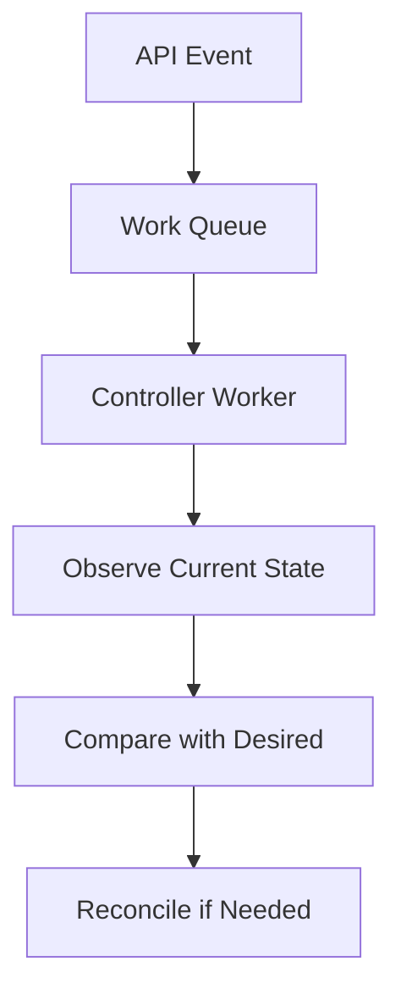

# Kubernetes Controller Manager

> **Chapter 10 of the Kubernetes Handbook**
>
> **Difficulty:** ⭐⭐⭐ Intermediate
>
> **Reading Time:** 3–4 Hours
>
> **Prerequisites**
>
> - Kubernetes Architecture
> - API Server
> - etcd
> - Scheduler
> - Worker Nodes
>
> **Next Chapter**
>
> kubelet

---

# Learning Objectives

After completing this chapter, you'll understand:

- What the Controller Manager is
- Why Kubernetes needs Controllers
- The Reconciliation Loop
- Desired State vs Actual State
- Built-in Controllers
- Controller workflow
- High Availability
- Failure recovery
- Troubleshooting
- Production best practices

---

# What is the Controller Manager?

The **Controller Manager** is the Control Plane component responsible for running Kubernetes controllers.

Controllers continuously monitor the cluster and ensure that the **actual state matches the desired state**.

Unlike the Scheduler, which makes a one-time placement decision,

Controllers work continuously throughout the lifetime of the cluster.

---

# Why Does Kubernetes Need Controllers?

Imagine you create:

```yaml
replicas: 3
```

Initially:

```
Desired Pods = 3
Actual Pods = 3
```

Everything is healthy.

Now suppose one Worker Node suddenly crashes.

```
Desired Pods = 3
Actual Pods = 2
```

Without a Controller,

nothing would happen.

The application would permanently run with only two replicas.

Instead,

the Controller notices the difference and creates a replacement Pod.

---

# The Core Idea

Everything in Kubernetes revolves around one question:

> **Does reality match the desired state?**

If the answer is:

```
Yes
```

The Controller does nothing.

If the answer is:

```
No
```

The Controller takes corrective action.

---

# Desired State vs Actual State

Suppose a Deployment specifies:

```yaml
replicas: 5
```

Desired state:

```
5 Pods
```

Current reality:

```
3 Pods
```

Difference:

```
Need 2 More Pods
```

The Controller creates two additional Pods.

---

# The Reconciliation Loop

This process is called the **Reconciliation Loop**.

```text
Desired State
      │
      ▼
Observe Current State
      │
      ▼
Compare
      │
      ▼
Difference?
      │
 ┌────┴────┐
 │         │
No        Yes
 │         │
 ▼         ▼
Wait    Take Action
```

This loop runs continuously.

It is the foundation of Kubernetes' self-healing behavior.

---

# Continuous Reconciliation

Unlike traditional automation,

Kubernetes doesn't perform an action once and stop.

Instead,

Controllers repeatedly ask:

```
Has anything changed?
```

If nothing changed,

they wait.

If something changed,

they reconcile the difference.

---

# Event-Driven Architecture

Controllers don't repeatedly scan the entire cluster.

Instead,

they establish watches through the API Server.

Conceptually:

```text
Controller

↓

Watch API Server

↓

Receive Event

↓

Reconcile
```

Examples of events include:

- Deployment created
- Pod deleted
- Node becomes NotReady
- ReplicaSet updated

---

# Controller Manager Architecture



The Controller Manager is actually a collection of many controllers running together.

---

# One Controller, One Responsibility

Kubernetes follows a simple design principle:

> One Controller = One Responsibility

Examples:

| Controller | Responsibility |
|------------|----------------|
| Deployment Controller | Manage Deployments |
| ReplicaSet Controller | Maintain replica count |
| Job Controller | Complete Jobs |
| Node Controller | Monitor Nodes |
| Service Controller | Manage cloud load balancers |

Each Controller focuses on one specific resource.

---

# Example Workflow

Suppose you create:

```yaml
kind: Deployment

replicas: 3
```

The Deployment Controller notices:

```
New Deployment
```

It creates:

```
ReplicaSet
```

The ReplicaSet Controller notices:

```
Need 3 Pods
```

It creates:

```
3 Pod Objects
```

The Scheduler then assigns those Pods to Worker Nodes.

Notice how Controllers cooperate rather than trying to perform every task themselves.

---

# Controllers Do Not Execute Pods

A common misconception:

```
Controller

↓

Runs Containers
```

This is false.

Controllers create or update Kubernetes objects.

The kubelet later creates the actual containers.

---

# Why Multiple Controllers?

Imagine a single controller responsible for:

- Deployments
- Jobs
- ReplicaSets
- Nodes
- Services
- CronJobs
- DaemonSets

The code would become extremely complex.

Instead,

Kubernetes divides responsibilities into many smaller controllers.

Benefits:

- Easier maintenance
- Better scalability
- Simpler testing
- Independent development

---

# Controllers Communicate Through the API Server

Controllers never modify etcd directly.

Instead:

```text
Controller

↓

API Server

↓

etcd
```

This ensures:

- Validation
- Authorization
- Consistency
- Auditability

---

# Controller vs Scheduler

| Controller | Scheduler |
|------------|-----------|
| Maintains desired state | Chooses Worker Nodes |
| Runs continuously | Acts when scheduling is required |
| Creates Kubernetes objects | Binds Pods to Nodes |
| Performs reconciliation | Performs placement |

They solve completely different problems.

---

# Common Misconceptions

### "The Controller Manager is one Controller."

❌ False.

It runs many Controllers.

---

### "Controllers run applications."

❌ False.

Controllers manage Kubernetes resources.

Worker Nodes execute applications.

---

### "Controllers only run when users create resources."

❌ False.

Controllers continuously monitor the cluster and react whenever reality diverges from the desired state.

---

# Best Practices

- Treat controllers as declarative automation.
- Avoid manually modifying managed resources.
- Monitor reconciliation failures.
- Understand which controller owns each resource.
- Prefer Kubernetes-native resources over custom automation when possible.

---

# Architecture Insight

The Controller Manager is what transforms Kubernetes from a simple orchestration platform into a **self-healing system**.

Without Controllers:

- Failed Pods would stay failed.
- Replica counts would drift.
- Nodes would never recover automatically.
- Rolling updates would stop midway.

Controllers are the automation engine behind Kubernetes.

---

# Summary (Part 1)

In this chapter you've learned:

- The Controller Manager runs many Controllers.
- Controllers continuously compare desired and actual state.
- The Reconciliation Loop powers self-healing.
- Controllers react to events through the API Server.
- Each Controller has one well-defined responsibility.
- Controllers manage resources—they do not execute workloads.

In the next part, we'll explore the most important built-in Controllers, including the Deployment Controller, ReplicaSet Controller, Job Controller, Node Controller, and others, following how they work together inside a production cluster.

---

# Built-in Controllers

The Controller Manager is not a single controller.

Instead,

it runs many specialized controllers.

Some of the most important are:

| Controller | Responsibility |
|------------|----------------|
| Deployment Controller | Manages Deployments |
| ReplicaSet Controller | Maintains replica count |
| StatefulSet Controller | Manages stateful applications |
| DaemonSet Controller | Runs one Pod per node |
| Job Controller | Executes batch jobs |
| CronJob Controller | Schedules Jobs |
| Node Controller | Monitors Worker Nodes |
| Service Controller | Manages cloud load balancers |
| Namespace Controller | Cleans up deleted namespaces |

Each controller watches specific Kubernetes resources and reconciles only those resources.

---

# How Controllers Cooperate

Controllers don't compete.

They form a chain of responsibility.

Example:

```text
Deployment
      │
      ▼
ReplicaSet
      │
      ▼
Pods
      │
      ▼
Scheduler
      │
      ▼
Worker Node
```

Each controller completes one task before the next component takes over.

---

# Deployment Controller

Suppose a user creates:

```yaml
kind: Deployment

replicas: 3
```

The Deployment Controller notices:

```
New Deployment
```

Question:

```
Does a ReplicaSet already exist?
```

If not,

it creates one.

The Deployment Controller does **not** create Pods directly.

---

# ReplicaSet Controller

Now the ReplicaSet Controller takes over.

Suppose:

```
Desired Pods = 3

Actual Pods = 1
```

Difference:

```
Need 2 Pods
```

The ReplicaSet Controller creates two additional Pod objects.

Notice that the Scheduler still hasn't assigned these Pods to nodes.

---

# Scheduler Takes Over

The Scheduler notices:

```text
Node = <none>
```

It chooses suitable Worker Nodes and binds the Pods.

Finally,

the kubelets execute the Pods.

This demonstrates the clear separation of responsibilities.

---

# Deployment Lifecycle



---

# ReplicaSet Controller Example

Suppose:

```text
Desired Pods = 4
```

Current:

```text
Pod 1

Pod 2

Pod 3
```

One Pod crashes.

Current:

```text
3 Pods
```

ReplicaSet Controller notices:

```
Need 1 Pod
```

It creates another Pod object.

This is Kubernetes' self-healing behavior.

---

# Node Controller

The Node Controller monitors Worker Node health.

Suppose:

```
Worker-2

↓

NotReady
```

The Node Controller detects the condition.

If the node remains unavailable,

Pods managed by higher-level controllers (such as Deployments) are recreated on healthy nodes.

The Node Controller focuses on node state,

while other controllers manage application replicas.

---

# Job Controller

Jobs are different from Deployments.

Deployment:

```
Run Forever
```

Job:

```
Run

↓

Finish

↓

Exit
```

The Job Controller ensures that a specified number of successful completions occur.

---

# Example

Suppose:

```yaml
completions: 5
```

Current:

```
Completed = 4
```

The Job Controller creates another Pod until:

```
Completed = 5
```

Then it stops.

---

# CronJob Controller

CronJobs create Jobs according to a schedule.

Example:

```text
Every Day

↓

02:00 AM

↓

Create Job
```

The CronJob Controller watches the schedule and creates Job objects at the appropriate times.

---

# DaemonSet Controller

A DaemonSet follows a completely different rule.

Instead of:

```
Run 5 Pods
```

it says:

```
Run One Pod

↓

On Every Worker Node
```

Examples:

- Log collection agents
- Monitoring agents
- Node security agents
- Networking components

---

# Example

Cluster:

```text
Worker-1

Worker-2

Worker-3
```

DaemonSet:

```
Logging Agent
```

Result:

```text
Worker-1

↓

Logging Agent

----------------

Worker-2

↓

Logging Agent

----------------

Worker-3

↓

Logging Agent
```

If a fourth Worker Node joins,

the DaemonSet Controller automatically creates a new Pod there.

---

# StatefulSet Controller

Stateful applications often require:

- Stable identities
- Persistent storage
- Predictable startup order

Examples:

- Databases
- Message queues
- Distributed storage systems

The StatefulSet Controller manages these guarantees.

Unlike Deployments,

StatefulSets preserve Pod identity across restarts.

---

# Service Controller

In cloud environments,

the Service Controller may interact with the cloud provider.

Example:

```yaml
type: LoadBalancer
```

The Service Controller requests a cloud load balancer and updates the Service once it becomes available.

The exact implementation depends on the cloud platform.

---

# Namespace Controller

When a Namespace is deleted,

its resources must also be removed.

The Namespace Controller ensures that cleanup completes before the Namespace disappears.

This prevents orphaned Kubernetes objects.

---

# Controllers Watching Resources

Each controller establishes watches for the resources it owns.

Conceptually:

```text
Deployment Controller

↓

Watch Deployments

----------------------

ReplicaSet Controller

↓

Watch ReplicaSets

----------------------

Node Controller

↓

Watch Nodes

----------------------

Job Controller

↓

Watch Jobs
```

This event-driven model avoids constant polling.

---

# Multiple Controllers Can Observe the Same Event

Suppose a Pod is deleted.

Different controllers may react for different reasons.

Example:

```text
Pod Deleted
      │
      ├────────► ReplicaSet Controller
      │            Creates replacement Pod
      │
      └────────► Endpoint Controller
                   Updates Service endpoints
```

Each controller performs only its own responsibility.

---

# Ownership

Kubernetes resources often reference their owner.

Example:

```text
Deployment

↓

Owns

↓

ReplicaSet

↓

Owns

↓

Pods
```

These ownership relationships help controllers understand which resources they are responsible for.

---

# Garbage Collection

Suppose you delete a Deployment.

Should the ReplicaSet remain?

Should the Pods remain?

No.

Because Kubernetes tracks ownership,

dependent resources can be cleaned up automatically.

This is known as **Garbage Collection**.

---

# Controller Design Pattern

Nearly every Kubernetes controller follows the same pattern.

```text
Watch Resource
      │
      ▼
Observe Current State
      │
      ▼
Compare with Desired State
      │
      ▼
Difference?
      │
 ┌────┴────┐
 │         │
No        Yes
 │         │
 ▼         ▼
Wait    Reconcile
```

Whether it's a Deployment, Job, or DaemonSet,

the pattern remains remarkably consistent.

---

# Common Misconceptions

### "The Deployment Controller creates Pods."

❌ Not directly.

It creates or updates ReplicaSets.

The ReplicaSet Controller creates the Pod objects.

---

### "The Node Controller recreates application Pods."

❌ Not directly.

It detects node problems.

Higher-level workload controllers ensure the desired number of replicas exists.

---

### "Every controller watches every resource."

❌ False.

Each controller watches only the resources relevant to its responsibility.

---

# Production Insight

When troubleshooting Kubernetes,

always identify **which controller owns the resource**.

Examples:

- Deployment problem → Deployment Controller
- Missing replicas → ReplicaSet Controller
- Node failure → Node Controller
- Scheduled task → CronJob Controller

Knowing the responsible controller dramatically narrows the investigation.

---

# Summary (Part 2)

In this section you learned:

- The Controller Manager runs many specialized controllers.
- Controllers cooperate through a chain of responsibility.
- The Deployment Controller manages Deployments.
- The ReplicaSet Controller maintains replica counts.
- The Node Controller monitors Worker Nodes.
- The Job, CronJob, DaemonSet, StatefulSet, Service, and Namespace Controllers each solve specific problems.
- Ownership relationships enable automatic cleanup through Garbage Collection.
- Nearly every controller follows the same reconciliation pattern.

In the next part, we'll explore advanced controller behavior, including reconciliation timing, work queues, retries, leader election, failure scenarios, and controller performance in production clusters.

---

# Controllers Never Stop Running

Unlike a traditional script,

a Kubernetes Controller never "finishes."

Instead,

it continuously waits for events.

Conceptually:

```text
Start Controller
       │
       ▼
Watch Resources
       │
       ▼
Receive Event
       │
       ▼
Reconcile
       │
       ▼
Wait Again
```

This loop continues for the lifetime of the Controller.

---

# Event-Driven Design

Controllers do **not** repeatedly scan the cluster.

Instead,

they establish watches with the API Server.

Example:

```text
Deployment Created

↓

API Server

↓

Deployment Controller

↓

Reconcile
```

Only meaningful changes trigger work.

This greatly improves scalability.

---

# Why Not Poll?

Imagine:

```
500 Controllers

↓

Every Second

↓

Check Entire Cluster
```

This would generate enormous unnecessary load.

Instead,

controllers receive notifications only when resources change.

---

# Work Queues

Controllers don't process events immediately.

Instead,

events are placed into a **work queue**.

Conceptually:

```text
API Event
      │
      ▼
Work Queue
      │
      ▼
Controller Worker
      │
      ▼
Reconcile
```

The queue smooths bursts of activity and allows controllers to process events at a sustainable rate.

---

# Why Use a Work Queue?

Suppose 1,000 Pods are deleted at the same time.

Without a queue:

```
1000 Immediate Reconciliations
```

This could overwhelm the controller.

With a queue:

```text
Event 1
Event 2
Event 3
...
Event 1000
```

Workers process them steadily.

---

# Multiple Worker Threads

Large clusters often use multiple reconciliation workers.

Conceptually:

```text
              Work Queue

      ┌─────────┼─────────┐
      ▼         ▼         ▼
 Worker 1   Worker 2   Worker 3
```

Each worker processes different queue items independently.

This improves throughput while maintaining correctness.

---

# The Reconcile Function

Almost every Kubernetes controller follows the same structure.

Conceptually:

```text
Receive Object
       │
       ▼
Read Current State
       │
       ▼
Compare Desired State
       │
       ▼
Difference?
       │
 ┌─────┴─────┐
 │           │
No          Yes
 │           │
 ▼           ▼
Done     Apply Changes
```

This function is often called the **Reconcile** function.

---

# Idempotency

Controllers are designed to be **idempotent**.

Meaning:

Running reconciliation multiple times should produce the same final state.

Example:

Desired:

```text
3 Pods
```

Current:

```text
3 Pods
```

Reconcile runs.

Result:

```
Nothing changes.
```

Running reconciliation again produces the same outcome.

---

# Why Idempotency Matters

Imagine a temporary network error.

The controller retries.

If reconciliation were not idempotent,

each retry might accidentally create extra Pods.

Instead,

the controller first checks the current state before making changes.

---

# Retry Logic

Failures happen.

Examples:

- API timeout
- Temporary network issue
- Storage delay

Controllers typically retry failed operations.

Conceptually:

```text
Attempt

↓

Failure

↓

Wait

↓

Retry

↓

Success
```

Retries help recover from transient problems without manual intervention.

---

# Exponential Backoff

Repeated immediate retries can worsen an outage.

Instead,

controllers often increase the wait time between retries.

Example:

```text
Retry 1

↓

1 Second

Retry 2

↓

2 Seconds

Retry 3

↓

4 Seconds

Retry 4

↓

8 Seconds
```

This strategy is called **exponential backoff**.

It reduces pressure on already struggling systems.

---

# Leader Election

Production clusters usually run multiple Controller Manager instances.

```text
Controller Manager A

↓

Leader

-----------------

Controller Manager B

↓

Standby

-----------------

Controller Manager C

↓

Standby
```

Only the elected leader actively performs reconciliation.

---

# Why Leader Election?

Suppose two Deployment Controllers are both active.

Deployment:

```
Replicas = 3

Actual = 2
```

Controller A creates:

```
Pod 3
```

Controller B also creates:

```
Pod 4
```

Now there are four Pods instead of three.

Leader Election prevents duplicate reconciliation.

---

# Failure Recovery

Suppose the active Controller Manager crashes.

```text
Leader

↓

Failure

↓

Leader Election

↓

New Leader

↓

Reconciliation Continues
```

Existing workloads continue running.

The new leader resumes reconciliation.

---

# Temporary Inconsistency

Suppose:

```
Desired = 5 Pods

Actual = 4 Pods
```

Before reconciliation occurs,

the cluster temporarily remains in this state.

Eventually,

the controller notices the difference and restores the desired state.

This delay is expected.

Kubernetes provides **eventual consistency**, not instantaneous consistency.

---

# Eventual Consistency

One of Kubernetes' design principles is:

```
Observe

↓

Compare

↓

Correct
```

The cluster converges toward the desired state over time.

This approach scales better than trying to synchronize every component instantly.

---

# Controller Throughput

Controller performance depends on factors such as:

- Number of watched objects
- Queue length
- Reconciliation complexity
- API Server responsiveness
- etcd performance

A slow API Server or unhealthy etcd can delay reconciliation even if the controller itself is healthy.

---

# Reconciliation is Incremental

Suppose a Deployment manages:

```
1000 Pods
```

One Pod fails.

The controller doesn't recreate all 1000 Pods.

It identifies the difference:

```
Need 1 Pod
```

Only that missing Pod is recreated.

This incremental approach makes Kubernetes efficient.

---

# Internal Workflow



This pattern is common across Kubernetes controllers and custom Operators.

---

# Custom Controllers

One of Kubernetes' strengths is that developers can create their own controllers.

Typical architecture:

```text
Custom Resource

↓

Custom Controller

↓

Reconcile

↓

External System
```

Examples include:

- Database Operators
- Kafka Operators
- Redis Operators
- Certificate Managers

They all follow the same reconciliation pattern as the built-in controllers.

---

# Common Misconceptions

### "Controllers execute continuously."

❌ Not exactly.

Controllers run continuously, but reconciliation is usually triggered by events and queue processing rather than constant busy work.

---

### "Every event causes immediate reconciliation."

❌ Not necessarily.

Events enter a work queue and are processed by controller workers.

---

### "Retries indicate a broken controller."

❌ False.

Retries are a normal mechanism for handling transient failures.

---

# Production Insight

When troubleshooting delayed reconciliation, investigate the entire chain:

```text
Resource Changed
      │
      ▼
API Server Watch
      │
      ▼
Controller Queue
      │
      ▼
Reconcile
      │
      ▼
API Update
      │
      ▼
etcd
```

A delay anywhere in this pipeline can slow the system.

---

# Summary (Part 3)

In this section you learned:

- Controllers are event-driven.
- Work queues smooth bursts of activity.
- Reconciliation is idempotent.
- Controllers retry transient failures using exponential backoff.
- Leader Election prevents duplicate reconciliation.
- Kubernetes relies on eventual consistency.
- Controllers update only the differences they observe.
- Custom controllers follow the same reconciliation model as built-in controllers.

In the final part, we'll focus on production troubleshooting, operational best practices, interview questions, and a Controller Manager revision cheat sheet.

---

# Controller Manager in Production

The Controller Manager is responsible for keeping the cluster aligned with its desired state.

If it stops working:

- Existing Pods continue running.
- The Scheduler can still assign Pods that already exist.
- The API Server can still accept requests.
- **New reconciliation stops.**

This distinction is extremely important.

The Controller Manager maintains the cluster—it does not execute workloads.

---

# What Stops Working?

Suppose the Controller Manager crashes.

Consider the following operations.

| Operation | Works? |
|-----------|--------|
| Existing Pods continue running | ✅ Yes |
| kubectl get pods | ✅ Yes |
| API Server accepts requests | ✅ Yes |
| Deployment self-healing | ❌ No |
| Replica maintenance | ❌ No |
| Node recovery | ❌ No |
| Job completion | ❌ No |

Notice that **execution continues**, but **automation stops**.

---

# High Availability

Production clusters normally run multiple Controller Manager instances.

```text
             Load Balancer
                  │
                  ▼
      (API Server Cluster)

Controller Manager A
        │
        ▼
      Leader

----------------------

Controller Manager B
        │
        ▼
     Standby

----------------------

Controller Manager C
        │
        ▼
     Standby
```

Only the elected leader performs reconciliation.

---

# Failure Scenario 1

Suppose:

```
Deployment

Desired = 5

Actual = 4
```

Normally:

```
ReplicaSet Controller

↓

Create New Pod
```

Now imagine the Controller Manager has crashed.

Nothing happens.

The Deployment remains:

```
Desired = 5

Actual = 4
```

until another Controller Manager becomes the leader.

---

# Failure Scenario 2

Worker Node failure.

```
Worker-2

↓

NotReady
```

Normally:

```
Node Controller

↓

Detect Failure

↓

ReplicaSet Controller

↓

Create Replacement Pod
```

Without a functioning Controller Manager,

replacement Pods are not created automatically.

---

# Failure Scenario 3

CronJob

```
02:00 AM

↓

Create Job
```

If the Controller Manager is unavailable,

the scheduled Job is not created during the outage.

Whether it runs later depends on the CronJob configuration and timing.

---

# Failure Scenario 4

Job

Desired:

```
10 Successful Completions
```

Current:

```
8 Completed
```

Normally:

```
Job Controller

↓

Create More Pods
```

Without reconciliation,

the Job stalls.

---

# Troubleshooting Workflow

When a Kubernetes resource isn't behaving as expected,

follow a structured process.

---

## Step 1 – Verify the Resource

Example:

```bash
kubectl get deployment
```

Check:

- Desired replicas
- Available replicas
- Current status

---

## Step 2 – Describe the Resource

```bash
kubectl describe deployment frontend
```

Review:

- Events
- Conditions
- Replica counts

---

## Step 3 – Identify the Responsible Controller

Ask:

Which controller owns this resource?

Examples:

| Resource | Controller |
|----------|------------|
| Deployment | Deployment Controller |
| ReplicaSet | ReplicaSet Controller |
| Job | Job Controller |
| CronJob | CronJob Controller |
| Node | Node Controller |

This narrows the investigation significantly.

---

## Step 4 – Check Controller Manager Logs

Depending on the installation method:

```bash
kubectl logs -n kube-system <kube-controller-manager-pod>
```

or

```bash
journalctl -u kube-controller-manager
```

Useful log messages include:

- Watch failures
- Leader election events
- API errors
- Reconciliation failures

---

## Step 5 – Inspect Events

```bash
kubectl get events --sort-by=.lastTimestamp
```

Events often explain:

- Failed reconciliations
- Resource creation failures
- Node state changes

---

# Common Operational Commands

View Deployments:

```bash
kubectl get deployments
```

---

Describe Deployment:

```bash
kubectl describe deployment frontend
```

---

View ReplicaSets:

```bash
kubectl get replicasets
```

---

View Jobs:

```bash
kubectl get jobs
```

---

View CronJobs:

```bash
kubectl get cronjobs
```

---

View Events:

```bash
kubectl get events --sort-by=.lastTimestamp
```

---

# Performance Considerations

Controller performance depends on:

- Number of watched resources
- Queue depth
- API Server latency
- etcd performance
- Reconciliation complexity

If reconciliation becomes slow,

investigate:

- API Server health
- etcd latency
- Queue backlog
- Controller logs

---

# Best Practices

- Run multiple Controller Manager instances.
- Monitor reconciliation latency.
- Monitor leader election events.
- Avoid unnecessary custom controllers.
- Keep reconciliation logic idempotent.
- Monitor API Server and etcd health.
- Use Kubernetes-native resources before building custom automation.

---

# Controller Communication Matrix

| Component | Interaction |
|-----------|-------------|
| API Server | Watches resources and updates objects |
| etcd | Indirect access through the API Server |
| Scheduler | Creates Pods that require scheduling |
| kubelet | Executes Pods created through reconciliation |
| Operators | Follow the same controller pattern |

Controllers rarely communicate directly with each other.

Instead,

they cooperate through shared Kubernetes resources.

---

# Controller Manager Cheat Sheet

```text
Watch Resource
      │
      ▼
Receive Event
      │
      ▼
Work Queue
      │
      ▼
Reconcile
      │
      ▼
Update Resource
      │
      ▼
API Server
      │
      ▼
etcd
```

---

# Interview Questions

## Beginner

1. What is the Controller Manager?
2. What is a Controller?
3. What is the Reconciliation Loop?
4. What is desired state?
5. What is actual state?

---

## Intermediate

1. Explain how the Deployment Controller works.
2. What is the responsibility of the ReplicaSet Controller?
3. Explain the Node Controller.
4. Why are Controllers event-driven?
5. Why are reconciliation loops idempotent?

---

## Advanced

1. Explain Leader Election in the Controller Manager.
2. Describe the controller pattern.
3. What happens when the Controller Manager fails?
4. Why are work queues important?
5. How would you debug a failed reconciliation?

---

# Real-World Scenarios

### Scenario 1

A Deployment specifies:

```text
replicas = 5
```

Only four Pods exist.

Where do you investigate?

> **Answer:** Start with the Deployment and ReplicaSet Controllers, then examine events, Scheduler decisions, and kubelet status if replacement Pods were created but never started.

---

### Scenario 2

A CronJob never starts.

Possible causes?

> **Answer:** Controller Manager availability, CronJob schedule, suspended CronJob configuration, or Job creation failures.

---

### Scenario 3

A Worker Node crashes.

No replacement Pods appear.

Possible areas?

> **Answer:** Node Controller, ReplicaSet Controller, Controller Manager health, API Server, or cluster capacity.

---

### Scenario 4

A Deployment object exists,

but no ReplicaSet exists.

Likely responsible component?

> **Answer:** Deployment Controller.

---

# Common Misconceptions

### "Controllers constantly scan the entire cluster."

❌ False.

They primarily react to watch events and process work queues.

---

### "Every controller watches every Kubernetes resource."

❌ False.

Each controller watches only the resources relevant to its responsibility.

---

### "Controllers execute applications."

❌ False.

Controllers manage Kubernetes objects.

The kubelet executes workloads on Worker Nodes.

---

# Key Takeaways

- Controllers maintain the desired state of the cluster.
- The Reconciliation Loop is the core Kubernetes design pattern.
- Each controller has one clearly defined responsibility.
- Work queues smooth bursts of activity.
- Idempotent reconciliation enables safe retries.
- Leader Election prevents duplicate reconciliation.
- Existing workloads continue running even if reconciliation temporarily stops.
- Understanding ownership makes troubleshooting much easier.

---

# Summary

The Controller Manager is Kubernetes' automation engine.

It continuously observes the cluster, compares reality with the desired state, and performs corrective actions whenever necessary.

This reconciliation model enables self-healing, declarative operations, rolling updates, and many of the capabilities that distinguish Kubernetes from traditional orchestration systems.

---

# Related Chapters

Next:

- **11_kubelet.md**

Deep dives:

- **12_kube_proxy.md**
- **13_Container_Runtime.md**

Future topics:

- **05_Troubleshooting/**
- **08_Observability/**
- **10_AI_SRE/**
