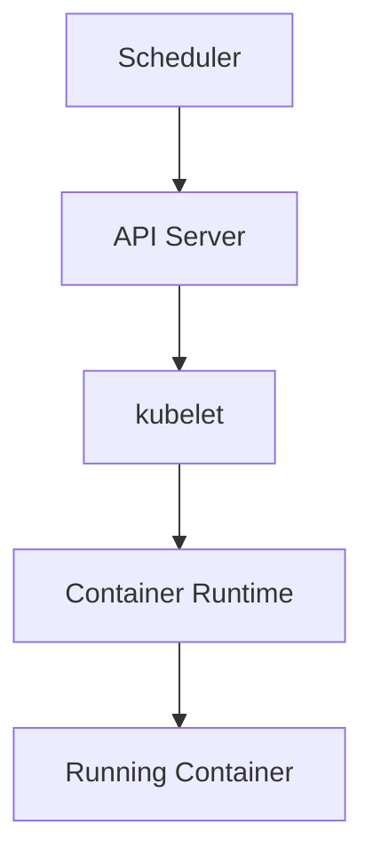
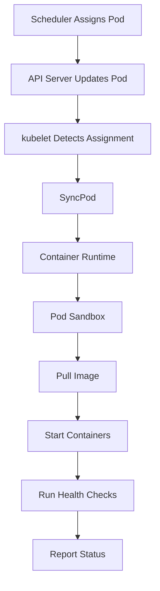

# kubelet - The Node Agent

> **Chapter 11 of the Kubernetes Handbook**
>
> **Difficulty:** ⭐⭐⭐ Intermediate
>
> **Reading Time:** 3–4 Hours
>
> **Prerequisites**
>
> - Kubernetes Architecture
> - Control Plane
> - Scheduler
> - Controller Manager
> - Worker Nodes
>
> **Next Chapter**
>
> kube-proxy

---

# Learning Objectives

After completing this chapter, you'll understand:

- What kubelet is
- Why Kubernetes needs kubelet
- Pod Lifecycle
- Pod Synchronization
- Container Runtime Interface (CRI)
- Health Checks
- Pod Status Reporting
- Failure Recovery
- Production Best Practices
- Troubleshooting

---

# What is kubelet?

**kubelet** is the primary Kubernetes agent running on every Worker Node.

Its responsibility is simple:

> **Ensure that the Pods assigned to this Worker Node are actually running.**

Notice the wording carefully.

The kubelet does **not** decide where Pods should run.

That decision has already been made by the Scheduler.

---

# Why Does Kubernetes Need kubelet?

Suppose the Scheduler selects:

```
Worker-3
```

for a Pod.

The Scheduler updates the Pod object.

But...

Who actually:

- Pulls the image?
- Creates the container?
- Mounts storage?
- Configures networking?
- Restarts failed containers?

Answer:

```
kubelet
```

---

# Responsibilities

The kubelet is responsible for:

- Watching assigned Pods
- Communicating with the Container Runtime
- Starting containers
- Restarting failed containers
- Running health probes
- Reporting Pod status
- Reporting Node status
- Managing volumes
- Managing Secrets and ConfigMaps on the node

The kubelet is **not** responsible for:

- Scheduling Pods
- Maintaining replica counts
- Managing Deployments
- Deciding cluster-wide placement

---

# Where Does kubelet Fit?



The kubelet acts as the bridge between Kubernetes and the Container Runtime.

---

# kubelet Watches the API Server

Every kubelet continuously watches the API Server.

It is interested only in Pods assigned to **its own Worker Node**.

Example:

```
Worker-1

↓

kubelet

↓

Watch:

Pods assigned to Worker-1
```

It ignores Pods assigned to other nodes.

---

# Example

Scheduler assigns:

```
frontend

↓

Worker-2
```

Immediately,

the kubelet running on Worker-2 notices:

```
New Assigned Pod
```

and begins creating it.

---

# Pod Synchronization

The kubelet constantly asks:

> **Does the actual state of my node match the desired state from the API Server?**

Example:

Desired:

```
Pod Exists
```

Actual:

```
Pod Missing
```

Action:

```
Create Pod
```

This reconciliation happens continuously.

---

# kubelet is Also a Controller

Although it is not part of the Controller Manager,

the kubelet follows the same reconciliation philosophy.

Conceptually:

```text
Desired Pod

↓

Observe

↓

Compare

↓

Different?

↓

Reconcile
```

The scope is simply limited to a single Worker Node.

---

# Pod Lifecycle Begins

Suppose:

```bash
kubectl apply -f deployment.yaml
```

The sequence is:

```text
Developer
      │
      ▼
API Server
      │
      ▼
Deployment Controller
      │
      ▼
ReplicaSet Controller
      │
      ▼
Scheduler
      │
      ▼
kubelet
      │
      ▼
Container Runtime
      │
      ▼
Running Container
```

The kubelet is the first component that actually interacts with the Worker Node.

---

# What Happens When kubelet Receives a Pod?

The kubelet performs several steps.

High level:

```text
Receive Pod
      │
      ▼
Check Image
      │
      ▼
Create Sandbox
      │
      ▼
Mount Volumes
      │
      ▼
Configure Networking
      │
      ▼
Start Containers
      │
      ▼
Report Status
```

Each step is discussed later in this chapter.

---

# kubelet Communicates with the Container Runtime

The kubelet does **not** create containers directly.

Instead,

it communicates with the Container Runtime.

Example:

```text
kubelet

↓

CRI

↓

containerd

↓

Container
```

CRI stands for:

```
Container Runtime Interface
```

It provides a standard way for kubelet to work with different runtimes.

---

# Why Use CRI?

Imagine if kubelet had built-in support for every runtime.

It would need separate implementations for:

- containerd
- CRI-O
- future runtimes

Instead,

kubelet communicates through a common interface.

Benefits:

- Simpler architecture
- Runtime independence
- Easier upgrades

---

# kubelet Reports Status

The kubelet continuously reports:

- Pod status
- Container status
- Node status
- Health information

to the API Server.

Example:

```text
Running

↓

Succeeded

↓

Failed

↓

CrashLoopBackOff
```

The API Server stores this information,

allowing users to view it with `kubectl`.

---

# Node Heartbeats

The kubelet periodically tells the Control Plane:

```
I'm alive.
```

These updates are called **heartbeats**.

If heartbeats stop,

the Node Controller eventually marks the Worker Node as:

```text
NotReady
```

This is one of the primary ways Kubernetes detects node failures.

---

# kubelet vs Scheduler

| kubelet | Scheduler |
|----------|-----------|
| Runs on Worker Nodes | Runs in the Control Plane |
| Executes Pods | Chooses nodes |
| Talks to Container Runtime | Talks to API Server |
| Monitors local Pods | Monitors unscheduled Pods |

These responsibilities complement each other but never overlap.

---

# Common Misconceptions

### "kubelet chooses where Pods run."

❌ False.

The Scheduler chooses the Worker Node.

---

### "kubelet creates Deployments."

❌ False.

Controllers create Kubernetes objects.

The kubelet executes them.

---

### "kubelet manages the entire cluster."

❌ False.

Each kubelet manages only its own Worker Node.

---

# Best Practices

- Monitor kubelet health.
- Keep kubelet versions compatible with the Control Plane.
- Use supported Container Runtimes.
- Monitor Node heartbeats.
- Secure kubelet communication.

---

# Architecture Insight

Think of the kubelet as the **local manager** of a Worker Node.

The Control Plane decides **what** should happen.

The kubelet ensures it actually happens on that specific machine.

---

# Summary (Part 1)

In this chapter you've learned:

- kubelet runs on every Worker Node.
- It watches Pods assigned to its node.
- It communicates with the Container Runtime using CRI.
- It starts and monitors containers.
- It reports Pod and Node status.
- It sends heartbeats to the Control Plane.
- It reconciles desired state with actual state on a single Worker Node.
---

# Complete Pod Startup Workflow

Let's follow a Pod from the moment it is assigned to a Worker Node until the application starts.

High-level flow:



Every Pod follows this workflow.

---

# Step 1 – Scheduler Assigns the Pod

Earlier we learned:

```
Pending Pod

↓

Scheduler

↓

Worker-2
```

The Scheduler updates:

```yaml
spec:
  nodeName: worker-2
```

The kubelet on Worker-2 is watching for exactly this type of change.

---

# Step 2 – kubelet Detects the Assignment

The kubelet receives an event from the API Server.

Conceptually:

```text
API Server

↓

New Pod Assigned

↓

Worker-2 kubelet
```

The kubelet places the Pod into its reconciliation process.

---

# Step 3 – SyncPod

The kubelet's core operation is called **SyncPod**.

Think of it as:

> "Make the real Pod match the desired Pod."

Pseudo-workflow:

```text
Pod Exists?

↓

No

↓

Create Pod

----------------

Already Exists?

↓

Update if Necessary
```

Almost every Pod change eventually results in a `SyncPod` operation.

---

# Step 4 – Validate the Pod

Before creating anything,

the kubelet validates the Pod specification.

Examples:

- Valid container definitions
- Referenced Secrets
- Referenced ConfigMaps
- Volume definitions
- Resource configuration

If required resources are missing,

the Pod cannot start successfully.

---

# Step 5 – Create the Pod Sandbox

The first object created is **not** the application container.

Instead,

the Container Runtime creates a **Pod Sandbox**.

The sandbox provides:

- Network namespace
- Linux namespaces
- Pod IP
- Shared environment for containers

Think of it as the "home" where all containers in the Pod will live.

---

# Why a Sandbox?

Suppose a Pod contains:

```
Container A

Container B
```

They need to share:

- IP address
- Network namespace
- Loopback interface
- IPC namespace (depending on configuration)

The sandbox provides this shared environment.

---

# Step 6 – Configure Networking

Once the sandbox exists,

networking is configured.

Conceptually:

```text
Create Network Namespace

↓

Assign Pod IP

↓

Configure Routes

↓

Connect to Cluster Network
```

This is usually performed through a CNI (Container Network Interface) plugin, which we'll study later.

---

# Step 7 – Mount Volumes

The kubelet prepares storage.

Possible volume types include:

- PersistentVolume
- emptyDir
- ConfigMap
- Secret
- projected volumes

Example:

```text
Volume

↓

Mount into Pod

↓

Available to Containers
```

Containers should not start before required volumes are ready.

---

# Step 8 – Pull Container Images

Now the kubelet asks the Container Runtime:

```
Do we already have this image?
```

If:

```
Yes
```

Reuse it.

If:

```
No
```

Download it from the container registry.

Example:

```text
docker.io/nginx:1.27
```

↓

Download

↓

Store Locally

---

# Image Pull Policy

Image download behavior depends on:

```yaml
imagePullPolicy:
```

Common values:

| Value | Behavior |
|--------|----------|
| Always | Always pull the image |
| IfNotPresent | Pull only if missing locally |
| Never | Never pull; image must already exist |

Understanding this setting helps troubleshoot image-related startup issues.

---

# Step 9 – Create Containers

Once everything is prepared,

the Container Runtime creates the application containers.

Conceptually:

```text
Sandbox Ready

↓

Volumes Ready

↓

Networking Ready

↓

Create Container

↓

Start Container
```

This is the first time the application actually begins executing.

---

# Multiple Containers

Suppose a Pod contains:

```
Main Container

Sidecar Container
```

Both containers are created within the same Pod sandbox.

They share:

- Network
- Pod IP
- Mounted volumes (when configured)

Each container still has its own process space and filesystem.

---

# Step 10 – Start Health Checks

After the containers start,

the kubelet begins executing configured probes.

Examples:

- Startup Probe
- Liveness Probe
- Readiness Probe

These probes determine whether the application is:

- Started
- Healthy
- Ready to receive traffic

We'll study probes in detail later.

---

# Step 11 – Report Pod Status

Finally,

the kubelet updates the API Server.

Example:

```text
ContainerCreating

↓

Running
```

Users can observe this transition:

```bash
kubectl get pods
```

The API Server stores the updated status in etcd.

---

# Pod Startup Timeline

```text
Scheduler

↓

API Server

↓

kubelet

↓

SyncPod

↓

Sandbox

↓

Networking

↓

Volumes

↓

Image Pull

↓

Container Creation

↓

Health Checks

↓

Running
```

This sequence is repeated for every Pod in the cluster.

---

# What If Something Fails?

Suppose the image cannot be downloaded.

Result:

```text
ImagePullBackOff
```

Suppose the application crashes immediately.

Result:

```text
CrashLoopBackOff
```

Suppose a required Secret is missing.

Result:

The Pod remains unable to start successfully.

The kubelet reports these failures back to the API Server.

---

# Synchronization Never Stops

Even after the Pod reaches:

```text
Running
```

the kubelet continues monitoring it.

Examples:

- Container exits unexpectedly.
- Health probe fails.
- Pod specification changes.

Each event triggers another reconciliation cycle.

---

# Common Misconceptions

### "The Scheduler starts containers."

❌ False.

The Scheduler only assigns the Pod to a Worker Node.

---

### "The image is always downloaded."

❌ False.

The Container Runtime checks the local image cache and follows the configured `imagePullPolicy`.

---

### "Containers are created before networking."

❌ Generally false.

The Pod sandbox and networking are prepared before application containers start.

---

# Production Insight

When troubleshooting a Pod that never reaches the `Running` state, determine **which startup step failed**.

Typical progression:

```text
Assigned?

↓

Sandbox Created?

↓

Network Ready?

↓

Volumes Mounted?

↓

Image Pulled?

↓

Container Started?

↓

Health Checks Passing?

↓

Running?
```

This step-by-step approach is far more effective than guessing.

---

# Summary (Part 2)

In this section you learned:

- The kubelet detects newly assigned Pods.
- `SyncPod` is the kubelet's core reconciliation operation.
- The Pod sandbox is created before containers.
- Networking and volumes are prepared first.
- Images are pulled according to the image pull policy.
- Containers are then created and started.
- Health probes begin after startup.
- The kubelet continuously reports Pod status to the API Server.
- Reconciliation continues throughout the Pod's lifetime.

---

# Complete Pod Startup Workflow

Let's follow a Pod from the moment it is assigned to a Worker Node until the application starts.

High-level flow:


Every Pod follows this workflow.

---

# Step 1 – Scheduler Assigns the Pod

Earlier we learned:

```
Pending Pod

↓

Scheduler

↓

Worker-2
```

The Scheduler updates:

```yaml
spec:
  nodeName: worker-2
```

The kubelet on Worker-2 is watching for exactly this type of change.

---

# Step 2 – kubelet Detects the Assignment

The kubelet receives an event from the API Server.

Conceptually:

```text
API Server

↓

New Pod Assigned

↓

Worker-2 kubelet
```

The kubelet places the Pod into its reconciliation process.

---

# Step 3 – SyncPod

The kubelet's core operation is called **SyncPod**.

Think of it as:

> "Make the real Pod match the desired Pod."

Pseudo-workflow:

```text
Pod Exists?

↓

No

↓

Create Pod

----------------

Already Exists?

↓

Update if Necessary
```

Almost every Pod change eventually results in a `SyncPod` operation.

---

# Step 4 – Validate the Pod

Before creating anything,

the kubelet validates the Pod specification.

Examples:

- Valid container definitions
- Referenced Secrets
- Referenced ConfigMaps
- Volume definitions
- Resource configuration

If required resources are missing,

the Pod cannot start successfully.

---

# Step 5 – Create the Pod Sandbox

The first object created is **not** the application container.

Instead,

the Container Runtime creates a **Pod Sandbox**.

The sandbox provides:

- Network namespace
- Linux namespaces
- Pod IP
- Shared environment for containers

Think of it as the "home" where all containers in the Pod will live.

---

# Why a Sandbox?

Suppose a Pod contains:

```
Container A

Container B
```

They need to share:

- IP address
- Network namespace
- Loopback interface
- IPC namespace (depending on configuration)

The sandbox provides this shared environment.

---

# Step 6 – Configure Networking

Once the sandbox exists,

networking is configured.

Conceptually:

```text
Create Network Namespace

↓

Assign Pod IP

↓

Configure Routes

↓

Connect to Cluster Network
```

This is usually performed through a CNI (Container Network Interface) plugin, which we'll study later.

---

# Step 7 – Mount Volumes

The kubelet prepares storage.

Possible volume types include:

- PersistentVolume
- emptyDir
- ConfigMap
- Secret
- projected volumes

Example:

```text
Volume

↓

Mount into Pod

↓

Available to Containers
```

Containers should not start before required volumes are ready.

---

# Step 8 – Pull Container Images

Now the kubelet asks the Container Runtime:

```
Do we already have this image?
```

If:

```
Yes
```

Reuse it.

If:

```
No
```

Download it from the container registry.

Example:

```text
docker.io/nginx:1.27
```

↓

Download

↓

Store Locally

---

# Image Pull Policy

Image download behavior depends on:

```yaml
imagePullPolicy:
```

Common values:

| Value | Behavior |
|--------|----------|
| Always | Always pull the image |
| IfNotPresent | Pull only if missing locally |
| Never | Never pull; image must already exist |

Understanding this setting helps troubleshoot image-related startup issues.

---

# Step 9 – Create Containers

Once everything is prepared,

the Container Runtime creates the application containers.

Conceptually:

```text
Sandbox Ready

↓

Volumes Ready

↓

Networking Ready

↓

Create Container

↓

Start Container
```

This is the first time the application actually begins executing.

---

# Multiple Containers

Suppose a Pod contains:

```
Main Container

Sidecar Container
```

Both containers are created within the same Pod sandbox.

They share:

- Network
- Pod IP
- Mounted volumes (when configured)

Each container still has its own process space and filesystem.

---

# Step 10 – Start Health Checks

After the containers start,

the kubelet begins executing configured probes.

Examples:

- Startup Probe
- Liveness Probe
- Readiness Probe

These probes determine whether the application is:

- Started
- Healthy
- Ready to receive traffic

We'll study probes in detail later.

---

# Step 11 – Report Pod Status

Finally,

the kubelet updates the API Server.

Example:

```text
ContainerCreating

↓

Running
```

Users can observe this transition:

```bash
kubectl get pods
```

The API Server stores the updated status in etcd.

---

# Pod Startup Timeline

```text
Scheduler

↓

API Server

↓

kubelet

↓

SyncPod

↓

Sandbox

↓

Networking

↓

Volumes

↓

Image Pull

↓

Container Creation

↓

Health Checks

↓

Running
```

This sequence is repeated for every Pod in the cluster.

---

# What If Something Fails?

Suppose the image cannot be downloaded.

Result:

```text
ImagePullBackOff
```

Suppose the application crashes immediately.

Result:

```text
CrashLoopBackOff
```

Suppose a required Secret is missing.

Result:

The Pod remains unable to start successfully.

The kubelet reports these failures back to the API Server.

---

# Synchronization Never Stops

Even after the Pod reaches:

```text
Running
```

the kubelet continues monitoring it.

Examples:

- Container exits unexpectedly.
- Health probe fails.
- Pod specification changes.

Each event triggers another reconciliation cycle.

---

# Common Misconceptions

### "The Scheduler starts containers."

❌ False.

The Scheduler only assigns the Pod to a Worker Node.

---

### "The image is always downloaded."

❌ False.

The Container Runtime checks the local image cache and follows the configured `imagePullPolicy`.

---

### "Containers are created before networking."

❌ Generally false.

The Pod sandbox and networking are prepared before application containers start.

---

# Production Insight

When troubleshooting a Pod that never reaches the `Running` state, determine **which startup step failed**.

Typical progression:

```text
Assigned?

↓

Sandbox Created?

↓

Network Ready?

↓

Volumes Mounted?

↓

Image Pulled?

↓

Container Started?

↓

Health Checks Passing?

↓

Running?
```

This step-by-step approach is far more effective than guessing.

---

# Summary (Part 2)

In this section you learned:

- The kubelet detects newly assigned Pods.
- `SyncPod` is the kubelet's core reconciliation operation.
- The Pod sandbox is created before containers.
- Networking and volumes are prepared first.
- Images are pulled according to the image pull policy.
- Containers are then created and started.
- Health probes begin after startup.
- The kubelet continuously reports Pod status to the API Server.
- Reconciliation continues throughout the Pod's lifetime.

In the next part, we'll explore health probes, restart policies, container failures, Node heartbeats, Pod lifecycle states, and how the kubelet recovers from common failures in production.
---

# kubelet Never Stops Monitoring

Even after a Pod reaches:

```text
Running
```

the kubelet's work is **not finished**.

It continuously monitors:

- Containers
- Health probes
- Restart policy
- Node health
- Pod status

This continuous monitoring is another example of Kubernetes' reconciliation model.

---

# Pod Lifecycle

A Pod moves through several phases.

```text
Pending

↓

Running

↓

Succeeded

↓

Failed
```

In some situations, a Pod may also remain in:

```text
Unknown
```

These phases describe the Pod's overall state, not the state of individual containers.

---

# Container States

Containers have their own lifecycle.

```text
Waiting

↓

Running

↓

Terminated
```

A Pod can contain multiple containers, each with its own state.

---

# Waiting State

A container is **Waiting** when it has not yet started.

Common reasons include:

- Pulling the image
- Waiting for a volume
- Waiting for dependencies
- Creating the Pod sandbox

Examples:

```text
ContainerCreating
```

```text
ImagePullBackOff
```

```text
ErrImagePull
```

---

# Running State

The container process has started successfully.

This does **not** necessarily mean the application is ready to receive traffic.

That decision depends on the readiness probe.

---

# Terminated State

A container reaches the **Terminated** state when it exits.

Possible reasons include:

- Application completed successfully
- Application crashed
- Manual termination
- Out-of-memory (OOM) kill

The kubelet determines what to do next based on the Pod's restart policy.

---

# Restart Policy

Every Pod has a restart policy.

Common values:

| Restart Policy | Behavior |
|---------------|----------|
| Always | Restart whenever the container exits |
| OnFailure | Restart only after non-zero exit codes |
| Never | Never restart automatically |

The default for most workload controllers (such as Deployments) is `Always`.

---

# Restart Workflow

Suppose:

```
Application

↓

Crash
```

Restart Policy:

```
Always
```

The kubelet starts a replacement container.

```text
Crash

↓

Restart

↓

Running
```

---

# Liveness Probe

A **Liveness Probe** answers:

> **Is the application still healthy?**

Suppose the application enters a deadlock.

The process still exists,

but it no longer responds.

The liveness probe fails.

The kubelet restarts the container.

---

# Example

```yaml
livenessProbe:
  httpGet:
    path: /health
    port: 8080
```

If repeated probe failures occur,

the kubelet restarts the container.

---

# Readiness Probe

A **Readiness Probe** answers:

> **Is the application ready to receive traffic?**

This differs from liveness.

Suppose:

- The application is still starting.
- Database connections are not ready.

The application is alive,

but not yet ready.

The readiness probe fails.

The Pod is temporarily removed from Service endpoints.

No restart occurs.

---

# Startup Probe

Some applications require a long startup time.

Without a startup probe,

the liveness probe may restart them before initialization completes.

The **Startup Probe** tells the kubelet:

> "Wait until startup finishes before evaluating liveness."

This is especially useful for:

- Large Java applications
- Machine Learning models
- Database initialization
- Applications with long warm-up times

---

# Probe Comparison

| Probe | Purpose | Failure Result |
|--------|---------|----------------|
| Startup | Has the application finished starting? | Startup considered failed; container may be restarted |
| Liveness | Is the application healthy? | Restart container |
| Readiness | Can it receive traffic? | Remove Pod from Service endpoints |

Understanding this table is extremely important.

---

# Health Check Timeline

```text
Container Starts

↓

Startup Probe

↓

Successful?

↓

Yes

↓

Liveness + Readiness Begin
```

The startup probe, when configured, runs first.

---

# CrashLoopBackOff

One of the most common Kubernetes errors is:

```text
CrashLoopBackOff
```

Meaning:

```
Start

↓

Crash

↓

Restart

↓

Crash

↓

Restart

↓

Crash
```

The kubelet gradually increases the delay before each restart.

This prevents endless rapid restart loops.

---

# Why Exponential Backoff?

Imagine an application that crashes immediately.

Without backoff:

```text
Restart

↓

Crash

↓

Restart

↓

Crash

↓

Restart
```

This wastes CPU and floods logs.

Instead,

the kubelet waits longer between restart attempts.

Example:

```text
1 Second

↓

2 Seconds

↓

4 Seconds

↓

8 Seconds

↓

16 Seconds
```

---

# ImagePullBackOff

Suppose the image cannot be downloaded.

Example causes:

- Incorrect image name
- Missing registry credentials
- Registry unavailable
- Network failure

The kubelet retries image pulls using backoff.

The Pod enters:

```text
ImagePullBackOff
```

---

# ErrImagePull

This often appears before `ImagePullBackOff`.

Example:

```text
ErrImagePull

↓

Retry

↓

ImagePullBackOff
```

The first indicates the initial failure.

The second indicates repeated retries with increasing delays.

---

# Node Heartbeats

The kubelet periodically reports:

```text
Node Healthy
```

to the API Server.

These heartbeats allow the Control Plane to determine whether the Worker Node is still available.

---

# Node Failure

Suppose:

```
Worker-2

↓

Power Failure
```

The kubelet stops sending heartbeats.

The Node Controller eventually marks the node:

```text
NotReady
```

Higher-level controllers can then recreate affected workloads on healthy nodes.

---

# Node Conditions

Some common node conditions include:

| Condition | Meaning |
|-----------|---------|
| Ready | Node is healthy |
| NotReady | Node is unavailable or unhealthy |
| MemoryPressure | Memory resources are low |
| DiskPressure | Disk resources are low |
| PIDPressure | Process ID resources are exhausted |
| NetworkUnavailable | Networking is not functioning correctly |

These conditions influence scheduling and workload placement.

---

# Graceful Termination

Suppose a Pod is deleted.

The kubelet does **not** immediately kill the container.

Instead:

```text
SIGTERM

↓

Grace Period

↓

SIGKILL (if necessary)
```

This gives applications time to:

- Finish requests
- Flush buffers
- Close database connections
- Save state

---

# Container Restart vs Pod Recreation

This distinction is frequently misunderstood.

Container crash:

```
kubelet

↓

Restart Container
```

Pod deleted:

```
Controller

↓

Create New Pod

↓

Scheduler

↓

kubelet
```

The kubelet restarts containers.

Controllers recreate Pods.

---

# Common Misconceptions

### "A failed readiness probe restarts the container."

❌ False.

Readiness affects traffic routing, not container execution.

---

### "A running container is automatically healthy."

❌ False.

Health probes determine application health, not just process existence.

---

### "CrashLoopBackOff is the cause of the problem."

❌ False.

It is a symptom indicating repeated container crashes.

The underlying application or configuration issue must be investigated.

---

# Production Insight

When debugging a Pod that repeatedly restarts:

1. Check container logs.
2. Inspect Events.
3. Verify image pull status.
4. Review health probes.
5. Confirm Secrets and ConfigMaps exist.
6. Check resource limits (especially memory).
7. Inspect the application's exit code.

Following this sequence usually identifies the root cause quickly.

---

# Summary (Part 3)

In this section you learned:

- The kubelet continuously monitors running Pods.
- Pods and containers have different lifecycle states.
- Restart policies determine how exited containers are handled.
- Startup, Liveness, and Readiness probes serve different purposes.
- CrashLoopBackOff results from repeated container failures.
- ImagePullBackOff indicates repeated image pull failures.
- The kubelet sends Node heartbeats.
- Node conditions help Kubernetes identify unhealthy Worker Nodes.
- Graceful termination allows applications to shut down safely.
- The kubelet restarts containers, while controllers recreate Pods.

In the final part, we'll cover production troubleshooting, kubelet configuration, operational best practices, interview questions, and a complete kubelet revision cheat sheet.


---

# kubelet in Production

Every Worker Node runs exactly one kubelet.

If the kubelet stops functioning,

that Worker Node effectively stops participating in Kubernetes,

even though Linux itself may continue running.

The kubelet is therefore one of the most critical processes on every node.

---

# What Happens if kubelet Stops?

Suppose:

```text
Worker-2

↓

kubelet Crash
```

What happens?

| Operation | Status |
|-----------|--------|
| Existing containers keep running | ✅ Usually Yes |
| New Pods start | ❌ No |
| Health probes run | ❌ No |
| Status updates sent | ❌ No |
| Heartbeats sent | ❌ No |

Notice something interesting.

The kubelet is **not** the application.

If it crashes,

Linux does not immediately kill running containers.

However,

Kubernetes gradually loses visibility into that node.

---

# kubelet Failure Timeline

Example:

```text
kubelet Stops

↓

Heartbeats Stop

↓

API Server Stops Receiving Updates

↓

Node Controller Detects Missing Heartbeats

↓

Node = NotReady

↓

Controllers Create Replacement Pods
```

This sequence is fundamental to Kubernetes self-healing.

---

# Common Production Issues

Some of the most common kubelet-related problems include:

- CrashLoopBackOff
- ImagePullBackOff
- ErrImagePull
- CreateContainerConfigError
- CreateContainerError
- FailedMount
- FailedScheduling (often discovered while troubleshooting a Pod)

Understanding these conditions dramatically speeds up debugging.

---

# Troubleshooting Workflow

Never guess.

Always investigate systematically.

---

## Step 1 – Check Pod Status

```bash
kubectl get pods
```

Example:

```text
frontend

0/1

CrashLoopBackOff
```

---

## Step 2 – Describe the Pod

```bash
kubectl describe pod frontend
```

The Events section often explains the failure.

Examples:

```text
FailedMount
```

```text
Back-off restarting failed container
```

```text
Failed to pull image
```

---

## Step 3 – Check Container Logs

```bash
kubectl logs frontend
```

If the container restarts repeatedly:

```bash
kubectl logs frontend --previous
```

The previous logs are often more useful because they capture the crash before the restart.

---

## Step 4 – Check Node Status

```bash
kubectl get nodes
```

Example:

```text
Worker-2

NotReady
```

If the node is unhealthy,

many Pods on that node may be affected.

---

## Step 5 – Describe the Node

```bash
kubectl describe node worker-2
```

Inspect:

- Conditions
- Allocatable resources
- Taints
- Events

This often reveals:

- Memory pressure
- Disk pressure
- Node unreachable
- Network problems

---

## Step 6 – Review kubelet Logs

Depending on your environment:

```bash
journalctl -u kubelet
```

or,

if using another logging system,

consult the node's kubelet service logs.

Common messages include:

- Failed image pull
- Probe failures
- Runtime communication errors
- Volume mount failures

---

# Common Pod States

| Status | Typical Meaning |
|---------|-----------------|
| Pending | Waiting for scheduling or resources |
| ContainerCreating | kubelet is preparing the Pod |
| Running | Containers are executing |
| Completed | Workload finished successfully |
| Error | Container terminated with an error |
| CrashLoopBackOff | Repeated container crashes |
| ImagePullBackOff | Image download repeatedly failing |

Knowing where the Pod stopped helps narrow the investigation.

---

# Common Failure Messages

| Message | Typical Cause |
|----------|---------------|
| ErrImagePull | Image not found or registry issue |
| ImagePullBackOff | Repeated pull failures |
| FailedMount | Volume or Secret problem |
| CrashLoopBackOff | Application repeatedly crashes |
| OOMKilled | Container exceeded memory limit |
| CreateContainerConfigError | Invalid configuration, missing Secret/ConfigMap |
| CreateContainerError | Runtime failed to create the container |

---

# Node Conditions

View node details:

```bash
kubectl describe node worker-1
```

Common conditions:

| Condition | Meaning |
|-----------|---------|
| Ready | Node healthy |
| NotReady | Node unavailable |
| MemoryPressure | Low available memory |
| DiskPressure | Low available disk space |
| PIDPressure | Process ID limit reached |
| NetworkUnavailable | Node networking problem |

The Scheduler uses some of these conditions when deciding whether a node is eligible.

---

# kubelet and Resource Management

The kubelet enforces:

- CPU limits
- Memory limits
- Restart policies
- Graceful shutdown

It also coordinates with the Container Runtime to create and terminate containers.

Resource **requests** influence scheduling,

while resource **limits** are primarily enforced during execution.

---

# Best Practices

- Keep kubelet versions aligned with the Kubernetes version skew policy.
- Monitor Node conditions continuously.
- Configure health probes carefully.
- Always define resource requests and limits.
- Review kubelet logs during node-level incidents.
- Use supported Container Runtime implementations.
- Keep Worker Node clocks synchronized.

---

# Useful Commands

View Pods:

```bash
kubectl get pods
```

---

Describe Pod:

```bash
kubectl describe pod <pod-name>
```

---

View Logs:

```bash
kubectl logs <pod-name>
```

---

View Previous Logs:

```bash
kubectl logs <pod-name> --previous
```

---

View Nodes:

```bash
kubectl get nodes
```

---

Describe Node:

```bash
kubectl describe node <node-name>
```

---

Check kubelet Service (Linux):

```bash
systemctl status kubelet
```

---

View kubelet Logs:

```bash
journalctl -u kubelet
```

---

# kubelet Communication Matrix

| Component | Interaction |
|-----------|-------------|
| API Server | Watches assigned Pods and reports status |
| Scheduler | Receives Pods after scheduling (indirectly through the API Server) |
| Controller Manager | Indirect coordination through desired state |
| Container Runtime | Creates and manages containers via CRI |
| CNI Plugin | Configures Pod networking |
| CSI Plugin | Manages storage volumes |

The kubelet is the central coordinator on the Worker Node.

---

# kubelet Cheat Sheet

```text
API Server
      │
      ▼
Watch Assigned Pods
      │
      ▼
SyncPod
      │
      ▼
Create Pod Sandbox
      │
      ▼
Configure Networking
      │
      ▼
Mount Volumes
      │
      ▼
Pull Images
      │
      ▼
Start Containers
      │
      ▼
Run Health Probes
      │
      ▼
Report Status
```

---

# Interview Questions

## Beginner

1. What is kubelet?
2. Where does kubelet run?
3. What is the responsibility of kubelet?
4. What is CRI?
5. What is a Pod sandbox?

---

## Intermediate

1. Explain the complete Pod startup process.
2. What is SyncPod?
3. Explain Startup, Liveness, and Readiness probes.
4. What happens when a container crashes?
5. What information does kubelet report to the API Server?

---

## Advanced

1. What happens when kubelet stops running?
2. Explain Node heartbeats.
3. How would you troubleshoot CrashLoopBackOff?
4. How would you investigate ImagePullBackOff?
5. Why does kubelet use the Container Runtime Interface (CRI)?

---

# Real-World Scenarios

### Scenario 1

A Pod remains in:

```text
ContainerCreating
```

Possible causes?

> **Answer:** Volume mount failures, networking setup issues, image pull delays, or Container Runtime problems.

---

### Scenario 2

A Pod repeatedly restarts.

Where should you investigate first?

> **Answer:** Application logs (`kubectl logs`), probe configuration, exit codes, Events, and resource limits (especially memory).

---

### Scenario 3

The Worker Node becomes `NotReady`.

Possible causes?

> **Answer:** kubelet failure, network connectivity issues, system resource exhaustion, or underlying machine failure.

---

### Scenario 4

The application is running but receives no traffic.

Likely area?

> **Answer:** Readiness Probe failures or Service endpoint configuration. The application process may be healthy but not yet considered ready.

---

# Common Misconceptions

### "kubelet schedules Pods."

❌ False.

Scheduling is performed by the Scheduler.

---

### "CrashLoopBackOff is a Kubernetes bug."

❌ False.

It indicates that the application repeatedly exits after starting.

---

### "Running means traffic is reaching the application."

❌ False.

Traffic routing depends on readiness, not just container execution.

---

# Key Takeaways

- kubelet is the primary agent on every Worker Node.
- It continuously reconciles the desired state for local Pods.
- It communicates with the Container Runtime through CRI.
- It creates Pod sandboxes, configures networking, mounts volumes, and starts containers.
- It executes health probes and restart policies.
- It reports Pod and Node status back to the API Server.
- Structured troubleshooting is far more effective than trial and error.

---

# Summary

The kubelet is responsible for turning Kubernetes' desired state into a running application on a Worker Node.

It bridges the gap between the Control Plane and the underlying operating system, coordinating the Container Runtime, networking, storage, health monitoring, and status reporting.

Understanding the kubelet is essential for diagnosing real-world Kubernetes issues and operating production clusters with confidence.

---

# Related Chapters

Next:

- **12_kube_proxy.md**

Deep dives:

- **13_Container_Runtime.md**
- **03_Networking/**
- **04_Storage/**

Future topics:

- **05_Troubleshooting/**
- **08_Observability/**
- **10_AI_SRE/**
