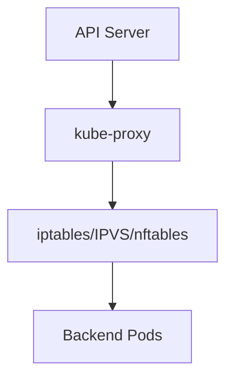

# kube-proxy - Kubernetes Service Networking

> **Chapter 12 of the Kubernetes Handbook**
>
> **Difficulty:** ⭐⭐⭐⭐ Intermediate
>
> **Reading Time:** 5–6 Hours
>
> **Prerequisites**
>
> - Kubernetes Architecture
> - API Server
> - Worker Nodes
> - kubelet
> - Basic Linux Networking
>
> **Next Chapter**
>
> Container Runtime

---

# Learning Objectives

After completing this chapter you'll understand:

- Why kube-proxy exists
- The networking problem it solves
- Services
- Endpoints
- EndpointSlices
- Virtual IPs (ClusterIP)
- iptables
- IPVS
- nftables
- Service load balancing
- Connection tracking
- Traffic flow
- Failure scenarios
- Production best practices
- Troubleshooting

---

# Before Learning kube-proxy

Many beginners misunderstand kube-proxy.

They think:

> kube-proxy forwards every packet.

This is **not true.**

kube-proxy is **not** a traditional proxy.

It does **not** sit in the middle of every network request.

Instead,

it **programs the Linux networking stack** so that packets automatically reach the correct Pod.

This distinction is extremely important.

---

# What is kube-proxy?

kube-proxy is a network agent running on **every Worker Node**.

Its responsibility is:

> Ensure Kubernetes Services correctly route traffic to Pods.

Unlike kubelet,

kube-proxy does **not** create containers.

Unlike Scheduler,

it does **not** assign Pods.

Its only responsibility is networking.

---

# Why Kubernetes Needs kube-proxy

Imagine three Pods.

```
Frontend

↓

Backend Pod A

Backend Pod B

Backend Pod C
```

Pods are temporary.

Suppose:

```
Backend Pod A

↓

Deleted
```

A replacement Pod appears with a completely different IP.

Without Kubernetes networking,

every client would need to know:

- every Pod IP
- every Pod replacement
- every Pod restart

That clearly doesn't scale.

---

# The Networking Problem

Pods are **ephemeral**.

Example:

Today

```
Backend

10.244.1.10
```

Tomorrow

```
Backend

10.244.4.82
```

The IP changes.

Applications cannot depend on Pod IPs.

Instead,

they communicate through **Services**.

---

# Services Provide Stable Networking

Instead of:

```
Frontend

↓

10.244.1.10
```

Applications use:

```
Frontend

↓

backend-service
```

or

```
10.96.14.22
```

The Service remains stable,

even if Pods change.

---

# High-Level Architecture


Notice:

Traffic does **not** pass through a kube-proxy process.

Instead,

Linux routing rules determine where packets go.

---

# Where Does kube-proxy Run?

Every Worker Node runs exactly one kube-proxy.

Example:

```
Cluster

Worker-1

├── kubelet
├── kube-proxy

-------------------

Worker-2

├── kubelet
├── kube-proxy

-------------------

Worker-3

├── kubelet
├── kube-proxy
```

Each kube-proxy configures networking only for its own node.

---

# Responsibilities

kube-proxy is responsible for:

- Watching Services
- Watching EndpointSlices
- Programming Linux networking rules
- Service load balancing
- Maintaining network rules
- Supporting different proxy modes

It is **not** responsible for:

- Pod networking (CNI does that)
- DNS
- Scheduling
- Running applications

---

# kube-proxy Watches the API Server

Just like kubelet,

kube-proxy continuously watches the API Server.

It watches:

- Services
- EndpointSlices

Whenever something changes,

it updates networking rules.

---

# Example

Suppose:

```
Service Created
```

Immediately:

```
API Server

↓

kube-proxy

↓

Update iptables
```

No administrator intervention is needed.

---

# Services

Everything in kube-proxy revolves around **Services**.

A Service provides:

- Stable IP
- Stable DNS name
- Load balancing
- Service discovery

Example:

```yaml
kind: Service

metadata:
  name: backend
```

Applications communicate with the Service,

not directly with Pods.

---

# ClusterIP

Every Service receives a virtual IP.

Example:

```
Service

↓

10.96.0.15
```

This IP is called the:

```
ClusterIP
```

Clients never need to know Pod IPs.

---

# Virtual IP

One question surprises many beginners.

Where does this IP exist?

Example:

```
10.96.0.15
```

There is **no physical network interface**

holding this IP.

Instead,

Linux networking rules recognize it

and redirect traffic.

This is why it's called a **Virtual IP (VIP).**

---

# Service Example

Suppose:

```
Backend Service

↓

ClusterIP

10.96.0.10
```

Backend Pods:

```
10.244.1.5

10.244.2.8

10.244.5.9
```

Client:

```
curl 10.96.0.10
```

Traffic reaches one of the Pods,

even though the Service IP doesn't belong to any Pod.

---

# EndpointSlices

Earlier Kubernetes used:

```
Endpoints
```

Modern Kubernetes prefers:

```
EndpointSlices
```

An EndpointSlice contains:

- Pod IPs
- Ports
- Readiness
- Metadata

Example:

```
Service

↓

EndpointSlice

↓

Pod A

Pod B

Pod C
```

---

# Why EndpointSlices?

Imagine:

```
15,000 Pods
```

One enormous Endpoints object becomes inefficient.

Instead,

Kubernetes splits them into multiple EndpointSlices.

Benefits:

- Better scalability
- Smaller updates
- Lower memory usage
- Faster watches

---

# Traffic Flow

Let's follow a request.

```
Application

↓

ClusterIP

↓

iptables/IPVS Rule

↓

Pod

↓

Response
```

Notice:

Traffic never travels through an application-level proxy.

Linux networking handles it.

---

# kube-proxy Modes

kube-proxy supports multiple implementations.

Modern Kubernetes commonly uses:

| Mode | Status |
|--------|---------|
| iptables | Most common |
| IPVS | High performance |
| nftables | Newer Linux networking backend |
| userspace | Legacy, rarely used |

We'll study each mode in detail.

---

# Userspace Mode (Historical)

Early Kubernetes versions forwarded traffic like this:

```
Client

↓

kube-proxy Process

↓

Pod
```

Every packet passed through kube-proxy.

Problems:

- Slow
- Extra context switches
- High CPU usage

Modern clusters rarely use this mode.

---

# iptables Mode

Today,

most clusters use:

```
iptables
```

Instead of forwarding packets,

kube-proxy creates Linux firewall/NAT rules.

Example:

```
Service IP

↓

iptables Rule

↓

Backend Pod
```

The Linux kernel performs forwarding.

No userspace forwarding is required.

---

# Why iptables is Faster

Userspace:

```
Packet

↓

kube-proxy

↓

Kernel

↓

Pod
```

iptables:

```
Packet

↓

Kernel Rule

↓

Pod
```

The kernel handles everything directly.

Much faster.

---

# IPVS Mode

Large clusters often use:

```
IPVS
```

IPVS is a Linux kernel load balancer.

Benefits:

- Better scalability
- Efficient connection handling
- Multiple balancing algorithms
- Better performance with thousands of Services

---

# iptables vs IPVS

| Feature | iptables | IPVS |
|----------|-----------|------|
| Simplicity | High | Moderate |
| Performance | Good | Excellent |
| Large Clusters | Good | Better |
| Load Balancing Algorithms | Basic | Multiple |
| Kernel Support | Native | Native |

---

# nftables Mode

Modern Linux distributions increasingly use:

```
nftables
```

instead of iptables.

Newer Kubernetes versions can use nftables as the packet filtering backend.

Advantages include:

- Simpler rule management
- Better scalability
- Unified packet filtering framework

As of today, many production clusters still use iptables or IPVS, while nftables adoption continues to grow.

---

# kube-proxy Never Forwards Packets

This is worth repeating.

Many engineers believe:

```
Application

↓

kube-proxy

↓

Pod
```

Wrong.

Correct:

```
Application

↓

Linux Networking

↓

Pod
```

kube-proxy only installs the rules.

Linux executes them.

---

# kube-proxy Communication



Notice:

Packets never pass through the API Server.

The API Server only informs kube-proxy about Service changes.

---

# kubelet vs kube-proxy

| kubelet | kube-proxy |
|----------|------------|
| Runs Pods | Routes traffic |
| Talks to CRI | Programs networking |
| Watches Pods | Watches Services |
| Reports Pod status | Updates networking rules |

---

# Common Misconceptions

### "kube-proxy is a reverse proxy."

❌ False.

It programs networking rules.

---

### "Traffic passes through kube-proxy."

❌ False.

Traffic passes through Linux networking.

---

### "Services directly know Pod IPs."

❌ Not exactly.

Services reference EndpointSlices, and kube-proxy programs the networking rules based on that information.

---

# Best Practices

- Prefer EndpointSlices over legacy Endpoints.
- Monitor kube-proxy health.
- Keep networking plugins compatible with Kubernetes.
- Use IPVS for very large clusters when appropriate.
- Avoid manually modifying kube-proxy-managed networking rules.

---

# Architecture Insight

The key insight is that **kube-proxy is a control-plane agent for node networking**, not a data-plane proxy.

It translates Kubernetes Service objects into Linux networking rules.

After those rules are installed,

the Linux kernel forwards traffic at high speed without involving kube-proxy for every packet.

---

# Summary (Part 1)

In this chapter you've learned:

- Why kube-proxy exists.
- The networking problem Services solve.
- How ClusterIPs provide stable virtual addresses.
- Why Pods should never be addressed directly.
- The role of EndpointSlices.
- The major kube-proxy modes.
- Why modern kube-proxy doesn't forward packets itself.
- How kube-proxy collaborates with the Linux networking stack.

In Part 2, we'll dive into:

- Complete packet flow
- NodePort
- LoadBalancer Services
- ExternalTrafficPolicy
- Session Affinity
- Connection tracking
- Failure scenarios
- Production troubleshooting
- Performance tuning
- Interview questions
- Cheat sheet

---

# Complete Packet Flow

Let's follow a request from one Pod to another.

Suppose:

```
Frontend Pod

↓

backend-service

↓

Backend Pods
```

The packet flow looks like this:


Notice again:

**kube-proxy does not forward the packet.**

It already programmed the networking rules.

The Linux kernel applies those rules.

---

# Example

Backend Service:

```text
ClusterIP

10.96.0.20
```

Backend Pods:

```
10.244.1.5

10.244.2.9

10.244.3.12
```

Application:

```bash
curl http://10.96.0.20
```

The kernel consults the networking rules.

One backend Pod is selected.

---

# Load Balancing

Suppose the Service has three Pods.

```
Pod A

Pod B

Pod C
```

Requests arrive.

Typical distribution:

```
Request 1

↓

Pod A

---------------

Request 2

↓

Pod B

---------------

Request 3

↓

Pod C
```

This provides basic load balancing.

---

# Is it Round Robin?

Many people assume Kubernetes always uses round robin.

Not necessarily.

The exact behavior depends on:

- kube-proxy mode
- Linux networking backend
- Connection tracking
- Session affinity

Round robin is common but not guaranteed.

---

# Connection Tracking (conntrack)

Linux maintains a connection tracking table.

Example:

```
Client A

↓

Pod 1
```

Subsequent packets belonging to the same connection continue reaching Pod 1.

This prevents packets from the same TCP connection being sent to different Pods.

---

# Why Connection Tracking Matters

Imagine a TCP connection.

Without connection tracking:

```
Packet 1

↓

Pod A

Packet 2

↓

Pod B
```

The connection would fail.

Instead,

Linux remembers the mapping.

---

# Service Types

So far we've discussed **ClusterIP**.

Kubernetes supports several Service types.

| Type | Purpose |
|------|---------|
| ClusterIP | Internal communication |
| NodePort | External access through a node |
| LoadBalancer | Cloud load balancer |
| ExternalName | DNS alias |

---

# ClusterIP

Default Service type.

Only accessible inside the cluster.

Example:

```
Frontend

↓

Backend Service

↓

ClusterIP
```

Most internal microservice communication uses ClusterIP.

---

# NodePort

NodePort exposes a Service on every Worker Node.

Example:

```
Worker-1

10.0.0.5:30080

-------------------

Worker-2

10.0.0.6:30080

-------------------

Worker-3

10.0.0.7:30080
```

Clients connect to:

```
<NodeIP>:NodePort
```

The request is forwarded to a backend Pod.

---

# NodePort Packet Flow


Again,

traffic flows according to kernel networking rules.

---

# LoadBalancer Service

Cloud providers support another Service type:

```yaml
type: LoadBalancer
```

The Service Controller requests a cloud load balancer.

Example:

```
Internet

↓

Cloud Load Balancer

↓

Worker Nodes

↓

Pods
```

The implementation depends on the cloud provider.

---

# ExternalName

Unlike other Services,

ExternalName does not route traffic.

Instead,

it returns a DNS alias.

Example:

```yaml
type: ExternalName
```

Clients resolve:

```
database.company.com
```

rather than receiving a ClusterIP.

---

# Session Affinity

Sometimes requests from the same client should continue reaching the same backend.

Example:

```
Client A

↓

Pod 2

↓

Pod 2

↓

Pod 2
```

This is called **Session Affinity**.

It can be useful for applications that maintain local session state.

---

# ExternalTrafficPolicy

For Services exposed externally,

Kubernetes supports:

```
Cluster
```

and

```
Local
```

---

## Cluster

Traffic may be forwarded to Pods on any node.

Benefits:

- Better distribution
- Higher availability

---

## Local

Traffic stays on the receiving node whenever possible.

Benefits:

- Preserves the original client IP
- Avoids an extra network hop

Trade-off:

If a node has no matching Pod,

it cannot serve traffic for that Service.

---

# EndpointSlice Updates

Suppose:

```
Pod Deleted
```

The sequence is:

```text
Pod Removed

↓

EndpointSlice Updated

↓

API Server

↓

kube-proxy

↓

Networking Rules Updated
```

The Service begins routing only to healthy backend Pods.

---

# Failure Scenario 1 – Backend Pod Dies

Suppose:

```
Pod A

↓

Crash
```

The EndpointSlice is updated.

kube-proxy refreshes the networking rules.

Future connections are directed to the remaining healthy Pods.

---

# Failure Scenario 2 – Worker Node Failure

Suppose:

```
Worker-2

↓

NotReady
```

Pods on that node become unavailable.

EndpointSlices are updated,

and kube-proxy removes those Pods from the routing rules.

Traffic is redirected to healthy nodes.

---

# Failure Scenario 3 – kube-proxy Stops

Suppose kube-proxy crashes.

What happens?

Existing networking rules remain in the Linux kernel.

Existing Services often continue working for some time.

However:

- New Services are not programmed.
- Endpoint changes are not reflected.
- Routing rules gradually become outdated.

---

# Failure Scenario 4 – Incorrect Service Selector

Suppose:

```yaml
selector:
  app: backend
```

But Pods actually have:

```yaml
app: api
```

Result:

```
Service

↓

No Endpoints
```

Traffic reaches no Pods.

This is a very common configuration error.

---

# Common Commands

View Services:

```bash
kubectl get svc
```

---

Describe Service:

```bash
kubectl describe svc backend
```

---

View EndpointSlices:

```bash
kubectl get endpointslices
```

---

View Endpoints (legacy):

```bash
kubectl get endpoints
```

---

Inspect kube-proxy Pods:

```bash
kubectl get pods -n kube-system
```

---

Inspect kube-proxy Logs:

```bash
kubectl logs -n kube-system <kube-proxy-pod>
```

---

# Troubleshooting Workflow

When a Service is unreachable:

### Step 1

Verify the Service exists.

```bash
kubectl get svc
```

---

### Step 2

Verify EndpointSlices.

```bash
kubectl get endpointslices
```

Are backend Pod IPs present?

---

### Step 3

Verify Pod labels.

```bash
kubectl get pods --show-labels
```

Do they match the Service selector?

---

### Step 4

Check Pod readiness.

A Pod that fails its readiness probe is removed from Service endpoints.

---

### Step 5

Inspect kube-proxy.

Verify:

- Running
- Healthy
- Recent logs

---

### Step 6

Verify CNI networking.

Remember:

kube-proxy routes traffic,

but the CNI plugin provides Pod-to-Pod connectivity.

If CNI fails,

Services may also fail.

---

# Performance Considerations

Large clusters may contain:

- Thousands of Services
- Hundreds of thousands of EndpointSlices
- Millions of connections

Performance depends on:

- Proxy mode
- Linux networking
- conntrack table size
- Endpoint update frequency
- Kernel tuning

IPVS generally scales better than iptables in very large environments.

---

# Best Practices

- Use ClusterIP for internal communication.
- Keep Service selectors simple and consistent.
- Monitor EndpointSlice updates.
- Configure readiness probes carefully.
- Monitor conntrack usage on busy nodes.
- Keep kube-proxy and the CNI plugin compatible with your Kubernetes version.

---

# kube-proxy Communication Matrix

| Component | Interaction |
|-----------|-------------|
| API Server | Watches Services and EndpointSlices |
| kubelet | Independent component on the same node |
| CNI Plugin | Provides Pod networking used by Service routing |
| Linux Kernel | Executes networking rules |
| Pods | Receive routed traffic |

---

# kube-proxy Cheat Sheet

```text
Service Created
      │
      ▼
API Server
      │
      ▼
kube-proxy
      │
      ▼
Program iptables/IPVS/nftables
      │
      ▼
Linux Kernel
      │
      ▼
Backend Pods
```

---

# Interview Questions

## Beginner

1. What is kube-proxy?
2. Why does Kubernetes need Services?
3. What is a ClusterIP?
4. What is an EndpointSlice?
5. Does kube-proxy forward every packet?

---

## Intermediate

1. Explain how kube-proxy works internally.
2. Compare iptables and IPVS.
3. What is Session Affinity?
4. Explain NodePort.
5. What is ExternalTrafficPolicy?

---

## Advanced

1. Describe the complete packet flow from one Pod to another through a Service.
2. What happens if kube-proxy crashes?
3. Why are EndpointSlices preferred over Endpoints?
4. How does conntrack affect Service networking?
5. How would you troubleshoot a Service that has no backend endpoints?

---

# Real-World Scenarios

### Scenario 1

The Service exists,

but:

```text
Endpoints: <none>
```

Likely cause?

> **Answer:** The Service selector does not match any Pods, or all matching Pods are failing their readiness probes.

---

### Scenario 2

Pods are healthy,

but traffic never reaches them.

Possible causes?

> **Answer:** CNI networking problems, kube-proxy issues, incorrect Service configuration, firewall rules, or node networking failures.

---

### Scenario 3

One backend Pod crashes.

What happens?

> **Answer:** Kubernetes updates the EndpointSlice, kube-proxy refreshes the networking rules, and future requests are routed only to healthy Pods.

---

### Scenario 4

kube-proxy is stopped on one node.

Do Services immediately fail?

> **Answer:** Not necessarily. Existing kernel networking rules usually continue working until Service or endpoint changes require updated rules.

---

# Common Misconceptions

### "ClusterIP belongs to a Pod."

❌ False.

A ClusterIP is a virtual IP managed through Linux networking rules.

---

### "NodePort bypasses kube-proxy."

❌ False.

NodePort traffic is still handled using kube-proxy-programmed networking rules.

---

### "Services know which Pods are running."

❌ Indirectly.

The Service selects Pods by labels, and Kubernetes maintains EndpointSlices listing the currently eligible backend Pods.

---

# Key Takeaways

- kube-proxy translates Kubernetes Services into Linux networking rules.
- Packets are forwarded by the Linux kernel, not by the kube-proxy process.
- EndpointSlices provide scalable backend discovery.
- ClusterIP is a virtual IP.
- NodePort and LoadBalancer expose Services outside the cluster.
- Readiness probes determine whether Pods receive traffic.
- Systematic troubleshooting should begin with Services, EndpointSlices, Pod labels, and readiness.

---

# Summary

kube-proxy bridges Kubernetes' declarative Service model with the Linux networking stack.

By continuously watching Services and EndpointSlices and programming efficient kernel networking rules, it enables reliable service discovery and load balancing without introducing a userspace proxy into every request path.

Understanding kube-proxy is essential for diagnosing Service connectivity issues and operating production Kubernetes clusters.

---

# Related Chapters

Next:

- **13_Container_Runtime.md**

Future topics:

- **03_Networking/01_Pod_Networking.md**
- **03_Networking/02_CNI.md**
- **03_Networking/03_Services.md**
- **03_Networking/04_Ingress.md**
- **03_Networking/05_DNS.md**
