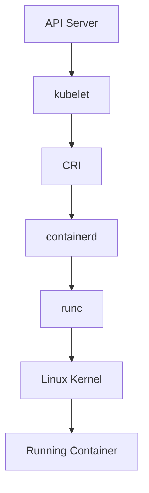
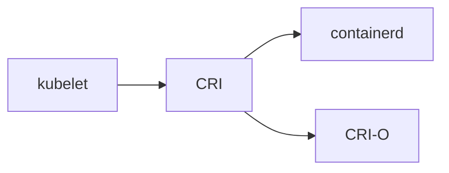
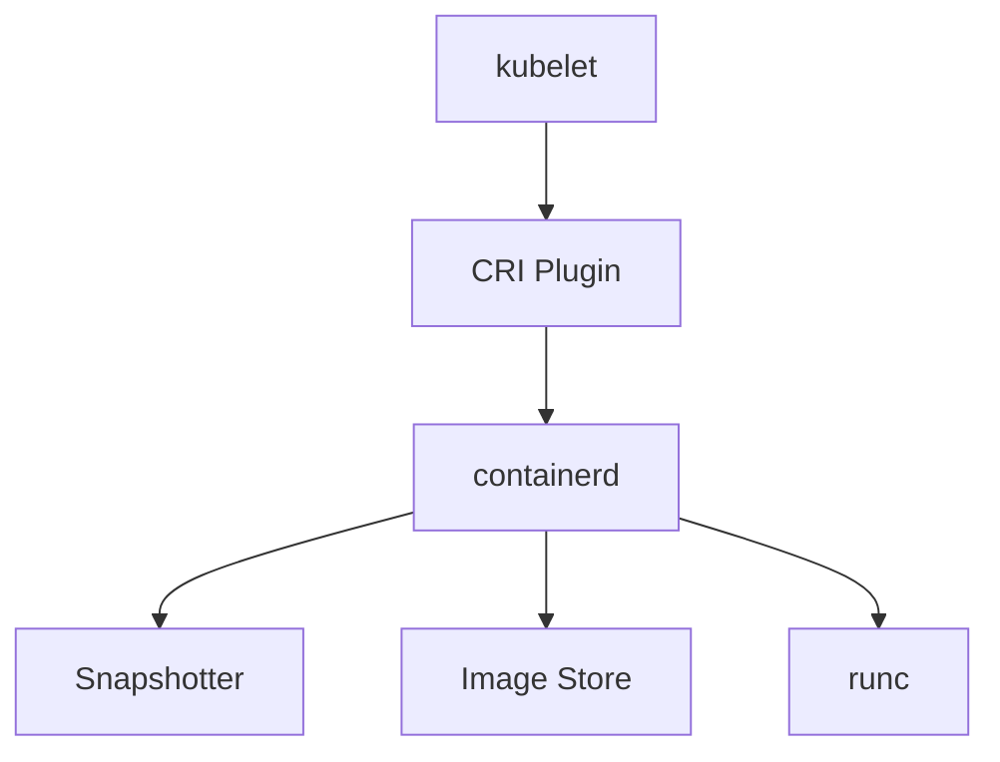
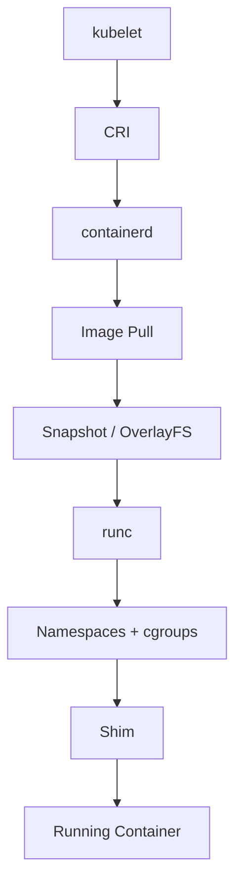

# Container Runtime - How Kubernetes Actually Runs Containers

> **Chapter 13 of the Kubernetes Handbook**
>
> **Difficulty:** ⭐⭐⭐⭐ Advanced
>
> **Reading Time:** 6–8 Hours
>
> **Prerequisites**
>
> - Kubernetes Architecture
> - kubelet
> - kube-proxy
> - Basic Linux concepts
>
> **Next Chapter**
>
> Pod Lifecycle (End-to-End)

---

# Learning Objectives

After completing this chapter, you'll understand:

- What a Container Runtime is
- Why Kubernetes needs a Container Runtime
- CRI (Container Runtime Interface)
- OCI (Open Container Initiative)
- containerd architecture
- runc
- Shim processes
- Image lifecycle
- Container lifecycle
- Linux namespaces
- cgroups
- OverlayFS
- Runtime troubleshooting
- Production best practices

---

# Before Learning Container Runtimes

Many engineers believe Kubernetes runs containers.

It doesn't.

Kubernetes is an **orchestrator**.

The actual container creation is delegated to a **Container Runtime**.

Without a runtime,

Kubernetes cannot start even a single container.

---

# What is a Container Runtime?

A **Container Runtime** is software responsible for creating, starting, stopping, and deleting containers.

It interacts directly with the Linux kernel.

Examples include:

- containerd
- CRI-O
- Docker Engine (historically)
- Kata Containers (specialized)
- gVisor (sandboxed runtime)

Modern Kubernetes primarily uses **containerd** or **CRI-O**.

---

# Responsibilities

A Container Runtime is responsible for:

- Pulling container images
- Managing image storage
- Creating container sandboxes
- Starting containers
- Stopping containers
- Managing container lifecycle
- Reporting container status
- Managing snapshots
- Communicating with the Linux kernel

It is **not** responsible for:

- Scheduling Pods
- Managing Deployments
- Networking policies
- Replica management

---

# Where Does the Container Runtime Fit?



This is the execution path after a Pod has been scheduled.

---

# Historical Background

In the early days of Kubernetes,

Docker was the default runtime.

The architecture looked like this:

```text
kubelet
    │
    ▼
Docker Engine
    │
    ▼
containerd
    │
    ▼
runc
```

Later,

Kubernetes introduced the **Container Runtime Interface (CRI)**.

This allowed Kubernetes to work with multiple runtimes.

---

# Why Docker Was Removed

A common misconception is:

> "Kubernetes removed Docker support."

This statement is misleading.

What actually happened:

- Kubernetes removed **Dockershim**.
- Docker images still follow OCI standards.
- Kubernetes now communicates directly with CRI-compatible runtimes.

Docker itself was **not banned**.

The integration layer changed.

---

# Container Runtime Interface (CRI)

The **Container Runtime Interface** is a standard API between kubelet and a Container Runtime.

Without CRI:

```
kubelet

↓

Special code for Docker

↓

Special code for containerd

↓

Special code for CRI-O
```

Every runtime would require custom integration.

---

# With CRI

Instead:



The kubelet speaks one protocol.

Every runtime implements the CRI.

---

# Benefits of CRI

CRI provides:

- Runtime independence
- Standardized communication
- Easier upgrades
- Simpler kubelet code
- Better ecosystem support

This is an excellent example of interface-based software design.

---

# What Happens When kubelet Starts a Pod?

Suppose the Scheduler has already assigned a Pod.

The kubelet sends a request through CRI.

High-level flow:

```text
Pod Assigned
      │
      ▼
kubelet
      │
      ▼
CRI Request
      │
      ▼
Container Runtime
      │
      ▼
Linux Kernel
```

The runtime handles everything below the CRI boundary.

---

# OCI - Open Container Initiative

The **Open Container Initiative (OCI)** defines open standards for containers.

OCI specifies:

- Image format
- Runtime specification

Because of OCI,

an image built by one tool can usually run on another OCI-compliant runtime.

---

# OCI Image Specification

An OCI image contains:

- Layers
- Metadata
- Configuration
- Entrypoint
- Environment variables

Container registries such as Docker Hub and GHCR distribute OCI-compatible images.

---

# OCI Runtime Specification

The OCI Runtime Specification defines:

- How a container is created
- Linux namespaces
- cgroups
- Mount points
- Process execution

The runtime that commonly implements this specification is **runc**.

---

# containerd Architecture

containerd is not a single monolithic process.

Conceptually:



containerd coordinates image management, snapshots, and container execution.

---

# What is runc?

runc is a lightweight OCI runtime.

Its job is simple:

> Create Linux containers.

It performs operations such as:

- Creating namespaces
- Applying cgroups
- Mounting filesystems
- Launching the container process

After that,

it exits.

---

# Why Doesn't runc Stay Running?

Once the container starts,

there is no need for runc to remain active.

Instead,

a **shim process** takes over.

This keeps containers alive even if the runtime process restarts.

We'll examine shims in detail later in this chapter.

---

# Images vs Containers

This distinction is fundamental.

| Image | Container |
|--------|-----------|
| Read-only | Running instance |
| Template | Process |
| Stored in registry | Runs on a node |
| Immutable | Mutable runtime state |

Think of an image as a blueprint.

A container is the running building.

---

# Container Runtime Lifecycle

Every container goes through a lifecycle.

```text
Image
   │
   ▼
Pull
   │
   ▼
Unpack
   │
   ▼
Create
   │
   ▼
Start
   │
   ▼
Running
   │
   ▼
Stop
   │
   ▼
Delete
```

The runtime manages every step.

---

# Image Pull Process

Suppose the kubelet requests:

```text
nginx:1.27
```

The runtime:

1. Checks the local cache.
2. Downloads missing layers.
3. Verifies integrity.
4. Stores the image.
5. Prepares it for execution.

Future containers can reuse the cached layers.

---

# Layered Images

Container images consist of multiple layers.

Example:

```text
Application Layer
        │
Base Dependencies
        │
Operating System Layer
```

If two images share the same base layer,

it is stored only once on disk.

This reduces storage and download time.

---

# Common Misconceptions

### "Kubernetes runs containers."

❌ False.

The Container Runtime runs containers.

---

### "Docker is required for Kubernetes."

❌ False.

Modern Kubernetes commonly uses containerd or CRI-O.

---

### "Images and containers are the same."

❌ False.

An image is a template.

A container is a running instance.

---

# Best Practices

- Use OCI-compliant images.
- Prefer containerd or CRI-O for production.
- Keep runtime versions compatible with Kubernetes.
- Use trusted container registries.
- Monitor image storage usage.

---

# Architecture Insight

The Container Runtime is the **execution engine** beneath Kubernetes.

Everything above it—API Server, Scheduler, Controller Manager, kubelet—defines *what should happen*.

The runtime performs the actual work of turning an image into an isolated Linux process.

---

# Summary (Part 1)

In this chapter you've learned:

- Why Kubernetes needs a Container Runtime.
- The role of CRI.
- Why OCI standards matter.
- The responsibilities of containerd and runc.
- The difference between images and containers.
- How container creation begins after kubelet issues a CRI request.

In Part 2, we'll dive into Linux namespaces, cgroups, OverlayFS, shim processes, complete container creation, runtime failures, troubleshooting, interview questions, and production best practices.


---

# Linux Namespaces

Containers are **not virtual machines**.

A container is simply a Linux process with isolation provided by **namespaces**.

A namespace limits what a process can see.

Without namespaces:

```
Process

↓

Can see entire system
```

With namespaces:

```
Container Process

↓

Can see only its own isolated environment
```

This is the foundation of container isolation.

---

# Types of Namespaces

Linux provides several namespace types.

| Namespace | Isolates |
|------------|----------|
| PID | Processes |
| NET | Networking |
| MNT | Mount points |
| IPC | Inter-process communication |
| UTS | Hostname |
| USER | User and Group IDs |
| CGROUP | cgroup view (Linux kernels supporting cgroup namespaces) |

Each container combines multiple namespaces.

---

# PID Namespace

Normally:

```
Linux

PID 1

PID 2

PID 3

PID 4
```

Inside a container:

```
Container

PID 1

PID 2

PID 3
```

The container believes it owns the machine,

even though the host has many more processes.

---

# Network Namespace

Each Pod receives its own network namespace.

Inside the Pod:

```
eth0

localhost

Pod IP
```

Processes inside the Pod cannot directly view the host's networking configuration.

This isolation enables each Pod to have its own IP address.

---

# Mount Namespace

Containers also receive isolated filesystems.

Host:

```
/

├── home

├── var

├── etc
```

Container:

```
/

├── app

├── bin

├── etc
```

The container cannot automatically access arbitrary host directories.

---

# UTS Namespace

UTS isolates:

- Hostname
- Domain name

Each container can have its own hostname without affecting the host.

---

# IPC Namespace

Processes communicate using:

- Shared memory
- Message queues
- Semaphores

IPC namespaces prevent containers from interfering with IPC resources belonging to other containers.

---

# User Namespace

User namespaces map container users to different users on the host.

Example:

```
Container

root

↓

Host

UID 100000
```

This reduces the impact of a container escape because container root does not necessarily correspond to host root.

Support depends on runtime configuration and distribution.

---

# cgroups

Namespaces provide **isolation**.

cgroups provide **resource control**.

Think of it like this:

```
Namespaces

↓

What can the container see?

------------------------

cgroups

↓

How much can it use?
```

---

# What cgroups Control

Examples include:

- CPU
- Memory
- Disk I/O
- Process count
- Huge pages (where supported)

Without cgroups,

one container could consume all available resources.

---

# Example

Pod specification:

```yaml
resources:
  limits:
    cpu: "1"
    memory: "512Mi"
```

The runtime configures cgroups so the container cannot exceed those limits (subject to kernel behavior and the specific resource).

---

# OOM Kill

Suppose a container exceeds its memory limit.

Linux may terminate the offending process.

The result:

```
OOMKilled
```

The kubelet observes the termination and acts according to the Pod's restart policy.

---

# OverlayFS

Images are read-only.

Containers require writable storage.

Linux commonly uses **OverlayFS** to combine these layers.

Conceptually:

```
Read-only Image Layers

↓

Writable Container Layer

↓

Merged Filesystem
```

The container sees one unified filesystem.

---

# Copy-on-Write

Suppose:

Image contains:

```
config.txt
```

Container modifies:

```
config.txt
```

The original image layer remains unchanged.

OverlayFS copies the file into the writable layer before modification.

This behavior is called **Copy-on-Write (CoW)**.

---

# Why Layering Matters

Suppose:

Image A:

```
Ubuntu

+

Python

+

App A
```

Image B:

```
Ubuntu

+

Python

+

App B
```

The Ubuntu and Python layers are shared.

Only the application layer differs.

This saves:

- Storage
- Network bandwidth
- Image pull time

---

# Shim Processes

Earlier we learned that `runc` exits after starting a container.

Who keeps the container attached to the runtime?

The answer is a **shim process**.

Conceptually:

```text
containerd

↓

Shim

↓

Container
```

The shim:

- Keeps standard input/output streams connected.
- Reports exit status.
- Allows containerd to restart independently.

---

# Complete Container Creation

Let's combine everything.



This is the complete execution pipeline from kubelet to a running Linux process.

---

# Container Lifecycle

A container typically follows this lifecycle:

```text
Image

↓

Pull

↓

Unpack

↓

Create

↓

Start

↓

Running

↓

Stop

↓

Delete
```

Every transition is coordinated by the runtime.

---

# Common Runtime Failures

| Error | Possible Cause |
|--------|----------------|
| ImagePullBackOff | Registry or image problem |
| ErrImagePull | Initial pull failure |
| CreateContainerError | Runtime failed to create the container |
| OOMKilled | Memory limit exceeded |
| CrashLoopBackOff | Application repeatedly exits |
| ContainerCannotRun | Invalid command or runtime configuration |

---

# Troubleshooting Workflow

When a container fails:

### Step 1

Inspect the Pod.

```bash
kubectl describe pod <pod-name>
```

Review:

- Events
- Container status
- Exit reason

---

### Step 2

Inspect logs.

```bash
kubectl logs <pod-name>
```

If the container has restarted:

```bash
kubectl logs <pod-name> --previous
```

---

### Step 3

Inspect the runtime.

On nodes using containerd:

```bash
crictl ps
```

List running containers.

---

View images:

```bash
crictl images
```

---

Inspect a container:

```bash
crictl inspect <container-id>
```

`crictl` is the standard CLI for CRI-compatible runtimes.

---

### Step 4

Check the runtime service.

Example:

```bash
systemctl status containerd
```

If the runtime is unavailable,

the kubelet cannot create containers.

---

### Step 5

Review runtime logs.

Example:

```bash
journalctl -u containerd
```

Look for:

- Image pull failures
- Snapshot errors
- Runtime crashes
- Storage problems

---

# Runtime vs kubelet

| kubelet | Container Runtime |
|----------|-------------------|
| Watches Pods | Runs containers |
| Talks to the API Server | Talks to the Linux kernel |
| Uses CRI | Implements CRI |
| Reports Pod status | Reports container status to kubelet |

The kubelet decides **what** should exist on the node.

The runtime makes it happen.

---

# Performance Considerations

Container startup time depends on:

- Image size
- Number of layers
- Registry latency
- Disk performance
- Snapshotter performance
- Node CPU and memory

Reducing image size often has a measurable impact on startup time.

---

# Production Best Practices

- Use small base images where practical.
- Remove unnecessary packages.
- Pin image versions instead of using `latest`.
- Use trusted registries.
- Monitor image storage usage.
- Periodically clean unused images.
- Keep the runtime updated according to Kubernetes compatibility guidance.

---

# Useful Commands

List containers:

```bash
crictl ps
```

---

List all containers:

```bash
crictl ps -a
```

---

List images:

```bash
crictl images
```

---

Inspect a container:

```bash
crictl inspect <container-id>
```

---

Inspect an image:

```bash
crictl inspecti <image-id>
```

---

View runtime status:

```bash
crictl info
```

---

# Communication Matrix

| Component | Interaction |
|-----------|-------------|
| kubelet | Sends CRI requests |
| containerd | Coordinates image and container lifecycle |
| runc | Creates OCI containers |
| Linux Kernel | Enforces namespaces and cgroups |
| OverlayFS | Provides the container filesystem |

---

# Container Runtime Cheat Sheet

```text
kubelet
      │
      ▼
CRI
      │
      ▼
containerd
      │
      ▼
Pull Image
      │
      ▼
OverlayFS
      │
      ▼
runc
      │
      ▼
Namespaces + cgroups
      │
      ▼
Shim
      │
      ▼
Running Container
```

---

# Interview Questions

## Beginner

1. What is a Container Runtime?
2. What is CRI?
3. What is OCI?
4. What is the difference between an image and a container?
5. Why does Kubernetes need containerd?

---

## Intermediate

1. Explain the container creation process.
2. What is `runc`?
3. Why are shim processes required?
4. What are Linux namespaces?
5. What are cgroups?

---

## Advanced

1. Explain the complete path from a Pod specification to a running Linux process.
2. Compare containerd and CRI-O.
3. How does OverlayFS reduce storage usage?
4. What happens during an OOM kill?
5. How would you troubleshoot a container that never starts?

---

# Real-World Scenarios

### Scenario 1

A Pod remains in:

```text
ImagePullBackOff
```

Possible causes?

> **Answer:** Incorrect image name, registry authentication issues, registry outage, or network connectivity problems.

---

### Scenario 2

The container repeatedly exits with:

```text
OOMKilled
```

Likely cause?

> **Answer:** The application exceeded its configured memory limit. Review memory usage and resource limits.

---

### Scenario 3

`containerd` is stopped.

What happens?

> **Answer:** Existing containers may continue running for some time, but the kubelet cannot create new containers or manage container lifecycle until the runtime becomes available.

---

### Scenario 4

Two containers use the same Ubuntu base image.

Why isn't Ubuntu stored twice?

> **Answer:** OCI images are layered. Shared read-only layers are reused by multiple images and containers.

---

# Common Misconceptions

### "Containers are lightweight virtual machines."

❌ False.

Containers are isolated Linux processes that share the host kernel.

---

### "Docker created containers."

❌ False.

Linux kernel features such as namespaces and cgroups made containers possible. Docker popularized and simplified their use.

---

### "Deleting a container deletes its image."

❌ False.

Containers and images have separate lifecycles.

---

# Key Takeaways

- Kubernetes delegates container execution to a Container Runtime.
- CRI standardizes communication between kubelet and runtimes.
- OCI standardizes image and runtime formats.
- `runc` creates isolated Linux processes.
- Namespaces provide isolation.
- cgroups enforce resource limits.
- OverlayFS enables efficient layered filesystems.
- Shim processes keep containers connected after `runc` exits.
- Understanding Linux internals greatly improves Kubernetes troubleshooting.

---

# Summary

The Container Runtime is the execution engine that transforms a container image into an isolated Linux process.

By combining OCI standards, CRI communication, namespaces, cgroups, OverlayFS, and runtime components such as `containerd` and `runc`, Kubernetes can reliably execute workloads while remaining independent of any specific runtime implementation.

---

# Related Chapters

Next:

- **14_Pod_Lifecycle_End_to_End.md**

Future topics:

- **03_Networking/**
- **04_Storage/**
- **06_Security/**
- **08_Observability/**
