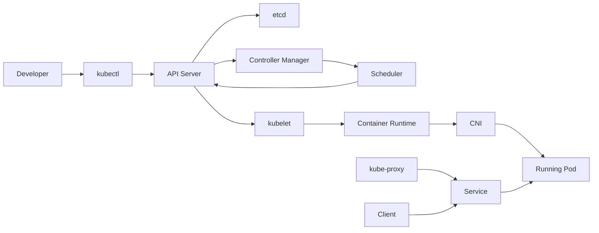
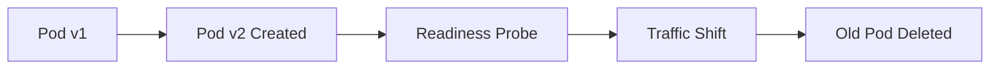

# Pod Lifecycle End-to-End

> **Chapter 14 of the Kubernetes Handbook**
>
> **Difficulty:** ⭐⭐⭐⭐ Advanced
>
> **Reading Time:** 6–8 Hours
>
> **Prerequisites**
>
> - Kubernetes Architecture
> - API Server
> - etcd
> - Scheduler
> - Controller Manager
> - kubelet
> - kube-proxy
> - Container Runtime
>
> **Next Section**
>
> Kubernetes Networking

---

# Learning Objectives

After completing this chapter, you'll understand:

- The complete lifecycle of a Pod
- How every Kubernetes component participates
- What happens after `kubectl apply`
- What happens when a Pod crashes
- What happens when a node fails
- Rolling Updates
- Pod deletion
- End-to-end troubleshooting

---

# Why This Chapter Matters

So far we've studied every major component separately.

Now it's time to connect them.

A single Pod may interact with:

- kubectl
- API Server
- etcd
- Admission Controllers
- Controller Manager
- Scheduler
- kubelet
- Container Runtime
- CNI Plugin
- CSI Plugin
- kube-proxy
- CoreDNS

Understanding how they cooperate is one of the most important Kubernetes skills.

---

# The Complete Journey

A Pod goes through many stages before becoming available.

High-level overview:



Every component we've studied appears in this workflow.

---

# Step 1 — Developer Creates a Deployment

Suppose a developer runs:

```bash
kubectl apply -f deployment.yaml
```

Example:

```yaml
apiVersion: apps/v1
kind: Deployment

metadata:
  name: frontend

spec:
  replicas: 3
```

This is only the beginning.

No Pods exist yet.

---

# Step 2 — kubectl Sends an API Request

`kubectl` is simply a client.

It sends an HTTPS request to the API Server.

```text
Developer

↓

kubectl

↓

HTTPS

↓

API Server
```

Everything begins with the API Server.

---

# Step 3 — Authentication

Before doing anything,

the API Server verifies:

- Who is making the request?
- Is the identity valid?

Possible methods include:

- Client certificates
- Service Accounts
- OIDC
- Authentication tokens

Unauthenticated requests are rejected.

---

# Step 4 — Authorization

After authentication,

the API Server checks permissions.

Example:

```
Can this user create Deployments?
```

RBAC is commonly used.

If permission is denied,

the request stops here.

---

# Step 5 — Admission Controllers

The request is now passed through Admission Controllers.

They may:

- Validate the object
- Reject it
- Modify it

Examples:

- Add default values
- Enforce security policies
- Apply Pod Security rules

Only after this stage does the object become eligible for persistence.

---

# Step 6 — Store Desired State

The API Server writes the Deployment to etcd.

```text
Deployment

↓

API Server

↓

etcd
```

At this moment:

```
Desired State Exists

Actual Pods = 0
```

---

# Step 7 — Deployment Controller Notices

The Deployment Controller is watching Deployments.

It receives an event:

```
New Deployment
```

Question:

```
ReplicaSet exists?
```

Answer:

```
No
```

Action:

```
Create ReplicaSet
```

---

# Step 8 — ReplicaSet Controller

The ReplicaSet Controller receives another event.

Desired:

```
Replicas = 3
```

Current:

```
Pods = 0
```

Difference:

```
Need 3 Pods
```

It creates three Pod objects.

---

# Step 9 — Scheduler Detects Pending Pods

Each new Pod has:

```yaml
spec:
  nodeName: null
```

Status:

```
Pending
```

The Scheduler watches for unscheduled Pods.

---

# Step 10 — Scheduling Decision

The Scheduler performs:

1. Find candidate nodes.
2. Filter unsuitable nodes.
3. Score remaining nodes.
4. Select the best node.

Example:

```
Pod A

↓

Worker-2
```

The Scheduler updates:

```yaml
nodeName: worker-2
```

---

# Step 11 — kubelet Notices the Assignment

The kubelet on Worker-2 is watching the API Server.

It notices:

```
New Pod Assigned
```

The kubelet starts its reconciliation loop.

---

# Step 12 — SyncPod Begins

The kubelet calls its internal synchronization logic.

Conceptually:

```text
Desired Pod

↓

Current State

↓

Difference?

↓

Create Pod
```

Everything below this point happens on the Worker Node.

---

# Step 13 — Container Runtime Takes Over

The kubelet sends a CRI request.

```text
kubelet

↓

CRI

↓

containerd
```

The runtime prepares the container environment.

---

# Step 14 — Image Pull

The runtime checks:

```
Image Exists?
```

If yes,

reuse it.

If no,

download it.

Example:

```
nginx:1.27
```

↓

Registry

↓

Local Cache

---

# Step 15 — Pod Sandbox

Before application containers start,

the runtime creates a Pod sandbox.

The sandbox provides:

- Network namespace
- Shared environment
- Pod IP
- Linux isolation

Every container in the Pod shares this environment.

---

# Step 16 — CNI Configures Networking

The runtime invokes the CNI plugin.

The CNI:

- Creates network interfaces
- Assigns the Pod IP
- Connects the Pod to the cluster network

Only after networking is complete can containers communicate.

---

# Step 17 — Volumes

The kubelet prepares storage.

Examples:

- emptyDir
- ConfigMap
- Secret
- PersistentVolume

The runtime mounts these volumes before starting the containers.

---

# Step 18 — Container Starts

Finally,

the runtime creates the Linux process.

Internally:

```text
containerd

↓

runc

↓

Namespaces

↓

cgroups

↓

Running Process
```

The application is now executing.

---

# Step 19 — Health Probes

The kubelet begins health monitoring.

Possible probes:

- Startup
- Liveness
- Readiness

These determine:

- Is the application alive?
- Is it ready?
- Should it receive traffic?

---

# Step 20 — Pod Becomes Running

The kubelet reports:

```text
Running
```

to the API Server.

The API Server stores the updated status in etcd.

Users can now see:

```bash
kubectl get pods
```

Example:

```text
frontend

1/1

Running
```

---

# Step 21 — EndpointSlice Update

Once the Pod is Ready,

the EndpointSlice controller updates the Service backends.

Example:

```
frontend-service

↓

EndpointSlice

↓

New Pod IP
```

---

# Step 22 — kube-proxy Updates Rules

Every kube-proxy receives the EndpointSlice update.

It programs:

- iptables
- IPVS
- nftables

depending on the configured mode.

Traffic can now reach the Pod.

---

# Step 23 — Client Sends Request

A client sends:

```text
frontend-service
```

The request follows:

```text
Client

↓

ClusterIP

↓

Linux Networking Rules

↓

Pod
```

The application finally receives traffic.

---

# Complete Timeline

```text
kubectl apply
      │
      ▼
API Server
      │
      ▼
Authentication
      │
      ▼
Authorization
      │
      ▼
Admission Controllers
      │
      ▼
etcd
      │
      ▼
Deployment Controller
      │
      ▼
ReplicaSet Controller
      │
      ▼
Scheduler
      │
      ▼
kubelet
      │
      ▼
Container Runtime
      │
      ▼
CNI
      │
      ▼
Container Starts
      │
      ▼
Health Probes
      │
      ▼
Running
      │
      ▼
EndpointSlice
      │
      ▼
kube-proxy
      │
      ▼
Traffic
```

---

# Architecture Insight

Notice that **no single component does everything**.

Each Kubernetes component has one responsibility:

- API Server → accepts requests
- etcd → stores state
- Controller Manager → reconciliation
- Scheduler → placement
- kubelet → execution
- Runtime → process creation
- CNI → networking
- kube-proxy → Service routing

This separation is one of Kubernetes' greatest strengths.

---

# Summary (Part 1)

You now understand the complete journey of a Pod from:

```bash
kubectl apply
```

to

```text
Running Pod
```

Every component contributes one step to the process.

In Part 2, we'll follow what happens **after** the Pod is running, including rolling updates, crashes, self-healing, node failures, graceful deletion, scaling, complete troubleshooting workflows, production scenarios, interview questions, and a full end-to-end cheat sheet.


---

# Life After the Pod Starts

Earlier we stopped when the Pod reached:

```text
Running
```

However, the Pod's lifecycle is far from over.

The kubelet continues monitoring it.

Controllers continue reconciling it.

The Scheduler may schedule replacement Pods.

Services continuously update routing.

Kubernetes never stops observing the cluster.

---

# Continuous Reconciliation

Once the Pod is running, multiple components continue working.

| Component | Responsibility |
|-----------|----------------|
| kubelet | Monitor local containers |
| Controller Manager | Maintain desired state |
| API Server | Accept updates |
| etcd | Store latest state |
| kube-proxy | Update Service routing |
| CNI | Maintain Pod networking |

The system remains active throughout the Pod's lifetime.

---

# Scenario 1 – Application Crash

Suppose the application crashes.

```
Running

↓

Application Exit

↓

Container Stops
```

The kubelet detects the exit.

What happens next depends on the restart policy.

---

# Restart Policy

Most Pods created by Deployments use:

```yaml
restartPolicy: Always
```

Workflow:

```text
Container Crash

↓

kubelet

↓

Restart Container

↓

Running
```

Notice:

The **Pod remains the same**.

Only the container restarts.

---

# Scenario 2 – Liveness Probe Failure

Suppose the application enters a deadlock.

The process still exists,

but it no longer responds.

```
Liveness Probe

↓

Failure

↓

kubelet

↓

Restart Container
```

The Pod is preserved.

The container is recreated.

---

# Scenario 3 – Readiness Probe Failure

Suppose:

- Application is alive
- Database connection is unavailable

The readiness probe fails.

```
Readiness Failure

↓

EndpointSlice Update

↓

kube-proxy Updates Rules

↓

Traffic Stops
```

The container continues running.

The Pod simply stops receiving new requests until it becomes ready again.

---

# Scenario 4 – Pod Deletion

User executes:

```bash
kubectl delete pod frontend
```

Sequence:

```text
Delete Request

↓

API Server

↓

etcd

↓

kubelet

↓

SIGTERM

↓

Grace Period

↓

SIGKILL (if needed)

↓

Container Stops
```

The kubelet performs graceful termination.

---

# Graceful Shutdown

The default termination grace period is typically:

```yaml
terminationGracePeriodSeconds: 30
```

Applications should use this time to:

- Finish active requests
- Close database connections
- Flush logs
- Save state

If the process does not exit before the grace period ends, the kubelet forcefully terminates it.

---

# Scenario 5 – Deployment Self-Healing

Suppose:

```
Deployment

Replicas = 3
```

One Pod is manually deleted.

Sequence:

```text
Pod Deleted

↓

ReplicaSet Controller

↓

Need 1 Pod

↓

Create New Pod

↓

Scheduler

↓

kubelet

↓

Running
```

This is Kubernetes' self-healing behavior.

---

# Scenario 6 – Scaling

Original Deployment:

```yaml
replicas: 3
```

User scales:

```bash
kubectl scale deployment frontend --replicas=5
```

Workflow:

```text
Deployment Updated

↓

ReplicaSet Controller

↓

Need 2 More Pods

↓

Create Pods

↓

Scheduler

↓

kubelet

↓

Running
```

Scaling is simply another reconciliation event.

---

# Scenario 7 – Rolling Update

Suppose:

Version:

```
v1
```

User deploys:

```
v2
```

Kubernetes performs a rolling update.

Conceptually:

```text
Old Pod

↓

New Pod Starts

↓

Ready?

↓

Yes

↓

Old Pod Removed
```

This repeats until every Pod runs the new version.

The goal is to avoid downtime.

---

# Rolling Update Timeline



The Deployment Controller coordinates this process.

---

# Scenario 8 – Node Failure

Suppose:

```
Worker-2

↓

Power Failure
```

The kubelet stops sending heartbeats.

Workflow:

```text
Node Controller

↓

Node NotReady

↓

ReplicaSet Controller

↓

Replacement Pod

↓

Scheduler

↓

Healthy Node

↓

kubelet
```

Applications recover automatically if sufficient capacity exists.

---

# Scenario 9 – Image Update

Suppose:

```yaml
image: nginx:1.28
```

The Deployment changes.

The Deployment Controller creates a new ReplicaSet.

The old ReplicaSet is gradually scaled down while the new one scales up.

This enables controlled rollouts and rollbacks.

---

# Pod Termination Lifecycle

```text
Delete Request
      │
      ▼
API Server
      │
      ▼
Deletion Timestamp
      │
      ▼
kubelet
      │
      ▼
SIGTERM
      │
      ▼
Grace Period
      │
      ▼
SIGKILL (if required)
      │
      ▼
Pod Removed
```

Deletion is a controlled process rather than an immediate kill.

---

# End-to-End Troubleshooting

When a Pod fails, investigate from the top of the stack downward.

## Step 1 – Resource Exists?

```bash
kubectl get deployment
kubectl get pods
```

---

## Step 2 – Pod Pending?

Possible causes:

- Scheduler
- Resources
- Affinity
- Taints
- Node availability

---

## Step 3 – ContainerCreating?

Possible causes:

- Image pull
- Volume mount
- CNI networking
- Runtime issues

---

## Step 4 – CrashLoopBackOff?

Check:

```bash
kubectl logs <pod>
kubectl logs <pod> --previous
```

---

## Step 5 – Running but No Traffic?

Investigate:

- Readiness Probe
- Service selector
- EndpointSlice
- kube-proxy
- NetworkPolicy (if configured)

---

## Step 6 – Node Healthy?

```bash
kubectl get nodes
kubectl describe node <node>
```

---

# Failure Mapping

| Symptom | Likely Component |
|---------|------------------|
| Forbidden request | API Server / RBAC |
| Pending | Scheduler |
| ImagePullBackOff | Container Runtime / Registry |
| FailedMount | kubelet / Storage |
| CrashLoopBackOff | Application / kubelet |
| No Service endpoints | Service selector / Readiness |
| Pod unreachable | kube-proxy / CNI |
| Node NotReady | kubelet / Node |

This table is a powerful troubleshooting aid.

---

# Production Best Practices

- Define resource requests and limits.
- Configure Startup, Liveness, and Readiness probes.
- Use rolling updates instead of recreating Deployments.
- Avoid using the `latest` image tag.
- Monitor Events regularly.
- Keep labels and selectors consistent.
- Test node failure scenarios.
- Monitor control plane components and Worker Nodes.

---

# End-to-End Communication Matrix

| Component | Primary Role |
|-----------|--------------|
| kubectl | Sends API requests |
| API Server | Entry point |
| etcd | Source of truth |
| Controller Manager | Reconciliation |
| Scheduler | Node selection |
| kubelet | Pod execution |
| Container Runtime | Container lifecycle |
| CNI | Pod networking |
| kube-proxy | Service routing |
| CoreDNS | Service discovery |

---

# Complete Kubernetes Flow

```text
Developer
      │
      ▼
kubectl
      │
      ▼
API Server
      │
      ▼
Authentication
      │
      ▼
Authorization
      │
      ▼
Admission Controllers
      │
      ▼
etcd
      │
      ▼
Deployment Controller
      │
      ▼
ReplicaSet Controller
      │
      ▼
Scheduler
      │
      ▼
kubelet
      │
      ▼
Container Runtime
      │
      ▼
Namespaces + cgroups
      │
      ▼
Running Container
      │
      ▼
Readiness Probe
      │
      ▼
EndpointSlice
      │
      ▼
kube-proxy
      │
      ▼
Client Traffic
```

---

# Quick Revision Sheet

| Component | Key Responsibility |
|-----------|--------------------|
| API Server | Accepts and validates requests |
| etcd | Stores desired state |
| Controller Manager | Reconciles desired and actual state |
| Scheduler | Chooses a Worker Node |
| kubelet | Executes Pods on a node |
| Container Runtime | Runs containers |
| kube-proxy | Routes Service traffic |
| CNI | Connects Pods to the network |

---

# Interview Questions

## Beginner

1. What happens after `kubectl apply`?
2. Which component stores cluster state?
3. Who schedules Pods?
4. Who starts containers?
5. What is the role of kube-proxy?

---

## Intermediate

1. Explain the complete Pod lifecycle.
2. Describe the reconciliation loop.
3. Explain how rolling updates work.
4. What happens during Pod deletion?
5. Explain the difference between liveness and readiness probes.

---

## Advanced

1. Walk through every component involved in creating a Pod.
2. What happens when a Worker Node fails?
3. Explain how Kubernetes performs self-healing.
4. How would you troubleshoot a Pod stuck in `ContainerCreating`?
5. Describe the end-to-end flow from `kubectl apply` to client traffic reaching the Pod.

---

# Real-World Scenarios

### Scenario 1

A Pod is `Running` but users receive 503 errors.

> **Answer:** Check the readiness probe, Service selector, EndpointSlices, kube-proxy rules, and application logs.

---

### Scenario 2

A node suddenly powers off.

> **Answer:** The Node Controller marks it `NotReady`. Workload controllers create replacement Pods on healthy nodes if capacity is available.

---

### Scenario 3

A Deployment rollout stalls.

> **Answer:** Investigate readiness probe failures, image pull issues, insufficient cluster resources, or Pods failing to start.

---

### Scenario 4

A Pod is deleted manually.

> **Answer:** If it is managed by a Deployment, the ReplicaSet Controller creates a replacement Pod to maintain the desired replica count.

---

# Common Misconceptions

### "Creating a Deployment immediately creates running containers."

❌ False.

Many components participate before a container starts.

---

### "Deleting a Pod removes the application."

❌ Not if the Pod is managed by a higher-level controller such as a Deployment.

---

### "Running means users can access the application."

❌ False.

The Pod must also be Ready and selected by a Service.

---

# Key Takeaways

- Kubernetes is a collection of specialized components working together.
- Every component has a single responsibility.
- Controllers continuously reconcile desired and actual state.
- kubelet manages execution on each Worker Node.
- Services and kube-proxy enable stable networking.
- Understanding the complete lifecycle makes troubleshooting much easier.

---

# Summary

The Pod lifecycle demonstrates Kubernetes' declarative architecture in action.

A simple `kubectl apply` triggers a coordinated sequence involving the API Server, etcd, controllers, the Scheduler, kubelet, the Container Runtime, networking components, and Service routing. Each component performs a focused task, collectively delivering a resilient, self-healing platform for running containerized applications.

---

# Fundamentals Complete 🎉

You have now completed the **Fundamentals** section of the handbook.

**Next Section:**

```
03_Networking/
```

We'll begin with:

```
01_Pod_Networking.md
```

where you'll learn:

- The Kubernetes networking model
- Why every Pod gets its own IP
- Flat networking
- Cross-node communication
- Network namespaces
- veth pairs
- Linux bridges
- Overlay networks
- VXLAN
- How CNI plugins make Pod networking work
