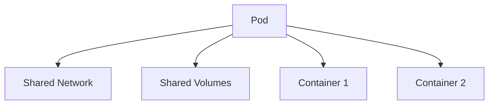

# Pod

> **Difficulty:** ⭐⭐ Beginner
>
> **Prerequisites**
>
> - Kubernetes Fundamentals
> - Pod Lifecycle
>
> **Next Chapter**
>
> ReplicaSet

---

# Learning Objectives

After this chapter, you'll understand:

- What a Pod is
- Why Pods exist
- Pod architecture
- Pod YAML structure
- Single vs Multi-container Pods
- Important Pod fields
- Common kubectl commands
- Best practices

---

# What is a Pod?

A **Pod** is the **smallest deployable unit** in Kubernetes.

It is a Kubernetes object that encapsulates **one or more containers** which:

- Run on the same Worker Node
- Share the same network namespace
- Share storage volumes
- Have the same lifecycle

> **Remember:** Kubernetes schedules **Pods**, not individual containers.

---

# Why Pods?

Applications often need helper containers alongside the main application.

Examples:

- Log collector
- Metrics exporter
- Service mesh proxy
- Initialization scripts

A Pod allows these containers to run together as one unit.

---

# Pod Architecture



All containers inside the Pod share:

- IP address
- Hostname
- localhost
- Mounted volumes (when configured)

---

# Pod YAML

A minimal Pod:

```yaml
apiVersion: v1
kind: Pod

metadata:
  name: nginx-pod

spec:
  containers:
    - name: nginx
      image: nginx:1.27
      ports:
        - containerPort: 80
```

Create it:

```bash
kubectl apply -f pod.yaml
```

---

# Important Fields

## Metadata

Used to identify the Pod.

```yaml
metadata:
  name: frontend
  namespace: production
```

---

## Labels

Used for grouping Pods.

```yaml
labels:
  app: frontend
  tier: web
```

Services and Deployments use labels to identify Pods.

---

## Containers

Defines the containers to run.

```yaml
containers:
- name: nginx
  image: nginx
```

A Pod must contain at least one container.

---

## Ports

```yaml
ports:
- containerPort: 8080
```

This documents the port the application listens on. It does **not** expose the Pod outside the cluster.

---

## Environment Variables

```yaml
env:
- name: APP_ENV
  value: production
```

---

## Resource Requests & Limits

```yaml
resources:
  requests:
    cpu: "250m"
    memory: "256Mi"

  limits:
    cpu: "500m"
    memory: "512Mi"
```

- **Requests** → Used by the Scheduler.
- **Limits** → Enforced during execution.

---

# Single vs Multi-container Pods

## Single Container (Most Common)

```text
Pod
└── Application
```

Recommended for most workloads.

---

## Multi-container Pod

```text
Pod
├── Application
└── Sidecar
```

Used when containers must:

- Share storage
- Share localhost
- Share lifecycle

---

# Pod Networking

Every Pod receives:

- One IP address
- One hostname

Containers communicate using:

```text
localhost
```

No Service is required for communication between containers inside the same Pod.

---

# Pod Storage

Containers can share data using volumes.

Example:

```yaml
volumes:
- name: app-data
  emptyDir: {}
```

Mounted by multiple containers:

```yaml
volumeMounts:
- name: app-data
  mountPath: /data
```

---

# Pod Lifecycle

Common Pod phases:

| Phase | Meaning |
|--------|----------|
| Pending | Waiting to start |
| Running | At least one container running |
| Succeeded | Completed successfully |
| Failed | Finished with failure |
| Unknown | Status unavailable |

Use:

```bash
kubectl get pods
```

to view the current phase.

---

# Restart Policy

Possible values:

```yaml
restartPolicy: Always
```

```yaml
restartPolicy: OnFailure
```

```yaml
restartPolicy: Never
```

`Always` is the default for most workloads managed by Deployments.

---

# Common kubectl Commands

Create Pod:

```bash
kubectl apply -f pod.yaml
```

List Pods:

```bash
kubectl get pods
```

Describe Pod:

```bash
kubectl describe pod nginx-pod
```

View Logs:

```bash
kubectl logs nginx-pod
```

Execute Command:

```bash
kubectl exec -it nginx-pod -- /bin/bash
```

Delete Pod:

```bash
kubectl delete pod nginx-pod
```

---

# Best Practices

- Prefer one main application container per Pod.
- Use labels consistently.
- Define resource requests and limits.
- Use health probes for production workloads.
- Keep Pods stateless whenever possible.
- Store persistent data in volumes instead of the container filesystem.

---

# Common Mistakes

❌ Accessing Pods directly by IP.

✔ Use a Service.

---

❌ Storing important data inside the container filesystem.

✔ Use Persistent Volumes.

---

❌ Running unrelated applications in one Pod.

✔ Keep only tightly coupled containers together.

---

❌ Omitting resource limits.

✔ Define CPU and memory requests/limits.

---

# Interview Questions

### Beginner

- What is a Pod?
- Why is a Pod the smallest deployable unit?
- Can a Pod contain multiple containers?
- Do containers inside a Pod have different IP addresses?
- What is the difference between a Pod and a container?

---

### Intermediate

- Why are Pods ephemeral?
- When would you use a multi-container Pod?
- Explain Pod networking.
- Explain resource requests and limits.
- Explain the Pod lifecycle.

---

# Cheat Sheet

```text
Pod
│
├── One or More Containers
├── Shared Network
├── Shared Storage
├── One IP Address
├── One Lifecycle
└── Scheduled as a Single Unit
```

---

# Key Takeaways

- A Pod is the smallest deployable unit in Kubernetes.
- Kubernetes manages Pods, not individual containers.
- Most Pods contain a single application container.
- Containers inside a Pod share networking and storage.
- Pods are ephemeral and should be treated as replaceable.
- Services, Deployments, and other Kubernetes objects build on top of Pods.

---

# Next Chapter

**02_ReplicaSet.md**

Learn how Kubernetes ensures that the desired number of Pod replicas are always running.
