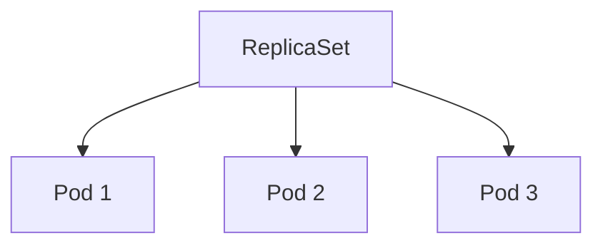

# ReplicaSet

> **Difficulty:** ⭐⭐ Beginner
>
> **Prerequisites**
>
> - Pod
>
> **Next Chapter**
>
> Deployment

---

# Learning Objectives

After this chapter, you'll understand:

- What a ReplicaSet is
- Why ReplicaSets exist
- How ReplicaSets work
- Label selectors
- Pod reconciliation
- ReplicaSet YAML
- Scaling Pods
- Best practices

---

# What is a ReplicaSet?

A **ReplicaSet** ensures that a specified number of identical Pods are always running.

If a Pod fails, crashes, or is deleted, the ReplicaSet automatically creates a new one to maintain the desired number of replicas.

Think of it as a **Pod manager**.

---

# Why Do We Need a ReplicaSet?

Suppose you manually create a Pod:

```text
Pod
```

If the Pod is deleted:

```text
Pod ❌
```

Nothing replaces it.

Your application is now unavailable.

With a ReplicaSet:

```text
ReplicaSet

↓

Pod
```

If the Pod is deleted:

```text
ReplicaSet

↓

New Pod
```

The desired number of Pods is maintained automatically.

---

# How ReplicaSet Works

A ReplicaSet continuously compares:

- Desired number of Pods
- Actual number of Pods

If they differ, it takes corrective action.

Example:

Desired:

```text
3 Pods
```

Current:

```text
2 Pods
```

Action:

```text
Create 1 New Pod
```

This process is called **reconciliation**.

---

# ReplicaSet Architecture



The ReplicaSet owns and manages all matching Pods.

---

# ReplicaSet YAML

```yaml
apiVersion: apps/v1
kind: ReplicaSet

metadata:
  name: nginx-rs

spec:
  replicas: 3

  selector:
    matchLabels:
      app: nginx

  template:
    metadata:
      labels:
        app: nginx

    spec:
      containers:
      - name: nginx
        image: nginx:1.27
```

Create it:

```bash
kubectl apply -f replicaset.yaml
```

---

# Important Fields

## replicas

Specifies how many Pods should exist.

```yaml
replicas: 3
```

---

## selector

Determines which Pods belong to the ReplicaSet.

```yaml
selector:
  matchLabels:
    app: nginx
```

---

## template

Defines the Pod that will be created.

```yaml
template:
  spec:
    containers:
```

Every new Pod is created from this template.

---

# Label Selector

ReplicaSets identify Pods using labels.

Pod:

```yaml
labels:
  app: nginx
```

ReplicaSet:

```yaml
selector:
  matchLabels:
    app: nginx
```

Matching labels mean the Pod belongs to the ReplicaSet.

---

# What Happens If a Pod Crashes?

Example:

```text
Desired = 3

Current = 2
```

ReplicaSet notices the difference.

Result:

```text
Create New Pod
```

Eventually:

```text
Desired = Current = 3
```

---

# Scaling

Increase replicas:

```yaml
replicas: 5
```

ReplicaSet creates:

```text
2 Additional Pods
```

Decrease replicas:

```yaml
replicas: 2
```

ReplicaSet removes extra Pods.

---

# Manual Scaling

```bash
kubectl scale rs nginx-rs --replicas=5
```

Check:

```bash
kubectl get rs
```

---

# Deleting a Pod

Delete:

```bash
kubectl delete pod <pod-name>
```

ReplicaSet immediately creates a replacement Pod.

Deleting individual Pods is therefore temporary if a ReplicaSet manages them.

---

# ReplicaSet Ownership

Pods created by a ReplicaSet contain an **Owner Reference**.

```text
ReplicaSet

↓

Owner

↓

Pod
```

This tells Kubernetes which object is responsible for the Pod.

---

# ReplicaSet vs Pod

| Pod | ReplicaSet |
|------|------------|
| Runs one workload | Manages multiple identical Pods |
| Can disappear permanently | Recreates missing Pods |
| No scaling | Supports scaling |
| No self-healing | Self-healing |

---

# ReplicaSet vs Deployment

| ReplicaSet | Deployment |
|------------|------------|
| Manages Pods | Manages ReplicaSets |
| Basic scaling | Rolling updates |
| No rollback | Rollback support |
| Rarely created directly | Recommended for applications |

In practice, you usually create **Deployments**, not ReplicaSets.

The Deployment creates ReplicaSets automatically.

---

# Common kubectl Commands

Create:

```bash
kubectl apply -f replicaset.yaml
```

View ReplicaSets:

```bash
kubectl get rs
```

Describe:

```bash
kubectl describe rs nginx-rs
```

Scale:

```bash
kubectl scale rs nginx-rs --replicas=5
```

Delete:

```bash
kubectl delete rs nginx-rs
```

---

# Best Practices

- Use Deployments instead of creating ReplicaSets directly.
- Keep label selectors unique.
- Avoid overlapping selectors.
- Use ReplicaSets only when you specifically need direct control.

---

# Common Mistakes

❌ Creating Pods manually for production applications.

✔ Use a Deployment (which creates ReplicaSets).

---

❌ Changing Pod labels manually.

✔ Labels determine ReplicaSet ownership.

Changing them can cause unexpected Pod creation or orphaned Pods.

---

❌ Overlapping selectors.

✔ Ensure each ReplicaSet manages a distinct set of Pods.

---

# Interview Questions

### Beginner

- What is a ReplicaSet?
- Why is it needed?
- How does it maintain the desired number of Pods?
- What is reconciliation?
- What is the purpose of a label selector?

---

### Intermediate

- What happens if a Pod is deleted?
- How does scaling work?
- Explain Owner References.
- Why are Deployments preferred over ReplicaSets?
- Can multiple ReplicaSets manage the same Pod?

---

# Cheat Sheet

```text
ReplicaSet
│
├── Maintains Desired Replicas
├── Watches Matching Pods
├── Creates Missing Pods
├── Deletes Extra Pods
└── Uses Label Selectors
```

---

# Key Takeaways

- A ReplicaSet ensures a fixed number of Pods are running.
- It continuously reconciles desired and actual state.
- It identifies Pods using label selectors.
- It provides self-healing and scaling.
- In production, ReplicaSets are usually managed by Deployments rather than created directly.

---

# Next Chapter

**03_Deployment.md**

Learn how Deployments provide rolling updates, rollbacks, and declarative application management using ReplicaSets.
