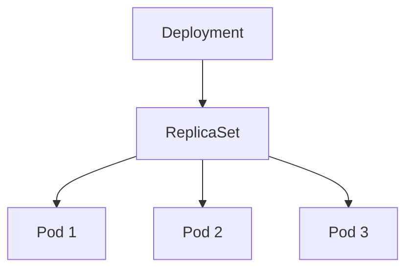

# Deployment

> **Difficulty:** ⭐⭐ Beginner
>
> **Prerequisites**
>
> - Pod
> - ReplicaSet
>
> **Next Chapter**
>
> Service

---

# Learning Objectives

After this chapter, you'll understand:

- What a Deployment is
- Why Deployments are used
- Deployment architecture
- Rolling Updates
- Rollbacks
- Scaling
- Deployment strategies
- Best practices

---

# What is a Deployment?

A **Deployment** is a Kubernetes object used to manage stateless applications.

It provides:

- Declarative application management
- Scaling
- Rolling updates
- Rollbacks
- Self-healing (through ReplicaSets)

A Deployment does **not** manage Pods directly.

Instead, it manages **ReplicaSets**, which in turn manage Pods.

---

# Deployment Architecture



The hierarchy is:

```text
Deployment
    ↓
ReplicaSet
    ↓
Pods
```

---

# Why Use a Deployment?

Suppose you create only a ReplicaSet.

It can:

- Maintain replicas
- Replace failed Pods

But it **cannot**:

- Perform rolling updates
- Roll back to previous versions
- Maintain deployment history

Deployments add these capabilities.

---

# Deployment YAML

```yaml
apiVersion: apps/v1
kind: Deployment

metadata:
  name: nginx-deployment

spec:
  replicas: 3

  selector:
    matchLabels:
      app: nginx

  template:
    metadata:
      labels:
        app: nginx

    spec:
      containers:
      - name: nginx
        image: nginx:1.27
```

Create:

```bash
kubectl apply -f deployment.yaml
```

---

# Important Fields

## replicas

Number of desired Pods.

```yaml
replicas: 3
```

---

## selector

Matches Pods managed by the Deployment.

```yaml
selector:
  matchLabels:
    app: nginx
```

---

## template

Defines the Pod template.

Every new Pod is created using this template.

---

# Deployment Lifecycle

```text
Deployment
      │
      ▼
ReplicaSet
      │
      ▼
Pods
```

If a Pod fails:

```text
ReplicaSet

↓

Creates Replacement Pod
```

The Deployment ensures the ReplicaSet itself remains in the desired state.

---

# Scaling

Increase replicas:

```bash
kubectl scale deployment nginx-deployment --replicas=5
```

Decrease replicas:

```bash
kubectl scale deployment nginx-deployment --replicas=2
```

The Deployment updates the ReplicaSet, which then creates or removes Pods.

---

# Rolling Update

One of the biggest advantages of Deployments is **Rolling Updates**.

Suppose the current version is:

```
nginx:1.27
```

Update to:

```
nginx:1.28
```

Kubernetes replaces Pods gradually.

```text
Old Pod

↓

New Pod Created

↓

Ready?

↓

Old Pod Removed
```

Users experience little or no downtime.

---

# Deployment Strategies

Kubernetes supports two update strategies.

## RollingUpdate (Default)

Updates Pods gradually.

```text
Old Pod

↓

New Pod

↓

Old Pod Removed
```

Suitable for most production applications.

---

## Recreate

Deletes all existing Pods before creating new ones.

```text
Delete All Pods

↓

Create New Pods
```

This causes downtime but may be required for applications that cannot run multiple versions simultaneously.

---

# Strategy Configuration

```yaml
strategy:
  type: RollingUpdate
```

or

```yaml
strategy:
  type: Recreate
```

---

# Rolling Update Parameters

For `RollingUpdate`, you can control:

```yaml
strategy:
  rollingUpdate:
    maxSurge: 1
    maxUnavailable: 1
```

### maxSurge

Maximum extra Pods that can be created during an update.

### maxUnavailable

Maximum Pods allowed to be unavailable during the update.

These settings help balance deployment speed and application availability.

---

# Rollback

If a deployment fails after an update:

View rollout history:

```bash
kubectl rollout history deployment nginx-deployment
```

Rollback:

```bash
kubectl rollout undo deployment nginx-deployment
```

Kubernetes restores the previous ReplicaSet.

---

# Check Rollout Status

```bash
kubectl rollout status deployment nginx-deployment
```

Useful for monitoring updates.

---

# Update an Image

```bash
kubectl set image deployment/nginx-deployment nginx=nginx:1.28
```

Kubernetes automatically starts a rolling update.

---

# Deployment vs ReplicaSet

| Deployment | ReplicaSet |
|------------|------------|
| Manages ReplicaSets | Manages Pods |
| Rolling updates | No rolling updates |
| Rollback support | No rollback |
| Deployment history | No history |

---

# Common kubectl Commands

Create:

```bash
kubectl apply -f deployment.yaml
```

View Deployments:

```bash
kubectl get deployments
```

Describe Deployment:

```bash
kubectl describe deployment nginx-deployment
```

Scale:

```bash
kubectl scale deployment nginx-deployment --replicas=5
```

Update Image:

```bash
kubectl set image deployment/nginx-deployment nginx=nginx:1.28
```

Check Rollout:

```bash
kubectl rollout status deployment nginx-deployment
```

Rollback:

```bash
kubectl rollout undo deployment nginx-deployment
```

Delete:

```bash
kubectl delete deployment nginx-deployment
```

---

# Best Practices

- Use Deployments for stateless applications.
- Prefer `RollingUpdate` for production.
- Avoid using the `latest` image tag.
- Configure readiness probes before performing rolling updates.
- Use meaningful labels and selectors.
- Monitor rollout status during deployments.

---

# Common Mistakes

❌ Creating ReplicaSets directly for production.

✔ Create Deployments instead.

---

❌ Using `Recreate` unnecessarily.

✔ Use `RollingUpdate` unless downtime is acceptable.

---

❌ Updating Pods manually.

✔ Update the Deployment specification.

---

❌ Ignoring rollout failures.

✔ Always check rollout status after updates.

---

# Interview Questions

### Beginner

- What is a Deployment?
- Why is it preferred over a ReplicaSet?
- What is a rolling update?
- What is a rollback?
- How do you scale a Deployment?

---

### Intermediate

- Explain the Deployment architecture.
- What are `maxSurge` and `maxUnavailable`?
- How does Kubernetes perform a rolling update?
- How do you roll back a failed Deployment?
- Explain the difference between `RollingUpdate` and `Recreate`.

---

# Cheat Sheet

```text
Deployment
│
├── Manages ReplicaSets
├── Supports Scaling
├── Rolling Updates
├── Rollbacks
├── Self-Healing
└── Declarative Management
```

---

# Key Takeaways

- A Deployment is the recommended way to manage stateless applications.
- It manages ReplicaSets, which manage Pods.
- Rolling updates minimize downtime during application upgrades.
- Rollbacks allow quick recovery from failed deployments.
- Deployments provide a declarative approach to application lifecycle management.

---

# Next Chapter

**04_Service.md**

Learn how Services provide stable networking, service discovery, and load balancing for Pods.
