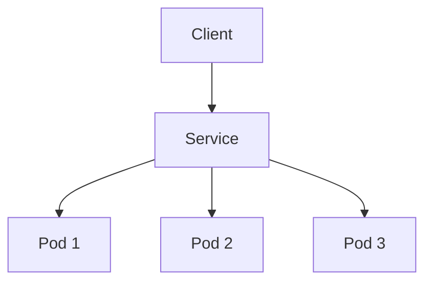

# Service

> **Difficulty:** ⭐⭐ Beginner
>
> **Prerequisites**
>
> - Pod
> - Deployment
>
> **Next Chapter**
>
> Namespace

---

# Learning Objectives

After this chapter, you'll understand:

- What a Service is
- Why Services are needed
- How Services discover Pods
- Types of Services
- Label Selectors
- EndpointSlices
- Service YAML
- Best practices

---

# What is a Service?

A **Service** is a Kubernetes object that provides a **stable network endpoint** for a group of Pods.

Since Pods are ephemeral and their IP addresses can change, a Service provides:

- A stable IP address (ClusterIP)
- A stable DNS name
- Load balancing across Pods
- Service discovery

---

# Why Do We Need a Service?

Imagine a Deployment with three Pods.

```text
Pod A → 10.244.1.5
Pod B → 10.244.2.8
Pod C → 10.244.3.12
```

If Pod A crashes:

```text
Old Pod → Deleted
New Pod → 10.244.5.21
```

The IP changes.

Applications cannot reliably communicate using Pod IPs.

Instead, they communicate through a Service.

---

# Service Architecture



The Service automatically distributes traffic among healthy Pods.

---

# How Does a Service Find Pods?

A Service uses **labels**.

Pods:

```yaml
labels:
  app: nginx
```

Service:

```yaml
selector:
  app: nginx
```

Every Pod with matching labels becomes a backend for the Service.

---

# Service YAML

```yaml
apiVersion: v1
kind: Service

metadata:
  name: nginx-service

spec:
  selector:
    app: nginx

  ports:
    - port: 80
      targetPort: 80

  type: ClusterIP
```

Create:

```bash
kubectl apply -f service.yaml
```

---

# Important Fields

## selector

Identifies which Pods receive traffic.

```yaml
selector:
  app: nginx
```

---

## port

The port exposed by the Service.

```yaml
port: 80
```

---

## targetPort

The port on the Pod.

```yaml
targetPort: 8080
```

Traffic arriving on `port` is forwarded to `targetPort`.

---

## type

Specifies how the Service is exposed.

Example:

```yaml
type: ClusterIP
```

---

# Service Types

## 1. ClusterIP (Default)

Accessible only inside the cluster.

```text
Pod
   ↓
ClusterIP Service
   ↓
Backend Pods
```

Used for communication between microservices.

---

## 2. NodePort

Exposes the Service on every Worker Node.

```text
Client

↓

NodeIP:30080

↓

Service

↓

Pods
```

Useful for testing or simple external access.

---

## 3. LoadBalancer

Creates an external load balancer (supported by most cloud providers).

```text
Internet

↓

Load Balancer

↓

Service

↓

Pods
```

Common in production cloud environments.

---

## 4. ExternalName

Maps a Service to an external DNS name.

Example:

```yaml
type: ExternalName
externalName: database.example.com
```

No ClusterIP is created.

---

# EndpointSlices

A Service does not store Pod IPs directly.

Instead, Kubernetes creates **EndpointSlices** containing the backend Pod addresses.

```text
Service

↓

EndpointSlice

↓

Pod 1
Pod 2
Pod 3
```

When Pods are added or removed, EndpointSlices are updated automatically.

---

# DNS

Every Service automatically receives a DNS name.

Example:

```
nginx-service.default.svc.cluster.local
```

Within the same namespace, applications can usually use the shorter name:

```
nginx-service
```

instead of the full DNS name.

---

# Service vs Pod

| Pod | Service |
|------|---------|
| Temporary IP | Stable IP |
| Can disappear | Stable endpoint |
| Runs application | Routes traffic |
| Managed by Deployment | Selects Pods using labels |

---

# Common kubectl Commands

Create:

```bash
kubectl apply -f service.yaml
```

List Services:

```bash
kubectl get svc
```

Describe Service:

```bash
kubectl describe svc nginx-service
```

View EndpointSlices:

```bash
kubectl get endpointslices
```

Delete:

```bash
kubectl delete svc nginx-service
```

---

# Best Practices

- Always access applications through a Service.
- Use meaningful labels and selectors.
- Prefer ClusterIP for internal communication.
- Use LoadBalancer for cloud-based external access.
- Verify readiness probes so only healthy Pods receive traffic.

---

# Common Mistakes

❌ Connecting directly to Pod IPs.

✔ Use a Service.

---

❌ Incorrect label selectors.

✔ Ensure Service selectors match Pod labels.

---

❌ Assuming a Service creates Pods.

✔ A Service only routes traffic.

---

❌ Exposing every Service externally.

✔ Use ClusterIP unless external access is required.

---

# Interview Questions

### Beginner

- What is a Service?
- Why do we need Services?
- What is a ClusterIP?
- What is a selector?
- What is the difference between `port` and `targetPort`?

---

### Intermediate

- Explain the different Service types.
- How does a Service discover Pods?
- What are EndpointSlices?
- Why shouldn't applications use Pod IPs directly?
- How does Kubernetes load balance traffic?

---

# Cheat Sheet

```text
Service
│
├── Stable IP
├── Stable DNS
├── Load Balancing
├── Uses Label Selectors
├── Uses EndpointSlices
└── Routes Traffic to Pods
```

---

# Key Takeaways

- A Service provides a stable way to access Pods.
- It selects Pods using labels.
- Services support load balancing and service discovery.
- ClusterIP is the default Service type.
- EndpointSlices track the Pods behind a Service.
- Applications should communicate with Services, not Pod IPs.

---

# Next Chapter

**05_Namespace.md**

Learn how Kubernetes organizes and isolates resources using Namespaces.
