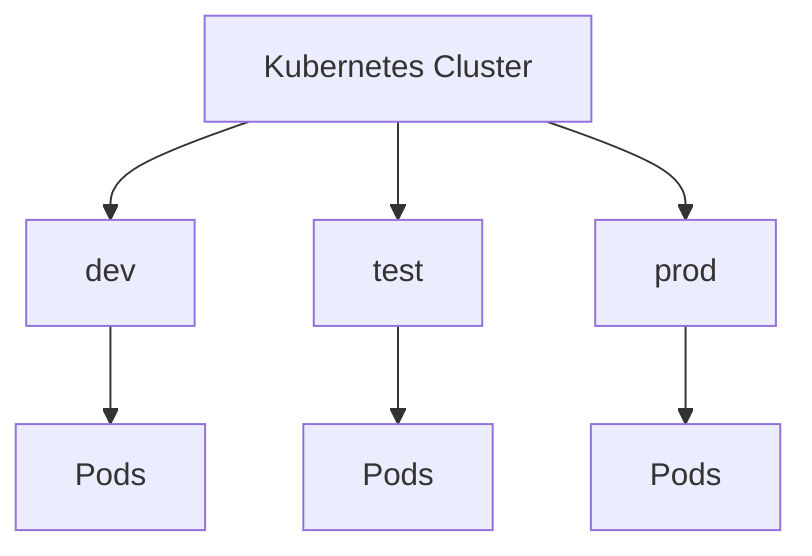

# Namespace

> **Difficulty:** ⭐⭐ Beginner
>
> **Prerequisites**
>
> - Pod
> - Deployment
> - Service
>
> **Next Chapter**
>
> ConfigMap

---

# Learning Objectives

After this chapter, you'll understand:

- What a Namespace is
- Why Namespaces are used
- Default Namespaces
- Namespace isolation
- Namespace YAML
- Common commands
- Best practices

---

# What is a Namespace?

A **Namespace** is a logical partition within a Kubernetes cluster.

It allows multiple teams, applications, or environments to share the same cluster while keeping their resources organized and isolated.

Think of a Namespace as a folder that groups related Kubernetes resources.

---

# Why Do We Need Namespaces?

Suppose a company has three teams:

- Development
- Testing
- Production

Without Namespaces:

```text
Cluster
├── frontend
├── backend
├── database
├── frontend
├── backend
└── database
```

Resource names would conflict.

With Namespaces:

```text
Cluster
├── dev
│   ├── frontend
│   └── backend
│
├── test
│   ├── frontend
│   └── backend
│
└── prod
    ├── frontend
    └── backend
```

Each Namespace has its own set of resources.

---

# Namespace Architecture



---

# Default Namespaces

Every Kubernetes cluster includes several built-in Namespaces.

| Namespace | Purpose |
|-----------|---------|
| `default` | User resources (default location) |
| `kube-system` | Kubernetes system components |
| `kube-public` | Publicly readable resources |
| `kube-node-lease` | Node heartbeat information |

View them:

```bash
kubectl get namespaces
```

---

# Creating a Namespace

YAML:

```yaml
apiVersion: v1
kind: Namespace

metadata:
  name: development
```

Create:

```bash
kubectl apply -f namespace.yaml
```

Or directly:

```bash
kubectl create namespace development
```

---

# Creating Resources in a Namespace

Example:

```yaml
metadata:
  name: frontend
  namespace: development
```

Or use:

```bash
kubectl apply -f deployment.yaml -n development
```

---

# Viewing Resources

Pods in the default Namespace:

```bash
kubectl get pods
```

Pods in a specific Namespace:

```bash
kubectl get pods -n development
```

Pods in all Namespaces:

```bash
kubectl get pods -A
```

---

# Resource Names

The same resource name can exist in different Namespaces.

Example:

```text
development/frontend

production/frontend
```

These are different resources and do not conflict.

---

# Namespace Isolation

Namespaces provide **logical isolation**.

Resources such as Pods, Services, ConfigMaps, and Secrets are generally scoped to a Namespace.

However, some resources are **cluster-wide**.

Examples include:

- Nodes
- PersistentVolumes
- Namespaces
- StorageClasses

---

# DNS Across Namespaces

Within the same Namespace:

```text
backend-service
```

Across Namespaces:

```text
backend-service.production.svc.cluster.local
```

Using the fully qualified domain name (FQDN) avoids ambiguity.

---

# When to Create a Namespace?

Good use cases:

- Different environments (dev, test, prod)
- Multiple teams
- Different applications
- Resource quotas
- Access control (RBAC)

Avoid creating a Namespace for every small microservice unless there is a clear operational need.

---

# Common kubectl Commands

Create:

```bash
kubectl create namespace development
```

List:

```bash
kubectl get namespaces
```

Describe:

```bash
kubectl describe namespace development
```

Delete:

```bash
kubectl delete namespace development
```

Switch Namespace (current context):

```bash
kubectl config set-context --current --namespace=development
```

---

# Best Practices

- Use separate Namespaces for different environments.
- Follow consistent naming conventions.
- Apply RBAC at the Namespace level where appropriate.
- Use ResourceQuotas for shared clusters.
- Avoid putting everything in the `default` Namespace.

---

# Common Mistakes

❌ Using only the `default` Namespace.

✔ Create Namespaces for projects or environments.

---

❌ Assuming Namespaces provide complete security isolation.

✔ Namespaces provide logical isolation. Additional controls like RBAC and NetworkPolicies are needed for stronger isolation.

---

❌ Deleting a Namespace without checking its contents.

✔ Deleting a Namespace removes all namespaced resources inside it.

---

# Interview Questions

### Beginner

- What is a Namespace?
- Why do we use Namespaces?
- Name the default Namespaces.
- Can two Namespaces contain resources with the same name?

---

### Intermediate

- Which Kubernetes resources are not namespaced?
- How do Services communicate across Namespaces?
- How do you change the current Namespace for `kubectl`?
- When should you create separate Namespaces?

---

# Cheat Sheet

```text
Namespace
│
├── Logical Isolation
├── Resource Organization
├── Environment Separation
├── Team Separation
├── Supports RBAC & Resource Quotas
└── Namespaced Resources
```

---

# Key Takeaways

- A Namespace logically separates resources within a cluster.
- It helps organize applications and environments.
- Resources in different Namespaces can have the same name.
- Some Kubernetes resources are cluster-scoped and do not belong to a Namespace.
- Namespaces are commonly combined with RBAC and ResourceQuotas for multi-tenant clusters.

---

# Next Chapter

**06_ConfigMap.md**

Learn how ConfigMaps store application configuration separately from container images.
