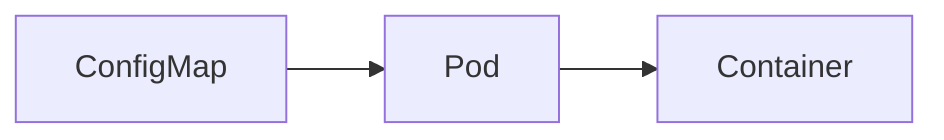

# ConfigMap

> **Difficulty:** ⭐⭐ Beginner
>
> **Prerequisites**
>
> - Pod
> - Deployment
>
> **Next Chapter**
>
> Secret

---

# Learning Objectives

After this chapter, you'll understand:

- What a ConfigMap is
- Why ConfigMaps are used
- Different ways to create ConfigMaps
- Using ConfigMaps as Environment Variables
- Mounting ConfigMaps as Volumes
- Best practices

---

# What is a ConfigMap?

A **ConfigMap** is a Kubernetes object used to store **non-sensitive configuration data** as key-value pairs.

It allows you to separate configuration from your application code.

Examples:

- Application settings
- URLs
- Feature flags
- Log levels
- Configuration files

---

# Why Use a ConfigMap?

Instead of hardcoding configuration:

```yaml
env:
- name: APP_MODE
  value: production
```

Store it in a ConfigMap:

```yaml
env:
- name: APP_MODE
  valueFrom:
    configMapKeyRef:
      name: app-config
      key: APP_MODE
```

Now the same container image can be used across different environments.

---

# ConfigMap Architecture



The ConfigMap provides configuration to the Pod.

---

# Creating a ConfigMap (YAML)

```yaml
apiVersion: v1
kind: ConfigMap

metadata:
  name: app-config

data:
  APP_MODE: production
  LOG_LEVEL: info
```

Apply:

```bash
kubectl apply -f configmap.yaml
```

---

# Creating from Command Line

```bash
kubectl create configmap app-config \
  --from-literal=APP_MODE=production \
  --from-literal=LOG_LEVEL=info
```

---

# View ConfigMaps

```bash
kubectl get configmaps
```

Describe:

```bash
kubectl describe configmap app-config
```

---

# Using as Environment Variables

Example:

```yaml
containers:
- name: app
  image: my-app

  env:
  - name: APP_MODE
    valueFrom:
      configMapKeyRef:
        name: app-config
        key: APP_MODE
```

The application receives:

```text
APP_MODE=production
```

---

# Import All Keys

Instead of importing one key at a time:

```yaml
envFrom:
- configMapRef:
    name: app-config
```

Every key becomes an environment variable.

Example:

```text
APP_MODE=production
LOG_LEVEL=info
```

---

# Mount as a Volume

ConfigMaps can also be mounted as files.

```yaml
volumes:
- name: config
  configMap:
    name: app-config
```

Mount:

```yaml
volumeMounts:
- name: config
  mountPath: /etc/config
```

Result:

```text
/etc/config/
├── APP_MODE
└── LOG_LEVEL
```

Each key becomes a file.

---

# Creating from a File

Suppose:

```
config.properties
```

```properties
APP_MODE=production
LOG_LEVEL=info
```

Create:

```bash
kubectl create configmap app-config \
  --from-file=config.properties
```

---

# ConfigMap vs Hardcoding

| Hardcoded | ConfigMap |
|-----------|-----------|
| Rebuild image to change config | Update ConfigMap |
| Same config everywhere | Environment-specific config |
| Less flexible | More flexible |

---

# ConfigMap vs Secret

| ConfigMap | Secret |
|------------|---------|
| Non-sensitive data | Sensitive data |
| Plain text | Base64 encoded (not encrypted by default) |
| App configuration | Passwords, API keys, tokens |

Never store passwords in a ConfigMap.

---

# Common kubectl Commands

Create:

```bash
kubectl apply -f configmap.yaml
```

View:

```bash
kubectl get configmaps
```

Describe:

```bash
kubectl describe configmap app-config
```

Delete:

```bash
kubectl delete configmap app-config
```

---

# Best Practices

- Store only non-sensitive configuration.
- Keep configuration separate from application code.
- Use descriptive names.
- Group related settings in the same ConfigMap.
- Use Secrets for confidential information.

---

# Common Mistakes

❌ Storing passwords in ConfigMaps.

✔ Use Secrets.

---

❌ Hardcoding environment-specific values in container images.

✔ Store them in ConfigMaps.

---

❌ Creating many tiny ConfigMaps unnecessarily.

✔ Group logically related configuration together.

---

# Interview Questions

### Beginner

- What is a ConfigMap?
- Why do we use ConfigMaps?
- How do you create a ConfigMap?
- How can a Pod use a ConfigMap?

---

### Intermediate

- What is the difference between `env` and `envFrom`?
- Explain mounting a ConfigMap as a volume.
- What is the difference between ConfigMap and Secret?
- Can ConfigMaps store binary data?

---

# Cheat Sheet

```text
ConfigMap
│
├── Stores Non-sensitive Data
├── Key-Value Pairs
├── Environment Variables
├── Mounted as Files
└── Separates Configuration from Code
```

---

# Key Takeaways

- ConfigMaps store application configuration.
- They help separate configuration from container images.
- They can be consumed as environment variables or mounted files.
- They are intended only for non-sensitive data.
- Secrets should be used for passwords, tokens, and other confidential values.

---

# Next Chapter

**07_Secret.md**

Learn how Kubernetes securely manages sensitive information such as passwords, API keys, certificates, and tokens.
