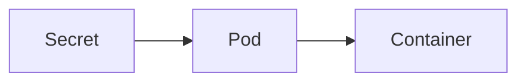

# Secret

> **Difficulty:** ⭐⭐ Beginner
>
> **Prerequisites**
>
> - ConfigMap
>
> **Next Chapter**
>
> Job

---

# Learning Objectives

After this chapter, you'll understand:

- What a Secret is
- Why Secrets are used
- Secret types
- Creating Secrets
- Using Secrets in Pods
- ConfigMap vs Secret
- Best practices

---

# What is a Secret?

A **Secret** is a Kubernetes object used to store **sensitive information**.

Examples include:

- Passwords
- API Keys
- Database Credentials
- OAuth Tokens
- TLS Certificates
- SSH Keys

Like ConfigMaps, Secrets store data as key-value pairs, but they are intended for confidential information.

---

# Why Use Secrets?

Instead of hardcoding credentials:

```yaml
env:
- name: DB_PASSWORD
  value: MyPassword123
```

Store them separately:

```yaml
env:
- name: DB_PASSWORD
  valueFrom:
    secretKeyRef:
      name: db-secret
      key: password
```

This keeps sensitive data separate from application code and container images.

---

# Secret Architecture



---

# Secret YAML

```yaml
apiVersion: v1
kind: Secret

metadata:
  name: db-secret

type: Opaque

data:
  username: YWRtaW4=
  password: cGFzc3dvcmQxMjM=
```

The values are Base64 encoded.

Create:

```bash
kubectl apply -f secret.yaml
```

---

# Base64 Encoding

Secrets use Base64 encoding.

Example:

```text
admin
```

↓

```text
YWRtaW4=
```

**Important:**

Base64 is **encoding**, not encryption.

Anyone with access to the Secret can decode it.

Real security depends on:

- RBAC
- etcd encryption at rest (if enabled)
- Access control

---

# Create Secret from Command Line

```bash
kubectl create secret generic db-secret \
  --from-literal=username=admin \
  --from-literal=password=password123
```

---

# View Secrets

```bash
kubectl get secrets
```

Describe:

```bash
kubectl describe secret db-secret
```

To view decoded values:

```bash
kubectl get secret db-secret -o yaml
```

---

# Using Secrets as Environment Variables

```yaml
env:
- name: DB_USERNAME
  valueFrom:
    secretKeyRef:
      name: db-secret
      key: username

- name: DB_PASSWORD
  valueFrom:
    secretKeyRef:
      name: db-secret
      key: password
```

The application receives:

```text
DB_USERNAME=admin
DB_PASSWORD=password123
```

---

# Mounting Secrets as Volumes

Secrets can also be mounted as files.

```yaml
volumes:
- name: secret-volume
  secret:
    secretName: db-secret
```

Mount it:

```yaml
volumeMounts:
- name: secret-volume
  mountPath: /etc/secrets
  readOnly: true
```

Files created:

```text
/etc/secrets/
├── username
└── password
```

---

# Secret Types

| Type | Purpose |
|------|---------|
| Opaque | Generic Secret |
| kubernetes.io/tls | TLS Certificate |
| kubernetes.io/dockerconfigjson | Container Registry Credentials |
| kubernetes.io/basic-auth | Username & Password |
| kubernetes.io/ssh-auth | SSH Keys |

`Opaque` is the default and most commonly used type.

---

# ConfigMap vs Secret

| ConfigMap | Secret |
|-----------|---------|
| Non-sensitive data | Sensitive data |
| Plain text | Base64 encoded |
| App configuration | Passwords, Keys, Tokens |

Use:

- **ConfigMap** → Configuration
- **Secret** → Credentials

---

# Common kubectl Commands

Create:

```bash
kubectl apply -f secret.yaml
```

List:

```bash
kubectl get secrets
```

Describe:

```bash
kubectl describe secret db-secret
```

Delete:

```bash
kubectl delete secret db-secret
```

---

# Best Practices

- Never hardcode credentials in YAML files or source code.
- Use Secrets only for sensitive data.
- Enable etcd encryption at rest in production.
- Restrict Secret access using RBAC.
- Mount Secrets as read-only volumes when possible.
- Rotate credentials regularly.

---

# Common Mistakes

❌ Assuming Base64 is encryption.

✔ Base64 is only an encoding format.

---

❌ Storing passwords in ConfigMaps.

✔ Store them in Secrets.

---

❌ Committing Secret YAML files with real credentials to Git.

✔ Use external secret management or inject values during deployment.

---

# Interview Questions

### Beginner

- What is a Secret?
- Why are Secrets used?
- How are Secrets different from ConfigMaps?
- How can a Pod consume a Secret?

---

### Intermediate

- Is Base64 encryption?
- What are the common Secret types?
- Explain mounting a Secret as a volume.
- How do you secure Secrets in production?

---

# Cheat Sheet

```text
Secret
│
├── Stores Sensitive Data
├── Key-Value Pairs
├── Base64 Encoded
├── Environment Variables
├── Mounted as Files
└── Protected Using RBAC & etcd Encryption
```

---

# Key Takeaways

- Secrets store sensitive information such as passwords, API keys, and certificates.
- They can be exposed to applications as environment variables or mounted files.
- Base64 encoding is **not** encryption.
- Protect Secrets with RBAC and enable etcd encryption at rest in production.
- Use ConfigMaps for configuration and Secrets for confidential data.

---

# Next Chapter

**08_Job.md**

Learn how Kubernetes runs one-time and batch workloads using Jobs.
