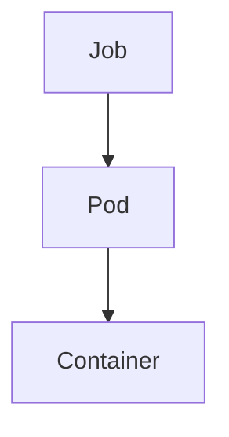

# Job

> **Difficulty:** ⭐⭐ Beginner
>
> **Prerequisites**
>
> - Pod
> - Deployment
>
> **Next Chapter**
>
> CronJob

---

# Learning Objectives

After this chapter, you'll understand:

- What a Job is
- Why Jobs are used
- Job lifecycle
- Job YAML
- Parallel Jobs
- Restart behavior
- Best practices

---

# What is a Job?

A **Job** is a Kubernetes object that runs a task **until it completes successfully**.

Unlike a Deployment, a Job is **not** designed to run forever.

Typical use cases:

- Database migration
- Backup
- Data processing
- Report generation
- Batch processing
- Machine Learning training

---

# Deployment vs Job

| Deployment | Job |
|------------|-----|
| Long-running application | One-time task |
| Runs continuously | Stops after completion |
| Restarts indefinitely | Finishes after success |
| Used for web applications | Used for batch workloads |

---

# Job Architecture



The Job creates one or more Pods and tracks their completion.

---

# Job Lifecycle

```text
Create Job
     │
     ▼
Create Pod
     │
     ▼
Run Task
     │
     ▼
Completed?
     │
 ┌───┴────┐
 │        │
No       Yes
 │        │
Retry   Job Complete
```

---

# Job YAML

```yaml
apiVersion: batch/v1
kind: Job

metadata:
  name: pi-job

spec:
  template:
    spec:
      containers:
      - name: pi
        image: perl:5.34
        command:
        - perl
        - -Mbignum=bpi
        - -wle
        - "print bpi(1000)"

      restartPolicy: Never
```

Create:

```bash
kubectl apply -f job.yaml
```

---

# Important Fields

## template

Defines the Pod that executes the task.

---

## restartPolicy

Possible values:

```yaml
restartPolicy: Never
```

or

```yaml
restartPolicy: OnFailure
```

`Always` is **not supported** for Jobs.

---

## completions

Number of successful executions required.

Example:

```yaml
completions: 5
```

The Job finishes only after five successful completions.

---

## parallelism

Number of Pods allowed to run simultaneously.

Example:

```yaml
parallelism: 2
```

Two Pods can execute the Job at the same time.

---

# Example

```yaml
completions: 6
parallelism: 2
```

Execution:

```text
Pod 1 ✓

Pod 2 ✓

↓

Pod 3 ✓

Pod 4 ✓

↓

Pod 5 ✓

Pod 6 ✓
```

Only two Pods run concurrently.

---

# Retry Behavior

If a Job Pod fails:

```text
Pod Failed

↓

Job

↓

Create New Pod
```

The Job retries until:

- Success
- Retry limit reached

---

# backoffLimit

Controls how many retries are allowed.

Example:

```yaml
backoffLimit: 4
```

After four failed attempts:

```text
Job Failed
```

---

# TTL After Completion

Completed Jobs remain in the cluster unless removed.

Automatically clean them up:

```yaml
ttlSecondsAfterFinished: 300
```

The Job is deleted five minutes after completion.

---

# Viewing Jobs

```bash
kubectl get jobs
```

Describe:

```bash
kubectl describe job pi-job
```

View Pods:

```bash
kubectl get pods
```

Logs:

```bash
kubectl logs <pod-name>
```

---

# Common kubectl Commands

Create:

```bash
kubectl apply -f job.yaml
```

List:

```bash
kubectl get jobs
```

Describe:

```bash
kubectl describe job pi-job
```

Delete:

```bash
kubectl delete job pi-job
```

---

# Best Practices

- Use Jobs for one-time or batch tasks.
- Set `backoffLimit` appropriately.
- Configure `ttlSecondsAfterFinished` to clean up completed Jobs.
- Use `OnFailure` when retries are appropriate.
- Monitor Job status and logs.

---

# Common Mistakes

❌ Using a Deployment for a one-time task.

✔ Use a Job.

---

❌ Forgetting to clean up completed Jobs.

✔ Use `ttlSecondsAfterFinished`.

---

❌ Setting `restartPolicy: Always`.

✔ Jobs support only `Never` and `OnFailure`.

---

# Interview Questions

### Beginner

- What is a Job?
- How is a Job different from a Deployment?
- What is `restartPolicy` in a Job?
- What is `backoffLimit`?

---

### Intermediate

- Explain `parallelism` and `completions`.
- What happens if a Job Pod fails?
- How do you automatically clean up completed Jobs?
- When would you use a Job instead of a CronJob?

---

# Cheat Sheet

```text
Job
│
├── One-time Workload
├── Creates Pods
├── Retries on Failure
├── Supports Parallel Execution
├── Stops After Completion
└── Used for Batch Processing
```

---

# Key Takeaways

- Jobs are designed for finite tasks, not long-running applications.
- A Job completes after the required number of successful executions.
- `parallelism` controls concurrency, while `completions` controls total successful runs.
- Use `backoffLimit` to limit retries.
- Configure `ttlSecondsAfterFinished` to automatically remove completed Jobs.

---

# Next Chapter

**09_CronJob.md**

Learn how Kubernetes schedules Jobs to run automatically at specified times using CronJobs.
