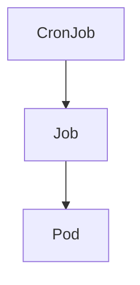

# CronJob

> **Difficulty:** ⭐⭐ Beginner
>
> **Prerequisites**
>
> - Job
>
> **Next Chapter**
>
> DaemonSet

---

# Learning Objectives

After this chapter, you'll understand:

- What a CronJob is
- Why CronJobs are used
- Cron schedule format
- CronJob YAML
- Concurrency policies
- Missed schedules
- Best practices

---

# What is a CronJob?

A **CronJob** creates **Jobs on a schedule**.

It is used for recurring tasks such as:

- Database backups
- Sending reports
- Log cleanup
- Cache cleanup
- Data synchronization
- Scheduled scripts

Instead of manually creating a Job every day, Kubernetes creates it automatically.

---

# CronJob Architecture



The flow is:

```text
CronJob
    ↓
Job
    ↓
Pod
```

---

# CronJob Lifecycle

```text
Scheduled Time
      │
      ▼
CronJob
      │
      ▼
Create Job
      │
      ▼
Create Pod
      │
      ▼
Task Executes
      │
      ▼
Job Completes
```

Every scheduled execution creates a **new Job**.

---

# CronJob YAML

```yaml
apiVersion: batch/v1
kind: CronJob

metadata:
  name: backup-job

spec:
  schedule: "0 2 * * *"

  jobTemplate:
    spec:
      template:
        spec:
          containers:
          - name: backup
            image: busybox
            command:
            - echo
            - "Running Backup"

          restartPolicy: OnFailure
```

Create:

```bash
kubectl apply -f cronjob.yaml
```

---

# Schedule Format

CronJobs use standard cron syntax.

```
* * * * *
│ │ │ │ │
│ │ │ │ └── Day of Week (0–6)
│ │ │ └──── Month (1–12)
│ │ └────── Day of Month (1–31)
│ └──────── Hour (0–23)
└────────── Minute (0–59)
```

Examples:

| Schedule | Meaning |
|----------|---------|
| `* * * * *` | Every minute |
| `0 * * * *` | Every hour |
| `0 0 * * *` | Every day at midnight |
| `0 2 * * *` | Every day at 2:00 AM |
| `0 0 * * 0` | Every Sunday |

---

# jobTemplate

A CronJob doesn't run containers directly.

It contains a Job template.

```yaml
jobTemplate:
  spec:
```

Every scheduled run creates a new Job using this template.

---

# Concurrency Policy

Controls what happens if the previous Job is still running.

### Allow (Default)

```yaml
concurrencyPolicy: Allow
```

Multiple Jobs can run simultaneously.

---

### Forbid

```yaml
concurrencyPolicy: Forbid
```

Skip the next execution if the previous Job is still running.

---

### Replace

```yaml
concurrencyPolicy: Replace
```

Stop the currently running Job and start a new one.

---

# Suspend a CronJob

Temporarily stop scheduling:

```yaml
suspend: true
```

Existing Jobs continue running.

No new Jobs are created until suspension is removed.

---

# Successful & Failed Job History

Limit how many completed Jobs Kubernetes keeps.

```yaml
successfulJobsHistoryLimit: 3

failedJobsHistoryLimit: 1
```

Older Jobs are automatically removed.

---

# startingDeadlineSeconds

Suppose the cluster is unavailable during the scheduled time.

```yaml
startingDeadlineSeconds: 300
```

The Job can still start if Kubernetes recovers within five minutes.

After that deadline, the execution is skipped.

---

# Common kubectl Commands

Create:

```bash
kubectl apply -f cronjob.yaml
```

View:

```bash
kubectl get cronjobs
```

Describe:

```bash
kubectl describe cronjob backup-job
```

Suspend:

```bash
kubectl patch cronjob backup-job \
-p '{"spec":{"suspend":true}}'
```

Delete:

```bash
kubectl delete cronjob backup-job
```

---

# Best Practices

- Use CronJobs only for scheduled tasks.
- Set appropriate history limits.
- Use `Forbid` for backups and financial jobs.
- Configure `startingDeadlineSeconds`.
- Monitor Job failures.

---

# Common Mistakes

❌ Using a CronJob for continuously running applications.

✔ Use a Deployment.

---

❌ Forgetting to clean old Jobs.

✔ Configure history limits.

---

❌ Choosing the wrong concurrency policy.

✔ Select the policy based on your workload.

---

# Interview Questions

### Beginner

- What is a CronJob?
- How is it different from a Job?
- What is the cron schedule format?
- What is `jobTemplate`?

---

### Intermediate

- Explain `concurrencyPolicy`.
- What does `startingDeadlineSeconds` do?
- How do you suspend a CronJob?
- What happens if a scheduled Job is missed?

---

# Cheat Sheet

```text
CronJob
│
├── Runs Jobs on a Schedule
├── Uses Cron Syntax
├── Creates New Jobs
├── Supports Concurrency Policies
├── Can Be Suspended
└── Keeps Job History
```

---

# Key Takeaways

- A CronJob schedules Jobs automatically.
- Every execution creates a new Job.
- Cron syntax determines when Jobs run.
- Concurrency policies control overlapping executions.
- History limits prevent the accumulation of old Jobs.

---

# Next Chapter

**10_DaemonSet.md**

Learn how DaemonSets ensure that exactly one Pod runs on every eligible node in the cluster.
