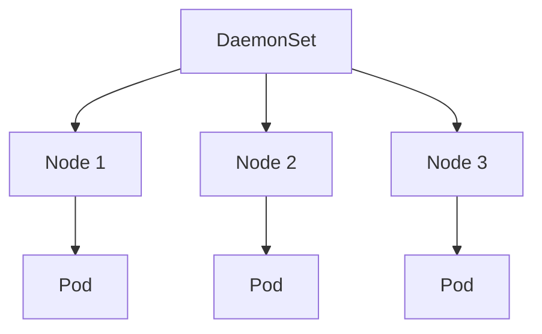

# DaemonSet

> **Difficulty:** ⭐⭐ Beginner
>
> **Prerequisites**
>
> - Pod
> - Deployment
>
> **Next Chapter**
>
> StatefulSet

---

# Learning Objectives

After this chapter, you'll understand:

- What a DaemonSet is
- Why DaemonSets are used
- How DaemonSets work
- DaemonSet YAML
- Node selectors and tolerations
- Best practices

---

# What is a DaemonSet?

A **DaemonSet** ensures that **one Pod runs on every eligible node** in the cluster.

When a new node joins the cluster, Kubernetes automatically schedules the DaemonSet Pod on that node.

When a node is removed, its DaemonSet Pod is also removed.

---

# Why Do We Need a DaemonSet?

Some applications must run on **every node**, not just a fixed number of replicas.

Common examples include:

- Log collectors (Fluent Bit, Fluentd)
- Monitoring agents (Node Exporter)
- Security agents
- Storage plugins
- CNI plugins

Using a Deployment for these workloads would not guarantee one Pod per node.

---

# DaemonSet Architecture



Each eligible node runs exactly one DaemonSet Pod.

---

# DaemonSet YAML

```yaml
apiVersion: apps/v1
kind: DaemonSet

metadata:
  name: fluent-bit

spec:
  selector:
    matchLabels:
      app: fluent-bit

  template:
    metadata:
      labels:
        app: fluent-bit

    spec:
      containers:
      - name: fluent-bit
        image: fluent/fluent-bit:latest
```

Create:

```bash
kubectl apply -f daemonset.yaml
```

---

# How DaemonSets Work

Suppose the cluster has three nodes.

```text
Node 1
Node 2
Node 3
```

Kubernetes creates:

```text
Node 1 → Pod

Node 2 → Pod

Node 3 → Pod
```

If a fourth node joins:

```text
Node 4
```

A new DaemonSet Pod is created automatically.

---

# Deployment vs DaemonSet

| Deployment | DaemonSet |
|------------|-----------|
| Fixed number of replicas | One Pod per eligible node |
| Used for applications | Used for node-level services |
| Scales manually | Scales automatically with nodes |

---

# Node Selection

Sometimes a DaemonSet should run only on specific nodes.

Example:

```yaml
nodeSelector:
  disk: ssd
```

Only nodes with:

```text
disk=ssd
```

receive the Pod.

---

# Taints and Tolerations

Control plane nodes are often tainted.

To allow a DaemonSet to run there, add a matching toleration.

Example:

```yaml
tolerations:
- operator: Exists
```

This is commonly used by networking and monitoring components.

---

# Updating a DaemonSet

Change the container image:

```yaml
image: fluent/fluent-bit:2.0
```

Apply:

```bash
kubectl apply -f daemonset.yaml
```

Kubernetes performs a rolling update across the nodes.

---

# Common kubectl Commands

Create:

```bash
kubectl apply -f daemonset.yaml
```

View:

```bash
kubectl get daemonsets
```

Describe:

```bash
kubectl describe daemonset fluent-bit
```

Delete:

```bash
kubectl delete daemonset fluent-bit
```

---

# Best Practices

- Use DaemonSets only for node-level services.
- Configure node selectors when appropriate.
- Add tolerations only when required.
- Keep DaemonSet Pods lightweight.
- Monitor rollout status after updates.

---

# Common Mistakes

❌ Using a DaemonSet for web applications.

✔ Use a Deployment.

---

❌ Assuming DaemonSets always run on control plane nodes.

✔ They must tolerate the node's taints if required.

---

❌ Forgetting node selectors.

✔ Limit scheduling when the workload is intended for specific nodes.

---

# Interview Questions

### Beginner

- What is a DaemonSet?
- Why do we use DaemonSets?
- Give some examples of DaemonSet workloads.
- How is a DaemonSet different from a Deployment?

---

### Intermediate

- What happens when a new node joins the cluster?
- How do node selectors affect a DaemonSet?
- Why are tolerations commonly used with DaemonSets?
- How does Kubernetes update a DaemonSet?

---

# Cheat Sheet

```text
DaemonSet
│
├── One Pod Per Eligible Node
├── Auto Scales With Nodes
├── Used for Node Services
├── Supports Node Selectors
└── Supports Rolling Updates
```

---

# Key Takeaways

- A DaemonSet ensures one Pod runs on every eligible node.
- It is ideal for logging, monitoring, networking, and storage agents.
- New nodes automatically receive a DaemonSet Pod.
- Node selectors and tolerations control where Pods are scheduled.
- DaemonSets are not intended for user-facing applications.

---

# Next Chapter

**11_StatefulSet.md**

Learn how StatefulSets manage stateful applications with stable identities, persistent storage, and ordered deployment.
