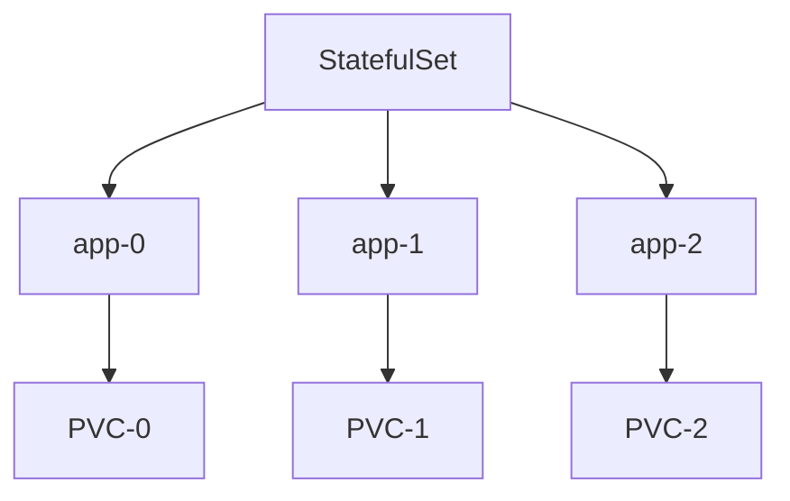

# StatefulSet

> **Difficulty:** ⭐⭐⭐ Intermediate
>
> **Prerequisites**
>
> - Pod
> - Deployment
> - Service
>
> **Next Chapter**
>
> Ingress

---

# Learning Objectives

After this chapter, you'll understand:

- What a StatefulSet is
- Why StatefulSets are needed
- StatefulSet characteristics
- Headless Services
- Stable Pod identities
- Persistent storage
- Ordered deployment
- Best practices

---

# What is a StatefulSet?

A **StatefulSet** is a Kubernetes workload used to manage **stateful applications**.

Unlike a Deployment, every Pod in a StatefulSet has:

- A stable name
- A stable network identity
- Its own persistent storage
- Ordered creation and deletion

---

# Why Do We Need a StatefulSet?

Applications like databases require stable identities.

Examples:

- MySQL
- PostgreSQL
- MongoDB
- Kafka
- ZooKeeper
- Elasticsearch

If a database Pod restarts, it should continue using the same storage and identity.

Deployments cannot guarantee this.

---

# Deployment vs StatefulSet

| Deployment | StatefulSet |
|------------|-------------|
| Stateless workloads | Stateful workloads |
| Pods are interchangeable | Every Pod is unique |
| Random Pod names | Stable Pod names |
| Shared or ephemeral storage | Dedicated persistent storage |
| Parallel creation | Ordered creation |

---

# StatefulSet Architecture



Each Pod has its own Persistent Volume Claim (PVC).

---

# StatefulSet YAML

```yaml
apiVersion: apps/v1
kind: StatefulSet

metadata:
  name: mysql

spec:
  serviceName: mysql

  replicas: 3

  selector:
    matchLabels:
      app: mysql

  template:
    metadata:
      labels:
        app: mysql

    spec:
      containers:
      - name: mysql
        image: mysql:8.0
```

Create:

```bash
kubectl apply -f statefulset.yaml
```

---

# Stable Pod Names

Pods receive predictable names.

Example:

```text
mysql-0

mysql-1

mysql-2
```

Even after a restart, the Pod keeps its name.

---

# Stable Network Identity

Each Pod receives a stable DNS name.

Example:

```text
mysql-0.mysql.default.svc.cluster.local

mysql-1.mysql.default.svc.cluster.local

mysql-2.mysql.default.svc.cluster.local
```

Applications can reliably communicate using these hostnames.

---

# Headless Service

A StatefulSet usually requires a **Headless Service**.

```yaml
clusterIP: None
```

Instead of providing one virtual IP, Kubernetes returns the IP address of each individual Pod.

This enables direct communication with specific replicas.

---

# Persistent Storage

Each Pod gets its own Persistent Volume Claim.

Example:

```text
mysql-0 → PVC-0

mysql-1 → PVC-1

mysql-2 → PVC-2
```

If a Pod restarts, it reconnects to the same storage.

---

# Ordered Deployment

Pods are created one at a time.

Example:

```text
mysql-0

↓

mysql-1

↓

mysql-2
```

The next Pod is created only after the previous one is ready.

---

# Ordered Deletion

Pods are removed in reverse order.

```text
mysql-2

↓

mysql-1

↓

mysql-0
```

This helps maintain application consistency.

---

# Scaling

Increase replicas:

```bash
kubectl scale statefulset mysql --replicas=5
```

New Pods:

```text
mysql-3

mysql-4
```

Each receives its own storage.

---

# Common kubectl Commands

Create:

```bash
kubectl apply -f statefulset.yaml
```

View:

```bash
kubectl get statefulsets
```

Describe:

```bash
kubectl describe statefulset mysql
```

Scale:

```bash
kubectl scale statefulset mysql --replicas=5
```

Delete:

```bash
kubectl delete statefulset mysql
```

---

# Best Practices

- Use StatefulSets only for stateful applications.
- Always use persistent storage.
- Use a Headless Service.
- Avoid manually changing Pod names.
- Test storage recovery procedures.

---

# Common Mistakes

❌ Using Deployments for databases.

✔ Use StatefulSets.

---

❌ Assuming Pods are interchangeable.

✔ Every StatefulSet Pod has a unique identity.

---

❌ Forgetting the Headless Service.

✔ It provides stable DNS records for each Pod.

---

# Interview Questions

### Beginner

- What is a StatefulSet?
- When should you use a StatefulSet?
- How is it different from a Deployment?
- Why are Pod names stable?

---

### Intermediate

- What is a Headless Service?
- Why does each Pod have its own PVC?
- Explain ordered deployment and deletion.
- Give examples of StatefulSet workloads.

---

# Cheat Sheet

```text
StatefulSet
│
├── Stateful Applications
├── Stable Pod Names
├── Stable DNS
├── Dedicated PVC per Pod
├── Ordered Deployment
└── Ordered Scaling
```

---

# Key Takeaways

- StatefulSets manage applications that require stable identity and persistent storage.
- Each Pod has a predictable name and dedicated storage.
- Headless Services provide stable DNS for Pods.
- Pods are created and deleted in order.
- Use StatefulSets for databases, message queues, and distributed systems.

---

# Next Chapter

**12_Ingress.md**

Learn how Ingress exposes HTTP/HTTPS applications, manages routing, TLS termination, and replaces multiple LoadBalancer Services with a single entry point.
