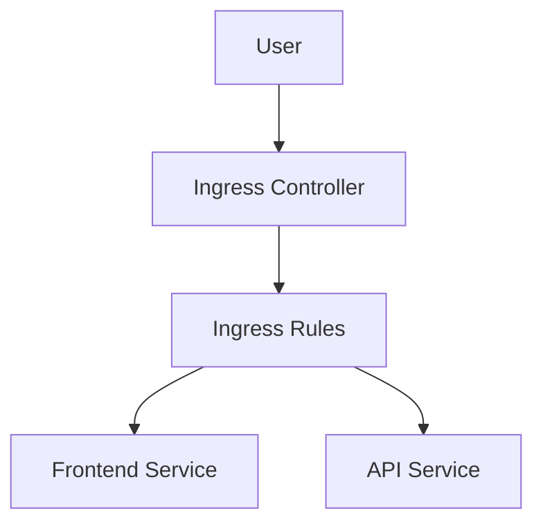

# Ingress

> **Difficulty:** ⭐⭐⭐ Intermediate
>
> **Prerequisites**
>
> - Service
> - Deployment
>
> **Next Chapter**
>
> Labels & Selectors

---

# Learning Objectives

After this chapter, you'll understand:

- What an Ingress is
- Why Ingress is needed
- Ingress vs LoadBalancer
- Ingress Controller
- Host-based routing
- Path-based routing
- TLS
- Best practices

---

# What is an Ingress?

An **Ingress** is a Kubernetes object that manages **HTTP and HTTPS traffic** entering the cluster.

Instead of exposing every application using its own LoadBalancer or NodePort Service, an Ingress provides a **single entry point** and routes requests to the appropriate Service.

---

# Why Do We Need an Ingress?

Suppose you have three applications.

Without Ingress:

```text
Internet
   │
   ├── LoadBalancer → Frontend
   ├── LoadBalancer → API
   └── LoadBalancer → Admin
```

This requires multiple external IPs and load balancers.

With Ingress:

```text
Internet
      │
      ▼
Ingress Controller
      │
 ┌────┼────┐
 ▼    ▼    ▼
Frontend API Admin
```

One entry point can route traffic to multiple Services.

---

# Important

**Ingress is only a set of routing rules.**

It does **not** process traffic by itself.

Traffic is handled by an **Ingress Controller**.

Common Ingress Controllers include:

- NGINX Ingress Controller
- Traefik
- HAProxy
- Kong
- AWS Load Balancer Controller

Without an Ingress Controller, an Ingress resource has no effect.

---

# Ingress Architecture



---

# Basic Ingress YAML

```yaml
apiVersion: networking.k8s.io/v1
kind: Ingress

metadata:
  name: app-ingress

spec:
  rules:
  - host: example.com

    http:
      paths:
      - path: /
        pathType: Prefix

        backend:
          service:
            name: frontend-service

            port:
              number: 80
```

Create:

```bash
kubectl apply -f ingress.yaml
```

---

# Host-Based Routing

Different domains can route to different applications.

Example:

| Host | Service |
|------|---------|
| app.example.com | Frontend |
| api.example.com | API |
| admin.example.com | Admin |

---

# Path-Based Routing

Different URL paths can route to different Services.

Example:

| Path | Service |
|------|---------|
| `/` | Frontend |
| `/api` | API |
| `/admin` | Admin |

Example YAML:

```yaml
paths:
- path: /api
  pathType: Prefix
```

---

# Ingress Class

If multiple Ingress Controllers exist in the cluster, specify which one should manage the Ingress.

```yaml
spec:
  ingressClassName: nginx
```

---

# TLS

Ingress can terminate HTTPS connections.

Example:

```yaml
tls:
- hosts:
  - example.com

  secretName: tls-secret
```

The referenced Secret contains the TLS certificate and private key.

---

# Ingress vs Service

| Service | Ingress |
|---------|---------|
| Exposes a single application | Routes traffic to multiple Services |
| Layer 4 (TCP/UDP) | Layer 7 (HTTP/HTTPS) |
| Uses ClusterIP, NodePort or LoadBalancer | Uses an Ingress Controller |

---

# Ingress vs LoadBalancer

| LoadBalancer | Ingress |
|--------------|---------|
| One external IP per Service | One external IP for many Services |
| No URL routing | Supports host and path routing |
| Cloud load balancer | Kubernetes routing rules |

---

# Common kubectl Commands

Create:

```bash
kubectl apply -f ingress.yaml
```

View:

```bash
kubectl get ingress
```

Describe:

```bash
kubectl describe ingress app-ingress
```

Delete:

```bash
kubectl delete ingress app-ingress
```

---

# Best Practices

- Use an Ingress Controller in production.
- Prefer HTTPS for external traffic.
- Use host-based routing for multiple applications.
- Store TLS certificates in Secrets.
- Keep routing rules simple and easy to maintain.

---

# Common Mistakes

❌ Assuming an Ingress works without an Ingress Controller.

✔ Install and configure an Ingress Controller.

---

❌ Exposing every Service with a LoadBalancer.

✔ Use a single Ingress whenever possible.

---

❌ Storing TLS certificates in ConfigMaps.

✔ Store them in Kubernetes Secrets.

---

# Interview Questions

### Beginner

- What is an Ingress?
- Why is an Ingress Controller required?
- What is the difference between Ingress and a Service?
- What is host-based routing?

---

### Intermediate

- Explain path-based routing.
- What is `ingressClassName`?
- How is TLS configured for an Ingress?
- When would you choose a LoadBalancer instead of an Ingress?

---

# Cheat Sheet

```text
Ingress
│
├── HTTP/HTTPS Routing
├── Requires Ingress Controller
├── Host-Based Routing
├── Path-Based Routing
├── TLS Termination
└── Single Entry Point
```

---

# Key Takeaways

- An Ingress manages HTTP/HTTPS traffic entering the cluster.
- It routes requests to Services based on hostnames or URL paths.
- An Ingress Controller is required to enforce Ingress rules.
- TLS certificates are typically stored in Kubernetes Secrets.
- Ingress reduces the need for multiple external load balancers.

---

# Next Chapter

**13_Labels_and_Selectors.md**

Learn how Kubernetes uses labels and selectors to organize resources and connect objects such as Services, Deployments, and ReplicaSets to Pods.
