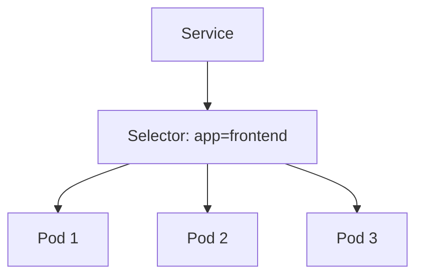

# Labels & Selectors

> **Difficulty:** ⭐⭐ Beginner
>
> **Prerequisites**
>
> - Pod
> - Deployment
> - Service
>
> **Next Chapter**
>
> Annotations

---

# Learning Objectives

After this chapter, you'll understand:

- What Labels are
- What Selectors are
- Why they are important
- Equality-based selectors
- Set-based selectors
- Best practices

---

# What are Labels?

**Labels** are key-value pairs attached to Kubernetes objects.

They are used to:

- Organize resources
- Group related objects
- Filter resources
- Connect Kubernetes objects together

Labels do **not** affect application behavior—they are metadata used by Kubernetes and users.

---

# Label Example

```yaml
metadata:
  labels:
    app: frontend
    env: production
    tier: web
```

A Pod can have multiple labels.

---

# Why are Labels Important?

Labels are how Kubernetes knows which resources belong together.

For example:

```text
Deployment
      │
      ▼
ReplicaSet
      │
      ▼
Pods
```

The ReplicaSet identifies Pods using labels.

Similarly:

```text
Service
      │
      ▼
Matching Pods
```

A Service also uses labels to find its backend Pods.

---

# What is a Selector?

A **Selector** is a query used to find objects that have specific labels.

Example:

```yaml
selector:
  matchLabels:
    app: frontend
```

This selects every object with:

```text
app=frontend
```

---

# Architecture



---

# Equality-Based Selector

Matches labels using equality.

Example:

```yaml
selector:
  matchLabels:
    app: frontend
    env: production
```

The Pod must match **all** specified labels.

---

# Set-Based Selector

Supports more flexible matching.

Example:

```yaml
selector:
  matchExpressions:
  - key: env
    operator: In
    values:
      - production
      - staging
```

Supported operators:

| Operator | Meaning |
|----------|---------|
| In | Value must exist in the list |
| NotIn | Value must not exist in the list |
| Exists | Key must exist |
| DoesNotExist | Key must not exist |

---

# Common Label Examples

```yaml
labels:
  app: nginx
  env: production
  tier: backend
  version: v1
```

These labels make it easy to organize and filter resources.

---

# Viewing Labels

Show labels:

```bash
kubectl get pods --show-labels
```

Filter Pods:

```bash
kubectl get pods -l app=frontend
```

Multiple labels:

```bash
kubectl get pods -l app=frontend,env=production
```

---

# Labels vs Selectors

| Labels | Selectors |
|--------|-----------|
| Attached to objects | Used to find objects |
| Key-value pairs | Query based on labels |
| Define identity | Select matching resources |

---

# Best Practices

- Use consistent naming conventions.
- Keep labels simple and meaningful.
- Use labels for grouping, not detailed descriptions.
- Ensure selectors match the intended Pods.
- Avoid changing labels on running workloads unless necessary.

---

# Common Mistakes

❌ Using inconsistent label names.

✔ Standardize labels across the cluster.

---

❌ Overlapping selectors.

✔ Ensure controllers manage distinct sets of Pods.

---

❌ Using labels for long descriptions.

✔ Use annotations for descriptive metadata.

---

# Interview Questions

### Beginner

- What is a label?
- What is a selector?
- Why are labels important?
- Which Kubernetes objects use selectors?

---

### Intermediate

- Explain equality-based and set-based selectors.
- What happens if a Service selector doesn't match any Pods?
- Can one Pod have multiple labels?
- Why should overlapping selectors be avoided?

---

# Cheat Sheet

```text
Labels
│
├── Key-Value Pairs
├── Organize Resources
├── Group Objects
└── Used by Selectors

Selectors
│
├── Find Matching Resources
├── Equality-Based
└── Set-Based
```

---

# Key Takeaways

- Labels organize Kubernetes resources using key-value pairs.
- Selectors identify resources based on labels.
- Services, ReplicaSets, and Deployments rely on selectors.
- Consistent labeling simplifies management and troubleshooting.
- Use annotations—not labels—for descriptive or large metadata.

---

# Next Chapter

**14_Annotations.md**

Learn how annotations store additional metadata that isn't used for resource selection.
