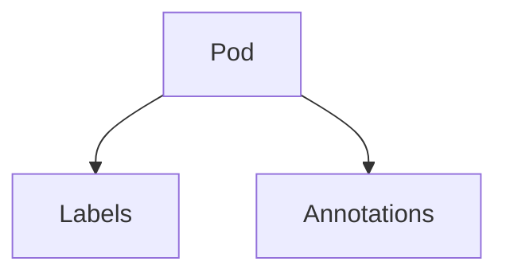

# Annotations

> **Difficulty:** ⭐ Beginner
>
> **Prerequisites**
>
> - Labels & Selectors
>
> **Next Chapter**
>
> OwnerReferences

---

# Learning Objectives

After this chapter, you'll understand:

- What Annotations are
- Labels vs Annotations
- Common use cases
- Annotation examples
- Best practices

---

# What are Annotations?

**Annotations** are key-value pairs attached to Kubernetes objects to store **additional metadata**.

Unlike labels, annotations are **not used to identify or select resources**.

They are mainly used by:

- Kubernetes tools
- Operators
- CI/CD systems
- Monitoring systems
- Users

---

# Annotation Example

```yaml
metadata:
  annotations:
    description: "Frontend application"
    owner: "platform-team"
    git.commit: "4d2a8c1"
```

Annotations can store almost any text value.

---

# Why Use Annotations?

Annotations are commonly used to store information such as:

- Build version
- Git commit hash
- Deployment timestamp
- Documentation
- Contact information
- Monitoring configuration
- Tool-specific settings

Example:

```yaml
metadata:
  annotations:
    deployed-by: github-actions
    build-number: "125"
```

---

# Labels vs Annotations

| Labels | Annotations |
|---------|-------------|
| Used for selection | Not used for selection |
| Small identifying metadata | Arbitrary metadata |
| Used by Services and Deployments | Used by tools and users |
| Indexed for efficient queries | Not indexed for selection |

---

# Architecture



Labels identify the object.

Annotations describe the object.

---

# Common Annotation Examples

```yaml
metadata:
  annotations:
    owner: "dev-team"
    git.branch: "main"
    git.commit: "4d2a8c1"
    documentation: "https://company-wiki/app"
```

---

# Viewing Annotations

View a resource:

```bash
kubectl describe pod nginx
```

Or display the full YAML:

```bash
kubectl get pod nginx -o yaml
```

---

# Adding an Annotation

```bash
kubectl annotate pod nginx \
owner=platform-team
```

Update an existing annotation:

```bash
kubectl annotate pod nginx \
owner=dev-team --overwrite
```

---

# Removing an Annotation

```bash
kubectl annotate pod nginx owner-
```

The trailing `-` removes the annotation.

---

# Common Use Cases

- CI/CD metadata
- Deployment history
- Monitoring configuration
- Backup information
- Contact details
- Links to documentation

---

# Best Practices

- Use labels for identifying resources.
- Use annotations for descriptive metadata.
- Keep annotation names meaningful.
- Use a domain prefix for custom annotations.

Example:

```text
example.com/owner
```

---

# Common Mistakes

❌ Using annotations in Service selectors.

✔ Only labels are used for selectors.

---

❌ Storing identifying information as annotations.

✔ Use labels for grouping and selection.

---

❌ Storing sensitive data in annotations.

✔ Use Kubernetes Secrets instead.

---

# Interview Questions

### Beginner

- What is an annotation?
- How is it different from a label?
- Can annotations be used in selectors?

---

### Intermediate

- Give examples of annotation use cases.
- How do you add an annotation?
- Why are annotations not indexed for selection?

---

# Cheat Sheet

```text
Annotations
│
├── Key-Value Metadata
├── Not Used for Selection
├── Used by Tools
├── Used for Documentation
└── Stores Extra Information
```

---

# Key Takeaways

- Annotations store additional metadata about Kubernetes resources.
- They are not used by selectors or controllers to identify objects.
- CI/CD pipelines, operators, and monitoring tools frequently rely on annotations.
- Use labels for identification and annotations for descriptive information.

---

# Next Chapter

**15_OwnerReferences.md**

Learn how Kubernetes tracks object ownership and automatically cleans up dependent resources using OwnerReferences.
