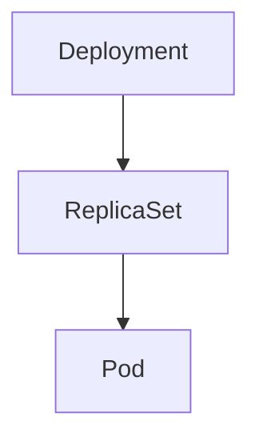

# OwnerReferences

> **Difficulty:** ⭐⭐ Beginner
>
> **Prerequisites**
>
> - Deployment
> - ReplicaSet
> - Pod
>
> **Next Chapter**
>
> Finalizers

---

# Learning Objectives

After this chapter, you'll understand:

- What OwnerReferences are
- Why they are used
- Garbage Collection
- Controller ownership
- Cascading deletion
- Best practices

---

# What is an OwnerReference?

An **OwnerReference** defines the relationship between two Kubernetes objects.

It tells Kubernetes:

> "This object is owned by another object."

If the owner is deleted, Kubernetes can automatically clean up the dependent objects.

---

# Why Do We Need OwnerReferences?

Suppose you create a Deployment.

```text
Deployment
      │
      ▼
ReplicaSet
      │
      ▼
Pods
```

The ReplicaSet is owned by the Deployment.

The Pods are owned by the ReplicaSet.

Kubernetes stores these ownership relationships using **OwnerReferences**.

---

# Owner Hierarchy

A typical ownership chain looks like:



Deleting the Deployment eventually removes the ReplicaSet and its Pods.

---

# OwnerReference Example

A Pod may contain metadata similar to:

```yaml
metadata:
  ownerReferences:
  - apiVersion: apps/v1
    kind: ReplicaSet
    name: frontend-7d9c9b8d5f
    uid: 8c1f...
```

This tells Kubernetes that the Pod belongs to the ReplicaSet.

---

# Garbage Collection

Kubernetes includes a **Garbage Collector**.

Its job is to remove objects that are no longer needed.

Example:

```text
Delete Deployment

↓

Delete ReplicaSet

↓

Delete Pods
```

This automatic cleanup prevents orphaned resources.

---

# Cascading Deletion

Deleting an owner can also delete its dependents.

Example:

```text
Deployment

↓

ReplicaSet

↓

Pods
```

This is called **cascading deletion**.

---

# Orphaned Resources

If ownership is removed or orphan deletion is requested, child resources may remain.

Example:

```text
ReplicaSet Deleted

↓

Pods Still Running
```

These Pods are called **orphaned Pods** because they no longer have a managing controller.

---

# Common Owner Relationships

| Owner | Dependent |
|--------|-----------|
| Deployment | ReplicaSet |
| ReplicaSet | Pod |
| Job | Pod |
| CronJob | Job |
| StatefulSet | Pod |

---

# Viewing OwnerReferences

Describe a Pod:

```bash
kubectl describe pod <pod-name>
```

Or view the YAML:

```bash
kubectl get pod <pod-name> -o yaml
```

Look for:

```yaml
ownerReferences:
```

---

# Best Practices

- Let Kubernetes manage OwnerReferences automatically.
- Avoid manually editing OwnerReferences.
- Use higher-level controllers like Deployments instead of managing Pods directly.
- Verify ownership when troubleshooting unexpected resource deletion.

---

# Common Mistakes

❌ Assuming Pods created by a Deployment are owned directly by the Deployment.

✔ They are owned by a ReplicaSet.

---

❌ Manually deleting managed Pods and expecting them to stay deleted.

✔ The owning controller usually recreates them.

---

❌ Editing OwnerReferences without understanding the impact.

✔ Incorrect ownership can lead to unexpected deletions or orphaned resources.

---

# Interview Questions

### Beginner

- What is an OwnerReference?
- Why does Kubernetes use OwnerReferences?
- What is garbage collection?

---

### Intermediate

- Explain cascading deletion.
- What happens when a Deployment is deleted?
- Why are Pods owned by ReplicaSets instead of Deployments?
- What are orphaned resources?

---

# Cheat Sheet

```text
OwnerReference
│
├── Defines Ownership
├── Used by Controllers
├── Enables Garbage Collection
├── Supports Cascading Deletion
└── Prevents Resource Leaks
```

---

# Key Takeaways

- OwnerReferences define parent-child relationships between Kubernetes objects.
- Kubernetes uses them for garbage collection and cascading deletion.
- Controllers automatically create and manage OwnerReferences.
- Understanding ownership helps explain why resources are recreated or automatically deleted.

---

# Next Chapter

**16_Finalizers.md**

Learn how Finalizers allow Kubernetes resources to perform cleanup before they are permanently deleted.
